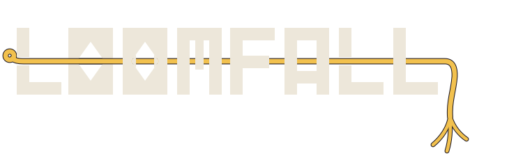
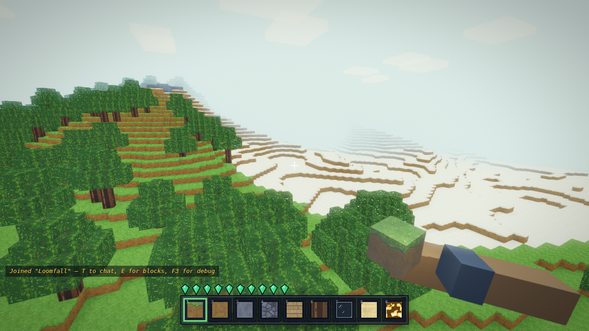
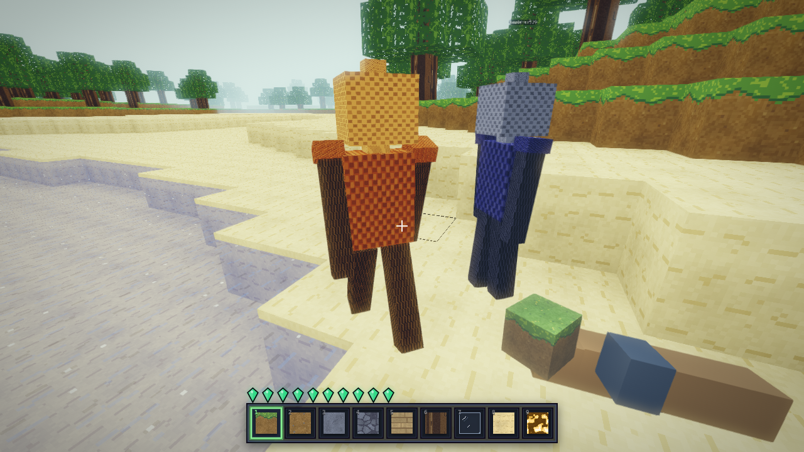
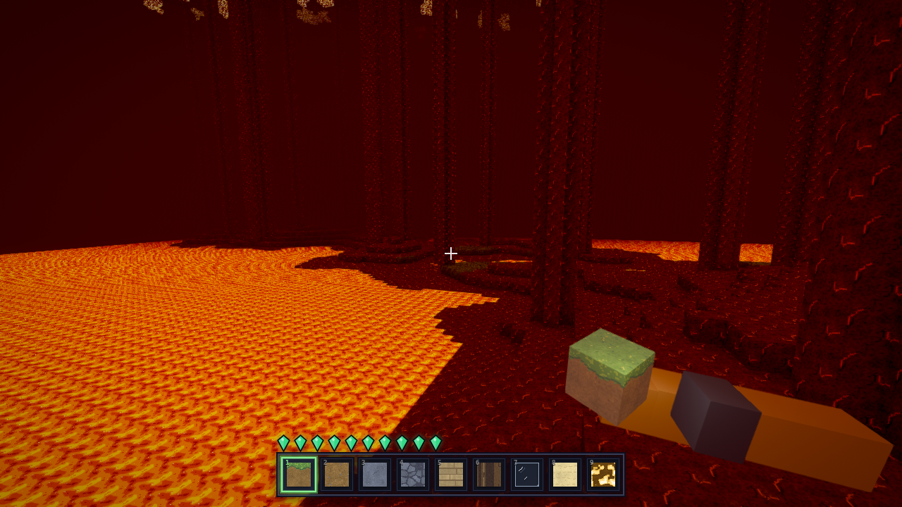
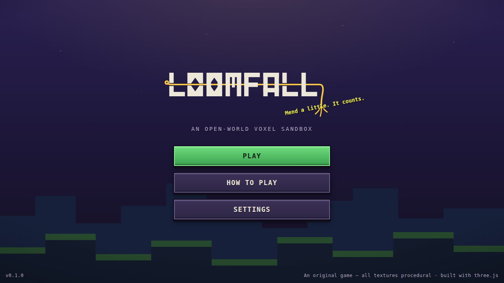
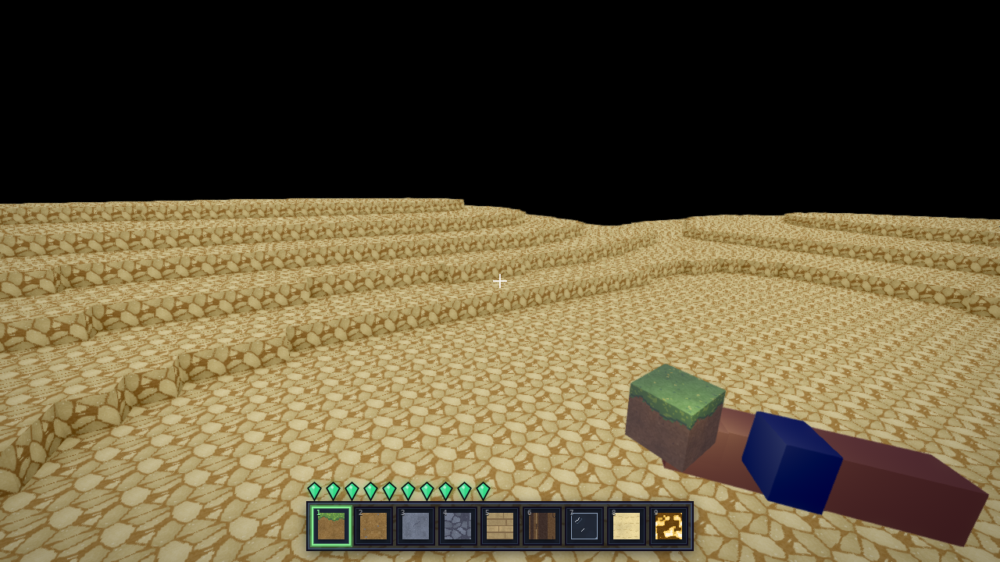
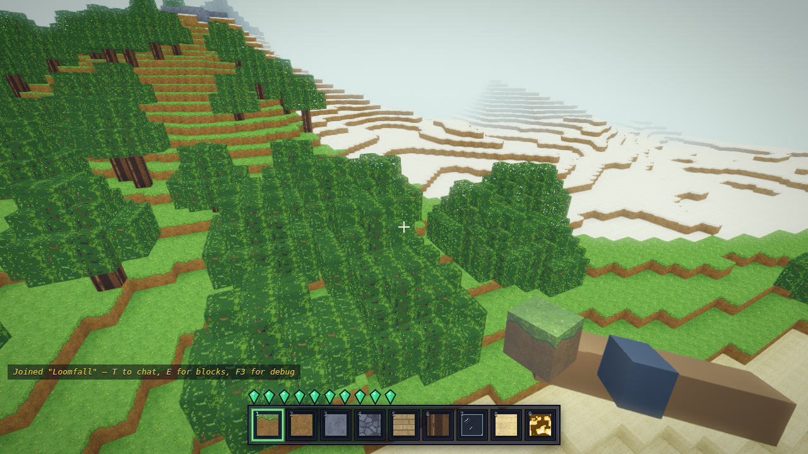
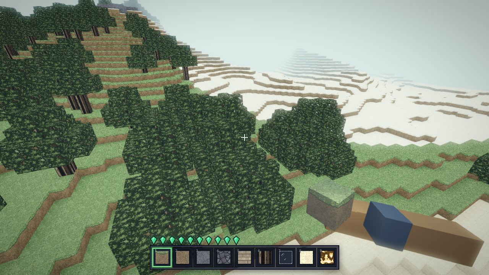
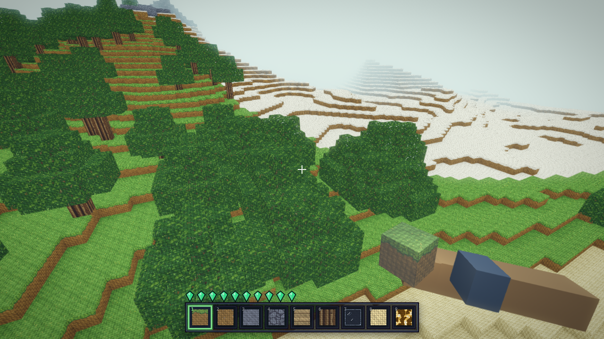

<p align="center">
  
</p>

# Loomfall

**Loomfall** is an original open-world voxel sandbox that runs entirely in your browser — no engine downloads, no accounts, no build step. Explore procedurally generated worlds stitched from meadows, forests, deserts, oceans, and snowcapped peaks; mine and build with hot-swappable procedural texture packs; weave portals to two other dimensions; fight the creatures of the fraying world; and do all of it together — the bundled Node server gives every world real-time online multiplayer with animated avatars, synced block edits, and chat. Every texture, sound, name, and model is generated in code: the whole game is original work.

## Screenshots



 
 

*The Warpwold overworld; two travelers in a shared world; the Cinderloom underrealm; the main menu; the Nevermend void-realm.*

## Quick start (single player)

```bash
git clone https://github.com/thejacobgerstenberg/MinecraftV2.git
cd MinecraftV2
npm install
npm start
```

Open **http://localhost:3000**, create a world (name + optional seed + game mode), and play. Worlds persist on the server across restarts. Requires Node.js >= 18.

**Game modes** (chosen at world creation, persisted per world):

- **Creative** (default) — the classic sandbox: the full block palette on `E`, double-tap-`Space` flight, instant breaking while flying.
- **Survival** — no flight, breaking is always timed, broken blocks drop as item entities you walk over to collect, placing consumes from your stacks, and `E` opens a full stack inventory (27 main slots + 4 armor + offhand) with a 2×2 personal crafting grid fed by `content/items.json` recipes.

## Multiplayer

Multiplayer is the same server — no extra setup. The server binds all interfaces, so friends on your LAN just open `http://<your-LAN-IP>:3000` and pick the same world from the world list: everyone shares the world, sees each other as animated avatars with name tags, and block edits and chat sync live.

Server configuration via environment variables:

| Variable | Default | Effect |
| --- | --- | --- |
| `PORT` | `3000` | HTTP + WebSocket port |
| `WORLD_DIR` | `./saves` | Directory where world saves live (point at a volume in containers) |
| `MAX_PLAYERS` | unlimited | Cap on concurrent players; over-cap joins get a friendly "server is full" message |
| `MOTD` | none | Message of the day, shown as a system chat line on join (max 256 chars) |

```bash
PORT=8080 MAX_PLAYERS=8 MOTD="Mend a little. It counts." npm start
```

To play across the internet, expose the port with a tunnel (e.g. `cloudflared tunnel --url http://localhost:3000`, or ngrok / Tailscale). For container and cloud hosting recipes, see `deploy/HOSTING.md` (landing via [PR #12](https://github.com/thejacobgerstenberg/MinecraftV2/pull/12)).

The server is authoritative and hardened: payload caps, rate limits, movement/reach/bounds validation, and input sanitization — see `docs/PROTOCOL.md`.

## Controls

| Input | Action |
| --- | --- |
| `W` `A` `S` `D` | Move |
| Mouse | Look (click the window to capture the pointer) |
| `Space` | Jump — **double-tap to toggle flight** (creative only); hold to ascend while flying |
| `Left Shift` | Sneak — slower, you can't walk off edges; descend while flying |
| `Left Ctrl` | Sprint (walking) / fast fly (flying) |
| Hold **Left click** | Break block (break time scales with hardness; instant while flying) |
| **Right click** | Place block |
| `1`–`9` / scroll wheel | Select hotbar slot |
| `E` | Block palette (creative) / stack inventory + 2×2 crafting (survival) |
| `Q` / `Ctrl+Q` | Drop one / the whole selected stack (survival; also works on the hovered slot in the inventory screen) |
| `T` | Chat |
| Hold `Tab` | Player roster (names, dimension badges, ping) |
| `F5` | Cycle camera view (first-person → third-back → third-front) |
| `F6` | Spectator free-cam (WASD + `Space`/`Ctrl` vertical, `Shift` boost) |
| `F3` | Debug overlay (position, biome, FPS, seed, …) |
| `Esc` | Pause menu (settings, achievements, travel, save & quit) |

Chat commands: `/w <name> <message>` sends a private whisper, `/r <message>` replies to the last whisper, `/mute <name>` / `/unmute <name>` hide a player's whispers, `/block <name>` / `/unblock <name>` hide their whispers and public chat, and `/emote <id>` plays an avatar gesture (e.g. wave, dance).

## Features

- **Procedural worlds** — 6+ biomes, carved caves, ore seams, trees; named saved worlds with shareable seeds.
- **Three dimensions** — the *Warpwold* overworld, the scorched *Cinderloom*, and the void-realm *Nevermend*, reached through portals you build block by block.
- **Five procedural texture packs** with live in-game hot-swap — every texture drawn in code, no image assets.
- **Real-time multiplayer** — shared named worlds, animated skinned avatars with emotes, synced edits, chat with private whispers and mute/block, a hold-`Tab` player roster, camera view cycling and a spectator free-cam, server-side validation.
- **Timed block breaking** with progressive crack decals, block particles, and a first-person held-block view model.
- **Mobs and combat** — 13 original species plus a boss, day/night and per-dimension spawn rules, melee combat, a death/respawn flow with canon death messages.
- **Day/night cycle and weather** — sun, moon, stars, clouds, rain, snow, and lightning storms with thunder.
- **Procedural audio** — block sounds, footsteps, ambience beds, per-dimension music, all synthesized at runtime; three volume buses.
- **Post-processing** — bloom, tone-mapping, FXAA, distance fog, per-dimension color grading, with a graphics-quality setting and an adaptive performance governor.
- **Survival mode** — per-world game mode with item-entity drops, walk-over pickup, stack inventory (hotbar + 27 main + 4 armor + offhand) with full cursor semantics, Q-drops, and a 2×2 personal crafting grid over the canon `items.json` recipes; inventory persists per world.
- **Achievements, splashes, tips, and lore** woven through the UI — 60 achievements defined, 32 wired to live triggers.
- **Physics with feel** — sprint-jump impulse, sneak edge-guarding, terminal velocity, creative flight.
- **Movement, reach, and edit validation server-side** — speed budgets, reach caps, rate limits (see `docs/PROTOCOL.md`).

## Texture packs

Loomfall ships five procedural packs — **Loomfall Classic** (default), **Softstone** (smooth gradients), **Gritstone** (weathered, high contrast), **Threadbare** (woven cross-stitch), and **Loudstone** (high-contrast, colorblind-safe ore shapes).

  

*The same vista in Loomfall Classic, Gritstone, and Threadbare.*

**Switching:** open **Settings** (main menu, or pause menu in game) and pick a pack from the *Texture Pack* select — the atlas rebuilds and hot-swaps live, no reload. Your choice persists.

**Adding a pack:** packs are code, not image folders. See `public/src/textures/packs5/README.md` for the pack format — a pack is a `definePack()` entry in `public/src/textures/packs5/packs.js` that transforms the shared per-tile painters (`painters.js`) through validated knobs (hue shifts, contrast, dither, overlays). Renders are deterministic per `(pack, tile, seed)`, and `packs5/selftest.mjs` verifies the atlas contract.

## Dimensions & portals

Three dimensions: the **Warpwold** (overworld), the **Cinderloom** (a scorched underrealm of lava seas), and the **Nevermend** (a pale void-realm).

To weave a portal:

1. Build a standing rectangular frame in a vertical plane out of **Cinderglass** (obsidian) — interior **2–4 blocks wide and 3–5 tall**; corners are optional.
2. Take a **Loom-Gate** block from the palette (`E`) and place it anywhere inside the frame — the interior fills with portal blocks. An incomplete frame places nothing and prints a hint in chat.
3. Stand inside the gate for **1.5 s** (a violet vignette closes in) and you'll fade through to the **Cinderloom**.

A frame of **Hemstone** (end stone) makes a **Nevermend** portal instead. Any portal lit in the Cinderloom or Nevermend leads **back to the Warpwold** — coordinates map 1:1, arrivals spawn-scan for safe dry ground, and a 4 s cooldown prevents instant bounce-back. Breaking any frame or gate block collapses the portal.

The pause menu also has a **Travel** row that jumps between dimensions directly — a creative-mode convenience; portals are the physical route.

## Testing

```bash
npm test
```

Runs all 12 suites (plain Node, no framework, CI-ready) — the 11 suites in `tests/` plus the adopted `tests-plus/` spec suites under `node --test` (`npm run test:plus` runs just the latter):

- `worldgen` — deterministic terrain: same seed, same world; biome/height invariants
- `mesher` — chunk meshing: face culling, AO, geometry counts
- `physics` — collision, jump arcs, sneak edge-guard, sprint-jump, terminal velocity
- `raycast` — block targeting and reach
- `dircull` — directional face culling, including a brute-force "every visible face drawn" check
- `net` — the live WebSocket protocol against a real server (join, move, edit, chat)
- `security` — 42-check hardening regression: rate limits, reach/bounds/speed validation, sanitization
- `desync` — server edit rejects + client rollback (no ghost blocks)
- `inventory` / `crafting` — the survival stack model (cursor click matrix, shift-click routing, drops, serialization) and the items.json recipe matcher (shaped/mirrored/shapeless, ingredient consumption)
- `gamemode` — per-world creative/survival mode: REST round-trip, welcome passthrough, legacy-save default
- `tests-plus/` — adopted deep suites (node:test): physics **spec pins** (gravity −32 b/s², jump 8.4 b/s, walk 4.317 / sprint 5.612 / sneak 1.295 / fly 10.89 b/s, terminal −78.4 b/s, auto-step 0.6, reach 6), plus meshing, raycast, worldgen determinism, save/load, and protocol anticheat

## Project structure

| Path | What lives there |
| --- | --- |
| `server/` | Node server: static hosting, read-only world REST API, the validated WebSocket protocol, persistence |
| `public/src/engine/` | Renderer: chunks, mesher, directional culling, sky, adaptive quality |
| `public/src/world/` | Terrain generator + noise |
| `public/src/gameplay/` | Player physics, controls, raycast, inventory, portals |
| `public/src/textures/` | The procedural 5-pack texture system + atlas |
| `public/src/ui/` | Menus, HUD, chat, debug overlay |
| `public/src/net/` | WebSocket client + peer avatar rigs |
| `public/src/dimensions/` | Dimension registry (fog, sky, portal materials) |
| `public/src/systems/` | Achievements, event bus, canonical naming, death messages |
| `public/graphics/` | Post-processing, distance fog, particles, cracks, view model, grading |
| `public/audio/` | Procedural audio engine |
| `public/weather/` | Rain / snow / lightning system |
| `public/mobs/` | Creature package: 13 species + boss, AI, spawn tables, loot |
| `public/content/` | Canon content: names, achievements, splashes, tips, death messages, game guide |
| `public/assets/` | Brand assets (wordmark, icon, favicon) |
| `docs/` | `DEV.md` (dev/QA reference), `PROTOCOL.md` (wire protocol + security), screenshots |
| `tests/` | The Node test suites |
| `CONTRACT.md` | Module API contracts the subsystems were built and verified against |

## Credits

Loomfall is an original game. It tips its hat to the classic voxel-sandbox genre, but all code, names, lore, textures, sounds, and models here are original — every asset is generated procedurally at runtime. Built with [three.js](https://threejs.org/).
