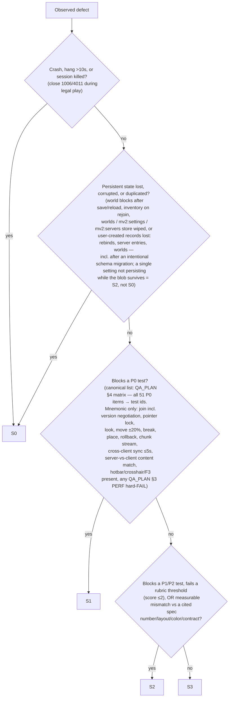

# BUG_TAXONOMY.md — Severity Definitions & Bug-Report Template

**Project:** MinecraftV2 — browser voxel game (TypeScript + Three.js client, HTML/CSS HUD overlay, authoritative Node.js WebSocket server, 100% procedural textures).
**Audience:** the QA-adversary agent (drives real Chromium via Playwright: synthesized `KeyboardEvent.code` / mouse input on a pointer-locked canvas, screenshots, DOM HUD reads, F3 debug overlay reads, CDP perf metrics) and the builder session that triages its reports.
**Ground truth:** [`docs/PARITY.md`](./PARITY.md) (feature backlog; P0/P1 tiers), [`docs/UX_SPEC.md`](./UX_SPEC.md) (screens, HUD anchors, keybinds, pointer lock), [`docs/MULTIPLAYER_PROTOCOL.md`](./MULTIPLAYER_PROTOCOL.md) (wire contract), [`docs/ART_DIRECTION.md`](./ART_DIRECTION.md) (ramps, packs, tinting).
**Companion docs:** functional scenarios live in [`docs/QA_PLAN.md`](./QA_PLAN.md) (scenario ids `S1..S10`, test ids `QA-S<k>-<nn>`, perf budgets `PERF-01..06`; screenshots are **nested**: `qa/S<k>/QA-S<k>-<nn>-<slug>.png` per QA_PLAN §1.6, e.g. `qa/S4/QA-S4-04-stone-wood-pick.png`); visual scoring lives in [`docs/UX_REVIEW_RUBRIC.md`](./UX_REVIEW_RUBRIC.md) (criteria `R1..R7`, its **own** screenshot scenarios `S1..S11` with **flat** files `qa/S<id>-<slug>[-<variant>].png` per rubric §1.1; any criterion scoring ≤ 2 **must** produce a bug filed per this document, titled `[rubric:<Rn>] …`).
**Scenario-id namespaces (the two docs collide on `S1..S10` — never write a bare `S<k>` in a report):** write QA_PLAN scenarios as **`QA:S<k>`** (QA:S3 = movement physics, QA:S4 = break/place, QA:S7 = Nether portal, QA:S9 = multiplayer) and rubric screenshot scenarios as **`RUBRIC:S<id>`** (RUBRIC:S3 = HUD × GUI scales, RUBRIC:S4 = HUD stress, RUBRIC:S7 = targeting/mining, RUBRIC:S9 = texture packs). Evidence reuse follows the `testRef` type: a `QA-S<k>-<nn>` or `PERF-nn` bug reuses the nested `qa/S<k>/QA-S<k>-<nn>-<slug>.png` shots; an `R<n>` bug reuses the flat `qa/S<id>-<slug>[-<variant>].png` rubric shots.

**Where bugs live:** one markdown file per bug at **`qa/bugs/<BUG-ID>.md`** (e.g. `qa/bugs/BUG-20260711-003.md`), evidence under **`qa/bugs/<BUG-ID>/`**. If GitHub issues are enabled for the repo, additionally open an issue whose title starts with the same `<BUG-ID>`; the file is canonical.

---

## 1. Severity Ladder

Severity measures **player/session impact of the observed behavior** — not how hard the fix is, and not the PARITY tier of the feature (tier informs the decision tree in §2, it does not equal severity). Every report carries exactly one severity `S0..S3` plus a one-line justification citing the decision rule that fired.

### 1.0 Quick definitions

| Sev | Name | One-line test |
|---|---|---|
| **S0** | Crash / data loss | The session or persistent state does not survive: crash, hang, corruption, loss, duplication, or a protocol violation that kills the connection. |
| **S1** | Core loop broken | A P0 capability (walk / look / break / place / see world / stay in sync) is unusable, grossly wrong, or does not self-heal. Blocks P0 tests. |
| **S2** | Feature defect | A feature works but disagrees with a spec number/behavior, or a P1/P2 feature is broken. Blocks P1/P2 tests. |
| **S3** | Polish | Cosmetic, minor drift, jank, typos, benign warnings. Never blocks a test's pass criterion. |

### 1.1 S0 — Crash / data loss

**Definition.** Any defect where (a) the client tab or server process crashes or hangs, (b) persisted state (worlds, inventories, settings) is corrupted, lost, or duplicated, or (c) a wire-contract violation terminates the session. If the player can lose something they cannot get back — time, items, a world — it is S0.

**Decision rules:**
- Client hang counts as crash: page unresponsive > 10 s (`page.evaluate('1')` does not resolve, or `page.screenshot()` times out), WebGL context lost without recovery, or an uncaught exception that stops the render loop.
- Data loss is judged against the **authoritative** state: server-side inventory (`inventory_set`, PROTOCOL §4.6), IndexedDB `worlds` store (UX_SPEC §2.2), `localStorage` `mv2:settings` / `mv2:servers` are in scope; a purely visual misrender is not.
- **Item duplication is data loss** (corruption of authoritative inventory), same severity as deletion.
- **Store vs key persistence boundary (mirrors §2 node C):** loss of the **entire** `localStorage` `mv2:settings` / `mv2:servers` blob or IndexedDB `worlds` store, or of any **user-created records** inside them (keybind rebinds, server-list entries, world entries) → **S0**. One or more **individual settings** failing to persist or apply while the rest of the blob survives (e.g. the whole `video` section reverting to defaults after reload while keybinds and servers survive) → **S2** (see S2-e).
- **Save-format / schema migration is not an excuse:** an *intentional* IndexedDB `worlds` / `mv2:settings` schema change that leaves a world created on an earlier build unopenable, silently regenerates terrain over player edits, or drops inventory/rebinds is **still S0** — migrations must preserve data. Waivable only by explicit repo-owner sign-off recorded in `## Notes`, exactly like the §6 S1 waiver mechanism. Record the creating build in `env.worldCreatedOnSha` (§3/§4) so "create on SHA X, open on SHA Y" is replayable.
- A protocol violation is S0 when it kills the session (close `4011 PROTOCOL_ERROR`, close `1006`, or a decode crash) during **legal** play; a wrong-but-survivable field value is S2.
- Reproduction rate does not downgrade S0: a 1/20 world-corruption repro is still S0.

**Concrete examples (≥5):**

| # | Example (mechanically checkable) |
|---|---|
| S0-a | **Server crash on malformed edit:** sending `EditRequest 0x40` with `y = 32767` (outside `WORLD_MIN_Y=-64 .. WORLD_MAX_Y=319`, PROTOCOL §0) throws an unhandled Node exception; every client's socket closes `1006` instead of receiving `edit_reject{INVALID_PLACEMENT}`. |
| S0-b | **World corruption on save/reload (singleplayer):** place 10 stone blocks at recorded coords, `Escape` → `Save and Quit to Title` (UX_SPEC §3.1), reopen the same world id from `worldSelect` — any of the 10 cells missing/altered (verify with F3 Targeted Block, UX_SPEC §5.14). |
| S0-c | **Inventory loss on rejoin (multiplayer):** with 3 known stacks in slots 0–2, send `{"t":"leave"}` (graceful, PROTOCOL §4.3), reconnect and complete the JOIN sequence — the post-join `inventory_set` differs from the pre-quit authoritative slots (no death occurred; `keepInventory` irrelevant). |
| S0-d | **Item duplication via cursor-stack race:** a crafted `inv_action` sequence (e.g. two rapid `quick_move` clicks exploiting a stale `expect`, PROTOCOL §4.6.3) yields more total items server-side than existed before — the `STATE_MISMATCH` anti-dupe check failed. |
| S0-e | **Client render-loop death:** after ~10 min of QA:S3-style walking (QA_PLAN S3 movement scenarios), the tab shows a frozen frame; console shows `THREE.WebGLRenderer: Context Lost` (or an uncaught exception in the frame callback) and no recovery; input has no effect. |
| S0-f | **Session-killing protocol violation:** server sends `Snapshot 0x11` before `ready`/`spawned` (illegal for state, PROTOCOL §1.3) or an `EditApply 0x41` frame shorter than its 26-byte layout (§4.5); a spec-conforming peer must kick with `4011` — either way the session dies during normal play. |
| S0-g | **Wrong-world delete:** in `worldSelect`, selecting world A and confirming `Delete world 'A'?` (UX_SPEC §2.2) removes world B's entry/blob from the IndexedDB `worlds` store. |
| S0-h | **Keepalive false-positive kick loop:** an idle-but-connected client is closed `4008 TIMEOUT` despite Pong `0x02` replies within `KEEPALIVE_TIMEOUT_MS = 30000` (PROTOCOL §4.10), and reconnect immediately re-kicks — the player cannot stay in the world. |
| S0-i | **Save-schema migration wipes a world:** world `qa-main` created on build `<shaX>` fails to open, silently regenerates terrain over player edits (the QA-S8-01 marker pattern is gone), or loses inventory/keybind rebinds after upgrading to build `<shaY>` that changed the IndexedDB `worlds` / `mv2:settings` schema. File with `build.clientSha = <shaY>` and `env.worldCreatedOnSha = <shaX>` (§4) so the two-build repro is replayable. Intentional migration ≠ waiver (§1.1 rule above). |

### 1.2 S1 — Core loop broken

**Definition.** The P0 sandbox loop — join, look, walk/jump, target a block, break it, place one, have the world stream in, and stay consistent with the server and other clients — is unusable or grossly wrong. "Grossly wrong" for physics means **> ±20% deviation from a PARITY §8A number, or a whole mechanic absent** (no jump, no sprint, no step-up). A blocked P0 test is S1 by definition. **The canonical P0 set is the QA_PLAN §4 coverage matrix** (all 51 PARITY `**[P0]**` items mapped to concrete test ids): a failing test is a P0 test **iff** its `QA-S<k>-<nn>` id appears in a QA_PLAN §4 row — decide mechanically by grepping the id in that table. PARITY remains canonical for an item's *tier*; QA_PLAN §4 is canonical for the *item → test-id mapping*; the §2 D-node parenthetical is a mnemonic shortlist, never the list.

**Decision rules:**
- Physics vs PARITY §8A: measure via F3 `XYZ` (3 decimals, UX_SPEC §5.14). Deviation > ±20% from walk 4.317 / sprint 5.612 / sneak 1.295 / fly 10.89 b/s, jump peak ≈ 1.252 blocks, terminal ≈ 3.92 b/t, step-up 0.6 → **S1**. Deviation ±2%–20% → **S2**. ≤ ±2% (quantization/rounding, POS_QUANT = 1/32 block) → not a defect.
- Desync severity gate: cross-client divergence (block or entity state) that **persists > 5 s** with both clients holding the section loaded → S1 ("doesn't self-heal": the interp buffer is ≤ 200 ms and a keyframe arrives every ~1 s, PROTOCOL §0/§6.6, so 5 s ≥ 5 healing opportunities). Divergence that self-heals ≤ 5 s but recurs → S2.
- Chunk hole gate (observe stationary for 60 s; spiral order, PROTOCOL §5.2): a section **inside** `viewDistance` still missing at **60 s** → **S1**. Inside `viewDistance` and it arrives in **30–60 s** → **S2** (slow-but-eventual load). Arrives in **< 30 s** → pass, not a bug. Holes only **beyond** `viewDistance + VIEW_HYSTERESIS` → **not-a-bug** (unloaded by design, PROTOCOL §5.2). Record `env.renderDistance` / `env.serverViewDistance` (§4) — the gate is meaningless without them.
- Edit round-trip gate: at RTT < 50 ms, an `EditRequest` answered by **neither** `EditApply 0x41` (echoing `editId`) **nor** `edit_reject` within 2 s → S1. Wrong reject `code` with correct behavior → S2.
- Input is part of the core loop: pointer lock never engaging, or a default P0 keybind (UX_SPEC §11: `KeyW/KeyA/KeyS/KeyD`, `Space`, `ShiftLeft`, `Mouse0`, `Mouse2`, `KeyE`, `Digit1..9`, `Escape`, `F3`) dead in its context → S1.
- Version negotiation gate (PROTOCOL §1.3): the server closing **4001** (`hello_err {PROTO_MISMATCH}`, non-retryable) for a client whose `hello.protocol` is **inside** `[PROTOCOL_MIN_SUPPORTED .. PROTOCOL_VERSION]`, replying `hello_ok` to a protocol **outside** that range, or failing to run a legal mismatch at `min(client.protocol, server.PROTOCOL_VERSION)` message semantics (PROTOCOL §1.3 rule 2) → **S1**: this happens pre-PLAY, so S0-f's "during normal play" clause does not apply, but the player can never join — it blocks the P0 join tests QA-S9-01/QA-S9-02. Wrong `min`/`max` fields in `hello_err`, or a wrong close code with otherwise-correct reject behavior → **S2**.
- Uniform decode/encode corruption gate: client-rendered section content that disagrees with **server-authoritative** content — compare `__qa.getSection`/`getBlock` against a server-side dump or the recorded PROBES column signature (QA_PLAN §1.7 / QA-S2-06) — and persists across a re-request of the section (relog, or leave past `viewDistance + VIEW_HYSTERESIS` and return) → **S1** ("see world" is grossly wrong). This fires even though every client shows the **same** wrong blocks, so the desync gate above never triggers, and no persisted state is lost until a save happens — it is not a "purely visual misrender" in the §1.1 sense. A transient misrender that a remesh or re-request fixes → S2/S3 per §1.3/§1.4.
- Performance gate (QA_PLAN §3, PERF-01..06 — these budgets are citable spec values, §1.3): any stated **hard-FAIL threshold** breached → **S1** at M0 — any frame > 100 ms or > 5 frames > 50 ms in the PERF-03 window; post-GC heap > 1024 MB or minute-5/minute-3 heap ratio > 1.10 (PERF-04); join > 10 s singleplayer / > 15 s multiplayer (PERF-01); a PERF-05 bandwidth cap; where a budget states only a single pass floor (PERF-02 fps floors, PERF-06 percentiles), that floor is its FAIL line. A stated *target* missed while the FAIL line holds (PERF-03 frames > 50 ms but ≤ 5 and none > 100 ms; PERF-04 heap 512–1024 MB) → **S2**. Post-GC heap growth on a trajectory to OOM, or an actual OOM/tab crash during the PERF-04 soak → **S0** (crash class, §1.1). File with `testRef: PERF-nn` (§3).

**Concrete examples (≥5):**

| # | Example (mechanically checkable) |
|---|---|
| S1-a | **Can't break:** hold `Mouse0` on a dirt block (crosshair outline visible per UX_SPEC §5.7) for 5 s — expected bare-hand break at **15 gt = 0.75 s** (`1.0/0.5/30` per PARITY §4.1) — but no crack-stage overlay appears and no `EditApply{blockId:0}` arrives. |
| S1-b | **Can't place:** with stone in the selected hotbar slot, `Mouse2` on the top face of grass_block at reach ≤ 4.5 (PARITY §9) produces no local ghost, no `EditRequest`/`interact_block`, and no world change within 2 s. |
| S1-c | **Movement grossly wrong:** hold `KeyW` 10 s on flat ground; F3 `XYZ` delta shows 58.1 blocks (5.81 b/s) vs walk **4.317 b/s** — +35% (> ±20% ⇒ S1). Or: `Space` jump apex (max F3 Y − start Y) = 0.71 blocks vs **≈ 1.252**, so the player cannot jump onto a 1-block ledge. |
| S1-d | **Rollback failure:** force `edit_reject{OUT_OF_REACH}` by placing at a cell 8 blocks away (cap `EDIT_REACH_BLOCKS = 6`, PROTOCOL §0); the optimistic phantom block persists client-side — the cell is not rewritten to `authoritative.blockId` + re-meshed (violates PROTOCOL §7 step 4). |
| S1-e | **Non-healing desync:** client A breaks a block; > 5 s later client B (same section loaded, both in view range) still renders it solid and B's player collides with it — the `EditApply` broadcast or B's apply path is broken. |
| S1-f | **Chunk hole never loads:** standing still 60 s after spawn, a section column at Chebyshev ring 3 (inside `viewDistance = 8`) still renders as a void hole (a fill between 30–60 s would be S2 per the chunk-hole gate); walking onto it drops the player through the world. F3 `C:` rendered/total count stalls. |
| S1-g | **Pointer lock dead:** `page.mouse.click(cx, cy)` on the canvas center never fires `pointerlockchange` (UX_SPEC §10.1); synthesized `movementX/Y` therefore never turns the camera — the game is unplayable. |
| S1-h | **Reconciliation rubber-band:** walking straight, the local player visibly snaps back > 1 block every snapshot (20 Hz) — shared-physics constant mismatch between client and server (PROTOCOL §6.3.1 makes the §0 constants normative). |
| S1-i | **F3 overlay absent:** `F3` toggles nothing (no `XYZ` / `Biome` / `Light` lines, UX_SPEC §5.14) — this is itself a P0 PARITY §27 item **and** it blocks every measurement-based P0 test, so it is S1, not S2. |
| S1-j | **Spurious version rejection:** client sends `hello {protocol: 1}` to a server whose supported range is `[1..1]`, yet the server replies `hello_err {code:"PROTO_MISMATCH", min:1, max:1}` and closes **4001** (PROTOCOL §1.3) — non-retryable without user action, so the player can never reach PLAY; blocks QA-S9-01/QA-S9-02. Equally S1: on a *legal* mismatch the higher side does not downgrade to `min(client, server)` message semantics (PROTOCOL §1.3 rule 2) and sends fields the lower version cannot parse. |
| S1-k | **Uniform section decode corruption:** at PROBES column `(37, −12)`, `__qa.getBlock(37, h−1, −12)` returns `sand` on **every** client and after every relog, where the recorded PROBES signature (QA_PLAN §1.7 / QA-S2-06) says `grass_block` — a `0x30` palette/bit-unpack bug. No cross-client divergence exists, so the desync gate never fires; S1 via the uniform-corruption gate (persists across section re-request). |
| S1-l | **Hotbar (or crosshair) absent in-world:** `#hud-root` renders no hotbar sprite (182×22 gp at `(guiVW/2 − 91, guiVH − 22)`, UX_SPEC §5.1) or no 9×9 crosshair at `(guiVW/2, guiVH/2)` (§5.7) with their gates met — P0 PARITY §27 HUD items and rubric R2 anchor-1s; like S1-i, this blocks every slot-selection/targeting P0 test (QA-S4-06, QA-S5-10), so it is S1, not S2. |

### 1.3 S2 — Feature defect

**Definition.** The capability exists and the core loop survives, but the behavior disagrees with a specific number, layout, color, or contract in the four spec docs — or a P1/P2 feature is broken outright. Anything that fails a P1/P2 test's pass criterion, or any measurable spec mismatch that isn't merely cosmetic drift, lands here.

**Decision rules:**
- Cite the exact spec value in the report (doc + § + number). No citation, no S2 — if you cannot ground it, it is S3 (subjective polish) or not a bug. Citable grounds = the four spec docs **plus the QA_PLAN §3 performance budgets (PERF-01..06)** — a PERF threshold is a valid Expected citation and must not be bounced at triage.
- HUD geometry: any widget whose measured rect deviates from its UX_SPEC §5 gp formula by **> 2 gp** (after `px = gp·S` conversion) is S2; ≤ 2 gp is S3 drift.
- Texture/color: a ramp stop, tint, or shade constant measurably off spec (outside the tolerance the rubric criterion assigns) is S2 **when it changes block identity/readability**; small drift within recognizability is S3.
- Texture-atlas cross-tile bleed: texels from a **neighboring atlas tile** visible at a tile edge, at any mip level, or at any zoom on any face (missing/short `PAD` gutter or missing edge-extrusion, ART §6.4) → **S2** whenever it alters block identity/readability — including on isolated block faces at distance that the rubric's R5.4 flat-area grid scan never trips, and regardless of the ramp/tint/shade constants being on-spec. Intra-tile hairline seams with the block still instantly recognizable stay **S3** (S3-a).
- Wrong reject/kick codes, wrong field values, missing optional messages — contract details that don't kill the session — are S2.
- A rubric criterion scored ≤ 2 always files a bug (title prefixed `[rubric:<Rn>]`, per UX_REVIEW_RUBRIC §5), graded via the §2 tree with a **floor of S2**: score 2 ⇒ S2; score 1 ⇒ S2 **unless** the anchor-1 defect also blocks a P0 test — a gate-met P0 HUD widget missing entirely (hotbar, crosshair, F3) is **S1** (see S1-i/S1-l). This S0..S3 ladder is the only severity vocabulary; the rubric §5 terms "release-blocking"/"major" map onto it exactly as stated here.

**Concrete examples (≥5):**

| # | Example (mechanically checkable) |
|---|---|
| S2-a | **Wrong break time for a tool tier:** stone with a wooden pickaxe breaks in ~46 gt (2.3 s) instead of **23 gt ≈ 1.15 s** (`speed 2.0 / hardness 1.5 / 30`, PARITY §4.1/§7.1); or iron pickaxe ≠ **8 gt ≈ 0.4 s** (`6.0/1.5/30`); or a bare-hand stone break (no harvest: `1/1.5/100` = 150 gt) **still drops** cobblestone, violating "wrong tool = no drop" (PARITY §4.1). |
| S2-b | **HUD element misplaced:** hotbar sprite top-left ≠ `(guiVW/2 − 91, guiVH − 22)` gp, or heart pitch ≠ 8 gp at `y = guiVH − 39`, or hunger not mirrored right→left from `(guiVW/2 + 91 − 9 − 8k, guiVH − 39)` (UX_SPEC §5.1/§5.4/§5.6) — measured on the RUBRIC:S3 HUD sweep shots `qa/S3-hud-gs<n>.png` (flat rubric naming, UX_REVIEW_RUBRIC §1.1 — these are rubric-scenario files, not QA_PLAN QA:S3 movement shots) with `px = gp·S`. |
| S2-c | **Texture off ART spec:** stone's dominant mid tone is not within tolerance of ramp stop 2 `#96999E` (ART §2.2), or grass_top in plains is not tinted by `(0.57, 0.74, 0.35)` (ART §1.6), or bottom faces are not darkened ×0.50 per the `shade[6]` table (ART §1.5.1) so blocks read flat. |
| S2-d | **Chat message ordering:** two `chat` broadcasts with ascending `ts` (PROTOCOL §4.7) render in reversed order in the chat log; or own sent message renders twice (local echo + server broadcast). |
| S2-e | **Settings not persisting:** set `fov` to 90 in `settings.video`, reload the page — `localStorage['mv2:settings']` still holds 70, or holds 90 but the camera boots at 70 (UX_SPEC §4/§4.2). |
| S2-f | **Keybind conflict not flagged:** bind `sprint` to `KeyW` (already `moveForward`); neither rebind button turns `--ui-text-err` `#FF5555` with the ⚠ icon (UX_SPEC §4.3). |
| S2-g | **Wrong reject code:** placing at 8 blocks returns `edit_reject{NO_PERMISSION}` instead of `OUT_OF_REACH` (PROTOCOL §4.5) — rollback still works (else S1-d), but the contract value is wrong. |
| S2-h | **Sprint gate missing:** sprint engages at `food ≤ 6` (violates `SPRINT_FOOD_THRESHOLD = 6`, "food > 6", PROTOCOL §0) — survival-loop rule (P1 tier) wrong, core loop intact. |
| S2-i | **Walk speed mildly off:** measured 4.62 b/s vs 4.317 (+7%; inside the ±2–20% S2 band of §1.2). |

### 1.4 S3 — Polish

**Definition.** Visible or audible imperfection that never flips a test's pass criterion and costs the player nothing: cosmetic drift within recognizability, timing jank of a few ticks, typos, benign console noise.

**Decision rules:**
- If any QA_PLAN pass criterion or rubric threshold fails because of it, it is **not** S3 — re-grade via the tree (§2).
- Console messages: warnings that do not precede a failure are S3; an **error**-level message correlated with a misbehavior belongs to that misbehavior's report as evidence, not its own S3.
- File S3s in batches per surface (one report per texture/pack, per screen) rather than one per pixel — see bundling (§5.3).

**Concrete examples (≥5):**

| # | Example |
|---|---|
| S3-a | **Texture seam:** hairline **intra-tile** seam visible in the 2×2 tile self-check (ART §1.2) on `gravel` under the `gritty` pack; block still instantly recognizable at 1× zoom. (Cross-**tile** atlas bleed — foreign texels from a neighboring tile at an edge or mip level — is S2, §1.3.) |
| S3-b | **Minor color-ramp drift:** `sand` highlight stop renders `#EFE6BC` vs spec `#EDE4B9` (ART §2.2) — within recognizability and rubric tolerance. |
| S3-c | **Tooltip typo:** hovering cobblestone in the inventory shows "Cobblestne". |
| S3-d | **Animation jank:** first-person swing arc completes in ~8 ticks vs ~6 (UX_SPEC §5.20); item-name popup fades at ~50 ticks vs 40 (§5.13). |
| S3-e | **Non-blocking console warnings:** `THREE.WebGLProgram: gl.getProgramInfoLog()` warning spam every atlas hot-swap (F3+T), no functional effect. |
| S3-f | **Splash-text animation wrong:** title-screen splash does not pulse `scale = 1 + 0.05·|sin(tπ)|` (UX_SPEC §2.1) — static instead. |
| S3-g | **Ping-bar threshold off:** tab-list ping icon turns yellow at 130 ms instead of the 150 ms green boundary (UX_SPEC §5.17). |

---

## 2. Severity Decision Tree

Apply **top-down; first match wins**. "Blocks a test" = the test's observable pass criterion cannot be evaluated or cannot pass because of this defect.



Text form: **data loss or crash? → S0. Blocks a P0 test (any test id in the QA_PLAN §4 matrix) or trips a QA_PLAN §3 PERF hard-FAIL? → S1. Blocks a P1/P2 test, fails a rubric gate, or measurably contradicts a cited spec value? → S2. Otherwise → S3.**

**Which doc is canonical for the P0 set:** the QA_PLAN §4 coverage matrix (51 rows, every PARITY `**[P0]**` item → concrete test ids) is the authoritative, exhaustive P0 list; evaluate node D by grepping the failing test id in that table. The D-node parenthetical above is a mnemonic and must never be treated as exhaustive.

**Tie-breakers & modifiers:**
- When in doubt between two levels, file the **higher** one and say so in the justification; triage may downgrade with a reason.
- A workaround never downgrades S0. It may downgrade S1→S2 only if the workaround is discoverable in normal play (e.g. "relog fixes it" is NOT a workaround — relogging is a session loss).
- Multiplayer-only defects keep their level; do not downgrade because singleplayer is fine (the server is the authority — PROTOCOL §1.1).
- Low repro rate (< 1/5) never changes severity; record it in `repro` and add the `flaky` label instead.

---

## 3. Bug-Report Template

QA agents: copy the fenced block below **verbatim** into `qa/bugs/<BUG-ID>.md`, then fill every field. Do not delete fields — write `n/a` with a reason. The YAML frontmatter (§4) goes at the very top of the same file, above this body.

````markdown
# BUG-YYYYMMDD-nnn — <title: defect stated verb-first, present tense, ≤80 chars>

**Severity:** S<0|1|2|3> — <one line: which §1 decision rule fired, e.g.
"S1 — blocks P0 rollback test QA-S9-06: edit_reject received but phantom block persists (PROTOCOL §7 step 4)">

**Build:** client `<git SHA, 12 hex>` on branch `<branch>`; server `<git SHA>` (same repo → same SHA; note if split)
**Env:** Chromium `<version>` via Playwright `<version>`, headless=<true|false>; viewport <w>×<h> @ dpr <n> —
mandatory-explicit, no default: `QA-S<k>-<nn>`/`PERF-nn` runs use the QA_PLAN §1.1 canonical 1280×720 @ 1 (S=3),
`R<n>` runs use the rubric §1.2 capture viewport 1920×1080 @ 1 (S=4); guiScale <setting: auto|1..4> (effective S=<n>);
renderDistance <client setting>; serverViewDistance <join_world.viewDistance | n/a in singleplayer>;
protocol v<n from hello_ok.protocol, expect 1>; pack `<default|smooth-cartoon|gritty>`;
world: fixture `<WORLD_A|WORLD_B|SERVER_1|custom>` (QA_PLAN §1.7), seed `<world_info.seed>`,
gamemode `<survival|creative|...>`, difficulty `<peaceful|easy|normal|hard>`, cheats <ON|OFF>,
worldType `<Default|...>`, gamerules <non-default keys from world_info #8, e.g. doDaylightCycle=false; "all default" ok>;
worldCreatedOnSha `<12 hex when the world/settings predate this build, else n/a>`;
single/multiplayer — when multiplayer: server URL, clients <count + names, e.g. 2: qa-alice, qa-bob>,
observer `<which named client observed the defect>`, rttMs <from __qa.getNetStats() at the observation step>

**Test ref:** <QA-S<k>-<nn> from docs/QA_PLAN.md §2, e.g. QA-S4-04 | PERF-nn from docs/QA_PLAN.md §3, e.g. PERF-03 |
rubric criterion e.g. R2.1 from docs/UX_REVIEW_RUBRIC.md | exploratory:QA:S<k> or exploratory:RUBRIC:S<id>
(namespaced nearest scenario per the header rule — never a bare S<k>)>
**Repro rate:** <n>/<m> attempts (<conditions that vary, e.g. "only after ≥2 rejoins">)

## Steps
1. <exact input: key by KeyboardEvent.code (`KeyW`, `Space`, `Digit3`), mouse as Mouse0/1/2
   (DOM button 0/1/2 = left/middle/right), click target in px at the stated viewport
   (e.g. "page.mouse.click(960, 540) — canvas center, acquires pointer lock")>
2. <every step numbered; include waits ("wait 2000 ms"), screen state ("pause screen open"),
   and world state ("standing on flat grass at F3 XYZ 8.5 / 72.0 / 8.5")>
3. <the observation step: what was read — screenshot region, DOM selector, F3 line, WS frame,
   __qa dump field>

## Expected
<observable outcome WITH spec citation: doc + section + value, e.g.
"Block breaks after 15 gt = 0.75 s (PARITY §4.1: 1.0/0.5/30) and an EditApply 0x41 with
blockId=0 (AIR_STATE_ID, PROTOCOL §0) arrives echoing the editId.">

## Actual
<what happened, with the measured value in the same units as Expected>

## Evidence
- Screenshots: `qa/bugs/BUG-YYYYMMDD-nnn/<nn>-<slug>.png` (before/after minimum). Reuse existing run
  shots by path when the defect is visible there, choosing the set that matches the testRef type:
  `QA-S<k>-<nn>`/`PERF-nn` ⇒ QA_PLAN §1.6 nested shots `qa/S<k>/QA-S<k>-<nn>-<slug>.png`
  (e.g. `qa/S4/QA-S4-04-stone-wood-pick.png`); `R<n>` ⇒ rubric §1.1 flat shots
  `qa/S<id>-<slug>[-<variant>].png` (e.g. `qa/S3-hud-gs4.png`) — the flat form exists only for rubric scenarios
- Console log excerpt: `qa/bugs/BUG-YYYYMMDD-nnn/console.log` (page console via CDP; trim to ±20 lines around the fault)
- Server log excerpt: `qa/bugs/BUG-YYYYMMDD-nnn/server.log` (same trimming)
- State dumps: `qa/bugs/BUG-YYYYMMDD-nnn/qa-state-<n>.json` — `JSON.stringify(window.__qa.dump())`
  per QA_PLAN instrumentation, captured at the observation step (if `window.__qa` is absent in a
  QA build, note "ABSENT" — and file that as its own S2)
- WS traces where wire-relevant: `qa/bugs/BUG-YYYYMMDD-nnn/ws-frames.json` (direction, opcode/`t`, ts, decoded fields)

## Notes
<hypotheses, related bugs (`related: BUG-...`), regression info (see §5.4), anything triage needs>
````

**Field rules:**
- **id** — `BUG-YYYYMMDD-nnn`: date is the filing date (UTC), `nnn` a zero-padded per-day counter starting `001`. Determine the next `nnn` by listing `qa/bugs/BUG-YYYYMMDD-*.md`.
- **title** — verb-first, present tense, states the defect, ≤ 80 chars: `Renders hotbar 40gp left of center at guiScale 4`, `Drops inventory on graceful rejoin`. Prefixes when applicable, in this order: `[rubric:<Rn>]` (mandatory for rubric-triggered bugs, per UX_REVIEW_RUBRIC §5), `[regression]`, `[flaky]`.
- **build** — `git rev-parse HEAD | cut -c1-12` + `git branch --show-current`, captured at test start. If the PR moved mid-run, re-verify before filing.
- **env** — protocol version comes from the live `hello_ok.protocol` field, not from reading constants.ts. Likewise `serverViewDistance` from the live `join_world.viewDistance`, `gamerules`/`difficulty`/`seed` from the live `world_info` (#8), and `rttMs` from `__qa.getNetStats()` **captured at the observation step** — the §1.2 edit round-trip gate is only valid at RTT < 50 ms, so a round-trip S1 filed without `rttMs` is unverifiable and bounces. `clients` + `rttMs` are required non-null whenever `multiplayer: true` (desync reports are meaningless without observer vs actor).
- **steps** — must be replayable by another agent with zero inference: every key by `KeyboardEvent.code`, every click by button + pixel target + what is at that target, every wait explicit.
- **expected** — one spec citation minimum. A report whose Expected has no doc+§ citation gets bounced back at triage (except S0 crash reports, where "does not crash" needs no citation). QA_PLAN §3 performance budgets (`PERF-01..06` thresholds) count as citable spec values for perf bugs — do not bounce them.

---

## 4. Machine-Readable Frontmatter (YAML)

Put this at the **top** of every `qa/bugs/<BUG-ID>.md`, above the §3 body. Keys are fixed; parsers may rely on exactly this schema. `null` for unknown, never omit a required key.

```yaml
---
schema: mv2-bug/1
id: BUG-20260711-003            # required, matches filename
title: "[rubric:R2] Renders hotbar 40gp left of center at guiScale 4"   # required, ≤80 chars, prefixes included
severity: S2                    # required: S0|S1|S2|S3
severityRule: "rubric ≤2 floor + spec mismatch — UX_SPEC §5.1 hotbar anchor formula"   # the §1/§2 rule that fired
status: open                    # open|confirmed|fixed|wontfix|duplicate
duplicateOf: null               # BUG-id when status=duplicate
build:
  clientSha: "a1b2c3d4e5f6"     # 12 hex
  serverSha: "a1b2c3d4e5f6"
  branch: "feat/first-playable"
  pr: 123                       # PR number or null
env:
  browser: "Chromium 138.0.7204.15"
  playwright: "1.54.0"
  headless: true
  viewport: [1920, 1080]        # mandatory-explicit, no default — QA-S<k>-<nn>/PERF-nn ⇒ [1280,720] (QA_PLAN §1.1, S=3); R<n> ⇒ [1920,1080] (rubric §1.2, S=4)
  dpr: 1
  guiScale: { setting: 4, S: 4 }  # setting: "auto"|1|2|3|4; S = effective computed scale (drives px = gp·S)
  renderDistance: 8             # client video setting (QA-S10-01 varies 2/8/16)
  serverViewDistance: null      # from live join_world.viewDistance; null in singleplayer
  protocolVersion: 1            # from hello_ok.protocol
  pack: default                 # default|smooth-cartoon|gritty
  fixture: WORLD_A              # WORLD_A|WORLD_B|SERVER_1 (QA_PLAN §1.7) or null = custom (then fields below are load-bearing)
  seed: "8675309"               # world_info.seed (string)
  gamemode: survival
  difficulty: normal            # world_info.difficulty: peaceful|easy|normal|hard
  cheats: true                  # Allow Cheats (create-world / server config)
  worldType: default            # create-world World Type
  gamerules: {}                 # non-default keys only, from world_info (#8), e.g. { doDaylightCycle: false }; {} = all default
  worldCreatedOnSha: null       # 12-hex build the world/settings were created on; REQUIRED non-null for save/migration bugs (S0-i); null = created on build.clientSha
  multiplayer: false
  serverUrl: null               # ws(s) URL when multiplayer
  clients: null                 # REQUIRED non-null when multiplayer: { count: 2, names: ["qa-alice", "qa-bob"], observer: "qa-bob" } — observer = the client that saw the defect
  rttMs: null                   # REQUIRED non-null when multiplayer: __qa.getNetStats().rttMs at the observation step (§1.2 edit round-trip gate valid only at RTT < 50 ms)
testRef: "R2"                   # QA-S<k>-<nn> | PERF-nn | "R2.1" | "exploratory:QA:S<k>" | "exploratory:RUBRIC:S<id>" — never a bare S<k>
rubricCriterion: "R2"           # "R1".."R7" when rubric-triggered, else null
reproRate: { n: 5, m: 5 }       # n successes reproducing out of m attempts
flaky: false                    # true when n/m < 1.0
regression: false               # see §5.4
regressionOf: null              # previously-passing test id, e.g. "QA-S7-02"
lastGoodSha: null               # newest SHA where regressionOf passed
specRefs:                       # every doc+section cited in Expected
  - "UX_SPEC §5.1"
evidence:
  screenshots:
    - "qa/bugs/BUG-20260711-003/01-hotbar-gs4.png"
  consoleLog: "qa/bugs/BUG-20260711-003/console.log"     # or null
  serverLog: null
  qaStateDumps:
    - "qa/bugs/BUG-20260711-003/qa-state-1.json"
  wsTrace: null
related: []                     # other BUG-ids, same area / suspected same subsystem
bundled: []                     # manifestation list when this report bundles (see §5.3)
---
```

---

## 5. Filing Rules

### 5.1 One defect per report
One observable defect = one report. "The HUD is wrong" is not a defect; "hearts row at `guiVH−41` instead of `guiVH−39`" is. If a single session surfaces five defects, file five reports (or bundle per §5.3 when one root cause is **demonstrated**, not suspected). Never mix severities inside one report — the worst symptom defines a different bug.

### 5.2 Dedup check — mandatory, before filing
1. Extract 2–3 distinctive keywords from your would-be title (widget name, message name, spec section: `hotbar`, `edit_reject`, `§5.1`).
2. Search existing reports: `grep -ril -e "<kw1>" -e "<kw2>" qa/bugs/` and review title lines of hits (`grep -h '^title:' qa/bugs/*.md`). If GitHub issues are in use, also `search_issues` on the same keywords.
3. **Same defect, same build family** → do not file; append a comment/`## Notes` line to the existing report with your repro (`reproRate` may be updated upward). **Build family (definition):** all commits on the same PR branch from the existing bug's `build.clientSha` forward, provided no `status: fixed` (with its fixing SHA in `## Notes`, §6) intervened. A fix ends the family: the same defect observed on any SHA after the fixing SHA is the §5.4 regression path (rule 4 below), never a dedup skip. A different branch/PR = a different family — file (with `related:`) so the other branch's triage sees it.
4. **Same defect, previously fixed** → new report, marked as a regression (§5.4), `related:` pointing at the old id.
5. Same symptom but different steps/surface → file separately with `related:` cross-links; triage merges if root cause converges.

### 5.3 When to bundle
Bundle **only** when one demonstrated root cause explains all manifestations, and enumerate every manifestation in `bundled:`:
- All 16 wool colors off-hue because the shared §2.6 dye→ramp derivation is wrong → **one** report listing the 16 blocks.
- Every container screen misplacing the player-inventory block because the common `(8,84)` origin (UX_SPEC §6.0) is wrong → one report.
- Counter-example: hotbar misplaced AND hearts misplaced is **two** reports unless you show both derive from one broken `guiVW/2` computation — different anchors, presumed different code paths.
The bundle's severity is the severity of its **worst** manifestation.

### 5.4 Regression marking
A defect in a test (or rubric sub-check) that **passed on an earlier build** is a regression:
- Set `regression: true`, `regressionOf: <test id>` (e.g. `QA-S7-02`), `lastGoodSha: <sha>` (newest SHA where it passed — from prior run records; `null` + note if unrecoverable).
- Prefix the title with `[regression]` (after any `[rubric:...]`).
- Regressions escalate triage priority one row in §6 within the same severity (an S2 regression is handled on the S1 row) — shipped-then-broken erodes the only safety net the builder has.

### 5.5 Honesty constraints (QA agent invariants)
- Never file from memory of the spec — re-open the doc and quote the value. If build and spec disagree, **the build is wrong** (UX_REVIEW_RUBRIC ground-truth rule); if two spec docs disagree, file an S2 against the docs with both citations.
- Never screenshot after mutating state past the defect; capture at the observation step.
- Record `m` honestly in `reproRate` — a 1/8 repro filed as 1/1 poisons triage.

---

## 6. Triage SLA — what the builder session does, by severity

"Merge" = the PR under QA. The rubric's own gate (overall < 3.00 or any criterion ≤ 2 ⇒ FAIL) applies in parallel.

| Sev | Merge gate | Builder action | Deadline / disposition |
|---|---|---|---|
| **S0** | **Blocks merge. No waivers.** | Fix in the same PR (or revert the causing commit); re-run the full P0 test set + the exact repro steps before re-requesting review. | Before anything else — an S0 halts feature work on the branch. |
| **S1** | **Blocks merge.** | Fix in the same PR. Waivable only by explicit repo-owner sign-off recorded in the bug's `## Notes` + `status: wontfix|open` with the waiver reason. | Before merge; re-run the referenced `QA-Sk-nn` plus adjacent P0 tests. |
| **S2** | **Blocks merge if** (a) it fails a PARITY **[P0]** or **[P1]** item, (b) it is rubric-gating (criterion ≤ 2), or (c) it is a `[regression]`. Otherwise backlog. | Fix-before-merge cases: in the same PR. Backlog cases: label with the target milestone (PARITY §32 roadmap); must close before that milestone's exit criteria. | Gating: before merge. Backlog: next milestone; never > 2 milestones open. |
| **S3** | Never blocks merge. | Batch into periodic polish passes (one PR sweeping a surface: "texture seams pass", "tooltip copy pass"). | Sweep before each release-quality milestone; close or `wontfix` with reason — S3s do not rot silently. |

**Triage protocol (builder side):** on PR open/update, read `qa/bugs/` newest-first; for each `open` bug reproduce via the report's Steps **before** touching code (if it doesn't reproduce, set `reproRate` context and ask QA — don't close); after a fix, set `status: fixed`, note the fixing SHA in `## Notes`, and QA re-runs the referenced test id before the bug closes. Duplicates: keep the earliest id, set `status: duplicate` + `duplicateOf` on later ones.

---

## 7. Quick Reference Card (QA agent, pin this)

- **Severity:** data loss/crash → **S0** · P0 loop blocked → **S1** · spec mismatch / P1-P2 blocked / rubric ≤2 → **S2** · else → **S3**. First match top-down; when unsure, file higher.
- **Physics bands (vs PARITY §8A):** >±20% ⇒ S1 · ±2–20% ⇒ S2 · ≤±2% ⇒ pass.
- **Desync:** persists >5 s ⇒ S1 · self-heals ≤5 s but recurs ⇒ S2 · same wrong blocks on every client vs server truth, persists re-request ⇒ S1 (uniform-corruption gate).
- **Chunk hole (inside viewDistance, stationary):** still missing at 60 s ⇒ S1 · fills in 30–60 s ⇒ S2 · fills <30 s ⇒ pass · only beyond viewDistance+VIEW_HYSTERESIS ⇒ not-a-bug.
- **Perf (QA_PLAN §3):** hard-FAIL threshold ⇒ S1 · target missed under the FAIL line ⇒ S2 · OOM-bound heap growth / tab crash ⇒ S0 · `testRef: PERF-nn`, budgets are citable.
- **Edit round-trip:** no `EditApply`/`edit_reject` in 2 s @ RTT<50 ms (record `env.rttMs`) ⇒ S1 · wrong code, right behavior ⇒ S2.
- **HUD geometry:** off by >2 gp ⇒ S2 · ≤2 gp ⇒ S3.
- **Id:** `BUG-YYYYMMDD-nnn` → file `qa/bugs/<id>.md`, evidence `qa/bugs/<id>/`.
- **Title:** verb-first defect, ≤80 chars; prefixes `[rubric:<Rn>]` → `[regression]` → `[flaky]`.
- **Always:** dedup grep first · one defect per report · spec citation in Expected · screenshots + console/server log + `__qa` dump · honest `n/m`.
