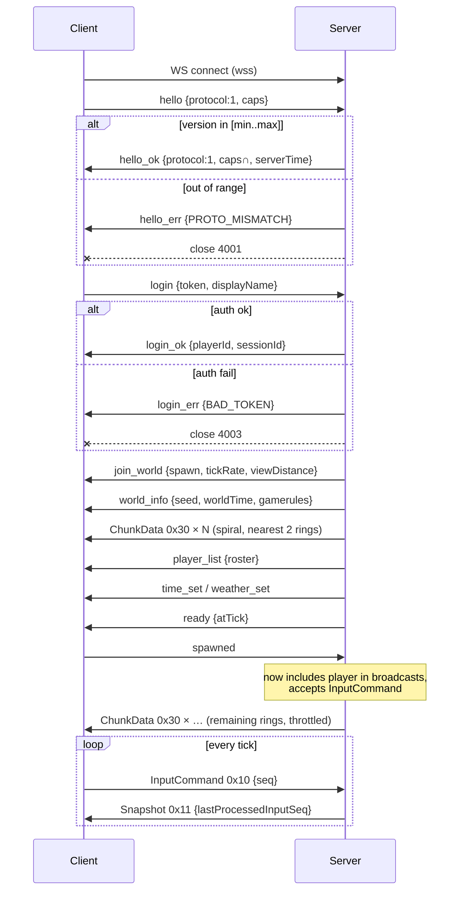
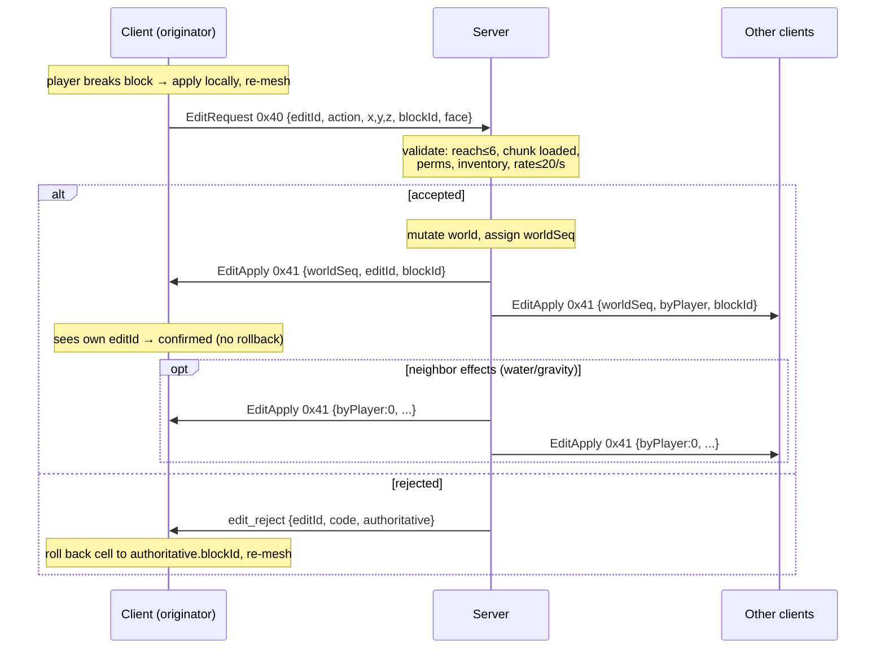

# MULTIPLAYER_PROTOCOL.md

Versioned WebSocket message protocol for MinecraftV2. Authoritative Node.js server, browser TypeScript + Three.js clients, shared TS types. This document is the wire contract. Every field, byte layout, and constant below is normative — implement exactly as written.

---

## 0. Load-Bearing Constants (single source of truth)

Put these in `shared/protocol/constants.ts`. All numbers below are referenced by section.

```ts
export const PROTOCOL_VERSION = 1;          // monotonic int, bump on ANY wire break
export const PROTOCOL_MIN_SUPPORTED = 1;    // server accepts [MIN..VERSION]

export const SIM_HZ = 20;                    // server simulation tick
export const SIM_DT_MS = 50;                 // 1000 / SIM_HZ
export const SNAPSHOT_HZ = 20;               // full-rate entity broadcast
export const SNAPSHOT_FAR_HZ = 10;           // entities beyond half view distance
export const INPUT_HZ_MIN = 20;              // client input send floor
export const INPUT_HZ_MAX = 33;              // client input send ceiling (~30ms)

export const INTERP_DELAY_MS = 100;          // baseline render-in-past delay
export const INTERP_DELAY_MIN_MS = 100;
export const INTERP_DELAY_MAX_MS = 200;      // adaptive clamp under jitter
export const EXTRAPOLATION_CAP_MS = 100;     // dead-reckoning limit before freeze

export const KEYFRAME_INTERVAL_TICKS = 20;   // full snapshot every ~1s
export const KEEPALIVE_INTERVAL_MS = 15000;  // server ping cadence
export const KEEPALIVE_TIMEOUT_MS = 30000;   // disconnect after silence

export const CHUNK_SIZE = 16;                // section is CHUNK_SIZE^3
export const SECTION_VOLUME = 4096;          // 16*16*16
export const VIEW_DISTANCE_DEFAULT = 8;      // chunks radius
export const VIEW_DISTANCE_MAX = 16;
export const VIEW_HYSTERESIS = 1;            // extra ring before chunk_unload
export const CHUNK_BUDGET_BYTES_PER_S = 1_500_000; // initial-load throttle/client
export const CHUNK_MAX_INFLIGHT = 8;         // unacked chunk packets before pause

export const POS_QUANT = 32;                 // int16 fixed-point: 1/32 block
export const EDIT_REACH_BLOCKS = 6;          // + small margin server-side
export const EDIT_RATE_CAP_PER_S = 20;
export const CHAT_MAX_CHARS = 256;
export const CHAT_RATE = { msgs: 3, perMs: 2000 };
export const MAX_FRAME_BYTES_CONTROL = 65536; // 64KB cap for non-chunk frames

export const RECONNECT_BACKOFF_MS = [1000, 2000, 4000, 8000, 16000, 30000];

// ── World bounds (§4.3 world_info, §5) ─────────────────────────────
export const WORLD_MIN_Y = -64;              // inclusive buildable floor; bedrock layer at MIN_Y
export const WORLD_HEIGHT = 384;             // total buildable height in blocks
export const WORLD_MAX_Y = 319;              // inclusive ceiling = WORLD_MIN_Y + WORLD_HEIGHT - 1
export const WORLD_SECTION_COUNT = 24;       // WORLD_HEIGHT / CHUNK_SIZE (16³ sections per column)
export const WORLD_MIN_SECTION_Y = -4;       // WORLD_MIN_Y >> 4
export const WORLD_MAX_SECTION_Y = 19;       // WORLD_MAX_Y >> 4
// Every edit AND movement step MUST validate WORLD_MIN_Y ≤ y ≤ WORLD_MAX_Y; i16 y/sectionY hold the range.

// ── Block-state id space (§3, §4.5, §5.1, §4.6) ────────────────────
// CANONICAL: every wire `blockId` field is a global block-STATE id, NOT a block type.
export const BLOCK_STATE_BITS = 15;          // canonical global block-STATE id width (edits, chunk palettes, item→block map)
export const MAX_BLOCK_STATE_ID = 32767;     // 2^15 - 1; a `blockId`/`stateId` field is in [0..MAX_BLOCK_STATE_ID]
export const AIR_STATE_ID = 0;               // air is state 0 everywhere (break result, empty-section marker)

// ── Combat / damage / survival (§4.13) ─────────────────────────────
export const HURT_INVULN_TICKS = 10;         // 0.5 s i-frames after a damage event (only larger damage re-applies within window)
export const ATTACK_KB_BASE = 0.4;           // base horizontal knockback impulse (blocks/tick)
export const ATTACK_KB_PER_LEVEL = 0.5;      // + per Knockback (melee) / Punch (bow) enchant level
export const ATTACK_KB_SPRINT_BONUS = 1;     // + one extra knockback level while sprint-attacking
export const ATTACK_CRIT_CHARGE_MIN = 0.9;   // attack-cooldown charge ≥ this fraction required to crit / sweep
export const REGEN_FOOD_THRESHOLD = 18;      // food ≥ 18 → passive regen (naturalRegeneration gamerule)
export const SPRINT_FOOD_THRESHOLD = 6;      // food > 6 required to start/continue sprinting
export const FALL_DMG_SAFE_BLOCKS = 3;       // first 3 blocks of a fall deal no damage
export const AIR_MAX_TICKS = 300;            // 15 s breath; -1/tick underwater, drown 1 dmg/s once 0

// ── Movement physics (§6.3.1 — shared/physics, run bit-identically both sides) ──
export const PHYS_GRAVITY = -0.08;           // blocks/tick² added to vy each tick (players/most mobs)
export const PHYS_DRAG_AIR = 0.98;           // vertical air-drag multiplier per tick (applied after gravity)
export const PHYS_TERMINAL_VY = -3.92;       // steady-state fall velocity = GRAVITY*DRAG/(1-DRAG)
export const PHYS_JUMP_VY = 0.42;            // initial jump velocity (blocks/tick)
export const PHYS_JUMP_BOOST_VY = 0.1;       // + per Jump Boost amplifier level
export const PHYS_SPRINT_JUMP_BOOST = 0.2;   // extra forward impulse on a sprint-jump
export const PHYS_STEP_HEIGHT = 0.6;         // auto step-up height (blocks)
export const PHYS_DEFAULT_SLIPPERINESS = 0.6;// ground friction factor of a normal block
export const SPEED_WALK = 4.317;             // blocks/s
export const SPEED_SPRINT = 5.612;           // blocks/s
export const SPEED_SNEAK = 1.295;            // blocks/s
export const SPEED_FLY = 10.89;              // creative/spectator base fly speed (blocks/s)
export const PLAYER_AABB = { w: 0.6, hStand: 1.8, hSneak: 1.5, hCrawlSwimElytra: 0.6 };
```

---

## 1. Overview

### 1.1 Authority model
The **server is fully authoritative**. Clients send **intent** (inputs, edit requests, chat, inventory actions), never authoritative state. The server simulates the world at `SIM_HZ = 20` and broadcasts snapshots. Any client-asserted position, block change, or inventory mutation is a *request* that the server validates, applies, and rebroadcasts. Clients may predict locally (§6.3, §7) but always reconcile to server state.

### 1.2 Transport
- **`wss://` only** (WebSocket over TLS). Plaintext `ws://` is permitted solely in dev/LAN mode and never in production.
- WebSocket runs over **TCP** → ordered, reliable, with head-of-line (HOL) blocking. Acceptable for a voxel/building game (see §14). The protocol is transport-agnostic: the hot-path channel (snapshots) could later move to WebTransport/QUIC datagrams without touching message shapes.
- **Frame-type is the primary discriminator**: WebSocket **text frames carry JSON** (control/cold path); **binary frames carry typed-array framing** (hot path). See §2.

### 1.3 Protocol version constant & negotiation
- `PROTOCOL_VERSION` is a single **monotonically increasing integer**, bumped on *any* wire-breaking change. It is independent of any marketing/game version.
- The server advertises a supported inclusive range `[PROTOCOL_MIN_SUPPORTED .. PROTOCOL_VERSION]`.
- Negotiation happens in the **first message pair**, **before authentication**, so out-of-date clients get a clear "update required" instead of a confusing auth error.

**Negotiation rule (normative):**
1. Client sends `hello` with its `protocol` int and optional `caps` (capability strings).
2. If `client.protocol` is **inside** the server range → server replies `hello_ok`. The session proceeds at `min(client.protocol, server.PROTOCOL_VERSION)` semantics; when they differ, the higher side downgrades to the lower's message set (never send a field a lower version can't parse).
3. If `client.protocol` is **outside** the range → server replies `hello_err {code:"PROTO_MISMATCH", min, max}` then closes with WS close code **4001**. Client must not retry without user action (update).
4. Optional **capabilities** (`caps`) are additive features negotiated as the **set intersection** of both sides' advertised caps. A missing cap must degrade gracefully, never error.

State machine (Minecraft-style): `HANDSHAKE → LOGIN → JOIN → PLAY`. Any message illegal for the current state → kick with `PROTOCOL_ERROR` (close 4011).

---

## 2. Envelope Format

### 2.1 Two envelopes, selected by WebSocket frame type

**Text frame → JSON control envelope.** Used for all low-frequency, reliable, schema-churny messages (handshake, login, join, worldinfo, roster, chat, inventory, time/weather, kick).

```jsonc
{ "t": "<type>", ...fields }   // "t" is the string discriminator, always first
```

**Binary frame → opcode-framed typed layout.** Used for all hot paths (player/entity snapshots, chunk data, block edits, ping). Every binary frame begins with a **1-byte opcode**; the remainder is an opcode-specific fixed layout, little-endian.

```
Binary frame:
┌────────┬───────────────────────────────┐
│ op:u8  │ payload (opcode-specific, LE)  │
└────────┴───────────────────────────────┘
```

Rationale (do not "simplify" to all-JSON): a JSON player-state is ~80–150 B; binary quantized form is 16–24 B (4–8×). At 40 players × 20 Hz that is ~3.8 MB/s JSON vs ~0.6 MB/s binary server egress. Handshake/chat/inventory stay JSON because their evolvability is worth more than their negligible bytes.

**Endianness:** all multi-byte binary fields are **little-endian** (matches `DataView.setUint*(…, true)` and JS typed arrays on x86/ARM). Always pass `littleEndian = true` explicitly to `DataView`.

**Escape hatch:** opcode `0x00` = "JSON-in-binary" (UTF-8 JSON bytes follow the opcode) if JSON ever must ride a binary channel. Not used in v1.

### 2.2 Opcode map

| Range | Class | Opcodes (v1) |
|---|---|---|
| `0x00` | Escape | `0x00` JSON-in-binary |
| `0x01–0x0F` | Session / keepalive | `0x01` Ping, `0x02` Pong |
| `0x10–0x2F` | Snapshots / entity state | `0x10` InputCommand (C→S), `0x11` Snapshot (S→C) |
| `0x30–0x3F` | Chunks / world | `0x30` ChunkData, `0x31` ChunkUnload |
| `0x40–0x4F` | Edits | `0x40` EditRequest (C→S), `0x41` EditApply (S→C broadcast) |
| `0x50–0x5F` | Reserved / extensions | — |

JSON messages are keyed by `t` string, not opcode. The two namespaces never collide because they travel on different frame types.

### 2.3 Shared TS types (authoring rule)
All envelopes live in `shared/protocol/`. JSON messages are a discriminated union on `t`; binary messages have a matching `encodeX(view)` / `decodeX(view)` pair and a documented byte table. Builder agents: never define a wire type in only client or only server — it goes in `shared/`.

```ts
// shared/protocol/json.ts
export type JsonC2S = Hello | Login | Leave | ChatSend | InvAction | Spawned
  // v1 additive (§4.5a/§4.6/§4.13/§4.14) — old clients ignore unknown `t`
  | InteractBlock | UseItem | InteractEntity | HeldSlot | Respawn
  | ContainerClose | RecipeSelect | SetCreativeSlot | PickBlock
  | SignEdit | BookEdit | EnterBed | LeaveBed | TeleportConfirm;
export type JsonS2C = HelloOk | HelloErr | LoginOk | LoginErr | JoinWorld
  | WorldInfo | PlayerList | PlayerJoin | PlayerLeave | Ready
  | InventorySet | InventoryDelta | InvAck | InvReject
  | Chat | EntitySpawn | EntityDespawn | TimeSet | WeatherSet | Kick
  // v1 additive (§4.6/§4.7/§4.8/§4.12/§4.13/§4.14/§4.15) — old clients ignore unknown `t`
  | SetHealth | SetExperience | EntityMeta | EntityHurt | EntityDeath | YouDied
  | EffectSet | EffectRemove | PlaySound | StopSound | SpawnParticle
  | ContainerOpen | ContainerClose | WindowProperty | EnchantOffers | TradeOffers
  | RecipeBook | BossBar | Worldborder | BlockEntityData | BlockAction | Explosion
  | CollectItem | Scoreboard | Team | SetTitle | SetActionBar | SleepStatus
  | Teleport | Difficulty;
```

---

## 3. Quantization Formulas (binary hot path)

Reference these everywhere a binary field is packed. `enc` = client/server encode, `dec` = decode.

| Field | Wire type | Encode | Decode | Resolution |
|---|---|---|---|---|
| Position (chunk-relative) | `int16` ×3 | `round(localPos * 32)` | `raw / 32` | 1/32 block (~0.03 m) |
| Position (absolute, if used) | `float32` ×3 | direct | direct | full |
| Velocity | `int16` ×3 | `round(v * 256)` | `raw / 256` | 1/256 block/tick |
| Yaw | `uint16` | `round((yaw mod 360) / 360 * 65536)` | `raw / 65536 * 360` | ~0.0055° |
| Pitch | `int16` | `round(clamp(pitch,-90,90) / 90 * 32767)` | `raw / 32767 * 90` | ~0.003° |
| Move axis (input) | `int8` | `round(clamp(axis,-1,1) * 127)` | `raw / 127` | 1/127 |
| Time delta | `uint16` | ms, clamp 0..65535 | direct | 1 ms |

Position uses **chunk-relative int16** so 1/32-block precision fits in 6 bytes; the containing chunk is implied by the entity's current chunk (sent on chunk changes) or carried as a separate `originChunk` in the Snapshot header. When an entity crosses a chunk boundary, a keyframe (§6.6) re-establishes origin.

### 3.1 Block-state ids (normative — resolves the u16-vs-15-bit ambiguity)

**Every `blockId` field on the wire — in `EditRequest`/`EditApply` (§4.5), chunk palettes (§5.1), and the item→block mapping used on place (§4.6) — is a global block-STATE id, not a block type.** Minecraft blocks are *states*, not types: `oak_stairs` alone has ~40 states (`facing` ×4, `half` ×2, `shape` ×5), `oak_log` 3 (`axis`), a door 32 (`facing`×4·`half`×2·`hinge`×2·`open`×2·`powered`?), a fence/wall carries 4 connection bits + `waterlogged`, redstone dust `power` 0–15, crops `age` 0–7, leaves `distance`+`persistent`, beds `part`+`occupied`, rails `shape`, fluids `level` 0–7 + `falling` (§3.2). A flat block *type* id throws all of this away, so the id space is the **flattened global state table**.

- Canonical width is **15 bits** (`BLOCK_STATE_BITS`, `MAX_BLOCK_STATE_ID = 32767`); vanilla's ~28k states fit. The wire uses a `u16` container but the value is always in `[0..32767]`. Builders: treat the `u16 blockId` in §4.5 and the "direct 15-bit global IDs" in §5.1 as **the same id space** — do not maintain two id tables.
- `shared/blocks/` owns the `stateId ↔ {block, properties}` registry, generated once from the block/property definitions and identical on both sides. `stateId 0 = air` (`AIR_STATE_ID`).
- **Placement resolves the state server-side.** The client sends the item + target face + look + sub-voxel cursor (§4.5a `interact_block`/place); the server computes `facing`/`half`/`axis`/`shape`/`hinge`/`waterlogged`/`open` from `face`, player `yaw`/`pitch`, the `cursor` hit point, and neighbor states, then broadcasts the resulting `stateId` in `EditApply`. Clients never assert orientation.

### 3.2 Fluids as block states

Water and lava are **block states carrying `level` (0 = source, 1–7 flowing depth) + a `falling` bit**, plus every log/slab/stair/fence/etc. may carry a `waterlogged` bit that is itself part of its `stateId`. Source vs flowing is the `level`/`falling` distinction — a break/place of a fluid source emits normal `EditApply`; the server then streams the flow spread as neighbor-effect `EditApply` frames (`byPlayer=0`, §7) that update each cell's `level`/`falling` state. Shared physics (§6.3.1) reads the fluid `level` to apply the horizontal **flow push force** and buoyancy/drag.

---

## 4. Message Catalog

### 4.1 Catalog table

| # | Name | Dir | Envelope | Reliability | Trigger |
|---|---|---|---|---|---|
| 1 | `hello` | C→S | JSON | reliable | on connect |
| 2 | `hello_ok` | S→C | JSON | reliable | accept version |
| 3 | `hello_err` | S→C | JSON | reliable | reject version, then close 4001 |
| 4 | `login` | C→S | JSON | reliable | after hello_ok |
| 5 | `login_ok` | S→C | JSON | reliable | auth pass |
| 6 | `login_err` | S→C | JSON | reliable | auth fail, then close 4003 |
| 7 | `join_world` | S→C | JSON | reliable | begin join sequence |
| 8 | `world_info` | S→C | JSON | reliable | seed/time/spawn/gamerules |
| 9 | ChunkData `0x30` | S→C | binary | reliable | join snapshot + streaming |
| 10 | ChunkUnload `0x31` | S→C | binary | reliable | player left chunk radius |
| 11 | `player_list` | S→C | JSON | reliable | full roster on join |
| 12 | `player_join` | S→C | JSON | reliable | a player joined |
| 13 | `player_leave` | S→C | JSON | reliable | a player left |
| 14 | `ready` | S→C | JSON | reliable | join complete, may spawn |
| 15 | `spawned` | C→S | JSON | reliable | local player instantiated |
| 16 | InputCommand `0x10` | C→S | binary | latest-wins | every input tick |
| 17 | Snapshot `0x11` | S→C | binary | latest-wins | every snapshot tick |
| 18 | EditRequest `0x40` | C→S | binary | reliable+ack | player edits a block |
| 19 | EditApply `0x41` | S→C | binary | reliable | edit accepted, broadcast |
| 20 | `edit_reject` | S→C | JSON | reliable | edit denied |
| 21 | `inventory_set` | S→C | JSON | reliable | join / container open |
| 22 | `inventory_delta` | S→C | JSON | reliable | inventory changed |
| 23 | `inv_action` | C→S | JSON | reliable | player moves items |
| 24 | `inv_ack` | S→C | JSON | reliable | action accepted |
| 25 | `inv_reject` | S→C | JSON | reliable | action denied |
| 26 | `chat_send` | C→S | JSON | reliable | player sends chat/command |
| 27 | `chat` | S→C | JSON | reliable | broadcast chat |
| 28 | `entity_spawn` | S→C | JSON | reliable | mob/entity enters view |
| 29 | EntityMove | S→C | binary | latest-wins | folded into Snapshot `0x11` |
| 30 | `entity_despawn` | S→C | JSON | reliable | entity leaves view/dies |
| 31 | `time_set` | S→C | JSON | reliable | join + periodic correction |
| 32 | `weather_set` | S→C | JSON | reliable | join + on change |
| 33 | Ping `0x01` | S→C | binary | keepalive | every 15s |
| 34 | Pong `0x02` | C→S | binary | keepalive | reply to ping |
| 35 | `leave` | C→S | JSON | reliable | graceful quit |
| 36 | `kick` | S→C | JSON | reliable | abnormal termination |
| 37 | `interact_block` | C→S | JSON | reliable | right-click/use a block (open, toggle, place-on) |
| 38 | `use_item` | C→S | JSON | reliable | use held item (eat, draw bow, bucket) |
| 39 | `interact_entity` | C→S | JSON | reliable | attack/interact/trade/mount a specific entity |
| 40 | `held_slot` | C→S | JSON | reliable | select hotbar slot / swap offhand |
| 41 | `set_creative_slot` | C→S | JSON | reliable | creative: place any item in a slot |
| 42 | `pick_block` | C→S | JSON | reliable | middle-click pick block/entity into hand |
| 43 | `recipe_select` | C→S | JSON | reliable | recipe-book click → auto-fill grid |
| 44 | `container_open` | S→C | JSON | reliable | a window opened (chest/furnace/…) |
| 45 | `container_close` | S↔C | JSON | reliable | window closed (either side) |
| 46 | `window_property` | S→C | JSON | reliable | per-window scalar (furnace/anvil/brew/beacon) |
| 47 | `enchant_offers` | S→C | JSON | reliable | enchanting-table options |
| 48 | `trade_offers` | S→C | JSON | reliable | villager/merchant offer list |
| 49 | `recipe_book` | S→C | JSON | reliable | recipe unlock/init |
| 50 | `set_health` | S→C | JSON | reliable | local-player vitals (HP/food/air/armor…) |
| 51 | `set_experience` | S→C | JSON | reliable | local-player XP |
| 52 | `entity_meta` | S→C | JSON | reliable | health/name/equipment/pose change |
| 53 | `entity_hurt` | S→C | JSON | reliable | damage event (knockback + hurt anim) |
| 54 | `entity_death` | S→C | JSON | reliable | entity died (death anim) |
| 55 | `you_died` | S→C | JSON | reliable | local player died (death screen) |
| 56 | `respawn` | C→S | JSON | reliable | request respawn; re-runs spawn/chunk seq |
| 57 | `effect_set`/`effect_remove` | S→C | JSON | reliable | status-effect add/update/remove |
| 58 | `play_sound`/`stop_sound` | S→C | JSON | reliable | positional sound event |
| 59 | `spawn_particle` | S→C | JSON | reliable | particle event |
| 60 | `block_entity_data` | S→C | JSON | reliable | sign/furnace/banner/… NBT |
| 61 | `sign_edit`/`book_edit` | C→S | JSON | reliable | submit edited sign/book text |
| 62 | `block_action` | S→C | JSON | reliable | piston move / note-block / chest-lid / redstone action |
| 63 | `explosion` | S→C | JSON | reliable | TNT/creeper/bed explosion event |
| 64 | `collect_item` | S→C | JSON | reliable | item/orb fly-to-inventory pickup |
| 65 | `bossbar` | S→C | JSON | reliable | boss-bar add/update/remove |
| 66 | `worldborder` | S→C | JSON | reliable | border init/resize/warn/damage |
| 67 | `scoreboard` | S→C | JSON | reliable | objectives/scores/display |
| 68 | `team` | S→C | JSON | reliable | team create/update/member/remove |
| 69 | `set_title`/`set_actionbar` | S→C | JSON | reliable | title/subtitle + above-hotbar text |
| 70 | `enter_bed`/`leave_bed` | C→S | JSON | reliable | begin/stop sleeping |
| 71 | `sleep_status` | S→C | JSON | reliable | X/Y sleeping + skip-night broadcast |
| 72 | `teleport` | S→C | JSON | reliable | server teleport w/ confirm id |
| 73 | `teleport_confirm` | C→S | JSON | reliable | confirm a `teleport` id |
| 74 | `difficulty` | S→C | JSON | reliable | difficulty + lock (join + on change) |

> Note on #29 EntityMove: there is no standalone move message. **All per-tick position/rotation/velocity/animation of players AND entities travel inside the single Snapshot `0x11` binary frame** (§4.4.2). This keeps one hot-path packet per tick.

---

### 4.2 Session & Handshake

**#1 `hello` (C→S, JSON)**
```jsonc
{ "t": "hello", "protocol": 1, "client": "voxel/1.0.0", "caps": ["zstd","ext_height"] }
```
| field | type | notes |
|---|---|---|
| `t` | `"hello"` | |
| `protocol` | int | client's `PROTOCOL_VERSION` |
| `client` | string | free-form build id, ≤64 chars |
| `caps` | string[] | optional feature flags |

**#2 `hello_ok` (S→C, JSON)**
```jsonc
{ "t": "hello_ok", "protocol": 1, "caps": ["zstd"], "serverTime": 1720000000000 }
```
| field | type | notes |
|---|---|---|
| `protocol` | int | server's `PROTOCOL_VERSION` |
| `caps` | string[] | **intersection** of client/server caps |
| `serverTime` | int (ms epoch) | seeds clock-offset estimate |

**#3 `hello_err` (S→C, JSON)** — then close **4001**
```jsonc
{ "t": "hello_err", "code": "PROTO_MISMATCH", "min": 1, "max": 1 }
```

**#4 `login` (C→S, JSON)**
```jsonc
{ "t": "login", "token": "eyJhbGc...", "displayName": "Steve" }
```
| field | type | notes |
|---|---|---|
| `token` | string | bearer/JWT (`sub`,`exp`), validated server-side |
| `displayName` | string | cosmetic only, ≤32 chars, server validates/dedups |

Dev/LAN alternative: `{ "t":"login", "displayName":"Steve", "password":"…" }`. Never in production.

**#5 `login_ok` (S→C, JSON)**
```jsonc
{ "t": "login_ok", "playerId": "u_9f2a", "sessionId": "s_be31" }
```
`playerId` is server-assigned, immutable, opaque (UUID-like). **Never trust client identity.** Enforce single session: kick the older socket on duplicate login (close 4005).

**#6 `login_err` (S→C, JSON)** — then close **4003**
```jsonc
{ "t": "login_err", "code": "BAD_TOKEN" }
```

---

### 4.3 Join Sequence & World Info

Ordered, server-driven, after `login_ok`. Client does not move or spawn until `ready`.

**#7 `join_world` (S→C, JSON)**
```jsonc
{ "t": "join_world", "worldId": "w_main", "dimension": "overworld",
  "gamemode": "survival", "tickRate": 20, "viewDistance": 8,
  "yourPlayerId": "u_9f2a", "yourEntityId": 4207,
  "minY": -64, "worldHeight": 384,
  "spawn": { "x": 8.5, "y": 72, "z": 8.5, "yaw": 0, "pitch": 0 } }
```
| field | type | notes |
|---|---|---|
| `worldId` | string | |
| `dimension` | string | `"overworld"` in v1 |
| `gamemode` | `"survival"\|"creative"\|"adventure"\|"spectator"` | see behavior table below |
| `tickRate` | int | negotiated `SIM_HZ` |
| `viewDistance` | int | server-chosen, ≤ `VIEW_DISTANCE_MAX` |
| `yourPlayerId` | string | echo of local player id (opaque string) |
| `yourEntityId` | u32 | **numeric** id of the local player in Snapshot `0x11`; same id space as `EntityRecord.entityId` and `EditApply.byPlayer` |
| `minY` / `worldHeight` | int | `WORLD_MIN_Y` / `WORLD_HEIGHT` (§0); client bounds movement/edits/render to `[minY .. minY+worldHeight-1]` |
| `spawn` | Pose | initial pose |

**Gamemode behavior (normative — clients change physics/interest/render on it):**

| gamemode | break/place | fly / noclip | collision & visibility | interaction |
|---|---|---|---|---|
| `survival` | yes (durability, hunger, fall dmg) | no | normal | full |
| `creative` | instant break, infinite items | fly (double-jump), no fall dmg | normal | full + creative slot/pick-block (§4.6) |
| `adventure` | **only** blocks the item's `CanDestroy`/`CanPlaceOn` NBT allows | no | normal | use/interact only |
| `spectator` | never | fly + **noclip** (passes blocks) | **no collision, invisible to others, not in others' interest set**; can spectate through an entity's camera | none (no edits, no attacks, no pickups) |

`spectator` is the reason interest management (§6.6) must not broadcast a spectator's `EntityRecord` to other clients, and shared physics (§6.3.1) must skip collision for it.

**#8a Numeric ↔ string id mapping (normative).** Every roster message carries **both** the opaque string `playerId` and the numeric `entityId`. `Snapshot 0x11` EntityRecords and `EditApply.byPlayer` use only the numeric `entityId`; the client joins them to a roster entry (name/skin/team) through this pair. Without it a hot-path record cannot be tied to a name — so `player_list`, `player_join`, and `join_world.yourEntityId` all supply the numeric id.

**#8 `world_info` (S→C, JSON)** — seed, time, spawn, difficulty, gamerules
```jsonc
{ "t": "world_info",
  "seed": "8675309",
  "worldTime": 6000,
  "dayLengthTicks": 24000,
  "minY": -64, "worldHeight": 384,
  "difficulty": "normal", "difficultyLocked": false,
  "spawn": { "x": 8.5, "y": 72, "z": 8.5 },
  "gamerules": {
    "doDaylightCycle": true, "doWeatherCycle": true,
    "keepInventory": false, "mobGriefing": true, "pvp": true,
    "randomTickSpeed": 3, "fallDamage": true,
    "naturalRegeneration": true, "showDeathMessages": true,
    "doTileDrops": true, "doMobLoot": true, "doFireTick": true,
    "doMobSpawning": true, "doInsomnia": true, "spawnRadius": 10,
    "playersSleepingPercentage": 100, "doImmediateRespawn": false,
    "maxEntityCramming": 24, "doPatrolSpawning": true, "doTraderSpawning": true,
    "doLimitedCrafting": false
  } }
```
| field | type | notes |
|---|---|---|
| `seed` | string | procedural gen seed (string to survive >2^53) |
| `worldTime` | int (ticks) | authoritative world time |
| `dayLengthTicks` | int | full day in ticks (24000) |
| `minY` / `worldHeight` | int | `WORLD_MIN_Y` / `WORLD_HEIGHT` (§0) |
| `difficulty` | `"peaceful"\|"easy"\|"normal"\|"hard"` | see behavior below; sent again via `difficulty` (#74) on change |
| `difficultyLocked` | bool | client greys out the difficulty control |
| `spawn` | {x,y,z} | world spawn |
| `gamerules` | object | open map; unknown keys ignored by old clients |

**Difficulty behavior (normative):** `peaceful` = no hostile spawns (existing hostiles despawn), **hunger never drops below the starvation line and starvation damage is disabled**, faster regen; `easy/normal/hard` scale mob damage, mob equipment/reinforcement chance, zombie door-breaking, and regen rate. The server, not the client, enforces these — the client only renders the setting.

**Canonical gamerules (each MUST gate a real subsystem):**

| gamerule | type | wired to |
|---|---|---|
| `doDaylightCycle` / `doWeatherCycle` | bool | §4.9 time/weather advance |
| `keepInventory` | bool | §4.13 death: keep items + XP on death |
| `doImmediateRespawn` | bool | §4.12 `you_died.canRespawnImmediately`; auto-send `respawn` |
| `mobGriefing` | bool | creeper/enderman/explosion block edits (§4.5 explosion) |
| `pvp` | bool | §4.13 player-vs-player damage gate |
| `fallDamage` | bool | §4.13 fall-damage formula on/off |
| `naturalRegeneration` | bool | §4.13 food≥18 passive regen |
| `showDeathMessages` | bool | broadcast the `you_died`/`chat` death message |
| `doTileDrops` / `doMobLoot` | bool | spawn dropped-item entities (§4.8) on break / mob death |
| `doFireTick` | bool | fire spread/decay random ticks |
| `doMobSpawning` / `doPatrolSpawning` / `doTraderSpawning` | bool | natural / pillager-patrol / wandering-trader spawns |
| `doInsomnia` | bool | phantom spawns after 3 sleepless days (§4.14 resets the counter) |
| `spawnRadius` | int | radius around world spawn for respawn placement |
| `randomTickSpeed` | int | crop growth / leaf decay / fire tick rate |
| `playersSleepingPercentage` | int (0–100) | §4.14 fraction of players asleep needed to skip night |
| `maxEntityCramming` | int | entities in one block before cramming damage |
| `doLimitedCrafting` | bool | §4.6 only unlocked recipes are craftable |

> `seed` drives all procedural terrain **and** procedural texture generation (no external assets). Client must derive identical geometry from `seed`; blocks it receives via ChunkData are authoritative over any local prediction.

**#74 `difficulty` (S→C, JSON)** — difficulty change after join: `{ "t": "difficulty", "difficulty": "hard", "difficultyLocked": true }`. Switching to `peaceful` MUST despawn hostiles server-side and disable the hunger/starvation-damage path (§4.13).

**#9 ChunkData `0x30` (S→C, binary)** — see §5.

**#11 `player_list` (S→C, JSON)** — full roster
```jsonc
{ "t": "player_list", "players": [
  { "playerId": "u_1", "entityId": 4101, "name": "Alex", "gamemode": "survival", "ping": 42,
    "pose": {"x":10,"y":72,"z":4,"yaw":90,"pitch":0},
    "skin": { "seed": 771, "model": "wide", "mainHand": "right", "cape": true } },
  { "playerId": "u_2", "entityId": 4102, "name": "Notch", "gamemode": "creative", "ping": 88,
    "pose": {"x":-3,"y":70,"z":20,"yaw":0,"pitch":0},
    "skin": { "seed": 12, "model": "slim", "mainHand": "right", "cape": false } }
] }
```
| field | type | notes |
|---|---|---|
| `playerId` | string | opaque id |
| `entityId` | u32 | **numeric** id used in Snapshot `0x11` / `EditApply.byPlayer` (§8a) |
| `gamemode` | enum | survival\|creative\|adventure\|spectator |
| `ping` | int (ms) | keepalive RTT (§4.10), refreshed periodically |
| `skin` | object | procedural appearance — no external assets |

**Appearance / skin / nametag (normative).** There are **no external player textures**. A player's `skin` is derived procedurally from `{ seed:u32, model:"wide"\|"slim" }`; the client generates the 64×64 skin texture from `seed` (matching ART's procedural entity textures). `cape` toggles a procedurally-generated cape; `mainHand` picks the held-item side. A player renders with: the procedural skin, a floating **nametag** = display name (+ team color prefix/suffix, §4.7 teams), and, if a `below_name` scoreboard objective is set (§4.7), the number below the name. Nametag text/visibility/team color changes ride `entity_meta` (§4.8) and `team`/`scoreboard` (§4.7). Without `skin` remote players would be untextured.

**#12 `player_join` (S→C, JSON)**
```jsonc
{ "t": "player_join", "playerId": "u_3", "entityId": 4103, "name": "Herobrine",
  "gamemode": "survival", "ping": 0, "pose": {"x":0,"y":72,"z":0,"yaw":0,"pitch":0},
  "skin": { "seed": 6669, "model": "wide", "mainHand": "right", "cape": false } }
```

**#13 `player_leave` (S→C, JSON)**
```jsonc
{ "t": "player_leave", "playerId": "u_3", "reason": "quit" }
```
`reason ∈ "quit" | "timeout" | "kick"`.

**#14 `ready` (S→C, JSON)**
```jsonc
{ "t": "ready", "atTick": 128000 }
```
Signals init complete. Server begins including this player in broadcasts and accepting InputCommand **only after** it receives `spawned`.

**#15 `spawned` (C→S, JSON)**
```jsonc
{ "t": "spawned" }
```

**#35 `leave` (C→S, JSON)**
```jsonc
{ "t": "leave" }
```
Graceful quit. Server persists state, broadcasts `player_leave{reason:"quit"}`.

---

### 4.4 Hot Path — Input & Snapshot (binary)

#### 4.4.1 InputCommand `0x10` (C→S)

Client sends **intent**, not position. Send rate `INPUT_HZ_MIN..INPUT_HZ_MAX` (20–33 Hz). Batch is one input per frame; if render runs faster than send budget, coalesce.

```
op=0x10 InputCommand (16 bytes)
offset type   field
0      u8     op = 0x10
1      u32    seq            // monotonic input sequence, per-session
5      u16    dtMs           // ms since previous input (§3)
7      i8     moveX          // strafe, quantized (§3)
8      i8     moveZ          // forward, quantized
9      u16    yaw            // quantized (§3)
11     i16    pitch          // quantized (§3)
13     u8     flags          // bitfield below
14     u16    reserved       // 0 in v1 (alignment/expansion)
```
`flags` bits: `0x01 jump`, `0x02 sneak`, `0x04 sprint`, `0x08 primaryAction`, `0x10 secondaryAction`, `0x20 onGroundClaim` (advisory only). Server validates against physics (speed cap, collision, no-fly unless gamemode allows) and advances authoritative state; it records the highest processed `seq` per player.

> `primaryAction`/`secondaryAction` are **untargeted and advisory** — they cannot say *which* block/entity or *where on the face*. All targeted actions (break, use-on-block, attack/interact-entity) carry the target explicitly through the JSON messages in §4.5a. The flags exist only for animation/prediction hints.

**#40 `held_slot` (C→S, JSON)** — selected hotbar slot + offhand swap (gap: server can't infer the active slot, and remote hands must render the right item)
```jsonc
{ "t": "held_slot", "slot": 3 }            // scroll / number keys 1-9 → hotbar index 0-8
{ "t": "held_slot", "swapOffhand": true }  // F key: swap main-hand ↔ off-hand stacks
```
`slot` is `u8 0..8`. The server records the active hotbar slot per player (authoritative — resolves the ambiguity when two slots hold the same item) and broadcasts the resulting main-hand/off-hand `ItemStack` to others via `entity_meta.equipment` (§4.8) so remote players' hands render correctly.

#### 4.4.2 Snapshot `0x11` (S→C)

One frame per snapshot tick carries **all visible entities** (players + mobs) plus local-player reconciliation data. Delta-compressed against the last client-acked baseline; full keyframe every `KEYFRAME_INTERVAL_TICKS` (~1 s) or when the client has no valid baseline.

```
op=0x11 Snapshot — header (14 bytes)
offset type   field
0      u8     op = 0x11
1      u32    serverTick               // authoritative tick number
5      u32    lastProcessedInputSeq    // for local-player reconciliation (§6.4)
9      u16    baselineTick_lo16        // baseline this delta is against (0 = keyframe)
11     u8     flags                    // 0x01 = keyframe (full state)
12     u16    entityCount              // number of entity records following
--- then entityCount × EntityRecord ---
```

```
EntityRecord (variable, delta-encoded)
offset type   field
0      u32    entityId                 // player or mob id (server-assigned)
4      u8     fieldMask                // which fields present (bits below)
5..    ...    present fields in fixed order
```
`fieldMask` bits & their payloads (appear in this order when their bit is set):

| bit | field | wire | bytes |
|---|---|---|---|
| `0x01` | position | i16 x, i16 y, i16 z (chunk-relative, §3) | 6 |
| `0x02` | originChunk | i32 cx, i32 cz | 8 |
| `0x04` | rotation | u16 yaw, i16 pitch | 4 |
| `0x08` | velocity | i16 vx, i16 vy, i16 vz | 6 |
| `0x10` | animation | u8 animId, u8 animParam | 2 |
| `0x20` | flags | u16 flags2 (bits below) | 2 |
| `0x40` | entityType | u8 (present on keyframe/first appearance) | 1 |
| `0x80` | poseState | u8 pose, u8 itemUse (bits below) | 2 |

**`0x20 flags2` (u16) bits** — a single u8 cannot carry vanilla's boolean metadata; widen to u16:
`0x0001 onGround`, `0x0002 sneaking`, `0x0004 sprinting`, `0x0008 swingArm`, `0x0010 onFire`, `0x0020 glowing`, `0x0040 invisible`, `0x0080 nameVisible`, `0x0100 silent`, `0x0200 noGravity`, `0x0400 baby`, `0x0800 usingItem` (active-use in progress), `0x1000 swingOffhand` (swing is off-hand vs main). `arrowsStuck` count and `frozenTicks` (powder-snow) ride `entity_meta` (§4.8), not the hot path.

**`0x80 poseState`** — 2 bytes:
- `pose` u8: `0 standing`, `1 fallFlying` (elytra), `2 sleeping`, `3 swimming`, `4 spinAttack` (riptide), `5 crouching`, `6 longJumping`, `7 dying`, `8 sitting`. Drives the whole-body animation the interpolator plays.
- `itemUse` u8: active item-use state — high bit `0x80 = off-hand`, low bits `0..0x7F` = a **use progress 0..127** whose meaning is set by the held item (bow/crossbow draw %, eat/drink %, shield-block on/off, spyglass, spear). `0 = not using`.

**Keyframe** (`flags & 0x01`): every entity carries the full field set (`0x01|0x02|0x04|0x08|0x10|0x20|0x40|0x80`). **Delta**: only changed fields' bits set; entities that did not change since baseline are **omitted entirely**. `originChunk` (`0x02`) is included whenever the entity's chunk changed, re-anchoring the int16 position.

Client acks baseline by echoing `serverTick_lo16` in the next InputCommand? — No. To keep InputCommand fixed-size, baseline ack rides a lightweight rule: **the client treats the most recently *fully received* Snapshot tick as its baseline and the server tracks per-connection the last tick it flushed**; on TCP this is deterministic (ordered delivery), so the server encodes each delta against the immediately previous snapshot it sent to that client, and forces a keyframe if that client just connected or fell behind (send buffer high-water mark exceeded). This exploits TCP ordering — no explicit snapshot-ack message needed in v1.

Local player: the client finds its own `entityId` in the record list, snaps to authoritative position, then replays unacked inputs (§6.4). `lastProcessedInputSeq` in the header tells it which inputs to discard.

---

### 4.5 Block Edits — see §7 for the full flow

**#18 EditRequest `0x40` (C→S, binary)**
```
op=0x40 EditRequest (18 bytes)
offset type   field
0      u8     op = 0x40
1      u32    editId          // client-monotonic, per-session
5      u8     action          // 0 = break, 1 = place
6      i32    x               // world block coords
10     i16    y
12     i32    z
16     u16    blockItemId     // creative override only; survival uses the held item. See below.
--- then ---
18     u8     face            // 0..5 = -X,+X,-Y,+Y,-Z,+Z (place adjacency)
```
(19 bytes total incl. `face`.)

> **Placement resolves the block-STATE server-side (§3.1).** For survival, the placed block is derived from the player's **held item**, not from a client-sent state — `blockItemId` is honored only in creative (and still validated). The server computes the final `stateId` (facing/half/axis/shape/hinge/waterlogged/open) from `face`, player `yaw`/`pitch`, the sub-voxel cursor (via §4.5a `interact_block`), and neighbor states, and returns it in `EditApply.blockId`. `blockId` everywhere in §4.5 is a global block-state id in `[0..MAX_BLOCK_STATE_ID]` (§0), i.e. the same id space as chunk palettes (§5.1).

**#19 EditApply `0x41` (S→C, binary broadcast)**
```
op=0x41 EditApply (26 bytes total)
offset type   field
0      u8     op = 0x41
1      u32    worldSeq       // per-chunk authoritative edit sequence (ordering/tie-break)
5      u32    editId         // echoes originator's editId (0 for server/env-origin edits)
9      u32    byPlayer       // originating player id low32 (0 = server/env)
13     u8     action         // 0 break, 1 place
14     i32    x              // world block coords
18     i16    y
20     i32    z
24     u16    blockId        // resulting block-STATE id (0 = air after break)
```
Broadcast to every client with that section loaded. Server-computed neighbor effects (water flow, gravity, cascading updates) are emitted as **additional** `0x41` frames with `byPlayer = 0`; never trusted from clients.

**#20 `edit_reject` (S→C, JSON)**
```jsonc
{ "t": "edit_reject", "editId": 812, "code": "OUT_OF_REACH",
  "authoritative": { "x": 12, "y": 70, "z": -4, "blockId": 3 } }
```
`code ∈ OUT_OF_REACH | CHUNK_NOT_LOADED | NO_PERMISSION | BAD_ITEM | RATE_LIMIT | INVALID_PLACEMENT | OCCUPIED`. `authoritative` gives the true cell state so the client can roll back exactly (§7).

#### 4.5a Block / item / entity interaction (JSON, C→S)

`EditRequest 0x40` is **placement/break of a cell**. A right-click on a door, trapdoor, button, lever, gate, chest, bed, crafting table, jukebox, note block, or lectern is a distinct **USE** action (toggle state / open container / play sound), and clicking an entity needs a target id. The `InputCommand` flags cannot express these, so they are explicit messages.

**#37 `interact_block` (C→S, JSON)** — right-click / use a block; the server decides **interact vs place**
```jsonc
{ "t": "interact_block", "seq": 91, "x": 12, "y": 70, "z": -4,
  "face": 3, "hand": "main", "sneaking": false,
  "cursor": { "x": 0.5, "y": 1.0, "z": 0.5 } }
```
| field | type | notes |
|---|---|---|
| `x,y,z` | int | target block coords |
| `face` | 0..5 | clicked face (−X,+X,−Y,+Y,−Z,+Z) |
| `hand` | `"main"\|"off"` | |
| `sneaking` | bool | **sneaking forces PLACE**, suppressing the block's use action (vanilla: shift-click a chest places instead of opening) |
| `cursor` | {x,y,z} 0..1 | sub-voxel hit point within the cell (slab/stair half, note-block tuning, stem side) |

Server: if the block is interactable and not `sneaking` → run its use (open container → `container_open` §4.6; toggle → block-state `EditApply`; feed redstone for buttons/levers/pressure-plates → `block_action`/neighbor `EditApply`); else treat the held item as a place → `EditApply`. Validates `EDIT_REACH_BLOCKS` + rate cap.

**#38 `use_item` (C→S, JSON)** — use held item with no block target (eat, draw bow, throw, empty bucket in air)
```jsonc
{ "t": "use_item", "seq": 92, "hand": "main" }
{ "t": "use_item", "seq": 93, "hand": "main", "release": true, "heldTicks": 24 }
```
Hold-to-use items send a press then a `release:true`; the server times the hold (eat ≈ 32 ticks, bow draw → arrow velocity) and applies the effect / fires the projectile. Drives the `usingItem`/`itemUse` pose (§4.4.2).

**#39 `interact_entity` (C→S, JSON)** — attack or interact a **specific** entity (the server cannot infer the target from yaw/pitch)
```jsonc
{ "t": "interact_entity", "seq": 94, "entityId": 5001,
  "kind": "attack", "hand": "main", "at": { "x": 0.0, "y": 1.1, "z": 0.0 } }
```
`kind ∈ "attack" | "interact" | "interact_at"`. Required for **combat** (§4.13), **mounting** (boat/minecart/horse/llama), **trading** (opens `trade_offers`, §4.6), **leashing**, **feeding/breeding**, **shearing**, **name-tagging**, and **bucketing** mobs. `at` (relative hit point) selects armor-stand parts. Server validates entity-interaction range + line-of-sight, then resolves the outcome (damage, container, mount, etc.).

#### 4.5b Explosions & block actions (JSON, S→C)

**#63 `explosion` (S→C, JSON)** — TNT / creeper / bed / respawn-anchor. Emitting each destroyed cell as a separate `EditApply` would lose the knockback, the single sound/particle, and the screen shake — so an explosion is **one event**.
```jsonc
{ "t": "explosion", "x": 20.5, "y": 65.0, "z": -3.5, "radius": 3.0,
  "destroyed": [ { "x": 20, "y": 65, "z": -3 }, { "x": 21, "y": 65, "z": -3 } ],
  "knockback": { "x": 0.4, "y": 0.7, "z": -0.2 },
  "cameraShake": 0.6 }
```
`destroyed[]` cells are set to air (client may skip individual `EditApply` for them). `knockback` is the **per-recipient** impulse the server computed for *this* client's player (i16-quantized applies too). The server also emits the fireball particle (§4.8) and boom sound (§4.8) once, and drops item entities for surviving blocks per `mobGriefing`/`doTileDrops`. Client applies knockback to its predicted player and plays `cameraShake` (0..1).

**#62 `block_action` (S→C, JSON)** — transient block behaviors and moving blocks that a static state id can't carry
```jsonc
{ "t": "block_action", "x": 4, "y": 71, "z": 9, "kind": "piston_extend",
  "dir": 1, "sticky": true, "moved": [ { "x": 5, "y": 71, "z": 9, "blockId": 12 } ] }
```
`kind ∈ piston_extend | piston_retract | note_block | chest_lid | shulker_lid | end_gateway | bell_ring`. For pistons, `dir` (0..5 face) + `moved[]` (the pushed cells + their `blockId`) drive the **slide animation**; during travel the moved block is a transient block-entity, and the final resting cells arrive as normal `EditApply`. Note-block carries `{instrument, pitch}` for the §4.8 sound. **Redstone power** (0–15) lives in the block-STATE id (§3.1): repeaters/comparators (delay + strength + comparator mode), observers, detector rails, dispensers/droppers are all encoded as block states, and their power changes broadcast as ordinary `EditApply` frames with `byPlayer=0`.

---

### 4.6 Inventory

**#21 `inventory_set` (S→C, JSON)** — full sync on join / container open
```jsonc
{ "t": "inventory_set", "container": "player", "windowId": 0,
  "slots": [ { "slot": 0, "itemId": 1, "count": 64, "meta": null },
             { "slot": 1, "itemId": 0, "count": 0 } ] }
```
`itemId 0` / `count 0` = empty slot. `windowId 0` = the player inventory; nonzero = the id from `container_open` (§4.6.1). Add `carried` (an ItemStack|null) to report the cursor-held stack after a click (§4.6.3).

**ItemStack meta schema (normative).** `{ itemId, count, meta }` where `itemId` is the global item id and `meta` is `null` for a plain item or the object below (only present keys apply):
```jsonc
{ "itemId": 276, "count": 1, "meta": {
    "damage": 120, "maxDamage": 1561,          // durability: damage 0..maxDamage; tool/armor breaks at ==
    "enchants": [ { "id": "sharpness", "lvl": 5 }, { "id": "unbreaking", "lvl": 3 } ],
    "name": "§bExcalibur", "lore": ["A fine blade"],
    "potion": "strong_healing",                // potion/tipped-arrow type
    "customModelData": 0, "unbreakable": false,
    "color": 16711680,                          // leather-armor / firework dye (rgb int)
    "bannerPatterns": [ { "pattern": "bri", "color": "red" } ],
    "book": { "title": "Notes", "author": "Steve", "pages": ["p1"], "generation": 0 },
    "mapId": 42, "fireworks": { "flight": 1, "stars": [] },
    "blockState": 1032                          // resolved place-state hint for BlockItems (§3.1)
} }
```
**Stack-size table** (server enforces `count ≤ max` on every accept):
| max | items |
|---|---|
| 64 | most blocks & materials |
| 16 | ender pearls, snowballs, eggs, signs, buckets(empty), honey, banners |
| 1 | tools, weapons, armor, elytra, potions, buckets(filled), saddles, shulker boxes, written/writable books, maps, boats/minecarts |

**Durability:** on use/attack/break, the server decrements `meta.damage`; at `damage == maxDamage` the item breaks (removed, `Unbreaking` gives a probabilistic skip, `Mending` repairs from XP orbs). Client renders the durability bar from `damage/maxDamage`.

**#22 `inventory_delta` (S→C, JSON)**
```jsonc
{ "t": "inventory_delta", "container": "player", "windowId": 0,
  "changes": [ { "slot": 0, "itemId": 1, "count": 63, "meta": null } ],
  "carried": { "itemId": 0, "count": 0 } }
```
`carried` (optional) syncs the cursor-held stack (§4.6.3). Result-slot previews (crafting/smithing/stonecutter/anvil) are pushed here as the server recomputes them.

**#23 `inv_action` (C→S, JSON)** — one window click; request, not command
```jsonc
{ "t": "inv_action", "actionId": 17, "windowId": 3,
  "slot": 12, "button": 0, "mode": "pickup",
  "expect": { "slotItem": 1, "slotCount": 64, "carriedItem": 0, "carriedCount": 0 } }
```
Vanilla's `move|split|merge|drop|swap` cannot express the real click model: a **carried CURSOR stack** plus click modes. Model an explicit cursor stack (server-authoritative, echoed via `inventory_set/delta.carried`) and `(windowId, slot, button, mode)`:

| `mode` | `button` | action |
|---|---|---|
| `pickup` | 0 | left-click: pick up / put down whole stack, or swap with cursor |
| `pickup` | 1 | right-click: pick up half / drop one / place one |
| `quick_move` | 0/1 | shift-click: move stack to the other container region |
| `hotbar_swap` | 0..8 | number key 1-9: swap slot ↔ that hotbar index |
| `offhand_swap` | 40 | F key: swap slot ↔ off-hand |
| `clone` | 2 | middle-click (creative): copy slot to cursor |
| `throw` | 0 | Q: drop one from slot (no cursor) |
| `throw` | 1 | Ctrl-Q: drop whole slot |
| `drag_start`/`drag_add`/`drag_end` | 0=even split, 1=one-each, 2=clone | paint-drag distribute the cursor across `drag_add` slots |
| `double_click` | 0 | gather all matching items of the clicked type onto the cursor |

`windowId` scopes **every** action (0 = player inventory; nonzero = `container_open` id). `expect` carries the client's view of the clicked slot **and cursor** for optimistic concurrency (anti-dupe). `drag_*` sends `drag_start`, one `drag_add` per painted slot, then `drag_end`; the server distributes on `drag_end`.

**Prediction:** slot actions ARE predicted then reconciled — the client applies the click to its local slots+cursor optimistically, sends `inv_action` with `expect`, and accepts on `inv_ack`+`inventory_delta` or rolls back to the last authoritative `inventory_set`/`inventory_delta` on `inv_reject`.

**#24 `inv_ack` (S→C, JSON)**: `{ "t":"inv_ack", "actionId":17 }` (usually accompanied by an `inventory_delta`, including the recomputed `carried` cursor + any result slot).

**#25 `inv_reject` (S→C, JSON)**: `{ "t":"inv_reject", "actionId":17, "code":"STATE_MISMATCH" }`. `code ∈ STATE_MISMATCH | NOT_HELD | OUT_OF_RANGE | CONTAINER_CLOSED | ILLEGAL`.

#### 4.6.1 Container windows

**#44 `container_open` (S→C, JSON)** — a functional block/entity opened a window (result of `interact_block`/`interact_entity`)
```jsonc
{ "t": "container_open", "windowId": 3, "type": "chest", "title": "Chest", "slotCount": 27 }
```
`type ∈ chest | double_chest | barrel | shulker | ender_chest | hopper | dropper | dispenser | furnace | blast_furnace | smoker | crafting_table | anvil | grindstone | enchanting_table | brewing_stand | beacon | loom | cartography | stonecutter | smithing | merchant | lectern | horse | llama`. Each type has a **distinct slot layout and result logic** the client must render (ender chest is per-player; horse/llama include saddle+armor+chest slots). A following `inventory_set{windowId}` fills the slots.

**#45 `container_close` (S↔C, JSON)** — `{ "t": "container_close", "windowId": 3 }`. Either side may close: client on Esc/E; server force-closes (block broken, out of range, death). On close a non-null `carried` cursor stack is **dropped** server-side.

**#46 `window_property` (S→C, JSON)** — dynamic per-window scalars (vanilla WindowProperty): `{ "t":"window_property", "windowId":5, "key":"cookProgress", "value":137 }`. Keys — furnace: `burnTime|burnTimeTotal|cookProgress|cookTotal`; anvil: `levelCost`; brewing: `brewProgress|fuel`; beacon: `powerLevel|primaryEffect|secondaryEffect`.

**#47 `enchant_offers` (S→C, JSON)** — the 3 enchant-table options
```jsonc
{ "t": "enchant_offers", "windowId": 6, "slots": [
  { "level": 5, "enchantHint": "unbreaking", "lapisCost": 1 },
  { "level": 14, "enchantHint": "efficiency", "lapisCost": 2 },
  { "level": 30, "enchantHint": "fortune", "lapisCost": 3 } ] }
```
`level` = required XP levels; `lapisCost` = 1/2/3. Final applied enchants are server-authoritative.

**#48 `trade_offers` (S→C, JSON)** — villager/merchant offer list (an offer UI, not a slot grid)
```jsonc
{ "t": "trade_offers", "windowId": 7, "level": 3, "canRestock": true, "offers": [
  { "buy": [{ "itemId": 260, "count": 3 }], "buyB": null, "sell": { "itemId": 388, "count": 1 },
    "uses": 2, "maxUses": 12, "xp": 5, "priceMultiplier": 0.05, "demand": 0,
    "specialPrice": 0, "disabled": false } ] }
```

**#49 `recipe_book` (S→C, JSON)** — unlocked recipes: `{ "t":"recipe_book", "op":"add", "recipeIds":["torch","chest"] }`. `op ∈ init | add | remove`; `init` on join, `add` on discovery (fires the "recipe unlocked" toast). Server enforces `doLimitedCrafting`.

#### 4.6.2 Crafting, smelting, enchanting & recipe results

**Result computation is server-authoritative, per container.** Crafting grid, smithing, stonecutter, loom, anvil (rename/repair/combine), enchanting cost, brewing, and furnace smelting are all computed by the server; result-slot previews are pushed via `inventory_delta` (§4.6.1) and progress via `window_property`. Taking a result is an ordinary `inv_action` on the result slot; the server consumes the ingredients and re-previews.

**#43 `recipe_select` (C→S, JSON)** — click a recipe in the recipe book to auto-fill the grid: `{ "t":"recipe_select", "windowId":3, "recipeId":"minecraft:chest", "makeAll":false }`. Server moves matching items from inventory into the crafting grid (`makeAll` = fill for the max craftable), respecting `doLimitedCrafting`.

#### 4.6.3 Creative-mode actions (gamemode-gated)

**#41 `set_creative_slot` (C→S, JSON)** — creative only: place any item into a slot from nothing: `{ "t":"set_creative_slot", "slot":36, "item":{ "itemId":57, "count":64, "meta":null } }`. Server validates `gamemode == "creative"` (reject `ILLEGAL` otherwise).

**#42 `pick_block` (C→S, JSON)** — middle-click the looked-at block/entity to copy it into hand: `{ "t":"pick_block", "target":{ "kind":"block", "x":4, "y":71, "z":9 } }` (or `{ "kind":"entity", "entityId":5001 }`). In creative it copies with NBT into an empty hotbar slot; in survival it only selects an existing hotbar slot holding that item. Creative block-break is **instant** (no dig timer). Survival/creative sourcing differ — the server enforces it.

---

### 4.7 Chat & Commands

**#26 `chat_send` (C→S, JSON)**
```jsonc
{ "t": "chat_send", "msgId": 42, "text": "hello", "channel": "global" }
```
Server validates: `text.length ≤ CHAT_MAX_CHARS` (256); rate `≤ 3 msgs / 2000 ms` then throttle/mute (close 4009 on abuse). `channel ∈ global | local | team`.

**Command routing:** if `text` starts with `/`, it is a **command**, parsed and executed **server-side**, and **never rebroadcast raw**. The server replies with a `chat` message (system channel) or a state change. Unknown command → `chat` system reply `Unknown command`. `local` channel is range-limited (only players within N blocks receive it).

**#27 `chat` (S→C, JSON broadcast)**
```jsonc
{ "t": "chat", "from": "u_9f2a", "name": "Steve",
  "text": [ { "text": "hello ", "color": "yellow" }, { "text": "world", "bold": true } ],
  "channel": "global", "ts": 1720000000123, "system": false }
```
Server stamps `from`, `name`, `ts` — **never** echo client-supplied identity/time. `system:true` for server/command output and for **join/leave/death** messages (no `from`).

**Text component schema (normative).** `text` is either a plain string OR a **component tree** — an array of nodes `{ text?, translate?, with?, color?, bold?, italic?, underlined?, strikethrough?, obfuscated?, clickEvent?:{action,value}, hoverEvent?:{action,value}, extra?:Node[] }`. `color` accepts the 16 named colors + `#rrggbb`. `translate` + `with` support translation keys (e.g. death messages `death.attack.mob`). Legacy `§`-code strings (e.g. `"§bExcalibur"` in item names) are also accepted and expanded client-side. All rich fields (§4.8 nametags, §4.6 titles, boss bars, scoreboards) use this schema.

#### 4.7.1 Titles & action bar

**#69 `set_title` (S→C, JSON)** — big center title/subtitle: `{ "t":"set_title", "title":[{"text":"Level Up!"}], "subtitle":[], "fadeIn":10, "stay":70, "fadeOut":20 }` (times in ticks). Send `{ "clear": true }` or `{ "reset": true }` to remove.

**#69 `set_actionbar` (S→C, JSON)** — text just above the hotbar: `{ "t":"set_actionbar", "text":[{"text":"Now playing: seed 771","color":"gray"}] }`.

#### 4.7.2 Teams & scoreboard

**#68 `team` (S→C, JSON)** — the `channel:"team"` chat scope (§4.7) and nametag coloring require a real team system:
```jsonc
{ "t": "team", "op": "create", "name": "red",
  "color": "red", "prefix": [{"text":"[R] "}], "suffix": [],
  "friendlyFire": false, "seeInvisibleTeammates": true,
  "nametagVisibility": "always", "collisionRule": "pushOwnTeam",
  "deathMessageVisibility": "always", "members": ["Steve","Alex"] }
```
`op ∈ create | update | addMembers | removeMembers | remove`. Team `color` tints the member nametag; `prefix`/`suffix` wrap the name; the visibility/collision rules govern nametag rendering, collision, and death-message routing. The `team` chat channel (§4.7) delivers only to same-team members.

**#67 `scoreboard` (S→C, JSON)** — objectives, scores, and display slots
```jsonc
{ "t": "scoreboard", "op": "objective", "name": "kills", "displayName": [{"text":"Kills"}],
  "renderType": "integer", "slot": "sidebar",
  "scores": [ { "entry": "Steve", "value": 7 }, { "entry": "Alex", "value": 3 } ] }
```
`op ∈ objective | score | display | remove`. `slot ∈ sidebar | list | below_name`. A `below_name` objective renders its number **under each player's nametag** (§4.3 appearance); `list` renders in the Tab list; `sidebar` is the right-side panel.

---

### 4.8 Entities

**#28 `entity_spawn` (S→C, JSON)**
```jsonc
{ "t": "entity_spawn", "entityId": 5001, "type": "zombie", "category": "mob",
  "pose": {"x":20,"y":68,"z":-5,"yaw":180,"pitch":0},
  "meta": { "health": 20, "maxHealth": 20, "baby": false } }
```
Sent when an entity **enters the client's view radius** (interest management, §6.6). Per-tick motion thereafter rides Snapshot `0x11`. `category ∈ mob | object | player`.

**Object-entity spawn data (normative).** Non-mob (`category:"object"`) entities need type-specific spawn payloads in `meta` — a generic mesh is not enough:
| `type` | `meta` fields |
|---|---|
| `item` | `{ item: ItemStack }` (dropped stack) |
| `xp_orb` | `{ value }` |
| `arrow`/`trident`/`snowball`/`ender_pearl`/`potion`/`egg` | `{ vx, vy, vz, shooter: entityId }` |
| `tnt` | `{ fuse }` (ticks) |
| `falling_block` | `{ blockId }` (block-state id, §3.1) |
| `boat` | `{ wood: "oak"\|... }` |
| `minecart` | `{ variant: "rideable"\|"chest"\|"furnace"\|"hopper"\|"tnt" }` |
| `item_frame`/`glow_item_frame` | `{ facing, item: ItemStack\|null }` |
| `armor_stand` | `{ pose: {head,body,arms,legs}, slots: {6×ItemStack} }` |
| `painting` | `{ motive, facing }` |
| `firework_rocket` | `{ item: ItemStack }` |
| `fishing_bobber` | `{ owner: entityId }` |
| `lightning_bolt` | `{}` (visual + sound only) |
| `area_effect_cloud` | `{ radius, r, g, b }` |

**#64 `collect_item` (S→C, JSON)** — fly-to-inventory pickup animation + sound for items/XP orbs: `{ "t":"collect_item", "collectedId":5001, "collectorId":4207, "count":3 }`. Client animates `collectedId` toward `collectorId`, then removes it (a following `entity_despawn{reason:"removed"}` finalizes) and plays the pop sound.

**#30 `entity_despawn` (S→C, JSON)**
```jsonc
{ "t": "entity_despawn", "entityId": 5001, "reason": "out_of_range" }
```
`reason ∈ out_of_range | died | removed`. Client removes the mesh; re-`entity_spawn` on re-entry.

**#52 `entity_meta` (S→C, JSON)** — non-hot entity state as a **changed-fields delta**. Without it, remote players/mobs have no health bar, name tag, or drawable gear.
```jsonc
{ "t": "entity_meta", "entityId": 5001,
  "health": 14, "maxHealth": 20, "nameTag": [{"text":"Bessie"}], "nameVisible": true,
  "frozenTicks": 0, "arrowsStuck": 2,
  "equipment": { "mainHand": { "itemId": 276, "count": 1 }, "offHand": null,
                 "head": null, "chest": { "itemId": 311, "count": 1 }, "legs": null, "feet": null } }
```
Only changed fields need be present. `equipment` covers all **6 slots** (mainHand, offHand, head, chest, legs, feet) so ART can draw armor / held tools / zombie-skeleton gear on the model. Sent on spawn (full set) then on change. This is the render source for other players' held item + armor (gap: Snapshot has no equipment).

**#53 `entity_hurt` (S→C, JSON)** — a damage event (drives hurt flash, knockback, damage tilt)
```jsonc
{ "t": "entity_hurt", "entityId": 5001, "sourceType": "playerAttack",
  "knockback": { "x": 0.3, "y": 0.1, "z": -0.2 }, "newHealth": 14 }
```
`newHealth` is post-damage authoritative HP (for the local player also delivered via `set_health`, §4.12). `sourceType` enum (§4.13). Client plays the red hurt overlay + directional damage tilt.

**#54 `entity_death` (S→C, JSON)** — plays the death animation before removal: `{ "t":"entity_death", "entityId":5001 }`. A later `entity_despawn{reason:"died"}` finalizes.

**#57 `effect_set` (S→C, JSON)** / **`effect_remove`** — status-effect sync
```jsonc
{ "t": "effect_set", "entityId": 42, "effectId": "speed", "amplifier": 1,
  "durationTicks": 3600, "ambient": false, "showParticles": true, "showIcon": true }
{ "t": "effect_remove", "entityId": 42, "effectId": "speed" }
```
`effectId ∈ speed | slowness | haste | mining_fatigue | strength | weakness | jump_boost | regeneration | poison | wither | night_vision | invisibility | levitation | slow_falling | water_breathing | fire_resistance | absorption | health_boost | glowing | …`. `durationTicks < 0` = infinite. For the local player these populate the HUD effect icons; on any entity they drive particle color + Glowing. **Shared physics (§6.3.1) MUST read active effects** — Jump Boost changes jump velocity, Speed/Slowness scale walk speed, Levitation/Slow Falling change vertical motion.

Mobs interpolate exactly like remote players (§6.5), 100 ms buffer.

---

### 4.9 Time & Weather

**#31 `time_set` (S→C, JSON)** — on join, then every 15–30 s correction
```jsonc
{ "t": "time_set", "worldTime": 6120, "dayLengthTicks": 24000, "tickRate": 20 }
```
Between corrections the **client advances time locally** at `tickRate`. Never stream time per tick.

**#32 `weather_set` (S→C, JSON)** — event-driven + on join
```jsonc
{ "t": "weather_set", "state": "rain", "intensity": 0.7, "fadeMs": 5000 }
```
`state ∈ clear | rain | storm`. Client tweens visuals over `fadeMs`. Clients never set time or weather.

---

### 4.10 Keepalive

**#33 Ping `0x01` (S→C, binary)** — every `KEEPALIVE_INTERVAL_MS` (15 s)
```
0  u8   op = 0x01
1  u32  id
5  u64  serverTimeMs
```
**#34 Pong `0x02` (C→S, binary)**
```
0  u8   op = 0x02
1  u32  id            // echo
5  u64  clientTimeMs
```
Server measures RTT (send→receive), disconnects with close **4008** if no pong within `KEEPALIVE_TIMEOUT_MS` (30 s = 2 missed intervals). This is **on top of** WebSocket's built-in ping/pong, because app-level gives RTT + clock offset (§12). Client also self-pings to detect a dead server and trigger reconnect UI.

---

### 4.11 Kick / Disconnect

**#36 `kick` (S→C, JSON)** — sent (if socket still writable) *before* close
```jsonc
{ "t": "kick", "code": "PROTO_MISMATCH", "message": "Update required (v1).",
  "closeCode": 4001, "retryAfterMs": null }
```

| Close code | `code` | Meaning | Retryable |
|---|---|---|---|
| 4000 | `GENERIC` | Unspecified | yes |
| 4001 | `PROTO_MISMATCH` | Version negotiation failed | no (update) |
| 4003 | `BAD_TOKEN` | Auth failed | no (re-auth) |
| 4004 | `BANNED` | Player banned (may include `until`) | no |
| 4005 | `DUPLICATE_LOGIN` | Same identity connected elsewhere | yes |
| 4008 | `TIMEOUT` | Keepalive timeout | yes |
| 4009 | `RATE_LIMIT` | Flood/abuse (may include `retryAfterMs`) | yes, delayed |
| 4010 | `SERVER_FULL` | Capacity reached | yes, delayed |
| 4011 | `PROTOCOL_ERROR` | Malformed/illegal-for-state message | no |
| 4012 | `SERVER_SHUTDOWN` | Graceful shutdown/restart | honor `retryAfterMs` |

---

### 4.12 Local-player vitals, death & progression

Snapshot `0x11` carries pos/rot/vel/anim/pose only; the entire survival HUD (hearts/hunger/air/armor/XP) has no other data source. All JSON, S→C, reliable.

**#50 `set_health` (S→C, JSON)** — local-player vitals
```jsonc
{ "t": "set_health", "health": 14.0, "absorption": 0.0,
  "food": 17, "saturation": 4.5, "exhaustion": 1.2, "air": 300, "armor": 8 }
```
| field | type | notes |
|---|---|---|
| `health` | f32 0–20 (+Health Boost) | hearts |
| `absorption` | f32 | extra (yellow) hearts |
| `food` | u8 0–20 | hunger shanks; `food > 6` gates sprint (§6.3.1), `food ≥ 18` gates regen |
| `saturation` | f32 0..food | hidden reserve drained before `food` |
| `exhaustion` | f32 0..4 | accumulates from actions; each 4.0 drops 1 saturation/food |
| `air` | i16 0..300 | breath ticks (drives bubbles); §4.13 drowning |
| `armor` | u8 0..20 | armor bar (points) |

Never trust client HP. Drop to 0 HP → server also sends `you_died`.

**#51 `set_experience` (S→C, JSON)** — local-player XP: `{ "t":"set_experience", "xpLevel":12, "xpProgress":0.42, "xpTotal":190 }`. `xpProgress ∈ [0,1]` bar fill; `xpLevel` = green level number.

**#55 `you_died` (S→C, JSON)** — local death screen
```jsonc
{ "t": "you_died", "deathMessage": [{"text":"Steve was slain by Zombie"}],
  "canRespawnImmediately": false, "score": 190 }
```
`deathMessage` is a text component (§4.7). `canRespawnImmediately` mirrors `doImmediateRespawn`; when true the client may auto-send `respawn` with no screen.

**#56 `respawn` (C→S, JSON)** — `{ "t": "respawn" }`. Requested from the death screen. On receipt the server:
1. resets vitals (health→max, food→20, air→max, effects cleared) and, per `keepInventory`, keeps or drops inventory + XP;
2. teleports to the player's **spawn point** — a **bed/respawn-anchor** if set and still valid (§4.14), else world spawn (`spawnRadius` scatter);
3. **re-runs a partial JOIN**: fresh `world_info`/`change-dimension` if spawning in another dimension, chunk re-stream + keyframe (like §4.3 but no re-login). Join (§4.3) covers first spawn; `respawn` covers every death.

### 4.13 Combat, damage & survival mechanics

Attacks and damage flow through `interact_entity{kind:"attack"}` (§4.5a, C→S) and `entity_hurt` / `set_health` (S→C). This section pins the mechanics the messages imply.

**Damage source types** (`entity_hurt.sourceType`, drives death message + directional tilt + which mitigations apply):
`fall | mobAttack | playerAttack | arrow | projectile | fire | lava | drowning | suffocation | cactus | void | explosion | magic | thorns | freeze | lightning | starve | sweep`.

**Attack model (1.9+):** each item has an **attack cooldown** (per-item attack speed). Charge = `min(1, ticksSinceLastAttack / cooldownTicks)`.
- Damage scales with charge; an attack below full charge deals reduced damage and **cannot crit or sweep**.
- **Crit:** charge ≥ `ATTACK_CRIT_CHARGE_MIN`, attacker falling (vy<0), not sprinting, not on ladder/water → ×1.5 damage + crit particles.
- **Sweep:** full charge + sword + on-ground (not sprinting) → hits nearby entities for sweep damage + sweep particle.
- **Knockback:** horizontal impulse `ATTACK_KB_BASE (0.4) + ATTACK_KB_PER_LEVEL (0.5) × knockbackLevel`, `+ ATTACK_KB_SPRINT_BONUS` extra level while sprint-attacking; carried in `entity_hurt.knockback` (also i16-quantizable). Damaged entity gets `HURT_INVULN_TICKS (10)` i-frames — a second hit within the window only lands if it exceeds the last (vanilla "higher damage overrides").

**Environmental / non-attack damage (server ticks these; formulas normative):**
| source | rule |
|---|---|
| fall | `dmg = floor(fallDistance − FALL_DMG_SAFE_BLOCKS)` (i.e. `−3`); **cancelled** by landing in water / on slime / hay bale / by a ladder/vine climb-cancel; **reduced** by Feather Falling and by Jump Boost (raises the safe distance); gated by `fallDamage`. Server tracks per-player `fallDistance` (accumulate while airborne & vy<0; reset on ground/water/climb/**teleport §4.15**). |
| drowning | `air` (max `AIR_MAX_TICKS=300`) drops −1/tick while head is in water without water-breathing; at 0 → 1 dmg/sec. |
| fire / lava | ticked while burning/submerged (lava also sets `onFire`); Fire Resistance negates. |
| suffocation | inside an opaque block → 1 dmg/tick. |
| cactus / sweet-berry | contact damage per tick. |
| freeze | full powder-snow immersion raises `frozenTicks`; at threshold → freeze damage; `frozenTicks` rides `entity_meta`. |
| starve | `food == 0` on non-peaceful → damage down to a difficulty floor (easy 10, normal 1, hard 0 HP). |
| void | `y < WORLD_MIN_Y − 64` → 4 dmg/tick, ignores armor/invuln. |

**Regen:** `naturalRegeneration` && `food ≥ REGEN_FOOD_THRESHOLD (18)` → heal while draining saturation/exhaustion. **Peaceful** difficulty (§4.3) disables the hunger-starvation path and regenerates health passively. `pvp=false` cancels `playerAttack` between players.

### 4.14 Sleeping & spawn point

Beds are a multiplayer-coordination feature, so night-skip is a broadcast, not a local action.

**#70 `enter_bed` (C→S, JSON)** — `{ "t":"enter_bed", "x":3, "y":64, "z":7 }`; server validates it is night/thunder, the bed is reachable and unobstructed, then sets the player's **spawn point** to this bed (or `respawn_anchor`), broadcasts the sleeping pose (§4.4.2 `pose=2`), and rejects with a `chat` system message otherwise ("You can only sleep at night", "bed is obstructed").
**#70 `leave_bed` (C→S, JSON)** — `{ "t":"leave_bed" }` (also auto on wake).

**#71 `sleep_status` (S→C, JSON broadcast)** — `{ "t":"sleep_status", "sleeping":2, "total":4, "needed":4 }`. `needed = ceil(total × playersSleepingPercentage / 100)`. When `sleeping ≥ needed` the server **fast-forwards world time to morning** (streamed as a `time_set`, §4.9), clears weather, and **resets the phantom-insomnia counter** (`doInsomnia`) for sleepers. The client shows the "X/Y sleeping" overlay + the fade-to-morning transition.

Setting a bed spawn point echoes back nothing extra — the point is used on `respawn` (§4.12). If the bed is destroyed/obstructed at respawn time the server falls back to world spawn and sends a `chat` note.

### 4.15 Position resync / teleport

Reconciliation (§6.4) snaps-and-replays within the prediction window. **Legitimate large jumps** — `/tp`, portal, ender pearl, dismount, big knockback/explosion — exceed that window and would fight replay and rubber-band the camera. These use an explicit confirmed teleport.

**#72 `teleport` (S→C, JSON)** — `{ "t":"teleport", "teleportId":88, "pose":{"x":120.5,"y":70,"z":-40.5,"yaw":90,"pitch":0}, "relative":0 }`. `relative` is a bitmask (bit0..bit4 = x,y,z,yaw,pitch treated as deltas). On receipt the client **hard-sets** the pose, **discards its unacked input buffer** (they predate the teleport), and **suppresses error-smoothing** for this correction.
**#73 `teleport_confirm` (C→S, JSON)** — `{ "t":"teleport_confirm", "teleportId":88 }`. Until the server sees the matching id it **ignores stale InputCommands** (positions from before the teleport), so in-flight inputs cannot rubber-band the player back.

### 4.16 World-render events (sound, particle, block-entity, boss/border)

**#58 `play_sound` (S→C, JSON)** / **`stop_sound`** — positional sound (procedurally synthesized client-side; no audio assets)
```jsonc
{ "t": "play_sound", "soundId": "block.stone.break", "category": "block",
  "x": 12.5, "y": 70.0, "z": -4.5, "volume": 1.0, "pitch": 0.9, "seed": 771 }
{ "t": "stop_sound", "soundId": "music.game", "category": "music" }
```
`category ∈ master | music | record | weather | block | hostile | neutral | player | ambient | voice`. `seed` seeds the procedural synth + pitch variance so every client hears the same variant. Covers block place/break/step, mob idle/hurt/death, door/chest open, UI clicks, ambient cave, music, note-block pitches, records. `stop_sound` with no `soundId`/`category` stops all. Note-block pitch comes from `block_action` (§4.5b).

**#59 `spawn_particle` (S→C, JSON)** — particle event
```jsonc
{ "t": "spawn_particle", "typeId": "dust", "x": 12.5, "y": 71.0, "z": -4.5,
  "count": 8, "offset": { "x": 0.3, "y": 0.3, "z": 0.3 }, "speed": 0.02, "longDistance": false,
  "params": { "r": 1.0, "g": 0.0, "b": 0.0, "scale": 1.0 } }
```
`params` is type-specific: `dust {r,g,b,scale}`, `dust_color_transition {r,g,b,r2,g2,b2,scale}`, `block`/`falling_dust {blockId}`, `item {item:ItemStack}`. Covers block-break crumbs, explosion, potion swirls, redstone, crit, smoke, portal, splash, sweep, heart/anger, dripping. Honors the client particle setting (All/Decreased/Minimal). `longDistance` forces send beyond normal range.

**#60 `block_entity_data` (S→C, JSON)** — per-block NBT the block-STATE palette can't carry (chest/furnace contents flow through §4.6 containers instead)
```jsonc
{ "t": "block_entity_data", "x": 3, "y": 64, "z": 7, "beType": "sign",
  "data": { "frontText": ["line1","","",""], "backText": [], "color": "black", "glowing": false } }
```
Delivered **batched per section alongside `ChunkData 0x30`** (see §5.1.2) and again **on change**. `beType ∈ sign | hanging_sign | banner | bed | spawner | hopper | jukebox | skull | lectern | brewing_stand | note_block | furnace | chest | ...`; `data` carries type-specific fields (sign text + color, banner patterns, furnace lit/progress, spawner mob, jukebox record, skull owner, lectern page). Furnace lit/smelt progress may also stream via `window_property` while its window is open.

**#61 `sign_edit` / `book_edit` (C→S, JSON)** — submit edited text: `{ "t":"sign_edit", "x":3,"y":64,"z":7, "side":"front", "lines":["hi","","",""] }`, `{ "t":"book_edit", "hand":"main", "pages":["p1"], "sign":false, "title":null }`. Server validates ≤4 sign lines / ≤100 pages / ≤1024 chars/page; `book_edit sign:true` converts writable→written.

**#65 `bossbar` (S→C, JSON)** — dragon/wither/custom boss bar
```jsonc
{ "t": "bossbar", "uuid": "b_dragon", "op": "update", "name": [{"text":"Ender Dragon"}],
  "progress": 0.73, "color": "pink", "division": 10, "flags": 0 }
```
`op ∈ add | update | remove`; `color ∈ pink|blue|red|green|yellow|purple|white`; `division ∈ 0|6|10|12|20` notches; `flags` bits: darkenSky / playBossMusic / createFog.

**#66 `worldborder` (S→C, JSON)** — animated border wall + damage
```jsonc
{ "t": "worldborder", "op": "init", "centerX": 0, "centerZ": 0, "size": 59999968,
  "warningBlocks": 5, "warningTime": 15, "damagePerBlock": 0.2, "damageBuffer": 5 }
```
`op ∈ init | setSize | lerpSize (+durationMs) | center | warning | damage`. Client renders the moving wall + screen-edge tint within `warningBlocks`; server applies `damagePerBlock` dmg/s past the buffer.

---

## 5. World Snapshot on Join (Chunk Streaming)

### 5.1 Chunk unit & encoding
Unit is a **16×16×16 cubic section = 4096 blocks**. Cubic sections give fine streaming granularity and let empty-air sections be skipped.

**Per-section encoding (`0x30` payload):**
1. Build a **palette** of distinct **block-STATE ids** in the section (§3.1 — palette entries are 15-bit state ids, `u16` on the wire).
2. `bitsPerIndex = max(1, ceil(log2(paletteSize)))`, with clamps:
   - 1 unique → **single-value section**, 0 index bytes (just the palette entry).
   - ≤16 unique → **4 bits/block**.
   - ≤256 unique → **8 bits/block**.
   - else → direct **15-bit global state IDs** (same id space as §4.5 edits).
3. Bit-pack the 4096 indices (LSB-first) into a `Uint32Array`.
4. Compress the whole packet body with **LZ4** (fast, default) or **zstd level 3** (smaller) — chosen by negotiated `caps` (`"zstd"`). Air-only sections send as a 1-byte marker (no palette, no data).

**ChunkData `0x30` frame layout:** the block palette+indices alone are **not renderable** — the client also needs per-cell **biome** (grass/foliage/water tint, fog/sky) and **sky+block light** (shading, mob-spawn darkness). The server ships all three in the body (client-side relight across streaming seams is unreliable — neighbors arrive out of order). A `contentFlags` byte selects which length-prefixed segments follow, in order.
```
0   u8    op = 0x30
1   i32   sectionX          // section coords (block>>4)
5   i16   sectionY
7   i32   sectionZ
11  u8    contentFlags      // bit0=blocks, bit1=biomes, bit2=skyLight, bit3=blockLight
12  u8    encoding          // block encoding: 0=air,1=single,2=palette4,3=palette8,4=direct15
13  u8    compression       // 0=none,1=lz4,2=zstd (compresses the whole segment run)
14  u16   blockPaletteCount
16  u32   bodyLen           // total compressed byte length of the segments below
20  ...   [blocks]    blockPalette(u16×N) + bit-packed indices              (if bit0)
    ...   [biomes]    biomePaletteCount(u16) + biomePalette(u16×M) + 4-bit-packed 64 indices (if bit1)
    ...   [skyLight]  2048 B nibble array (16³ cells, 4 bits each, 0–15)     (if bit2)
    ...   [blockLight]2048 B nibble array                                    (if bit3)
```
For `contentFlags=0` / air-marker the frame ends at byte 11. For `encoding=1` (single) the block segment is just the one palette entry.

#### 5.1.1 Light & biome segments (normative)
- **Biome segment:** palette + **64 indices**, one per **4×4×4 sub-cell** of the section (biome resolution is 4×4×4, not per-block). Drives grass/foliage/water tint, temperature (rain vs snow, snow/ice formation), fog/sky color, ambient sound/music, and the mob-spawn list. Without it the world renders untinted.
- **Light segments:** two independent `2048 B` nibble arrays (**skyLight**, **blockLight**), 4 bits/cell (0–15). A section may omit `skyLight` (e.g. deep underground) via `contentFlags`; the client treats a missing sky segment as **full-bright above the heightmap, 0 below**. On arrival the client re-seams edge light with already-loaded neighbors.
- **Incremental light on edits:** a place/break changes local light. Because every `EditApply 0x41` (§7) is broadcast to all clients with the section loaded, each client **recomputes the affected light nibbles locally** from the block change (deterministic BFS bounded to the light radius); large server-driven relights (e.g. a chunk of leaves) may also arrive as a fresh `0x30` for the affected sections. No separate light-only message in v1.

#### 5.1.2 Heightmaps & block entities
- **Heightmaps** (`MOTION_BLOCKING`, `WORLD_SURFACE`) are **client-derived**, not transmitted: after a column's sections load, the client scans top-down for the highest motion-blocking / non-air block. They feed lighting seams, precipitation/cloud placement, and mob-spawn eligibility. (If profiling shows the scan is too costly, a compacted per-column `9-bit × 256` heightmap MAY be added as a future `contentFlags` bit — reserve bit4.)
- **Block entities** (§4.16 `block_entity_data`) are streamed **batched per section immediately after** its `ChunkData 0x30` (one JSON frame listing `{pos, beType, data}` for every block entity in the section), and again individually on change.

**Size numbers:** typical terrain section (~10 block types) → 4 bits/block = 2048 B + biome + 2×2048 B light → ~2–4× compression → **~1–2 KB/section on the wire**. A 16-radius load (~800 non-empty sections) → a few MB, streamed, never blocking.

### 5.2 Prioritization: spiral from player
Send sections in a **spiral / ring outward** from the player's chunk (nearest first). Concretely, order by ascending Chebyshev ring, then by ascending squared horizontal distance within the ring, columns before adjacent rings:

```
for ring in 0..viewDistance:
  for (cx,cz) on the square ring at Chebyshev distance `ring` from player chunk:
    for sy from player's section Y outward (|dy| ascending):
      if section non-empty: enqueue ChunkData
```
Load the **nearest 2 rings before sending `ready`**; stream the remaining rings after. As the player moves, diff desired-vs-loaded: enqueue new sections, and send `ChunkUnload 0x31` for sections beyond `viewDistance + VIEW_HYSTERESIS` (avoids boundary thrash).

**ChunkUnload `0x31`:**
```
0  u8   op = 0x31
1  i32  sectionX
5  i16  sectionY
7  i32  sectionZ
```

### 5.3 Compression & bandwidth budget
- Throttle initial-load egress to `CHUNK_BUDGET_BYTES_PER_S` (**1–2 MB/s per client**) so one joiner never starves live traffic.
- Cap **in-flight chunk packets** at `CHUNK_MAX_INFLIGHT` (8) using the WS socket's `bufferedAmount` as backpressure: pause enqueue while `ws.bufferedAmount > threshold`, resume on drain. (TCP ordering means no explicit chunk-ack message is needed; use `bufferedAmount` as the flow-control signal.)
- Compression choice via `caps`: default LZ4; use zstd-3 if both sides advertise `"zstd"`.

---

## 6. Tick & Timing Model

### 6.1 Rates (normative)
- **Server simulation: 20 Hz (50 ms)** — `SIM_HZ`. Minecraft-proven for dozens of players. If physics feels mushy, decouple to 30 Hz sim / 15 Hz net; do **not** exceed 30 Hz sim without cause.
- **Snapshot broadcast: 20 Hz** baseline (= sim tick); **10 Hz** for entities beyond half view distance (interest management, §6.6).
- **Client input send: 20–33 Hz** (30–50 ms), batched with `seq`.
- **Interpolation buffer: 100 ms** baseline = 2 × 50 ms snapshot interval; adaptive `2 × snapshotInterval + jitterMargin`, clamped **100–200 ms**.
- **Extrapolation cap: 100 ms** then freeze.
- **Keyframe: every 20th snapshot (~1 s).**

### 6.2 Client → server input
Client sends **InputCommand `0x10`** (§4.4.1) with movement intent, look, flags, monotonic `seq`, and `dtMs`. Server validates each against shared physics constants and advances authoritative state, recording highest processed `seq` per player.

### 6.3 Client prediction (local player)
- Client applies its own input **immediately** to the local player (0 ms input latency) and **retains** unacked inputs in a ring buffer keyed by `seq`.
- Prediction uses the **same physics code/constants as the server** (`shared/physics/`). Builder rule: movement integration is one shared function called by both sides. **Reconciliation (§6.4) desyncs to the tick if the two sides differ by any constant — so the numbers below are normative, not "defer to shared/physics".**

#### 6.3.1 Movement physics model (normative — constants in §0)
Both sides run this exact integration at `SIM_HZ`. Per tick, in order: **apply input acceleration → apply horizontal friction/drag → apply gravity → collide-and-slide against block AABBs → auto step-up ≤ `PHYS_STEP_HEIGHT` (0.6)**.
- **Vertical:** `vy = (vy + PHYS_GRAVITY) * PHYS_DRAG_AIR` (`−0.08` then `×0.98`); terminal `PHYS_TERMINAL_VY ≈ −3.92`. Jump sets `vy = PHYS_JUMP_VY (0.42) + PHYS_JUMP_BOOST_VY (0.1) × jumpBoostAmp`; a sprint-jump adds `PHYS_SPRINT_JUMP_BOOST (0.2)` forward.
- **Horizontal:** momentum model — target speed `SPEED_WALK 4.317` / `SPEED_SPRINT 5.612` / `SPEED_SNEAK 1.295` blocks/s, scaled by the **slipperiness** of the block underfoot (`PHYS_DEFAULT_SLIPPERINESS 0.6`); acceleration and friction both derive from that slipperiness.
- **AABB:** `PLAYER_AABB` 0.6 wide × 1.8 tall standing, **1.5** sneaking, **0.6** crawling/swimming/elytra. Eye height ≈ 1.62.
- **Block modifiers:** ice / packed_ice `slipperiness 0.98`, blue_ice `0.989` (long slides); slime block **bounces** (reflect `vy` unless sneaking); soul_sand / honey slow horizontal to ~0.4 (honey also slows fall + climb + blocks jump); cobweb sets motion drag ~0.25 on all axes; powder_snow slows + accrues `frozenTicks` (§4.13); ladders/vines set climb `vy = ±0.2` (0.15 down when holding) with capped horizontal.
- **Fluids:** in water, gravity is reduced (buoyancy) and drag ≈ 0.8/0.8 (Depth Strider reduces water drag); lava drag ≈ 0.5, gravity `−0.02`. A flowing fluid (level 0–7, §3.2) applies a **horizontal flow push force** toward the lower neighbor. Swimming uses the 0.6-tall AABB.
- **Effects modify these constants** (read active `effect_set`, §4.8): Speed `+20%/level` walk, Slowness `−15%/level`, Jump Boost `+vy`, Slow Falling caps fall to `≈ −0.06` and negates fall damage, Levitation `+0.05/level` upward, Dolphin's Grace / Depth Strider in water.
- **Elytra:** while `pose = fallFlying`, gravity acts along the look vector; pitch controls dive/climb; a firework rocket adds forward acceleration; landing/stall ends flight.
- **Sprint** requires `food > SPRINT_FOOD_THRESHOLD (6)` and forward input; ends on hunger drop or forward collision.
- **Spectator** (§4.3) skips collision entirely (noclip fly at `SPEED_FLY`).
- **Fall distance:** the server tracks per-player `fallDistance` for §4.13 fall damage — accumulate while airborne with `vy < 0`, **reset** on ground / water / climb / **teleport (§4.15)**.

### 6.4 Server reconciliation (local player)
Each Snapshot header carries `lastProcessedInputSeq`. On receipt the client:
1. Discards buffered inputs with `seq ≤ lastProcessedInputSeq`.
2. Snaps the local player to the authoritative position from its EntityRecord.
3. **Re-applies** the remaining unacked inputs on top (replays them through shared physics).
4. **Error smoothing:** if the positional correction is `< 0.1` block, lerp the *visual* position toward corrected over **2–4 frames** instead of snapping.

**Teleport exception (§4.15):** a `teleport 0x`-style correction is NOT a reconciliation snap. On a `teleport` (S→C) the client hard-sets the pose, **discards the whole unacked input buffer** (do not replay — those inputs predate the jump), and **suppresses error-smoothing** (jump the camera). It replies `teleport_confirm`; the server ignores any InputCommand older than the confirmed `teleportId`, so legitimate large jumps (`/tp`, portal, ender pearl, dismount, big knockback/explosion) never fight replay or rubber-band.

### 6.5 Remote players & entities: interpolation / extrapolation
- Render remote entities **in the past** by `interpDelay`. Buffer incoming snapshots; render at `renderTime = serverClock.now() − interpDelay`, lerping between the two straddling snapshots (position lerp, rotation slerp/short-angle-lerp).
- `interpDelay = clamp(2 × snapshotIntervalMs + jitterMargin, 100, 200)`. Measure inter-arrival jitter (EMA of |actual − expected| arrival gap); `jitterMargin ≈ 2σ`.
- **Extrapolation (dead reckoning):** if no snapshot straddles `renderTime`, extrapolate from last position + velocity for up to `EXTRAPOLATION_CAP_MS` (100 ms), then freeze. Cap tightly — over-extrapolation rubber-bands on direction changes.

### 6.6 Delta compression & interest management
- **Quantization** always on (§3): per-entity state ≈ **16–24 B**.
- **Baseline + delta:** deltas encoded against the previous snapshot sent to that client (TCP-ordered, §4.4.2). Full **keyframe every ~1 s** or when a client has no valid baseline (just joined / send buffer overflowed). Idle entities omitted → 50–80% steady-state reduction.
- **Interest management:** only include entities within the client's view radius; drop to **10 Hz** (or event-only) beyond ~half view distance. Bounds bandwidth to O(players × nearby), not O(players²).

### 6.7 Clock sync
From ping/pong (§4.10): `offset ≈ serverTimeMs + RTT/2 − clientTimeMs`, smoothed with an EMA. `serverClock.now() = Date.now() + offset`. Needed so client and server agree on `renderTime` and input timestamps. Smooth, never snap, the offset.

---

## 7. Block Edit Sync

**Model: optimistic client apply → authoritative validation → broadcast or rollback.**

**Flow:**
1. **Client** applies the edit locally *immediately* (place/break + re-mesh the affected greedy-meshed section) and sends **EditRequest `0x40`** with a client-monotonic `editId`.
2. **Server validates** (all must pass):
   - Player within `EDIT_REACH_BLOCKS` (6) + small margin of target cell.
   - Target section **loaded** for that player.
   - Permission / protection region allows it.
   - For place: inventory holds the block (survival) and placement is legal (not inside a player/entity, valid support if the block requires it).
   - Rate limit: `≤ EDIT_RATE_CAP_PER_S` (20/s) per player; excess → `edit_reject{RATE_LIMIT}` (repeat abuse → close 4009).
3. **On accept:** server mutates the authoritative world, assigns a **per-chunk `worldSeq`** (monotonic per section, the ordering/tie-break authority), then **broadcasts `EditApply 0x41`** to every client with that section loaded. The originator recognizes its own `editId` in the broadcast as the ack (no separate ack message needed on accept).
4. **On reject:** server sends **`edit_reject`** with `code` + `authoritative` cell state. The originator **rolls back** its optimistic change by writing `authoritative.blockId` into that exact cell and re-meshing.

**Sequence numbers & acks:**
- `editId` (client→server) correlates request↔outcome and enables **idempotency**: the server dedups by `(playerId, editId)`, so a retry after reconnect can't double-apply.
- `worldSeq` (server→all, per section) orders applied edits and is the conflict tie-breaker.

**Conflict resolution:** the server serializes edits **per section in tick order**. Two players racing the same cell → server's serialization decides the winner; the loser either gets `edit_reject` or simply observes the winning `EditApply` and re-syncs that cell. The `worldSeq` ordering makes the outcome deterministic and identical for all observers.

**Neighbor effects** (fluid flow §3.2, gravity/falling blocks, redstone power propagation §4.5b, cascading block updates, incremental light §5.1.1) are computed **server-side only** and streamed as additional `EditApply 0x41` frames with `byPlayer = 0`. Never trusted from clients. **Aggregate events keep their own message, not a burst of edits:** an **explosion** rides `explosion` (§4.5b) so knockback/sound/particle/camera-shake survive, and a **piston move** rides `block_action` (§4.5b) so the slide animates — the final resting cells still arrive as ordinary `EditApply`.

**Reliability:** edits ride the reliable path (TCP text/binary, in-order). No packet loss handling needed beyond TCP; the idempotency key covers reconnect retries.

---

## 8. Reliability, Ordering & Keepalive

- **WS is TCP** → all messages within a connection are **reliable and ordered**. The protocol layers *semantics* on top:
  - **Reliable + idempotent** (edits, inventory, chat): carry a monotonic id (`editId`/`actionId`/`msgId`); server dedups on `(playerId, id)`.
  - **Latest-wins** (InputCommand, Snapshot): no per-message ack; newer supersedes older. A dropped input is simply skipped (TCP still delivers it, but the server processes whatever `seq` order arrives and reconciliation corrects the client).
- **HOL blocking:** a lost snapshot stalls later packets ~1 RTT. The 100 ms interpolation buffer absorbs typical hitches; under 1–2% loss / 60 ms RTT expect occasional 60–180 ms remote-motion hitches (acceptable, see §14).
- **Keepalive:** server Ping every **15 s**, disconnect (close 4008) after **30 s** silence. Client self-pings to detect dead server.
- **Frame hardening:** reject frames over `MAX_FRAME_BYTES_CONTROL` (64 KB) for non-chunk messages with `PROTOCOL_ERROR` (close 4011); DoS mitigation.
- **Reconnect strategy:** exponential backoff + jitter `RECONNECT_BACKOFF_MS = [1s,2s,4s,8s,16s,30s]` (cap 30 s), **except** non-retryable codes (`PROTO_MISMATCH`, `BAD_TOKEN`, `BANNED`, `PROTOCOL_ERROR`) which require user action. On `SERVER_SHUTDOWN` (4012) honor `retryAfterMs`. On reconnect, server enforces single-session (kicks any stale socket) and re-runs the full JOIN sequence (fresh chunk snapshot + keyframe).

---

## 9. Sequence Diagrams

### 9.1 JOIN handshake



### 9.2 Block edit round-trip



---

## 10. Versioning & Extensibility

**Rule 1 — bump the int on any wire break.** Adding a required field, changing a byte layout, changing an opcode's meaning, or removing a message = increment `PROTOCOL_VERSION`. Negotiation (§1.3) then rejects incompatible clients cleanly.

**Rule 2 — prefer additive, non-breaking changes.** These do **not** require a version bump if old clients ignore unknowns:
- **New JSON field:** old clients ignore unknown keys (all JSON parsers must ignore-unknown, never strict-fail). Never repurpose an existing key's meaning.
- **New JSON message type (`t`):** old clients ignore unknown `t` values (log-and-drop, don't disconnect). Guard senders behind a **capability** so old clients never receive it.
- **New gamerule / weather state / entity type:** enums are open; unknown value → safe default (unknown block → render as "unknown" placeholder; unknown entity type → generic mesh; unknown gamerule → ignore).

**Rule 3 — new binary opcodes go in the reserved range `0x50–0x5F`** (or extend a class range). A client that receives an unknown binary opcode must **skip the frame** (it cannot know the length, so opcodes that old clients might see must be **capability-gated**: the server only sends `0x5x` frames to clients whose `caps` include the feature). For self-describing growth, new binary records should carry a length prefix.

**Rule 4 — capabilities for optional features.** Voice, extended-height chunks, zstd, etc. are `caps` strings negotiated as a set intersection (§1.3). This lets minor additive features ship **without** a version bump and lets mixed-version fleets coexist.

**Rule 5 — reserve now, use later.** InputCommand has a `reserved u16`; EntityRecord `fieldMask` has bits `0x80` free; opcode range `0x50–0x5F` is reserved. Fill these before bumping the version where possible.

**Builder checklist for adding a message:**
1. Define the type in `shared/protocol/` (JSON union member or binary opcode + encode/decode + byte table here).
2. If additive & optional → assign a `caps` string, gate the sender. If breaking → bump `PROTOCOL_VERSION` and `PROTOCOL_MIN_SUPPORTED` policy.
3. Old clients must ignore-unknown (JSON) or be capability-gated (binary).
4. Update this catalog table (§4.1) and the opcode map (§2.2).
