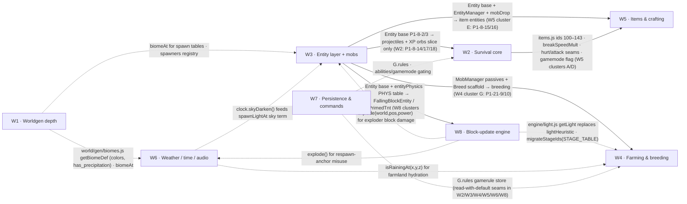

# P1 Work Plan — Loomfall / MinecraftV2

**Status:** punch list for post-merge build sessions · **Grounded:** 2026-07-11 · **Companion QA doc:** [QA_PLAN_P1.md](./QA_PLAN_P1.md)

## 1. Purpose

This document is the P1 punch list handed to build sessions the moment the playable PR (`feat/voxel-sandbox-game`) merges. It partitions **all 181 [P1] items in [docs/PARITY.md](./PARITY.md)** into eight build waves (W1–W8) plus four deferred items — the coverage appendix at the end proves the partition is exact (every item appears exactly once).

Every implementation note below references the **actual module boundaries, files, and exports of the real code** on `feat/voxel-sandbox-game` — not the idealized TypeScript/authoritative-server architecture PARITY.md assumes. Where the spec (PARITY.md) and the code (the builder's CONTRACT.md, docs/PROTOCOL.md, `public/src/constants.js`) disagree — world height 384 vs **128**, sea level 63 vs **40**, server tick vs **no server tick**, blockstates vs **flat Uint8 ids** — the disagreement is stated explicitly and the plan follows the **CODE**, recording the parity delta (§3 below is the normative delta table; each wave restates the deltas it depends on).

Ref scheme: `P1-<PARITY section#>-<n>` (n = order of appearance within the section; §8A keeps the "8A" tag). Items whose PARITY line carries multiple tiers are in scope only for their `⇒ P1-scope:` fragment. PARITY sections 3 (Dimensions), 12 (Redstone), 13 (Enchanting), 14 (Brewing), 16 (Structures), 17 (Villages & Trading) and 32 (Roadmap) carry **zero** P1 items; §12's emptiness is why W8 is repurposed from "redstone" into the block-update substrate P2 redstone will need.

All wave sections were grounded against `origin/feat/voxel-sandbox-game @ 010b2a8`; the branch HEAD is now `374be4b` — two commits (`1122b88` "Fix integration issues from adversarial playtest", `374be4b` "Harden server") landed after grounding, and their deltas are folded in as **§3.1** (normative for every wave). **All cited paths are real modules on the branch unless marked NEW**; paths/exports/constants verify at `010b2a8` and, except where §3.1 says otherwise, at `374be4b` too. The sibling `mobs/`, `weather/`, `audio/`, and `content/*.json` packages are merged in by W3, W6, W6, and W5 respectively.

## 2. Branch heads this plan was grounded on

| Branch | HEAD SHA | Note |
|---|---|---|
| `origin/feat/voxel-sandbox-game` | `374be4b` (detailed grounding read at `010b2a845e50090024a0d14033934fc1975ada8e`) | "Integrate playable game: menus, world select, gameplay loop, peers, texture hot-swap" — the builder's real game. Two post-grounding commits — `1122b88` "Fix integration issues from adversarial playtest" and `374be4b` "Harden server" — change the server/authority/render picture; their deltas are normative in §3.1 |
| `origin/feature/mobs` | `cfb5a6c` ("Reconcile mobs to canon"; W3 fragment authored against `c9db423f60dea3142c1d5e13689be3764d649de6`) | standalone `mobs/` package — now **13 archetypes** incl. boss (adds needlejack/raveler/scaldwarden; exploder removed from the nevermend spawn table; lootTables reconciled to canon ids) — vendored by W3, deltas noted in W3 clusters B/C/E |
| `origin/feature/weather` | `24ae13e1bfd92bc1b461d8d2357d4eb0f26c8df0` | standalone `weather/` package — vendored by W6 |
| `origin/feature/story-content` | `27abc38` (grounding read at `65cdfaebcb3236c50bdb4eb057c2d8bf38937530`; items.json/naming.json substance unchanged between the two) | `content/*.json` incl. items.json (**40** items), naming.json — vendored by W5 |
| `origin/feature/audio-engine` | exists (head not pinned at grounding) | complete standalone `audio/` package (engine.js/dsp.js/sfx/music/discs + demo/README) — vendored by W6; see W6 cluster A |
| `origin/design/parity-spec` | `69a760367575a1d486a4d1e6bb3525a567d1916e` | design docs only (docs/PARITY.md, QA_PLAN.md, BUG_TAXONOMY.md, …) |

## 3. Spec-vs-code delta table (normative for every wave)

Design docs = `design/parity-spec @ 69a7603` (PARITY.md / MULTIPLAYER_PROTOCOL.md). Real code = `feat/voxel-sandbox-game @ 374be4b` (detailed grounding at `010b2a8`; the post-grounding hardening/playtest deltas are consolidated in §3.1 and already reflected in the rows below). **Plan against the right-hand column.**

| Topic | Design docs (spec) | Real code (plan against this) |
|---|---|---|
| Language/stack | TypeScript + Three.js, shared TS types, bundled | Plain ES modules JS, no build step, no TS, vendored three r0.185 via importmap |
| Authority model | Authoritative server, server-side sim, client prediction | Server = relay + persistence, **no simulation**, but the hardened server (`374be4b`) is no longer "validation limited to ranges": it tracks an **authoritative per-player position** with movement token budgets (25 b/s controllable / 90 b/s falling); a violating `move` is SILENTLY DROPPED, with one grace teleport per 2 s (`GRACE_COOLDOWN_MS=2000`, `handleMove`). Client-authoritative sim still holds — within the server's reach/rate/movement envelopes (§3.1) |
| World height | y ∈ [−64, 319], height 384, 24 palette-indexed 16³ sections | **y ∈ [0, 127], height 128**, one flat `Uint8Array(16·16·128)` per chunk, no sections/palette |
| Sea level | 63 overworld / 31 nether lava / 0 end | **40** overworld / 31 nether lava (matches) / end has no sea (islands y≈40–72) |
| Tick rate | SIM_HZ=20, SNAPSHOT_HZ=20, server ticks | **No server tick at all**; client rAF sim (dt clamp 0.05 s); only cadence is the client 20 Hz move throttle |
| Protocol | PROTOCOL_VERSION=1 negotiation, JSON control + binary opcode frames, quantized i16 positions, snapshots/deltas | No version field; all-JSON `{t:…}`: `join/move/edit/chat` ⇄ `welcome/peer-join/peer-leave/move/edit/chat/error`; full-float positions; no snapshots |
| Chunk delivery | Server streams chunk_data with palettes | Client generates terrain locally from the seed; server sends only the edits overlay in `welcome` |
| Keepalive | 15 s ping / 30 s timeout | WS ping every 30 s, terminate on one missed pong |
| Block ids | Block-STATE ids, 15-bit, ~28k states | Uint8 block ids 0–29 (server validates 0–40 headroom); no states/orientation |
| Block set | Vanilla parity (~1050 blocks incl. non-cubes) | 30 blocks, **full cubes only** |
| Physics | Per-tick vanilla numbers (gravity −0.08 b/t², walk 4.317 b/s, step-height 0.6) | Per-second: gravity −24 b/s², jump 8.2, walk 4.3, sprint 5.805, fly 10/20; no step-up, no fall damage yet, kill plane y −10 |
| Player state | Health+hunger+XP survival loop, damage sources | health 20 shown as 10 "vitality shards"; nothing reduces it yet; instant break; free double-space flight |
| Edits | EDIT_REACH 6 server-validated, rate cap 20/s, server break time | Client REACH 6; **hardened server additionally enforces `MAX_REACH=7`** (every `edit` must be within 7 blocks of the sender's server-tracked position — `server/index.js` lines 56/531-532, PROTOCOL.md §edit; violations → `error bad_edit` "edit out of reach") **and a 20 edits/s token bucket per connection (burst 20, `EDIT_RATE`; excess edits SILENTLY DROPPED)**; **ALL edits at y=0 are rejected** (bedrock rule, line 523); instant break (140 ms bar flash); unbreakable via hardness −1. ⚠ This breaks the "remote sim results replicate as ordinary edit frames" convergence rule — see §3.1 |
| View distance | default 8, max 16 | default 6, settings 2–12; mesh build budget 2 chunks/frame |
| Worldgen | Density-function graph, xoroshiro128++, 6-param multinoise, ~60 biomes | fbm value/gradient noise, FNV/mulberry32, 8 biomes, column heightmap + 2 cave noises, per-chunk features clipped at borders |
| Seeds | 64-bit long, Java String.hashCode | number or string; strings hashed FNV-1a 32-bit; world seed defaults FNV-1a(worldId) |
| Persistence | Anvil/NBT regions, per-chunk | Single JSON per world: `saves/<id>.json` with per-dim edits map `"x,y,z"→id` |
| Chat | channels, commands, component trees, rate limits | Plain text 256 cap, whole-room broadcast incl. sender, **HTML-escaped on broadcast**; **server rate-limits 3 msgs/2 s (`error chat_rate`)**; join-name fallback is `Wanderer-xxxx` with room dedup (not `player`); no commands yet |
| Dimensions | Vanilla parity + portals | overworld/nether/end worldgen + `__game.setDimension()`; portal block id 29 exists but **no portal traversal mechanic** (still true in code at `374be4b`: `gameplay/portals.js` is absent, `switchDimension` takes one arg, `main.js` line 665 says "portals arrive next phase"). ⚠ docs/DEV.md at head already documents a PLANNED `__game.portals`/`travelTo(dim)`/`getDimension()`/`setDimension(dim, opts?)` API + a pause-menu "Travel" row that does NOT exist in code — DEV.md is not a safe citation source for `__game` here, and the builder's imminent portal/pause-menu work will retire this delta (coordinate with W6/W7 menu ownership) |
| Naming | "MinecraftV2", vanilla terms | Loomfall canon: Warpwold/Cinderloom/Nevermend; localStorage keys `loomfall.*` |

**Bottom line for build sessions:** PARITY.md is an aspirational vanilla-parity backlog whose framing numbers (384 world height, sea level 63, 20 Hz server tick, versioned binary protocol) do **not** describe the shipped code. The builder's own CONTRACT.md + docs/PROTOCOL.md (16×16×128, `SEA_LEVEL 40`, JSON relay protocol, no tick) are ground truth. Any spec text referencing y>127, block ids >40, section palettes, or server snapshots is future work, not current behavior.

### 3.1 Post-grounding hardening/playtest deltas (`1122b88` + `374be4b`) — normative for every wave

These two commits landed after this plan's detailed grounding read at `010b2a8`. Everything below is verified against `origin/feat/voxel-sandbox-game @ 374be4b` and OVERRIDES any older claim elsewhere in this document. The wave sections carry local call-outs at the affected spots.

1. **Server edit reach — `MAX_REACH=7`.** Every `edit` must be within 7 blocks of the sender's server-tracked position (`server/index.js` lines 56, 531-532; PROTOCOL.md §edit); remote edits are rejected with `error bad_edit` ("edit out of reach"). This **breaks the plan's core convergence rule** that durable client-sim results — random-tick crop growth up to simDistance≈96 blocks away, mob eat-grass, fire spread, fluid interaction products, falling-block placement, explosion holes, tree growth, `/setblock`, `/fill` — "replicate as ordinary edit frames". Whichever of W3/W4/W8 lands first must deliver the fix as a serialized `server/index.js` change: either a validated **sim-edit envelope** (e.g. widen reach for edits inside the sender's sim distance, still range/rate-validated) or a new authenticated frame — and the same wave updates PROTOCOL.md. Until then, W4's multiplayer tick-ownership replication and W8's transient/durable split **do not work as written** for out-of-reach cells.
2. **Server edit rate — 20 edits/s token bucket per connection, burst 20 (`EDIT_RATE`, `server/index.js` lines 43, 511, 419); excess edits are SILENTLY DROPPED.** Tree-growth bursts (40-60 edits), giant-mushroom builds, explosion holes, and `/fill` (up to 32768 cells) all exceed it — peers/persistence would see partial results. Bulk producers must pace their `sendEdit` bursts under the bucket (or the same server change as (1) raises the budget for sim edits). "No rate cap per docs/PROTOCOL.md" is now false — current PROTOCOL.md documents the cap and the silent drop.
3. **`PUT /api/worlds/:id` was REMOVED** (`server/index.js` lines 329-330: "intentionally NO PUT/PATCH/DELETE"; returns 404; PROTOCOL.md §1 "There is no REST write endpoint"; removal is a security fix per docs/SECURITY_FINDINGS.md). `MAX_BLOCK_ID=40` still verifies (line 29) but now has **ONE validation site** (the ws `edit` handler). No wave may re-add an unauthenticated REST write — extensions that previously targeted the PUT merge (W5 blockEntities, W8 `props`) go through additive WS frames only.
4. **Authoritative movement.** The server tracks per-player position with 25 b/s controllable / 90 b/s fall token budgets; violating `move`s are SILENTLY DROPPED, with one grace teleport per 2 s (`GRACE_COOLDOWN_MS=2000`, `handleMove`). Client teleports (`/tp`, respawn) work at most once per 2 s — see W7 cluster E. **All edits at y=0 are rejected** (bedrock rule, `server/index.js` line 523) — `/setblock`/`/fill` and any sim writer must clamp y to **[1,128)**, not [0,128).
5. **Chat hardening.** 3 msgs/2 s rate limit (`error chat_rate` — a new error code beyond the plan's known set `bad_join/already_joined/bad_edit/bad_world`), HTML-escape on broadcast, join-name fallback `Wanderer-xxxx` with room dedup. Coordinate new error codes (W7's proposed `bad_chat_target`, `bad_meta`, `server_full`) against this namespace.
6. **Render/quality modules shipped by the playtest commit:** `engine/AutoQuality.js` and `engine/DirectionalCulling.js` (+`tests/dircull.test.mjs`, 26 checks). `ChunkRenderer`'s constructor is now `(scene, world, atlas, opts={fastLighting, directionalCulling})` with an unlit `MeshBasicMaterial` fast path + `setLightLevel(0..1)` day/night tint; `DirectionalCulling` builds pre-sorted index variants + `drawRange` over mesher output; `main.js` wires it and publishes `__game.quality`. Any wave feeding new geometry or vertex colors through the mesher (W4 cross quads, W6 biomeTint, W8 per-face light) must coordinate with DirectionalCulling's sorted-variant invariants, and constructor extensions must merge into the EXISTING opts bag.
7. **`npm test` is no longer a stub:** `package.json` test = `node tests/run-all.mjs` running 7 suites (worldgen/mesher/physics/raycast/net/dircull/security). `tests/security.test.mjs` (42 checks, PORT=3310) locks in the hardened server behavior — the reach/rate/y=0 rules above will actively fight wave features as planned until (1) lands. New wave tests (`survival.test.mjs`, `farming.test.mjs`, …) must register in `tests/run-all.mjs`; `net.test.mjs` was rewritten for hardened behavior (PUT gone, reach-compliant edit coords) and is the template to follow.

## 4. Shared engineering conventions (cross-wave)

1. **1 game tick = 50 ms**, implemented as ONE fixed-step accumulator in the `main.js` rAF loop (`MAX_DT = 0.05 s`), subscriber order `[entities (W3), randomTick (W4), blockTicks (W8), time/weather (W6)]`. Whichever wave merges first creates the accumulator; later waves subscribe. All PARITY "gt" numbers convert at 50 ms/gt.
2. **Client-authoritative simulation.** The server (`server/index.js`) is a relay + persistence layer with no tick. Durable results (block products, growth, fire ignition, fallen blocks, explosion holes) replicate as ordinary `edit` frames; transient derived state (flowing fluid cells, light values, mobs, item/projectile entities) is client-local and never sent — W8's convergence rule generalizes this. ⚠ **§3.1(1)/(2)/(4) qualify this:** the hardened server rejects edits beyond `MAX_REACH=7` from the sender, silently drops edits over 20/s, and rejects all y=0 edits — the "ordinary edit frames" path only works inside that envelope until the §3.1(1) sim-edit server change lands.
3. **Append-only frozen registries.** `blocks/blocks.js` (ids 0–29 frozen) and `textures/texturePacks.js` `TILE_NAMES` grow append-only per CONTRACT.md, with painters added to **all three** packs. Every wave references block ids symbolically (`BLOCK_ID.<name>`), never numerals — which is what makes the ledger below resolvable.
4. **Read-with-default rule seams.** Every gamerule consumer reads `G.rules?.<rule> ?? default` until W7 delivers the store — the seam is identical in W3 (`mobGriefing`), W4 (`randomTickSpeed`), W6 (`doDaylightCycle`/`doWeatherCycle`), W8 (`doFireTick`).
5. **main.js is THE contention hot-file.** CONTRACT.md reserves it for the integration agent; every wave caps its main.js diff (stated per wave) and lands wiring as small serialized PRs.
6. **Dimension-switch rebuild rule.** `main.js switchDimension()` rebuilds `G.world`; every world-bound subsystem (MobManager, RandomTicker, BlockSim, orbs/projectiles) must be disposed and re-constructed on switch — no `setWorld()` anywhere.

### 4.1 The block-id & tile ledger (single hardest coordination point)

The wave fragments were authored in parallel and their requested id ranges **conflict**. A single id registrar must assign final contiguous ranges before the first append merges:

| Wave | Blocks requested | Range claimed in its fragment | Conflicts with |
|---|---|---|---|
| W1 | deepslate family, new ores, stone variants, podzol/mud/clay/ice, birch (≈22 ids) | 30–51 | W2 (30–37), W8 (30–31); W6's 52–58 assumes W1 keeps 30–51 |
| W2 | ice, packed_ice, slime_block, honey_block, cobweb, ladder, powder_snow, hay_bale (8) | 30–37 | W1, W8 |
| W4 | farmland/crops/saplings/flowers/stems/growers/mushrooms (47) | 60–106 (assumes W2 keeps 30–37, W1 renumbers to 38–59) | W1@38–59 would overlap W6's 52–58 |
| W5 | raw_skein (wool), handloom, furnace, furnace_lit, chest (5) | "next 5 contiguous after resolution" (symbolic only) | none |
| W6 | bed, bed_occupied, respawn_anchor_0..4 (7) | 52–58 | W4's proposed W1 renumber |
| W8 | fire, tnt (2) | 30–31 | W1, W2 |

**Resolution directive:** the registrar assigns the final per-wave ranges up front (numerals are immaterial — all wave code and all QA assertions are by `BLOCK_ID.<name>`/string name), locks the `TILE_NAMES` append order the same way, and bumps `MAX_BLOCK_ID` (currently 40 in `server/index.js` line 29; since the hardening commit there is only ONE validation site — the ws `edit` handler; the REST `PUT /api/worlds/:id` merge was REMOVED, §3.1(3)) **once**, per W4's proposal, to the Uint8 ceiling. ⚠ Interaction flag: W7's dense-chunk region store uses **255 as its no-edit sentinel** — so the practical ceiling is **254**, or the sentinel must change; the registrar owns that call.

## 5. Wave overview

| Wave | Title | Items | Size |
|---|---|---:|---|
| W1 | Worldgen depth: climate/splines, caves, ores, chunk pipeline | 41 | L |
| W2 | Player survival core: combat, health/hunger/regen, movement physics, XP, status effects | 46 | L |
| W3 | Entity layer + mob integration/spawning (bridge to feature/mobs) | 15 | M |
| W4 | Farming, crops, growth & breeding (random-tick foundation) | 12 | M |
| W5 | Items, crafting UI, tools progression, containers & drops (bridge to content/items.json) | 19 | L |
| W6 | Weather, day/night gt-time, sleeping, biome atmosphere, sound & particles (bridge to feature/weather) | 16 | M |
| W7 | Persistence, settings, gamerules, gamemode/difficulty plumbing, commands & menus depth | 17 | M |
| W8 | Block-update engine: scheduled ticks, lighting propagation, fluids, fire, gravity blocks & TNT (redstone-analogue groundwork) | 11 | M |
| | **Covered by waves** | **177** | |
| | Deferred (see [Deferred items](#deferred-items)) | 4 | |
| | **Extraction total (PARITY [P1])** | **181** | |

## 6. Wave dependency graph

Solid arrows = **hard ordering** for the named clusters/items (the consumer's remaining clusters are still parallel-safe). Dashed arrows = **soft seams**: capability-checked interfaces that degrade safely, either merge order works.



**Foundational ordering (from the wave mapping):** start **W3** (Entity base) and **W8** (light/ticks/props) early — they unblock slices of W2, W4, and W5. **W1/W6/W7 have no inbound P1 dependencies** and can start immediately. **W4 is the most downstream wave**, but its random-tick core and crop worldgen ids can start once id ranges are reserved.

## 7. Parallelization matrix

Symbols: **∥** safely concurrent (disjoint real modules) · **∥\*** concurrent, but serialize the named shared artifact (block-id/tile ledger, `server/index.js`, `net/NetClient.js`, `ui/menu.js`, `Controls.js`) in the PR queue · **→** ordered: row wave must land before the column wave's *named clusters* (rest of the column wave is free). Superscripts point at the justification list below.

| | W2 | W3 | W4 | W5 | W6 | W7 | W8 |
|---|---|---|---|---|---|---|---|
| **W1** | ∥\*¹ | ∥² | ∥\*³ | ∥\*⁴ | ∥⁵ | ∥⁶ | ∥\*⁷ |
| **W2** | | ∥⁸ | ∥⁹ | →¹⁰ | ∥¹¹ | ∥¹² | ∥¹³ |
| **W3** | | | →¹⁴ | →¹⁵ | ∥¹⁶ | ∥¹⁷ | →¹⁸ |
| **W4** | | | | ∥¹⁹ | ∥²⁰ | ∥²¹ | ∥²² |
| **W5** | | | | | ∥²³ | ∥\*²⁴ | ∥²⁵ |
| **W6** | | | | | | ∥\*²⁶ | ∥²⁷ |
| **W7** | | | | | | | ∥\*²⁸ |

1. W1∥W2 — disjoint modules: `world/TerrainGenerator.js`+`world/noise.js`+`world/gen/*` vs `gameplay/Player.js`+`physics.js`+`Controls.js`+`ui/hud.js`; both append `blocks.js`/`texturePacks.js` → ledger (§4.1).
2. W1∥W3 — only touchpoint is promoting `TerrainGenerator.biomeAt(x,z)` public (tiny; both fragments name it).
3. W1∥W4 — ledger; on second-land, converge W4's `buildTree` extraction with W1's `world/gen/steps.js` VEGETAL_DECORATION feature (both fragments carry the convergence note).
4. W1∥W5 — ledger; W1's new ores get drop-table/harvestTier/smelt rows as W5 follow-ups.
5. W1∥W6, W1-first preferred — W6 consumes `getBiomeDef` colors/`has_precipitation`/`forkSeed` but ships an 8-internal-biome fallback table and its own `MAX_BLOCK_ID` bump if it lands first.
6. W1∥W7 — disjoint modules; serialize `server/index.js` world-record edits (W1 adds `type`, W7 rewrites `normalizeWorld`).
7. W1∥W8 — the module-boundary agreement: W1 stays inside `world/TerrainGenerator.js`+`noise.js`+`world/gen/*`; W8 owns `engine/ChunkMesher.js` this cycle; only touchpoint is the ledger.
8. W2∥W3 — except W2's P1-8-14/17/18 slice (XP orbs, projectiles) which needs W3's Entity base (P1-8-2/3); conversely W3's wiring consumes `player.hurt`/`S.attackables`/`XP_BY_ARCHETYPE` — interfaces are events + two functions, either core can land first, the dependent slices wait.
9. W2∥W4 — `gameplay/items.js` is an agreed shared seam (whichever lands second rebases); W4's trampling/cactus hooks degrade without W2's `fallDistance`/`damagePlayer`.
10. W2→W5 hard — W5 clusters A/D require W2's `gameplay/items.js` (ids 100–143), `effects.breakSpeedMult()`, `Player.attackSpeed/attackDamage()` + `hurt` armor path, survival gamemode flag, XP orbs.
11. W2∥W6 — soft both directions: anchor-explosion fallback uses `damagePlayer`; W2 crit emits `G.fx?.emit('crit')`; W2's death flow calls `Player.resolveSpawn()` when present.
12. W2∥W7 — disjoint modules; W7 supersedes W2's interim `settings.difficulty` (documented reconciliation) and rewires the flight gate to abilities; `Controls.js` key appends serialize.
13. W2∥W8 — soft: lava/fire/explosion damage routes through W2's `damagePlayer` seam when present; W2's damage table owns the fire cadence.
14. W3→W4 — hard for W4 cluster G only (breeding needs vendored `MobManager` + Breed/FollowParent scaffold + `EntityManager.raycastEntities`); W4 clusters A–F have no wave prerequisites.
15. W3→W5 — hard for W5 cluster E only (ItemEntity on the Entity base; `mobDrop` events; `lootTables.js` edit); W5 clusters A/B/C/D/F/G/H don't need it.
16. W3∥W6 — both vendor a sibling branch and wire main.js → land as separate PRs; neither touches the other's modules; the sleep monster-proximity check is gated on the `mobs` cap.
17. W3∥W7 — entity/mob code touches neither server persistence nor menus; serialize the `server/index.js` difficulty POST (W3) vs `world-meta` (W7 absorbs it).
18. W3→W8 — hard for W8 clusters F/G only (FallingBlockEntity/PrimedTnt extend the Entity base, use `entityPhysics` + `queryAABB`); W8 clusters A–E are independent; W8 provides `explode()` back to W3's exploder.
19. W4∥W5 — `blockDrop` events buffer nowhere (drops invisible until W5 — accepted); `items.js` seam rebase rule as in ⁹.
20. W4∥W6 — W4's `isRainingAt` seam defaults `false` until W6 wires it.
21. W4∥W7 — W4 already codes the exact seam `G.rules?.randomTickSpeed ?? 3`; W7 delivers `G.rules`.
22. W4∥W8 — `lightHeuristic.js` swap and `migrateStageIds(STAGE_TABLE)` execute as follow-ups after both merge; both fragments keep the seams single-file.
23. W5∥W6 — disjoint: item/crafting modules + `ui/*` screens vs sky/weather/audio/particles.
24. W5∥W7\* — serialize `server/index.js` + `net/NetClient.js` (W5 `bedit` frame vs W7 `world-meta`/`player-save` frames) and coordinate the save-format extension (P1-4-10 `blockEntities` beside W7's world record).
25. W5∥W8 — `fallingBlockDrop`/`explosionDrops` events are consumed by W5 item entities when present; annotated-skipped otherwise.
26. W6∥W7\* — both extend the world record (`time` vs meta fields) and `ui/menu.js`; W7's interim time model explicitly yields to W6's `GameClock` (interface = the `world.time.dayTime` patch).
27. W6∥W8 — soft seams only: fire's rain-extinguish reads `G.weather?.getState()`; anchor explosion capability-checks `explode()`.
28. W7∥W8\* — serialize the protocol additions (`edit.props` field vs `world-meta`/`player-save` frames — W6's `{t:'time'}` set the additive precedent) ; W7's chunk records reserve the `light`/`blockTicks` slots W8 serializes into.

**Authoritative parallel sets (from the wave mapping, verbatim):**

- W1 ∥ W2 ∥ W7 (disjoint modules: `world/TerrainGenerator.js`+`noise.js` vs `gameplay/Player.js`+`physics.js`+`ui/hud.js` vs `server/index.js`+`ui/menu.js`+`ui/chat.js`; main.js conflicts limited to bootstrap wiring, which CONTRACT.md reserves for the integration agent)
- W1 ∥ W8 (worldgen stays in `world/*`, W8 owns `engine/ChunkMesher.js` + new tick/light modules) — the only touchpoint is append-only `blocks.js` id allocation; pre-assign id ranges per wave and raise server `MAX_BLOCK_ID=40` once, up front
- W3 ∥ W6 (mobs/ package + new entity layer vs `engine/Sky.js` + weather/ package + audio) — both merge a sibling branch and wire main.js, so land as separate PRs; neither touches the other's modules
- W3 ∥ W1 and W3 ∥ W7 (entity/mob code touches neither TerrainGenerator nor server persistence)
- W5 ∥ W1 ∥ W6 ∥ W7 for its bulk (new item/crafting modules + `ui/*` screens); only its item-entity slice (P1-8-15/16) waits on W3's Entity base and its container persistence (P1-4-10) coordinates a save-format extension with W7
- W2 ∥ W3 except P1-8-17/18 and P1-8-14 (projectiles and XP orbs need W3's Entity base P1-8-2/3); all block-sourced damage (fall/lava/drown/fire/cactus) is independent
- W4 is the most downstream wave: breeding needs W3's passive mobs, crop light≥9 prefers W8's block light, and stage-id blocks migrate onto W8's props store — but its random-tick core and crop worldgen ids can start once id ranges are reserved
- Foundational ordering: start W3 (Entity base) and W8 (light/ticks/props) early — they unblock slices of W2, W4, and W5; W1/W6/W7 have no inbound P1 dependencies and can start immediately

Each wave section below additionally carries its own **Parallel-safe split** (isolated support package vs must-be-builder files), so a wave can itself be run as a support-package branch + a thin builder-integration PR.

---

## W1: Worldgen depth: climate/splines, caves, ores, chunk pipeline

**Global parity delta (applies to every Y number in this wave):** PARITY §1 assumes world height 384, y∈[−64,320), sea level 63, deepslate below y 0. The CODE is `CHUNK_SY=128`, y∈[0,128), `SEA_LEVEL=40`, bedrock at y=0 (`public/src/constants.js`, CONTRACT.md). We plan against the CODE. Ore/blob Y-tables are rescaled with the linear map **`yCode = clamp(round((yParity + 64)/3), 0, 127)`** (384/3 = 128); deepslate becomes a low band (noisy transition y16→8, solid deepslate below y8); the §1 "slides" pin natively to code space (air roof y120→128, solid floor y0→5) instead of parity's 240→256. Every table below is already in code space.

### Items covered

- [ ] P1-1-1 — per-chunk population seed + feature salts (PARITY §1)
- [ ] P1-1-2 — per-noise seed fork by resource-string hash (PARITY §1)
- [ ] P1-1-3 — independent positional forks: carvers/aquifers/ores/structures (PARITY §1)
- [ ] P1-1-4 — 6 climate params at quart resolution (PARITY §1)
- [ ] P1-1-5 — PV formula `1 − |3|weirdness| − 2|` (PARITY §1)
- [ ] P1-1-6 — continentalness zones table (PARITY §1)
- [ ] P1-1-7 — temp 5 / humidity 5 / erosion 7 / PV 5 level tables (PARITY §1)
- [ ] P1-1-8 — biome = nearest point in climate parameter space (PARITY §1)
- [ ] P1-1-9 — noise cell 4(XZ)×8(Y) + trilinear interpolation (PARITY §1)
- [ ] P1-1-10 — base_3d_noise (old_blended_noise constants) (PARITY §1)
- [ ] P1-1-11 — depth = vertical gradient + spline offset (PARITY §1)
- [ ] P1-1-12 — sloped_cheese density combine (PARITY §1)
- [ ] P1-1-13 — slides: air roof / solid floor gradients (PARITY §1)
- [ ] P1-1-14 — final_density>0 → default_block; clamp ±64 (PARITY §1)
- [ ] P1-1-15 — cubic splines (cont., erosion, PV) → offset/factor/jaggedness (PARITY §1)
- [ ] P1-1-16 — emergent behavior: flat oceans, steep coasts, jagged peaks, plateaus (PARITY §1)
- [ ] P1-1-17 — rivers where |weirdness|≈0 (PARITY §1)
- [ ] P1-1-18 — ore config shape + placement + deepslate auto-swap (PARITY §1)
- [ ] P1-1-19 — coal ore bands (PARITY §1)
- [ ] P1-1-20 — iron ore bands (PARITY §1)
- [ ] P1-1-21 — copper ore band (PARITY §1)
- [ ] P1-1-22 — gold ore band (PARITY §1)
- [ ] P1-1-23 — redstone ore bands (PARITY §1)
- [ ] P1-1-24 — diamond ore bands (PARITY §1)
- [ ] P1-1-25 — lapis ore bands (PARITY §1)
- [ ] P1-1-26 — stone-variant blobs (dirt/gravel/granite/diorite/andesite/tuff) + clay disks (PARITY §1)
- [ ] P1-1-27 — deepslate band + tuff below band (PARITY §1)
- [ ] P1-1-28 — biome surface materials (desert/taiga/snowy/swamp/…) (PARITY §1)
- [ ] P1-1-29 — 11 ordered decoration steps, salted seeds (PARITY §1)
- [ ] P1-1-30 — TOP_LAYER_MODIFICATION freeze pass (snow/ice by height-adjusted temp) (PARITY §1)
- [ ] P1-1-31 — ChunkStatus staged generation pipeline (PARITY §1)
- [ ] P1-1-34 — chunk ticket/load levels (border ring vs full) (PARITY §1)
- [ ] P1-1-35 — superflat generator `{layers, biome}` (PARITY §1)
- [ ] P1-2-1 — temperature 5-level thresholds (PARITY §2)
- [ ] P1-2-2 — humidity 5-level thresholds (PARITY §2)
- [ ] P1-2-3 — erosion 7-level thresholds (PARITY §2)
- [ ] P1-2-4 — PV band thresholds (PARITY §2)
- [ ] P1-2-5 — biome registry record (effects/spawners/carvers/features) (PARITY §2)
- [ ] P1-2-6 — core ~12-biome set (PARITY §2)
- [ ] P1-4-4 — ores + deepslate variants (P1 scope of the terrain block set) (PARITY §4)
- [ ] P1-10-10 — world-spawn spiral search + spawnRadius scatter (PARITY §10)

### Implementation approach

Today's generator (`public/src/world/TerrainGenerator.js`) does everything in one synchronous `generateChunk(cx,cz) → Uint8Array(32768)`: fbm temp+humidity → 8 internal biomes (OCEAN/BEACH/PLAINS/FOREST/DESERT/MOUNTAINS/SNOW/SNOWCAP), column heightmap, cheese (`nCaveA>0.54`) + spaghetti caves, 4 ore types via a single per-chunk `mulberry32`, trees clamped to x,z∈[2,13]. This wave refactors it into a pure worldgen-core package plus a staged pipeline, keeping `generateChunk`'s output type unchanged for the mesher.

**Cluster A — Seeding & determinism (P1-1-1, P1-1-2, P1-1-3). NEW `public/src/world/gen/random.js`.**
Exports: `hashSeed(seedStrOrNum)` (reuse the FNV-1a/xmur3 conventions already in `textures/texturePacks.js:makeRng` and `server/index.js`), `forkSeed(worldSeed, name)` — hash the resource-location string (`'loomfall:temperature'`, `'loomfall:cave_cheese'`, `'loomfall:ore'`, `'loomfall:deepslate'`, `'loomfall:structure'`, `'loomfall:spawn'`, …) and XOR-fold into the world seed (P1-1-2); `populationSeed(worldSeed, cx, cz)` = `(Math.imul(a,cx) + Math.imul(b,cz)) ^ worldSeed` with `a,b` odd 32-bit ints drawn from `mulberry32(worldSeed)` (P1-1-1 — **parity delta:** 32-bit `Math.imul` math instead of Java 64-bit longs; JS has no cheap i64, determinism per-seed is what matters); `featureSeed(popSeed, featureIndex, stepIndex)` = `popSeed + featureIndex + 10000*stepIndex` (mixed through mulberry32). Carvers, ores, deepslate band and future structures each get their own `forkSeed` noise instance via `world/noise.js` `makeNoise2D/3D` (P1-1-3; the "aquifers" fork is reserved-but-unused — no aquifers in code, note as parity delta). This replaces the current ad-hoc per-chunk `mulberry32` that all features share.

**Cluster B — Climate params & biome selection (P1-1-4..8, P1-1-17, P1-2-1..4, P1-2-6). NEW `public/src/world/gen/climate.js`.**
`sampleClimate(x,z) → {temperature, humidity, continentalness, erosion, depth, weirdness, pv}` — five independent `fbm2D` octave stacks (from `world/noise.js`) on forked seeds, sampled once per **quart** (4×4 XZ cell, cached per column batch; no Y dimension in climate — 128-high world, depth is derived from terrain height, parity delta vs 3D multinoise); `pv = 1 − Math.abs(3*Math.abs(weirdness) − 2)` (P1-1-5). Data tables exported verbatim: `CONTINENTALNESS_ZONES` (P1-1-6, incl. the mushroom_fields zone which maps to `ocean` until a mushroom biome exists — noted delta), `TEMP_LEVELS`, `HUMIDITY_LEVELS`, `EROSION_LEVELS`, `PV_BANDS` (P1-1-7/P1-2-1..4). `pickBiome(climate) → biomeId` implements P1-1-8 as a nearest-point search over an exported `BIOME_PARAMETERS` list — at 12 biomes a linear scan over parameter intervals (distance = sum of squared gaps outside each interval) replaces the k-d tree; same contract, noted delta (~60 biomes → 12). The 12-biome set (P1-2-6): keep code's ocean/beach/plains/forest/desert, rename MOUNTAINS→`windswept_hills`, SNOW→`snowy_plains` (SNOWCAP folds into the P1-1-30 freeze pass), add `birch_forest`, `taiga`, `savanna`, `river`, `swamp`. Rivers (P1-1-17): where `|weirdness| < ~0.05` and continentalness is inland, the offset spline is pulled below `SEA_LEVEL` and biome forced to `river`. `TerrainGenerator` gains a public `biomeAt(x,z)` (main.js already feeds a biome string to `ui/debug.js setData({biome})` — swap its source to this).

**Cluster C — Splines & density terrain (P1-1-9..16). NEW `public/src/world/gen/splines.js` + `public/src/world/gen/density.js`.**
`splines.js`: generic cubic-spline evaluator + the three knot tables (continentalness/erosion/PV → **offset, factor, jaggedness**) stored as plain JSON-ish arrays (P1-1-15 — knots re-scaled so offset lands in code space: ocean floor ~y28-34, plains ~y44-52, peaks up to ~y100-115). `density.js`: `blendedNoise(x,y,z)` with parity constants xz_factor 80 / y_factor 160 / smear 8 (P1-1-10, ⚠verify flag carried over); `finalDensity(x,y,z, climate)` = `4*(depth + jaggedness*jNoise)*factor + base_3d_noise` (P1-1-12) where `depth` = vertical gradient (≈ `(offsetY − y)/128`, P1-1-11); slides clamp density negative for y∈[120,128) and positive for y∈[0,5] (P1-1-13 — **parity delta:** pinned to the 128-world roof/floor, not y240→256); clamp to [−64,64] (P1-1-14). Sampling: density evaluated only at cell corners on a **4(XZ)×8(Y)** lattice (5×17×5 corners per chunk) and trilinearly interpolated per block (P1-1-9). `finalDensity > 0 → stone` (default_block), else air / `water` below `SEA_LEVEL=40`. Cheese caves become the natural byproduct of the 3D term; the existing spaghetti-cave noise pair stays as a carver pass with its own `forkSeed` (Cluster A). Emergent shape targets (P1-1-16, used as QA numbers): ocean floor flat (σ<3.5) below y40, coasts step to beach, low-erosion+high-PV columns exceed y85, high erosion → plateaus near y44-55.

**Cluster D — Ore/blob system + new blocks (P1-1-18..27, P1-4-4). NEW `public/src/world/gen/ores.js` + appends to `public/src/blocks/blocks.js` and `public/src/textures/texturePacks.js`.**
`ores.js` exports `ORE_CONFIGS`: `{ block, size, count|rarity, height: {type:'uniform'|'trapezoid', min, max, peak?}, discardOnAirExposure, deepslateVariant }` (P1-1-18) and `placeOreVein(writer, rng, cfg, x,y,z)` (blob walker, replaces stone/deepslate only; the y≤ band auto-swaps to the deepslate variant). Code-space tables (rescaled per the header rule; existing coal/iron/gold/diamond tables in `TerrainGenerator.js` are REPLACED):
- coal s17: upper uniform y67–127 c10; lower trapezoid y21–85 peak53 c7 (P1-1-19)
- iron s9/s4: upper trapezoid y48–127 peak99 c30; mid trapezoid y13–40 peak27 c4; small uniform y0–45 c3 (P1-1-20)
- copper s10: trapezoid y16–59 peak37 c5 (dripstone-caves large variant deferred — no such biome; delta) (P1-1-21)
- gold s9: trapezoid y0–32 peak16 c2, discardOnAirExposure 0.5 (badlands bonus deferred — no badlands) (P1-1-22)
- redstone s8: uniform y0–26 c2; lower trapezoid y0–10 peak0 c3 (P1-1-23)
- diamond s4/8: trapezoid y1–26 peak≈2 c7 total, buried config discard 1.0 (P1-1-24)
- lapis s7: triangle y11–32 peak21 c2; buried uniform y0–43 c4 discard 1.0 (P1-1-25)
- blobs: dirt s33 c3 y21–75; gravel s33 c5 y0–127; granite/diorite/andesite s64 c2 each (two bands y21–41 / y43–64); tuff s64 c2 y0–15; clay disks r2-3 under water columns (P1-1-26)
- deepslate (P1-1-27): noisy transition band y16→8 on `forkSeed('deepslate')` 3D noise, solid deepslate y1–7; tuff only below y16.
Block appends (`blocks/blocks.js` is frozen 0-29, append-only per CONTRACT.md; new ids 30+): `deepslate 30`, `deepslate_coal_ore 31`, `deepslate_iron_ore 32`, `deepslate_gold_ore 33`, `deepslate_diamond_ore 34`, `copper_ore 35`, `deepslate_copper_ore 36`, `redstone_ore 37`, `deepslate_redstone_ore 38`, `lapis_ore 39`, `deepslate_lapis_ore 40`, `granite 41`, `diorite 42`, `andesite 43`, `tuff 44`, `calcite 45`, `podzol 46`, `mud 47`, `clay 48`, `ice 49`, `birch_log 50`, `birch_leaves 51` (P1-4-4). **Server change required:** `server/index.js` `MAX_BLOCK_ID = 40` (line 29) must bump to ≥ 64 (edit-validation headroom; one-line, wire-compatible — `edit.block` range widens; single validation site — the ws `edit` handler; the REST `PUT /api/worlds/:id` merge no longer exists, §3.1(3)). Each new block needs a `TILE_NAMES` append + a `drawTile` painter in **all three** packs in `textures/texturePacks.js` (append-only order per CONTRACT), plus `tiles` mapping in its block def; `CREATIVE_BLOCKS` extends accordingly. Ore placement runs in the UNDERGROUND_ORES decoration step with `featureSeed` salts (Clusters A/E).

**Cluster E — Decoration steps + surface rules + freeze pass (P1-1-28, P1-1-29, P1-1-30). NEW `public/src/world/gen/steps.js` (feature registry).**
`DECORATION_STEPS` = the full 11-name ordered enum verbatim (P1-1-29); wired steps in this wave: RAW_GENERATION (base terrain), LOCAL_MODIFICATIONS (clay disks), UNDERGROUND_ORES (blobs+ores), VEGETAL_DECORATION (trees — oak/birch/spruce shapes reusing `log/leaves` + new `birch_log/birch_leaves`; cactus; swamp water pools), TOP_LAYER_MODIFICATION (freeze pass); the rest are registered no-ops for later waves (structures → W-structures, springs → W-fluids). Each registered feature = `{name, step, index, place(writerView, rng, cx, cz)}`; its rng = `mulberry32(featureSeed(popSeed(cx,cz), index, stepIndex))`. Surface rules per biome (P1-1-28, scoped to the 12-biome set): desert → sand×4 over sandstone×3; taiga → podzol patches over dirt; snowy_plains → snow_grass/snow_block tops; swamp → mud patches + pools; beach → sand; others grass/dirt (badlands/mushroom/mangrove rules deferred with their biomes — delta). Freeze pass (P1-1-30): height-adjusted temperature `t' = temperature − max(0, h − 72)/64`; where `t' < threshold`: exposed water top (y=39) → `ice`, solid tops → snow cover (`snow_grass`/`snow_block` swap — **delta:** no thin snow-layer block; full-cube approximation, code has no non-cube shapes). This subsumes today's SNOWCAP band.

**Cluster F — Staged chunk pipeline (P1-1-31, P1-1-34). Touches `world/TerrainGenerator.js`, `engine/Chunk.js`, `engine/World.js`, `engine/ChunkRenderer.js`.**
Split `generateChunk` into `generateBase(cx,cz)` (climate → density → surface → carvers; deterministic, self-contained) and `populate(cx,cz, worldView)` (runs decoration steps for features **originating** in this chunk, allowed to write into the 3×3 neighborhood — trees lose the x,z∈[2,13] clamp). `Chunk` gains `status: 'empty'|'base'|'populated'|'full'` — a reduced ChunkStatus ladder (P1-1-31; **delta:** no structure_starts/references, no light stages — light is baked in `ChunkMesher`; enum documented as the vanilla 12-stage list with the implemented subset marked). Rules: `populate(C)` requires all of C's 3×3 at ≥`base`; C reaches `full` (meshable) once populate has run for C **and its 8 neighbors** (so cross-border writes are complete); therefore meshing C needs a 5×5 `base` halo — this generalizes `ChunkRenderer.update`'s existing 3×3-before-mesh rule. `World.ensureChunk(cx,cz, status='full')` drives stage advancement; `World.setBlock`'s dirty-marking (own + border neighbors) already handles re-mesh when populate writes into an already-meshed neighbor. Load levels (P1-1-34, simplified): within `renderDistance` rd → `full`+meshed; ring rd+1 → held at `base`/`populated` (the "border" level 31 analog); beyond rd+1 unloaded (keeps ChunkRenderer's Chebyshev rd+1 unload). No entity/block-ticking gates yet (no tick system — parity delta; the random-tick wave consumes this level field). Keep `BUILD_BUDGET=2` per frame but count stage advancements, nearest-first; memoize quart climate + density corners per column batch for perf.

**Cluster G — Superflat (P1-1-35). NEW `public/src/world/FlatGenerator.js`; touches `server/index.js`, `ui/menu.js`, `main.js`.**
`class FlatGenerator(seed, dimension, {layers, biome})` implementing the same interface as `TerrainGenerator` (`generateChunk`/`generateBase`/`populate` no-op/`biomeAt`); default `layers = [{block:'bedrock',height:1},{block:'dirt',height:2},{block:'grass',height:1}]`, biome `plains`, no caves/ores/features. Wiring: `POST /api/worlds` accepts optional `type: 'default'|'flat'` (+ optional `flatLayers`), persisted in `saves/<id>.json` and echoed in the `welcome` world record and `GET /api/worlds/:id` (additive protocol field; absent → `default`); `ui/menu.js` create-world form gains a World Type selector next to name/seed (`onCreateWorld({name,seed,type})`); `main.js` picks the generator class from `world.type` where it currently constructs `TerrainGenerator` (also in `switchDimension` — flat applies to overworld only, nether/end keep TerrainGenerator).

**Cluster H — Biome registry record (P1-2-5). NEW `public/src/world/gen/biomes.js`.**
`BIOMES` frozen record, one entry per the 12 ids: `{ id, temperature, downfall, has_precipitation, temperature_modifier?, effects: {fogColor, waterColor, waterFogColor, grassTint, foliageTint, skyShift?, particle?, sounds?, music?}, spawners: {monster:[], creature:[], ambient:[]}, spawn_costs: {}, carvers: [], features: [[]] }` + `getBiomeDef(id)`, `BIOME_IDS`. **Delta:** PARITY says "shared TS type" — no TS in this codebase (CONTRACT.md); ship a JSDoc `@typedef` on a plain frozen object. `features[][]` is indexed by DECORATION_STEPS position and is the same registry Cluster E executes (single source of truth). This record is the narrow interface consumed later by W3 (mob spawners — `mobs/spawnRules.js` `BIOME_MODIFIERS` takes a biome key) and W6 (P1-2-7/8/9 colors/effects, weather `has_precipitation` per P1-18-5); W1 populates `spawners` with data only (nothing reads it yet).

**Cluster I — World-spawn spiral (P1-10-10). NEW `public/src/world/gen/spawn.js`; touches `gameplay/Player.js`, `main.js`.**
`findWorldSpawn(generator, worldSeed) → {x,y,z}`: spiral out from (0,0) in 16-block steps (up to r≈1024): accept the first column where `biomeAt(x,z)` ∉ {ocean, river}, heightmap h ∈ [SEA_LEVEL, 100], top block solid, 2 air above; then scatter within `spawnRadius=10` (Chebyshev) using `mulberry32(forkSeed(worldSeed,'spawn'))`, re-validating with the scan-down. This generalizes `Player.respawn()`'s current hardcoded scan-down at column (8,8): `Player` gains a `spawnPoint` set by `main.js` at world load (and used by `respawn()`/the y<−10 kill-plane path; `findSafeSpawn` for nether/end in `main.js` is untouched). Deterministic per seed, client-computed — no server/protocol change.

### Cross-branch dependencies

- **Inbound: none.** The cross-branch mapping for W1 is empty. Only gate: the playable PR (`feat/voxel-sandbox-game`) must be merged first — every file cited above lives there. No code from `feature/mobs` or `feature/weather` is needed.
- **Outbound interfaces this wave must freeze for siblings:**
  - `world/gen/biomes.js` `getBiomeDef(id).spawners` (arrays of `{type, weight, minCount, maxCount}`) — consumed by W3 mob-spawning when it bridges `mobs/spawnRules.js` (`BIOME_MODIFIERS(biome)` + `normalizeDimension`).
  - `getBiomeDef(id).has_precipitation` / `downfall` / `effects` — consumed by the weather wave (P1-18-5 "no precip in desert/savanna") and W6 (P1-2-7/8/9 colors).
  - `TerrainGenerator.biomeAt(x,z)` — consumed by W3 spawn checks and the F3 overlay (`ui/debug.js`).
  - Block-id appends 30–51 + `MAX_BLOCK_ID` bump in `server/index.js` — any other wave touching `blocks/blocks.js` or the server must serialize against this (append-only; coordinate id allocation in the shared PR queue).

### Size (diff scope, not time)

| Cluster | Scope | Size |
|---|---|---|
| A seeding/random.js | 1 new module + threading through TerrainGenerator | S |
| B climate + biome pick | 2 new modules, refactor of TerrainGenerator biome path | M |
| C splines/density/slides | 2 new modules + rewrite of the heightmap core | **L** |
| D ores/blobs/deepslate + ~22 block & tile appends (3 packs) + server MAX_BLOCK_ID | 1 new module + blocks.js/texturePacks.js/server | **L** |
| E decoration steps + surfaces + freeze | 1 new module + TerrainGenerator surface pass | M |
| F staged pipeline / load levels | Chunk/World/ChunkRenderer/TerrainGenerator | M |
| G superflat | 1 new module + server/menu/main wiring | S |
| H biome registry | 1 new module (data) | S |
| I world spawn | 1 new module + Player/main wiring | S |
| **Wave total** | ~9 new modules, ~10 existing files touched | **L** |

### Parallel-safe split

- **ISOLATED SUPPORT PACKAGE (own branch, e.g. `feat/worldgen-core`; pure modules, unit-testable with `node tests/worldgen2.test.mjs` following the existing `tests/*.test.mjs` pattern (and registered in `tests/run-all.mjs`, §3.1(7)); only deps `world/noise.js` + `constants.js`):** `world/gen/random.js`, `climate.js`, `splines.js`, `density.js`, `ores.js` (configs + pure placer taking a writer callback), `biomes.js`, `steps.js`, `spawn.js`, `FlatGenerator.js`. Merge interface is narrow and nameable: `sampleClimate/pickBiome/BIOME_PARAMETERS`, `finalDensity`, `ORE_CONFIGS/placeOreVein`, `DECORATION_STEPS`, `getBiomeDef`, `findWorldSpawn`. New-block **tile painters** can also be authored in isolation as standalone `drawTile` case functions + a proposed `TILE_NAMES` append list, delivered as a patch for the builder to merge (texturePacks.js is pure but shared/append-only).
- **MUST-BE-BUILDER (hot files / core loop / frozen registries / protocol):** `world/TerrainGenerator.js` rewire (consumed by main.js and all tests), `engine/Chunk.js`/`engine/World.js`/`engine/ChunkRenderer.js` pipeline staging (render core loop), `blocks/blocks.js` + `textures/texturePacks.js` appends (frozen append-only registries feeding the atlas), `server/index.js` (`MAX_BLOCK_ID`, world `type` persistence), `ui/menu.js` create-world type, `main.js` + `gameplay/Player.js` spawn wiring, and the `__qa` hook additions (main.js) specced in W1-qa.md.

---

## W2: Player survival core: combat, health/hunger/regen, movement physics, XP, status effects

Ground truth is the builder branch `feat/voxel-sandbox-game` (@ `374be4b`; detailed grounding at `010b2a8`, §3.1 hardening deltas apply): browser ESM under `public/src/`, no build step, 16×16×128 chunks, `SEA_LEVEL 40`, per-second physics in `gameplay/Player.js` (gravity −24 b/s², walk 4.3, sprint ×1.35, water ×0.5 / sink −2.2 / swim +3.2, `KILL_PLANE_Y −10`), pure AABB collision in `gameplay/physics.js` (`moveAndCollide` → `{position, onGround, collided}`, `isInLiquid`), HUD = `ui/hud.js` `initHUD() → {showCrosshair, setHealth(0..20), setBreakProgress}`. **PARITY DELTA (wave-wide):** the server (`server/index.js`) is a relay/persistence layer with **no tick and no authority** (docs/PROTOCOL.md: `join/move/edit/chat` ⇄ `welcome/peer-join/peer-leave/move/edit/chat/error` — there is no `set_health`/`entity_hurt` message and none is added). ALL survival state in this wave is **client-authoritative**, simulated in the rAF loop (`main.js`, `MAX_DT = 0.05 s`); every PARITY "game tick" (gt) rule is implemented as an accumulator in seconds at **1 gt = 50 ms** (10 gt = 0.5 s, 32 gt = 1.6 s, 300 gt = 15 s). World height is 128 (not 384) and there is no Y<0 — fall/void staging uses y ∈ [0,128). Do NOT plan server-side damage validation.

### Items covered

- [ ] P1-4-3 — block `friction`/`velocityMult`/`jumpVelocityMult` property table (PARITY §4)
- [ ] P1-7-5 — per-piece armor points & toughness table (PARITY §7)
- [ ] P1-7-6 — armor durability = baseSlot × materialMult table (PARITY §7)
- [ ] P1-7-7 — armor+toughness damage-reduction formula (PARITY §7; SAME formula as P1-9-6 — implemented once)
- [ ] P1-8-14 — mob XP-orb values, `lastHurtByPlayer` gate (PARITY §8)
- [ ] P1-8-17 — projectile entity base: eye launch, per-tick gravity+drag, impact raycast (PARITY §8)
- [ ] P1-8-18 — arrow constants, block-stick, survival pickup, crit (PARITY §8)
- [ ] P1-8A-1 — FOV widens with sprint / Speed effect (PARITY §8A)
- [ ] P1-8A-2 — swim pose, sprint-swim ≈2.2 m/s, crawl through 1-block gaps, buoyancy (PARITY §8A)
- [ ] P1-8A-3 — ladder climb ≈2.35 m/s, sneak-cling (PARITY §8A)
- [ ] P1-8A-4 — slime block bounce (sneak cancels) (PARITY §8A)
- [ ] P1-8A-5 — honey block: move ×0.4, reduced jump, wall-slide (PARITY §8A)
- [ ] P1-8A-6 — cobweb: move ×0.25, cancel gravity accumulation (PARITY §8A)
- [ ] P1-8A-7 — soul_sand top ×0.4 / powder_snow sink (PARITY §8A)
- [ ] P1-8A-8 — sneak ledge-stop (PARITY §8A)
- [ ] P1-9-1 — attack cooldown `1/attack_speed`, damage ×(0.2 + t²·0.8) (PARITY §9)
- [ ] P1-9-2 — full-charge threshold t>0.9 enables crit/sweep (PARITY §9)
- [ ] P1-9-3 — critical hit ×1.5 + conditions (PARITY §9)
- [ ] P1-9-4 — knockback: base impulse, sprint bonus, KB-resistance (PARITY §9)
- [ ] P1-9-5 — reduction order: armor+toughness → Resistance → EPF → Absorption (PARITY §9)
- [ ] P1-9-6 — armor formula `dmg·(1−clamp(max(a/5, a−dmg/(2+t/4)),0,20)/25)` cap 80% (PARITY §9)
- [ ] P1-9-7 — EPF per level; `reduction = min(EPF,20)·0.04` (PARITY §9)
- [ ] P1-9-8 — Resistance −20%/level; Netherite KB-resist 0.1/pc (PARITY §9)
- [ ] P1-9-9 — 10-tick iframes, `(new−last)` overflow rule, bypass types (PARITY §9)
- [ ] P1-9-10 — damage-type flags (armor-reducible / KB / iframe-bypass / floors) (PARITY §9)
- [ ] P1-9-11 — fall damage `max(0,⌊fallDistance⌋−3)` + negation/reduction blocks (PARITY §9)
- [ ] P1-9-12 — air supply 300 gt, then 2 HP/s drowning (PARITY §9)
- [ ] P1-10-1 — max health 20 base, Absorption extra-HP slot (PARITY §10)
- [ ] P1-10-2 — natural regen tiers (food==20&sat>0 fast; food≥18 slow) (PARITY §10)
- [ ] P1-10-3 — starvation 1 HP/80 gt, difficulty floors 10/1/0 (PARITY §10)
- [ ] P1-10-4 — hunger 0–20, saturation 0–20 (≤food), exhaustion 0–4.0 rollover (PARITY §10)
- [ ] P1-10-5 — exhaustion cost table (PARITY §10)
- [ ] P1-10-6 — eating = 32 gt hold; only when food<20 (PARITY §10)
- [ ] P1-10-7 — sprint requires food>6 (PARITY §10)
- [ ] P1-10-8 — food `(hunger, saturation)` data table (PARITY §10)
- [ ] P1-10-9 — milk bucket clears all effects, returns bucket (PARITY §10)
- [ ] P1-10-12 — death → respawn screen; XP drop; reset (PARITY §10)
- [ ] P1-11-1 — Speed/Slowness/Haste/Mining-Fatigue (PARITY §11)
- [ ] P1-11-2 — Strength +3/L, Weakness −4/L melee (PARITY §11)
- [ ] P1-15-1 — XP-to-next-level piecewise curve (PARITY §15)
- [ ] P1-15-2 — total-XP piecewise curve (PARITY §15)
- [ ] P1-15-3 — XP sources (ore mining et al.) (PARITY §15)
- [ ] P1-15-5 — death drops `min(7·L,100)` XP, resets to 0 (PARITY §15)
- [ ] P1-23-2 — Peaceful: continuous regen, no starvation, poison/wither harmless (PARITY §23; hostile-spawn gating side lands in W3)
- [ ] P1-27-2 — first-person hand/use animations: eat/drink 32 gt hold, attack/place swing (PARITY §27)
- [ ] P1-27-4 — HUD survival rows: hearts, hunger, armor, XP bar+level, air bubbles (PARITY §27)

### Implementation approach

**Session-mode gate (glue, all clusters):** add `G.mode: 'survival'|'creative'` to the session object `S` in `main.js` (default `'survival'`; `__qa.setGameMode` flips it). Survival systems below run only in survival; in creative they idle and `Controls`' `toggleFlight` double-space stays allowed. In survival, `controls.on('toggleFlight', …)` in `main.js` becomes a no-op (kills today's free flight). Not claiming P1-22-1 — no `/gamemode`, no persistence of mode.

**Cluster A — Damage pipeline & armor math** (P1-7-5, P1-7-6, P1-7-7, P1-9-5, P1-9-6, P1-9-7, P1-9-8, P1-9-9, P1-9-10, P1-10-1) — NEW pure module `public/src/gameplay/combat.js` (no three import, node-testable like `physics.js`):
- `export const DAMAGE_TYPES` — record per PARITY §9.2 flags: `{melee:{armor:true,kb:true}, arrow:{armor:true,kb:true}, fall:{armor:false}, fire_tick:{armor:false, dps:2 /*1HP per 0.5s*/}, lava:{armor:true, dps:8}, drown:{armor:false, dps:2}, suffocation:{armor:false}, cactus:{armor:true, bypassIframes:true}, magic:{armor:false}, wither:{armor:false}, poison:{armor:false, floor:1}, explosion:{armor:true,kb:true}, freeze:{armor:false}, sonic_boom:{armor:false, bypassArmor:true}, void:{bypassAll:true}, kill:{bypassAll:true}, starve:{armor:false /* floors from difficulty, cluster E */}}`.
- `export function computeDamage(raw, {armorPoints=0, toughness=0, epf=0, resistanceLvl=0, type='melee'})` — ONE implementation of the P1-7-7 ≡ P1-9-6 formula: if `DAMAGE_TYPES[type].armor` then `raw·(1 − clamp(max(a/5, a − raw/(2+t/4)), 0, 20)/25)`; then `×(1 − 0.2·resistanceLvl)` (P1-9-8); then `×(1 − min(epf,20)·0.04)` (P1-9-7); Absorption soak happens in `Player.hurt` (order per P1-9-5). Enchantments don't exist yet — `epf` is a parameter, exercised via the `qaComputeDamage` probe hook until the enchanting wave.
- `export const ARMOR_STATS` — P1-7-5 table keyed `material → {points:[helm,chest,legs,boots], toughnessPerPiece, kbResistPerPiece}`: leather [1,3,2,1]/0/0, gold [2,5,3,1]/0/0, chain [2,5,4,1]/0/0, iron [2,6,5,2]/0/0, diamond [3,8,6,3]/2/0, netherite [3,8,6,3]/3/0.1. `export function armorDurability(slot, material)` — P1-7-6: base {helm:11, chest:16, legs:15, boots:13} × mult {leather:5, gold:7, chain:15, iron:15, diamond:33, turtle:25, netherite:37}. (Durability *consumption* P1-7-4 is not in this wave; the table feeds `gameplay/items.js` armor item defs, cluster E.)
- `Player.js` additions (`gameplay/Player.js`): fields `maxHealth = 20`, `absorption = 0` (P1-10-1; Health Boost deferred with effects that grant it), `invulnTicks = 0` (counts down in `update`), `lastHurtAmount = 0`, `armor = {head:null, chest:null, legs:null, feet:null}` (item-def stubs; no equip UI this wave — set via `__qa.setArmor`), derived getters `armorPoints`/`armorToughness`/`kbResist`. New method `hurt(raw, type='generic', opts={}) → appliedDamage`: applies `DAMAGE_TYPES` flags; iframe rule (P1-9-9): if `invulnTicks > 0` and !bypass, only `max(0, new − lastHurtAmount)` lands; on any landed hit set `invulnTicks = 10` (0.5 s accumulator) and `lastHurtAmount`; run `computeDamage`; soak from `absorption` first, remainder from `health`; add exhaustion 0.1 (cluster E); record `lastHurt = {atMs, type}` for the `getLastHurt()` hook (**PARITY delta:** local record, not protocol msg 53 — no such message exists); `health ≤ 0` → `die()` (cluster I). Kill plane: replace `if (y < KILL_PLANE_Y) this.respawn()` with `this.hurt(Infinity, 'void')` so death routes through the P1-10-12 flow.

**Cluster B — Melee combat mechanics** (P1-9-1, P1-9-2, P1-9-3, P1-9-4; consumes P1-11-2) — in `Player.js` + `main.js`:
- `Player` fields `attackSpeed = 4` (bare hand; per-tool values arrive with the tool wave via `gameplay/items.js`), `attackCharge` ramping 0→1 at `attackSpeed`/s in `update`; `attackDamage()` = `(base 1 + strengthBonus(+3/L) − weaknessMalus(−4/L, clamp ≥0)) × (0.2 + t²·0.8)` with `t = attackCharge` (P1-9-1, P1-11-2); `isFullCharge = t > 0.9` (P1-9-2).
- `main.js` `onBreak` (the existing left-click handler wired via `controls.on('break', onBreak)`) grows an entity branch: before the block raycast, sweep the eye ray (`REACH` capped at 3.0 for entities) against attackable-target AABBs. Target interface (deliberately = the `feature/mobs` per-mob object): `{position:{x,y,z}, velocity:{x,y,z}, hurt(dmg)}` pulled from a session registry `S.attackables` (array of providers). W2 ships a QA test-dummy provider (`__qa.spawnTestDummy`); W3 registers `MobManager.mobs`. On hit: crit check (P1-9-3: fullCharge && `player.velocity.y < 0` && `!player.onGround` && !climbing && !in-water && !sprinting) → dmg ×1.5; knockback (P1-9-4): horizontal impulse `KB_BASE = 8 b/s` along look, `+4 b/s` if sprinting, scaled ×(1 − target.kbResist||0), added to `target.velocity`; `target.hurt(dmg)`; tag `target._lastHurtByPlayerAtMs = now` (feeds P1-8-14); reset `attackCharge = 0`; swing viewmodel (cluster I); exhaustion 0.1.
- Attacking and mining share the left button: entity hit consumes the click (no block break same click), matching vanilla.

**Cluster C — Status effects** (P1-11-1, P1-11-2, + poison/hunger needed by the food table) — NEW pure module `public/src/gameplay/effects.js`:
- `export class Effects { list: [{id, amplifier /*0-based*/, remaining /*s*/}]; add(id, amp, seconds) /*strongest-wins refresh*/; get(id); clear(); tick(dt, {hurt, addExhaustion, difficulty}) }`. Implemented ids this wave: `speed, slowness, haste, mining_fatigue, strength, weakness, poison, hunger`. Tick behavior: poison damages 1 HP per 1.25 s via `hurt(1,'poison')` (floor 1 per `DAMAGE_TYPES`; **Peaceful gate:** `tick` receives difficulty and skips poison/wither damage entirely — P1-23-2); hunger adds exhaustion `0.005·(amp+1)` per gt (P1-10-5).
- Derived multipliers consumed elsewhere: `moveSpeedMult()` = ×(1+0.2L) speed, ×(1−0.15L) slowness, ≤0 at L6+ → clamp 0 (P1-11-1) — read in `Player.update` where `speed` is computed (multiplies `WALK_SPEED`/sprint product); `breakSpeedMult()` = ×(1+0.1L) haste, ×0.3^L fatigue — **exported now, consumed by the timed-block-break wave** (real code still insta-breaks in `main.js onBreak`; that item is not in W2); `meleeBonus()` for cluster B. Player owns one `Effects` instance, `player.effects`, ticked in `Player.update`.

**Cluster D — Environmental damage: fall, air/drowning, contact** (P1-9-11, P1-9-12, rest of P1-9-10) — in `Player.js` (uses what `physics.js` already returns; `physics.js` itself stays untouched):
- **Fall damage:** track `this.fallDistance` in `update`: accumulate `−Δy` while `velocity.y < 0` and not in liquid/climbing/flying; reset in water, on ladder, in cobweb, on respawn. On `onGround` false→true transition: sample landing block (`world.getBlock(⌊cx⌋, ⌊pos.y−0.01⌋, ⌊cz⌋)` at the AABB center): slime_block && !sneak → bounce `velocity.y = +impactVy·0.9` and NO damage; honey_block → dmg ×0.2 taken... per P1-9-11 honey = ~20% taken, hay_bale ×0.2 taken; water/cobweb/powder_snow/slime(non-sneak) → negated; else `hurt(max(0, floor(fallDistance) − 3), 'fall')`. Then `fallDistance = 0`. (Jump Boost/Slow Falling/beds don't exist — deferred with their features; noted, not silently dropped.)
- **Air/drowning (P1-9-12):** submerged test = eye cell is water: `world.getBlock(⌊eye.x⌋, ⌊eye.y⌋, ⌊eye.z⌋) === 8` (`BLOCK_ID.water`; `isInLiquid` is full-AABB and would trigger while wading). `this.air` in gt units, max 300, −20/s while submerged, +80/s (fast refill) when not; at 0 → `hurt(2,'drown')` every 1.0 s. Respiration/turtle-shell deferred (no enchants).
- **Contact damage:** lava: `isInLiquid` true and any overlapped cell is id 28 → `hurt(4,'lava')` per 0.5 s + `fireTicks` afterburn `hurt(1,'fire_tick')` per 0.5 s for 4 s after leaving; cactus (id 20 exists): any AABB-adjacent overlap-touching cell is cactus → `hurt(1,'cactus')` (bypasses iframes per flag); suffocation: eye cell solid → `hurt(1,'suffocation')` per 0.5 s.

**Cluster E — Hunger, food table, eating, items stub** (P1-10-2..10-9, P1-23-2 regen half) — NEW pure modules `public/src/gameplay/hunger.js` + `public/src/gameplay/items.js`:
- `hunger.js`: `export const FOODS` — P1-10-8 table verbatim (`bread {h:5,s:6.0}`, `apple {4,2.4}`, `golden_carrot {6,14.4}`, `cooked_beef {8,12.8}`, `sweet_berries {2,0.4}`, `rotten_flesh {4,0.8, effect:{id:'hunger',amp:0,s:30,chance:0.8}}`, `spider_eye {2,3.2, effect:{id:'poison',amp:0,s:5}}`, `pufferfish {1,0.2, effects:[poison amp1 60s, hunger amp2 15s]}`, …full list from the PARITY line; entries whose mechanics don't exist yet (chorus teleport, stews/cake/honey specials) carry the data now, mechanics with their features). `export class HungerState {food=20, saturation=5, exhaustion=0; addExhaustion(n) /* ≥4.0 → −1 sat, or −1 food if sat==0; P1-10-4 */; eat(foodDef); tick(dt, {health, maxHealth, difficulty, heal, starve})}`. `tick` implements P1-10-2/10-3/23-2: Peaceful → heal 1 HP/0.5 s unconditionally, never starve, food refills +1/4 s; else food==20 && sat>0 → heal 1 HP/0.5 s + `addExhaustion(6.0)`; food≥18 → heal 1 HP/4 s; food==0 → `starve(1)` per 4 s via `hurt(1,'starve')` clamped to floor {easy:10, normal:1, hard:0} (hard reaching 0 = death).
- Exhaustion cost hookup (P1-10-5): in `Player.update` — sprint 0.1/m and swim 0.01/m (multiply by horizontal distance actually moved this frame), jump 0.05 / sprint-jump 0.2 (on the `input.jump && onGround` branch); in `Player.hurt` — 0.1; in `main.js onBreak` — 0.005 per broken block; regen 6.0 inside `HungerState.tick`.
- Sprint gate (P1-10-7): `Player.update` computes `this.sprinting = input.sprint && movingForward && food > 6 && !sneaking`; the speed calc and FOV (cluster G) read `this.sprinting`, no longer raw `input.sprint`.
- `items.js` — minimal non-block item registry (**PARITY delta:** the builder branch has NO item system; `content/items.json` lives only on `feature/story-content` and is NOT wired — this stub is the client-side seam the tools/crafting wave later reconciles with it). Numeric ids ≥100 (block ids are 0–29 with server edit validation `MAX_BLOCK_ID = 40`; items are never sent as edits, so ≥100 is safely out of the wire range and `Inventory.slots` stays `number[]`): foods 100–119 (`bread 100, apple 101, cooked_beef 102, golden_carrot 103, sweet_berries 104, rotten_flesh 105, spider_eye 106, pufferfish 107, dried_kelp 108, …`), `milk_bucket 110`, `bucket 111`, `arrow 112`, armor pieces 120–143 (6 materials × 4 slots, stats/durability from `combat.js ARMOR_STATS`/`armorDurability`). Exports `ITEMS`, `getItemDef(id)`, `isItemId(id)`, `isPlaceable(id)` (= `id < 100 && BLOCKS[id]`), plus `drawItemIcon(ctx, def, px)` procedural painters (same style as `textures/texturePacks.js`; no external assets). **Integration guards:** `main.js onPlace` adds `if (!isPlaceable(id)) return` before `S.world.setBlock`; `main.js` `G.iconFor` wrapper routes `isItemId(id)` to `drawItemIcon` so `ui/hotbar.js`/`ui/icons.js` need no change. **PARITY delta:** `Inventory` slots are bare ids with no stack counts — eating consumes the slot to 0; milk bucket swaps slot 110 → 111 (P1-10-9 "bucket returned").
- **Eating (P1-10-6, P1-27-2 use-hold):** `Controls.js` adds `input.use` (true while right button held; the existing one-shot `place` event on mousedown is unchanged). `main.js` loop: if `input.use` && held item is a food && (`food < 20` || def.alwaysEdible e.g. golden_apple/milk) → advance `S.useTimer` (0→1 over 1.6 s = 32 gt; `dried_kelp` 0.85 s ≈ 17 gt); release early → reset; at 1.0 → `hunger.eat(def)`, apply `def.effect(s)` via `player.effects`, milk → `player.effects.clear()`, slot consumed, viewmodel munch anim + eat particles deferred to the particles wave.

**Cluster F — Movement-modifier blocks: registry appends + physics** (P1-4-3, P1-8A-4..7) — `public/src/blocks/blocks.js` + `public/src/textures/texturePacks.js` + `Player.js`:
- **Append block ids 30–37** (CONTRACT.md: ids ≥29 are append-only; server `MAX_BLOCK_ID = 40` already accepts them over the wire — no server change): `30 ice, 31 packed_ice, 32 slime_block, 33 honey_block, 34 cobweb (solid:false), 35 ladder (solid:false, climbable), 36 powder_snow (solid:false), 37 hay_bale`. **Id reservation: W2 owns 30–37; ids 38–40 remain for other waves — coordinate before appending.** Extend the `def()` helper in `blocks.js` with optional `friction=0.6`, `velocityMult=1`, `jumpVelocityMult=1`, `climbable=false` (P1-4-3 values: ice 0.98, packed_ice 0.989, slime 0.8; soul_sand id 23 gets `velocityMult 0.4, jumpVelocityMult 0.5`; honey `0.4/0.5`) — additive fields, existing 0–29 defs untouched. Append matching tile names to `TILE_NAMES` (append-only list, order is atlas-contract) + `drawTile` painters in ALL THREE packs (`default/smooth/gritty`) in `texturePacks.js`; add ids to `CREATIVE_BLOCKS` (end of list) in `blocks.js` so they're placeable from the palette.
- **Physics mapping (PARITY delta, stated up front):** vanilla's per-tick friction integrator doesn't exist — `Player.update` snaps grounded velocity to the wish direction (`control = 1`). Map `friction` onto the control factor: `groundControl = min(1, dt · 20 · (1 − slip))` where `slip = (friction − 0.6)/0.4` (stone 0.6 → control 1-ish as today; ice 0.98 → ~0.05/frame → multi-block slides). Numbers are tuned to behavior tests (slide ≥3 blocks on ice), not bit-parity. `velocityMult` multiplies the wish-speed when the block under feet (`⌊pos.y − 0.01⌋` at AABB center) matches; `jumpVelocityMult` scales `JUMP_VELOCITY`.
- Overlap effects (sample cells overlapped by the AABB each update): cobweb (P1-8A-6) → horizontal wish ×0.25, clamp `velocity.y` to [−1.5, +1.5] and skip gravity accumulation while inside, `fallDistance = 0`; powder_snow (P1-8A-7) → sink through (non-solid), same web-like damping ×0.9, jump-hold climbs out; leather-boots walk-on-top keys off `player.armor.feet?.material === 'leather'` (equippable only via `__qa.setArmor` until the equip UI wave). Slime bounce + honey wall-slide/fall-reduction are in cluster D's landing handler; honey also clamps airborne `velocity.y ≥ −0.8` when horizontally adjacent to a honey cell (wall-slide, P1-8A-5).

**Cluster G — Poses, sneak/sprint split, climb/swim, FOV** (P1-8A-1, P1-8A-2, P1-8A-3, P1-8A-8) — `Controls.js`, `Player.js`, `main.js`:
- **Input split (breaking change to today's map):** `Controls.js` currently maps ShiftLeft → BOTH `input.sprint` and `input.sneak`. Rebind: **ControlLeft = sprint, ShiftLeft = sneak** (flying descend keeps reading `sneakOrDescend`). Update the header comment + docs/DEV.md table. All W2 QA drives `ControlLeft`/`ShiftLeft` distinctly.
- **Pose state:** `player.pose ∈ 'standing'|'crouching'|'swimming'` with per-pose AABB height/eye height (1.8/1.62, 1.5/1.27, 0.6/0.4) mutating `this.size.y` (physics reads `player.size` per-call already); stand-up blocked if headroom cell solid (crawl persists through 1-high gaps — P1-8A-2). Swim pose when submerged (eye in water) && moving; sneak speed ×0.3.
- **Sneak ledge-stop (P1-8A-8):** in `Player.update`, when `onGround && sneaking && !flying`: before calling `moveAndCollide`, per-axis test the candidate horizontal displacement — probe whether any cell under the moved AABB footprint (`y = ⌊pos.y⌋ − 1`) is solid; if not, binary-shrink that axis' displacement (3 iterations) toward the last supported offset, zeroing it if none. Runs entirely in Player; `physics.js` unchanged.
- **Climbing (P1-8A-3):** if any AABB-overlapped cell has `climbable` (ladder 35): pressing into the ladder or jump → `velocity.y = +2.35`; sneak → `velocity.y = 0` (cling); gravity skipped; `fallDistance = 0`.
- **Swim tuning (P1-8A-2):** water-sprint multiplier retuned so sprint-swim ≈ 2.2 b/s (today sprint-in-water = 5.805×0.5 = 2.9; change to `WATER_SPRINT_TARGET = 2.2`, keep walk-swim 2.15 — near-parity for free). Buoyancy: passive vertical target in water becomes −0.5 b/s drift (float-ish) instead of −2.2, full −2.2 only while sneaking (dive); in lava keep sink −2.2 ("sinks in lava").
- **Sprint FOV (P1-8A-1):** `main.js` owns fov (`applySettings` sets `G.camera.fov = settings.fov`). In the rAF loop: `targetFov = settings.fov × (player.sprinting ? 1.10 : 1) × (1 + 0.05·speedEffectLevel)`; exp-lerp `camera.fov` toward it (k = 1−e^(−10·dt)), `updateProjectionMatrix()` only when |Δ| > 0.01. Visual-only.

**Cluster H — XP: curves, orbs, sources, death drop** (P1-15-1, P1-15-2, P1-15-3, P1-15-5, P1-8-14) — NEW `public/src/gameplay/xp.js` (pure) + NEW `public/src/gameplay/orbs.js` (scene-bound, injected deps):
- `xp.js`: `xpToNext(L)` (2L+7 / 5L−38 / 9L−158), `totalXpAt(L)` (L²+6L / 2.5L²−40.5L+360 / 4.5L²−162.5L+2220), `class XpState {level, points, progress, total; add(n); reset()}`, `export const XP_BY_ARCHETYPE` — P1-8-14 values mapped to the `feature/mobs` archetypes (13 at `cfb5a6c`): passives (grazer, trader, bobbindeer) 1–3; hostiles (groaner, exploder, screecher, frayedhound, emberspinner, unpicked, **needlejack, raveler, scaldwarden**) 5; `lastneedle` boss 500 (dragon-tier per table scale). Node test `tests/survival.test.mjs` asserts curve known-answers (registered in `tests/run-all.mjs`, §3.1(7)).
- `orbs.js`: `class XpOrbs { constructor(scene, world, {getPlayerCenter, onCollect(value)}); spawn(pos, value) /* splits into vanilla orb denominations */; update(dt); list; dispose() }` — orb = 0.2³ AABB integrated with `moveAndCollide` from `gameplay/physics.js` (reuse, no new collision code), magnet ≤ 8 blocks (accelerate toward player), collect ≤ 1.0 block; mesh = small emissive box (same hand-rolled style as `net/PeerAvatars.js`). `main.js` constructs it in `bootSession`, updates in the loop, disposes in `teardownSession`, rebuilds on `switchDimension` (world reference swaps there, like `ChunkRenderer`).
- **Sources (P1-15-3):** ore mining — in `main.js onBreak`, after `setBlock(...,0)`: broken id 13 (coal_ore) → `xp.add(randInt(0,2))`, 16 (diamond_ore) → `randInt(3,7)` spawned as orbs at the block, not direct add (so pickup is exercised). **PARITY delta:** registry has only coal/iron/gold/diamond ores (no lapis/redstone/emerald/quartz rows); iron/gold give 0 here (XP-on-smelt lands with the furnace wave). Mob kills: value from `XP_BY_ARCHETYPE`, gated on `mob._lastHurtByPlayerAtMs` within 5 s (P1-8-14 `lastHurtByPlayer`) — the tag is stamped by cluster B's attack path; the `mobDeath`-event wiring itself is W3 (see cross-branch). Breeding/fishing/trading/bottles: features don't exist; deferred with them.
- **Death drop (P1-15-5):** in `die()` flow — `orbs.spawn(deathPos, min(7·level, 100))`, `xpState.reset()`. **PARITY delta:** no `keepInventory` gamerule and no item-entity inventory drop — the hotbar is kept (creative-style); only XP drops. Recorded as a parity gap, not silently skipped.

**Cluster I — HUD survival rows, viewmodel, death/respawn, difficulty setting** (P1-27-4, P1-27-2, P1-10-12, P1-23-2 plumbing) — `ui/hud.js`, NEW `ui/death.js`, NEW `gameplay/viewmodel.js`, `ui/menu.js`, `main.js`:
- `ui/hud.js` — extend `initHUD()` return (existing `showCrosshair/setHealth/setBreakProgress` untouched; vitality shards stay the health row): `setHunger(0..20)` (10 icons, half-states, canon-styled "sustenance knots"; shake at ≤6 to echo vanilla), `setArmor(0..20)` (row hidden at 0), `setAir(gt0to300, visible)` (10 bubbles, 30 gt each, hidden when air full & not submerged), `setXp(level, progress0to1)` (bar above hotbar + centered level number), `setAbsorption(n)` (gold-tinted extra shards). Each row root gets `data-hud="health|hunger|armor|air|xp"` for QA. `main.js` loop pushes: `ui.hud.setHunger(player.hunger.food)` etc. (today it already calls `ui.hud.setHealth(S.player.health)` every frame — same pattern).
- **Viewmodel (P1-27-2, scoped):** the real code has NO first-person hand. `gameplay/viewmodel.js`: `class Viewmodel { constructor(camera, iconFor); setHeld(id); swing(); update(dt, {moving, useProgress}) }` — a camera-child `THREE.Group` holding a small textured mesh of the held block/item (crop from the live atlas via existing `makeIconFactory`/atlas canvas), walk-bob (sin on move speed), 0.25 s swing arc on attack/place (`main.js` calls `viewmodel.swing()` in `onBreak`/`onPlace`), eat wobble driven by `useProgress`. Bow pull/shield/spyglass: those items don't exist — deferred, noted.
- **Death flow (P1-10-12):** `Player.die()` sets `this.dead = true`, freezes input; `main.js` shows NEW `ui/death.js` screen (`initDeathScreen({onRespawn, onTitle})`, `section.screen` with buttons labeled `Respawn` / `Title`, red vignette, death-cause line from `lastHurt.type`; `data-screen="death"`). `Respawn` → `player.respawn()` (extend the existing `respawn()` to also reset `hunger` to 20/5, `air` 300, `effects.clear()`, `fallDistance 0` — it already resets health/velocity and scans the spawn column) + XP already dropped at death. No `doImmediateRespawn` gamerule (no gamerules yet — delta).
- **Difficulty (P1-23-2 plumbing):** add `difficulty: 'peaceful'|'easy'|'normal'|'hard'` (default `normal`) to the settings record in `ui/menu.js` (persisted `loomfall.settings`, cycle control in the settings screen, live-applied like `renderDistance`). Read by `HungerState.tick`, starvation floors, `Effects.tick` poison/wither gate. **W3 interface:** hostile-spawn gating reads the same `settings.difficulty` via the live `settings` object `main.js` already shares (`__game.settings` reference is page-lifetime stable). **PARITY delta:** vanilla difficulty is per-world server state; here it's a client setting (relay server has no world fields for it).

**Cluster J — Projectiles: arrow entity** (P1-8-17, P1-8-18) — NEW `public/src/gameplay/projectiles.js`:
- `class Projectiles { constructor(scene, world, {getTargets /* same attackable interface as cluster B */, onPlayerPickup(itemId)}); spawnArrow(pos, vel, {crit}); update(dt); list; dispose() }`. Arrow constants converted to per-second (**PARITY delta, conversion stated:** gravity 0.05 b/t² × 20² = **20 b/s²**; drag 0.99/t → **×0.99^(20·dt)** per update ≈ ×0.818/s; water drag 0.6/t → ×0.6^(20·dt)). Integration per update: apply gravity+drag to `vel`, segment-raycast old→new position with `raycastVoxel` from `gameplay/raycast.js` (P1-8-17 impact raycast; liquids skipped by that module — matches arrows passing through water while dragged), AABB-overlap test vs `getTargets()` for entity hits (damage `ceil(speed × 0.5)`, ×1.5 crit, routed through the target's `hurt`). Block impact → `inGround = true`, freeze at face, survival pickup: player AABB overlap → `onPlayerPickup(112 /* arrow item id */)` into the hotbar (cluster E items), despawn after 60 s. Tipped/spectral arrows: potions/glowing don't exist — data flags reserved, deferred.
- No bow item this wave (tools/items wave): arrows are launched by `__qa.spawnArrow` and, later, by mobs/dispensers. The module lands fully tested so the bow wave only adds the charge-and-launch call from `main.js`.
- **PARITY delta:** projectiles are client-local entities — peers do NOT see your arrows (no protocol entity messages; adding them is out of scope for the relay model).

**QA adapter (cross-cutting):** `main.js publishHooks()` additionally publishes `window.__qa` (gated on `?qa=1` in `location.search`) implementing the QA_PLAN §1.4 names this wave's tests use, as thin adapters over the live objects (`getHealth`, `getPose`, `getPlayerPos/Vel`, `onGround`, `isSprinting/isSneaking`, `getCameraFov`, `recordTicks` = 50 ms-accumulator sampler in the rAF loop, dev mutators `tp/give/setBlock/setGameMode`) plus the NEW W2 hooks specced at the top of `W2-qa.md`. `getCaps()` gains tokens `survival`, `moveBlocks`, `projectiles`. **Harness delta (flagged for the QA doc too):** the real SUT is `npm start` → `http://localhost:3000` (Express + `/ws`), not QA_PLAN §1.10's `npm run dev` :5173 / :25565 split — port/launch lines in QA_PLAN §1.1/1.10 are the spec's idealization; tests must target :3000. **Test-suite reality (§3.1(7)):** `npm test` is real — `node tests/run-all.mjs` running 7 suites (worldgen/mesher/physics/raycast/net/dircull/security); every new wave test file must register in `tests/run-all.mjs`, and `tests/security.test.mjs` (42 checks, PORT=3310) locks in the hardened reach/rate/y=0 server rules — follow the rewritten `net.test.mjs` (reach-compliant edit coords, no PUT) as the template.

### Cross-branch dependencies

Mapping says none blocking, and none are: every W2 item is testable on `feat/voxel-sandbox-game` alone (test dummy + `__qa` mutators replace mobs/enchants). Soft interfaces this wave DEFINES for later merges:

- **feature/mobs (wired in W3):** cluster B's attackable-target interface is intentionally the mobs per-mob shape `{position, velocity, hurt(dmg)}` (`mobs/MobManager.js`); W3 registers `manager.mobs` into `S.attackables`, wires `new MobManager(..., { onPlayerHurt: (dmg) => G.player.hurt(dmg, 'melee'), getPlayerPos, getBlockDef })`, and on the `mobDeath` CustomEvent spawns `XP_BY_ARCHETYPE` orbs iff the W2 `_lastHurtByPlayerAtMs` tag (stamped by cluster B on `mob` objects) is < 5 s old. Exploder `mobAttack {explosion}` → `player.hurt(dmg,'explosion')`.
- **feature/weather:** no dependency either direction. (`freeze` damage type ships as data; its only source — powder_snow + freezing ticks — activates when weather integration decides to use it.)
- **Same-branch wave order:** W2 must merge before W3 (mobs integration needs `player.hurt`, `settings.difficulty`, `S.attackables`, orb/XP modules). The timed-block-break wave consumes `effects.breakSpeedMult()`; the tools/crafting wave consumes `gameplay/items.js` ids/`ARMOR_STATS`/`attackSpeed` per tool and replaces `__qa.setArmor` staging with real equip; block-id range 38–40 stays reserved for other waves (W2 takes 30–37).

### Size

| Cluster | Scope | Size |
|---|---|---|
| A damage pipeline (`combat.js` NEW + Player.hurt) | 1 new pure module + Player.js + node test | M |
| B melee mechanics (charge/crit/KB + dummy) | Player.js + main.js onBreak | S–M |
| C status effects (`effects.js` NEW) | 1 new pure module + Player hook | S |
| D fall/air/contact damage | Player.js only | M |
| E hunger + foods + items stub + eating (`hunger.js`, `items.js` NEW) | 2 new modules + Controls input.use + main.js + Inventory guards | L |
| F modifier blocks (ids 30–37 + tiles ×3 packs + physics mapping) | blocks.js + texturePacks.js (append-only) + Player.js | M |
| G poses/sneak-split/climb/swim/FOV | Controls.js + Player.js + main.js | M |
| H XP (`xp.js`, `orbs.js` NEW) + sources + death drop | 2 new modules + main.js | M |
| I HUD rows + viewmodel + death screen + difficulty (`death.js`, `viewmodel.js` NEW) | hud.js + menu.js + 2 new modules + main.js | M |
| J projectiles (`projectiles.js` NEW) | 1 new module + main.js wiring | M |
| **Wave total** | ~9 existing files touched, 8 new modules, 1 node test file | **L** |

### Parallel-safe split

**ISOLATED SUPPORT PACKAGES** (own modules, mergeable via narrow named-export interfaces, buildable off-builder in parallel):
- **SP-1 "survival-math"**: `gameplay/combat.js`, `gameplay/effects.js`, `gameplay/hunger.js`, `gameplay/xp.js`, `gameplay/items.js` + `tests/survival.test.mjs` (plain-node, zero three imports — same pattern as `physics.js`/`tests/physics.test.mjs`). Interface = pure exports listed above; no builder file touched.
- **SP-2 "modifier-blocks"**: `blocks/blocks.js` ids 30–37 + `def()` prop extension + `textures/texturePacks.js` tiles/painters (both files are contractually append-only; the ONLY coordination point is the id/tile-name reservation — lock 30–37 and the tile-name order before parallel work starts).
- **SP-3 "client-entities"**: `gameplay/orbs.js`, `gameplay/projectiles.js`, `gameplay/viewmodel.js`, `ui/death.js` — scene/camera/world are constructor-injected; each merges with ≤10 lines of `main.js` wiring.
- **SP-4 "hud-rows"**: `ui/hud.js` additive API (`setHunger/setArmor/setAir/setXp/setAbsorption`) + CSS — no other wave touches hud.js.

**MUST-BE-BUILDER** (hot files, serialize on the integration owner): `gameplay/Player.js` (poses, hurt, fall/air/contact, modifier sampling, hunger/effects ticks — the biggest single diff), `gameplay/Controls.js` (ControlLeft/ShiftLeft rebind + `input.use`), `main.js` (loop wiring: FOV lerp, use-timer, death flow, orb/projectile updates, HUD pushes, mode gate, `__qa` adapter in `publishHooks`), `ui/menu.js` (difficulty setting row). `gameplay/physics.js` is deliberately untouched.

---

## W3: Entity layer + mob integration/spawning (bridge to feature/mobs)

### Items covered

- [ ] P1-8-1 — Entity attributes record (max_health, movement_speed, …) (PARITY §8.1)
- [ ] P1-8-2 — Shared `Entity` base fields for all entity kinds (PARITY §8.1a)
- [ ] P1-8-3 — Physics (gravity/drag/AABB/buoyancy) for ALL entities via per-type constants (PARITY §8.1a)
- [ ] P1-8-4 — Core passive set: chicken/pig/cow/sheep/rabbit → Loomfall passives (PARITY §8.2)
- [ ] P1-8-5 — Core hostile set: zombie/skeleton/creeper/spider → Loomfall hostiles (PARITY §8.4)
- [ ] P1-8-6 — Goal-selector goals (Float, Panic, Tempt, Breed, MeleeAttack, RangedAttack, …) (PARITY §8.6)
- [ ] P1-8-7 — Target selectors (NearestAttackableTarget, HurtByTarget, …) (PARITY §8.6)
- [ ] P1-8-8 — A* pathfinding with block malus, cliff avoidance, range = follow_range (PARITY §8.6)
- [ ] P1-8-9 — Spawn attempts per player: random chunks in 17×17, pack 1–4 from weighted list (PARITY §8.7)
- [ ] P1-8-10 — Valid-spawn predicate (opaque top, ≥2 air, light/biome/dim/Y, ≠Peaceful, player radius) (PARITY §8.7)
- [ ] P1-8-11 — Hostile light rule (block light == 0); passives sky ≥9 + grass (PARITY §8.7)
- [ ] P1-8-12 — Mob caps per category `cap × spawnableChunks/289` (PARITY §8.7)
- [ ] P1-8-13 — Despawn tiers: >128 instant; 32–128 → 1/800 per tick; ≤32 none; persistence flags (PARITY §8.8)
- [ ] P1-8-21 — Sheep eats grass_block to regrow shorn wool (P1 fragment of the Fox/Sheep line) (PARITY §8.15)
- [ ] P1-23-3 — Easy/Normal/Hard mob-behavior fragment: zombie reinforcements rare/chance/common (door-break + potion-spiders N/A per cluster G; the starvation-floor 10/1/0 fragment is delivered by W2 under P1-10-3; cluster G additionally imports vanilla damage scaling, which is not in the PARITY line) (PARITY §23)

### Ground rules (code-vs-spec deltas, stated up front)

- Plan against the REAL code: world is 16×16×**128** (`CHUNK_SY=128`, `constants.js`), `SEA_LEVEL=40`, numeric uint8 block ids 0–29 (`public/src/blocks/blocks.js`), no server simulation (server = relay/persistence, `server/index.js`), client sim on rAF with `MAX_DT=0.05` (main.js). PARITY §8's "server-authoritative AI" implementation note is **not achievable** on this architecture: mobs are **client-local** (each client simulates its own; no entity messages exist in the protocol — `join/move/edit/chat` + `welcome/peer-join/peer-leave/move/edit/chat/error` is the whole catalog per docs/PROTOCOL.md). Multiplayer mob sync is explicitly OUT of W3 scope; record as parity delta.
- PARITY tick-based numbers (1/800 per tick, 10gt i-frames, 30gt fuse) are honored by introducing a **fixed-step 50 ms accumulator** for the entity layer (W3 defines "1 game tick = 50 ms" inside `EntityManager.update(dt)`), independent of rAF frame rate. The mobs package's dt-seconds API is preserved; MobManager.update is called from the fixed-step loop.
- There is **no light engine** in the real code (only baked AO + per-vertex face shading in `engine/ChunkMesher.js`; `emissive` on block defs is render-only). P1-8-11's `blockLight == 0` rule is implemented behind a seam (`spawnLightAt(x,y,z)`) with a documented heuristic until the lighting wave lands — see cluster E.
- No difficulty concept exists in the code (world records are `{id,name,seed,createdAt,edits}`). W3 adds a per-world `difficulty` field (default `'normal'`) — see cluster G. P1-23-1 (enum/commands/lock) belongs to another wave; W3 only needs a readable/settable value.

### Implementation approach

**Cluster A — Shared entity layer (P1-8-1, P1-8-2, P1-8-3)** — the base that W2 (projectiles/XP orbs), W5 (item entities), W8 (falling blocks/TNT) layer on.

- New pure modules (no three.js dependency, mirrors `gameplay/physics.js` style):
  - `public/src/entities/Entity.js` — `export class Entity` with the §8.1a field set adapted to code reality: `id` (monotonic int; **parity delta: no UUIDs** — client-local entities need only session-unique ids; a `uuid` string slot is reserved for future sync), `type`, `pos:{x,y,z}` (AABB min corner, matching Player/PeerAvatars convention), `vel:{x,y,z}` (b/s, matching the codebase's per-second convention), `yaw,pitch`, `onGround`, `fireTicks`, `air` (default 300 ticks), `invulnerableTicks` (10 on hurt; new damage applies only `(new−last)` — the hook W2 combat consumes), `noGravity`, `fallDistance`, `tags:[]`, `customName:null`, `passengers:[]/vehicle:null` (fields present, riding logic is P2 — inert), `ageTicks`, `dead`. `portalCooldown/Glowing/freezeTicks` present-but-inert (no portal traversal/glow/freeze mechanics exist; delta noted).
  - `public/src/entities/attributes.js` — `export const ATTRIBUTE_DEFAULTS`, `export function makeAttributes(overrides)` → `{max_health, movement_speed, attack_damage, attack_speed, armor, armor_toughness, knockback_resistance, follow_range(16), jump_strength}` + 1.20.5 additions `{scale, gravity, step_height, block_interaction_range, entity_interaction_range, safe_fall_distance(3), max_absorption}`. `resolve(attrs, name)` returns the value (modifier ops are P2 — plain values now). Convention: `movement_speed` stored in vanilla units, converted at ×43 to b/s (player 0.1 → 4.3 b/s matches `gameplay/Player.js` WALK=4.3).
  - `public/src/entities/entityPhysics.js` — thin wrapper over the existing `moveAndCollide(world, aabb, velocity, dt)` + `isInLiquid(world, aabb)` from `public/src/gameplay/physics.js` (already handles axis-separated AABB-voxel collision with `getBlockDef(id).solid`). Adds per-entity-type constant table `PHYS = {mob:{gravity:-20, dragXZ, buoyancy}, item:{...}, projectile:{...}, falling_block:{...}}` — mob gravity −20 b/s² matches the vendored `mobs/ai.js` `GRAVITY = -20` export; PARITY's per-tick numbers (item 0.04 b/t² etc.) are converted to per-second equivalents and the conversion documented in the table comments (parity delta: per-second integration, not per-tick Euler — behavior equivalent within QA tolerances). Buoyancy uses `isInLiquid`.
  - `public/src/entities/EntityManager.js` — `export class EntityManager(world)`: `spawn(entity)`, `remove(id)`, `entities` (Map), `update(dt)` running the **fixed-step 50 ms accumulator** (max 4 steps/frame, matching main.js MAX_DT clamp), `queryAABB(min,max)`, `raycastEntities(origin,dir,maxDist)` (the hit-test surface W2 melee/projectiles consume), `dispose()`. Registered on the session object `G` in main.js and stepped in the rAF loop right after `player.update`.
- Mobs conform structurally, not by inheritance: mob objects in `MobManager.js` already carry plain `{position, velocity:{x,y,z}, grounded, ageSeconds, hp, dead, hurt(dmg)}` — a thin bridge `public/src/entities/mobEntityBridge.js` adapts each mob to the Entity read-interface (id/type:'mob:<archetype>'/pos/vel/onGround/ageTicks) so `EntityManager.entities` and the `__qa.getEntities()` hook enumerate mobs uniformly. `invulnerableTicks` (10gt i-frames) is added in the bridge around `mob.hurt` (the package has no i-frames — spec number wins).

**Cluster B — Vendor + wire the mobs package (integration spine)**

- Merge `mobs/` from `origin/feature/mobs` (**`cfb5a6c` "Reconcile mobs to canon"** — supersedes the `c9db423` this fragment was authored against) INTO the client tree at **`public/src/mobs/`** (files: `MobManager.js`, `ai.js`, `spawnRules.js`, `lootTables.js`, `blocksAdapter.js`, `creatures/*` — now 13 archetypes incl. `creatures/{needlejack,raveler,scaldwarden}.js`, plus the NEW `world/StubWorld.js` test/demo stub — keep it with `demo.html`/`serve.mjs` out of `public/`, or vendor it under `tests/` for unit tests only). Delete `mobs/vendor/` (three r160): the package imports bare `'three'`, which the builder's importmap in `public/index.html` already resolves to `public/vendor/three.module.js` (^0.185) — per the mobs README the remap is sufficient; no code edits for three. Keep `mobs/demo.html`/`serve.mjs` out of `public/` (leave at repo root or drop).
- `blocksAdapter.js` is **already reconciled** to the builder's numeric ids (GRASS:1, STONE:3, BEDROCK:17, END_STONE:26; fallback only) — the real wiring is injecting the canonical registry: `import { getBlockDef } from '../blocks/blocks.js'` and pass into the constructor.
- Construction (MUST-BE-BUILDER, in `public/src/main.js`):
  ```js
  G.mobs = new MobManager(scene, G.world, {
    getPlayerPos: () => G.player.position,
    onPlayerHurt: (dmg) => damagePlayer(dmg),        // see below
    getBlockDef,                                     // from public/src/blocks/blocks.js
    isDay: () => timeOfDay > 0.25 && timeOfDay < 0.75,  // main.js owns timeOfDay (0=midnight, .5=noon, DAY_LENGTH_S=600)
    dimension: G.dimension,                          // 'overworld'|'nether'|'end' — spawnRules.normalizeDimension accepts engine ids
    rng: seededRngFromWorldSeed,                     // reuse makeRng from public/src/textures/texturePacks.js or world/noise.js hash
  });
  ```
  `G.mobs.update(dt)` is called from the EntityManager fixed-step tick. `damagePlayer(dmg)`: minimal wiring now — decrement `G.player.health` (field exists, currently never reduced), call `initHUD()`'s `setHealth(hp)`, respawn via `G.player.respawn()` at ≤0; the full damage formula (armor/iframes for the player) is the combat wave's; W3 routes through whatever `damagePlayer` exists by then (narrow function seam).
- **Dimension switch (KNOWN CONSTRAINT):** `MobManager` has NO `setWorld()` and `main.js switchDimension(dimId)` rebuilds `G.world` + generator. Therefore `switchDimension` MUST `G.mobs.dispose()` then construct a **fresh MobManager** against the new `G.world` (passing the new `dimension`). `MobManager.setDimension(id)` alone is insufficient and must not be used across world rebuilds. Same rule for quit-to-title (`onQuitToTitle` teardown).
- Chunk-streaming guard: `engine/ChunkRenderer.js` unloads chunks beyond Chebyshev rd+1, and `World.getBlock` returns air for ungenerated chunks (mobs would free-fall). Rule: a mob whose chunk fails `world.hasChunk(cx,cz)` is **suspended** (no physics/AI step) — but the despawn distance check (cluster F) still runs, since it needs no world access.

**Cluster C — Archetype/attribute parity (P1-8-4, P1-8-5)**

- Replace the package's ad-hoc per-archetype tuning table in `MobManager.js` (aggroRange/contactDamage/attackCooldown blocks, ~lines 130–300 at `cfb5a6c`) with `makeAttributes()` records from cluster A. **⚠ Flag for the wave owner:** `cfb5a6c` freshly RECONCILED the tuning table to canon — the replacement must adopt those values, not silently re-break them: boss `lastneedle` maxHp is **600** with phase thresholds **60%/15%** (was 300 with 0.66/0.33; note the commit itself flags boss.json's 800 hp + stitching mechanic as internally inconsistent with the sim's 600 — file upstream, plan against the sim), and `trader` is canon **hp 40** ("canon: hp40 dmg6 spd3" comment). Vanilla → Loomfall mapping (**13 archetypes are canon at `cfb5a6c`** — the original 10 plus hostiles `needlejack` (warpwold night, spawn weight 3), `raveler` (nevermend, weight 4), `scaldwarden` (cinderloom, weight 2); `exploder` was REMOVED from the nevermend spawn table; vanilla names never appear in UI):
  - Passives (P1-8-4): **grazer/Skeinling = sheep** (max_health 8, wool → `raw_skein` drop, shearable state `woolGrown`), **bobbindeer = cow/pig** (max_health 10), **trader/Wickerkin = wandering-trader-role** (max_health **40** per the `cfb5a6c` canon comment, despawn-exempt — already in `DESPAWN_CONFIG.exemptArchetypes`). **Parity delta:** no chicken(4)/rabbit(3) analogs among the 13 archetypes — the ref is satisfied by the attribute/drop/AI system + 3 passive archetypes; extra species are content-only follow-ups. Breeding: implement the `Breed`/`FollowParent` goal scaffold here (feed 2 adults → baby at scale 0.5, 6000gt cooldown, baby→adult 24000gt); the breeding-food table and feed-item interaction land with the farming wave (P1-21-9/10) — until items exist, breeding is reachable only via the `__qa.feedMob` dev hook.
  - Hostiles (P1-8-5): **groaner/Understruck = zombie** (max_health 20, day-burn, follow_range 35), **screecher/Slagmoth = skeleton-role ranged flyer** (max_health 20, day-burn, RangedAttack — projectile entity comes from W2; until W2 lands, screecher uses its existing swoop/contact attack behind a `hasProjectiles` capability check), **exploder/Waxling = creeper** (max_health 20, fuse **1.5 s = 30gt** — the package's `fuseDuration: 1.5` already matches, blast r≈3: entity damage with falloff implemented here; **block destruction** calls a shared `explode(world, pos, power)` IF the W8 TNT/explosion module is present, else damage-only with delta noted), **frayedhound = spider** (max_health 16, no day-burn, `dayNeutral: true` — passive in daylight unless hurt, mirroring spider light≥12 neutrality via the isDay signal since there's no light engine). The three `cfb5a6c` hostiles — **needlejack, raveler, scaldwarden** — carry no vanilla-role remap (canon-original); their `makeAttributes()` records take the reconciled tuning-table values as-is.
  - Day-burn: at `isDay()` && sky-exposed (column check: no solid block above head up to y=127, cheap loop over `world.getBlock`), set `fireTicks`; burn = 1 dmg per 20gt via `mob.hurt`. Sky-exposure stands in for skylight (no light engine — delta).
- Drops stay event-based: `lootTables.rollLoot(archetype, rng)` fires `mobDrop {mobId, itemId, pos, count}` — W5 item entities subscribe and spawn ItemEntity. **Reconciliation status (updated at `cfb5a6c`):** `lootTables.js` was reconciled to canon — the old stub ids (`spare_button, tattered_thread, fray_fang, ember_silk`) NO LONGER EXIST; drops now emit canon ids directly (`scorched_silk`, `raw_skein`, `thread_sinew`, `hide_cloth`, `knot_charm`, `lore_scroll`, `loose_thread`, `needle_iron`, `tallowstone`, `cinderthread`, `emberskein_ore`, `voidknot`). **Real residual gap (do not "fix" silently):** `tallowstone, cinderthread, voidknot, emberskein_ore` are naming.json BLOCK ids (not items.json items) emitted as loot itemIds — file that resolution as the items wave's task (W5 cluster A); W3 keeps the canon ids as-is.

**Cluster D — Goal/target selectors + pathfinding + eat-grass (P1-8-6, P1-8-7, P1-8-8, P1-8-21)**

- New `public/src/mobs/goals.js`: a priority-ordered goal-selector array per archetype, each goal `{priority, canStart(mob,ctx), tick(mob,ctx,dt), stop(mob)}`, wrapping the existing pure steering primitives from `public/src/mobs/ai.js` (`wanderState/wanderSteer` → RandomStroll, `seekSteer` → MeleeAttack approach, `fleeSteer` → Panic/AvoidEntity, `navSteer` → step-up + cliff avoid, `flyerAvoid` for screecher, `stepGroundedBody` stays the integrator). Goals delivered: **Float** (in-liquid via `isInLiquid` from `gameplay/physics.js` → vy up), **Panic** (on hurt, passives, speed ×1.25), **Tempt** (held-item lure; inert until items exist — QA via `__qa` only), **Breed/FollowParent** (cluster C scaffold), **MeleeAttack**, **RangedAttack** (screecher; W2-gated), **AvoidEntity** (trader avoids hostiles), **RandomStroll**, **LookAtPlayer** (idle head-track using `headAnchor` the creature modules expose), **RestrictSun/FleeSun** (day-burn hostiles seek a sky-occluded column). **OpenDoor: N/A — no door blocks exist in the 30-block registry (parity delta, blocked on P2 blocks).** **EatGrass (P1-8-21):** new goal on grazer — when `woolGrown === false`, if the block under is grass (id 1) or snow_grass (id 19), after 40gt head-down animation set it to dirt (id 2) and set `woolGrown = true`. The world edit goes through the SAME path as player edits: `G.world.setBlock` + `net.sendEdit(x,y,z,2)` (marks chunk dirty → `ChunkRenderer` rebuilds). **⚠ §3.1(1):** the hardened server enforces `MAX_REACH=7` from the SENDER's tracked position — a grazer eating grass more than 7 blocks from the local player gets `error bad_edit` and the edit neither replicates nor persists (local sim still applies it → divergence). Until the §3.1(1) sim-edit server change lands, either suppress the `sendEdit` when out of reach (accepting client-local-only grass regrowth, delta) or gate EatGrass to within-reach cells. Gate behind future `mobGriefing` gamerule flag (default true; the gamerules wave will own the flag store — W3 reads `G.rules?.mobGriefing ?? true`).
- New `public/src/mobs/targeting.js`: **NearestAttackableTarget** — nearest player within `follow_range`, line-of-sight via the existing `raycastVoxel(world, origin, dir, maxDist)` from `public/src/gameplay/raycast.js` (eye→eye ray; hit before target = no LoS); **HurtByTarget** — `mob.hurt(dmg, source)` gains a `source` param recorded as `lastHurtBy`, overriding target acquisition even beyond aggro range; **DefendVillage / ResetUniversalAnger: N/A — no villages/anger system (parity delta, P2)**. Replaces the package's simple `aggroRange` distance check.
- New `public/src/mobs/pathfinder.js` (pure): A* over walkable voxel nodes using the `isSolid(x,y,z)` predicate the package already threads through (`ai.js` takes it everywhere), node cost + malus table via `getBlockDef`: water (8, id 8), lava (16 — avoid, id 28), cactus (8, id 20); step-up ≤ `step_height` (1), drop ≤ `safe_fall_distance` (3) else node rejected (cliff avoidance — upgrades `navSteer`'s local heuristic); search radius = `follow_range` (16 default, groaner 35). Output path is followed via `navSteer` toward the next waypoint. Budget: ≤64 expanded nodes/mob/tick, path recompute at 10gt cadence or on target cell change.

**Cluster E — Natural spawning (P1-8-9, P1-8-10, P1-8-11, P1-8-12)**

- Rewrite the spawn cadence in `MobManager.js` (`_spawnTimer` random-interval logic) into a per-game-tick **spawn cycle** in new `public/src/mobs/spawnCycle.js`, keeping `spawnRules.js` tables as the weighted lists (`SPAWN_TABLES`, `BIOME_MODIFIERS`, `pickSpawn`, `normalizeDimension` all reused):
  - **P1-8-9:** each tick, per player (client-local = the one local player): pick a random chunk in the 17×17 chunk square centered on the player's chunk, **clamped to `world.hasChunk(cx,cz)`** (real render distance default 6 → only 13×13 loaded; the eligible set is `loadedChunks ∩ 17×17` — parity delta: with rd<8 the area is effectively 13×13; documented, and `spawnableChunks` in the cap formula uses the actual eligible count). Random column in chunk, random y in [0,128), then pack of 1–4 of ONE archetype from `pickSpawn(dimension, isDay(), rng, biomeAt(x,z))`, pack members scattered ±4 blocks with re-validation per member.
  - **P1-8-10 valid-spawn predicate** (new `isValidSpawn(world, getBlockDef, archetype, x, y, z, ctx)`): block below solid && opaque (`def.solid && !def.transparent`), spawn cell + cell above air (`id 0`), not liquid; dimension gate from `SPAWN_TABLES`; y in [1,126]; hostiles require `difficulty !== 'peaceful'` (**note:** the Peaceful no-hostile rule is P1-23-2, owned elsewhere — W3 implements the predicate hook since spawning lives here; the other wave owns the difficulty item itself); no spawn within 24 blocks of the player (spec radius; SEA_LEVEL/height numbers per code: 40/128, not 63/384).
  - **P1-8-11 light rule — SEAM:** `spawnLightAt(x,y,z)` in spawnCycle.js. No light engine exists, so v1 heuristic: block light := 15 if any emissive block (`getBlockDef(id).emissive > 7`, e.g. glowstone 24, lava 28) within a 4-block Chebyshev box, else 0; sky light := 15 if the column above (x,y..127,z) has no solid block, else 0. Hostiles: blockLight === 0 AND (skyExposed ? !isDay() : true). Passives: skyExposed && isDay() && top block is grass (1) or snow_grass (19). When the lighting wave lands a real propagator, it replaces `spawnLightAt` only — the predicate is stable. **Explicit parity delta:** until then "block light == 0" means "no strong emitter within 4 blocks".
  - **P1-8-12 caps:** category per archetype (`monster`: groaner/exploder/frayedhound/screecher/emberspinner/unpicked/**needlejack/raveler/scaldwarden**; `creature`: grazer/bobbindeer/trader; ambient/water categories vacant — no such mobs). Cap = `ceil(base × spawnableChunks / 289)` with base Monster 70 / Creature 10; `spawnableChunks` = eligible chunk count from P1-8-9. With one player at rd 6: 169 chunks → monster cap 41, creature cap 6. Replaces `MAX_ALIVE_BY_DIMENSION`/`maxAliveFor` (14/12/10) as the cap authority; keep constructor `maxMobs` as a hard perf clamp (default 48 — client renders every mob as a THREE.Group; document the clamp as a perf delta).
  - Biome input: promote the internal biome classifier in `public/src/world/TerrainGenerator.js` (temp/humidity fbm → 8 biomes, already computed per column for terrain) to a public `biomeAt(x,z)` method; `BIOME_MODIFIERS` in spawnRules.js is keyed for warpwold and takes an optional biome arg — feed it the engine biome name (extend the modifier table keys to the 8 real biomes: ocean/beach/plains/forest/desert/mountains/snow/snowcap).

**Cluster F — Despawn parity (P1-8-13)**

- Replace `DESPAWN_CONFIG` (radius 48, minAge 12 s) and `shouldDespawn` in `public/src/mobs/spawnRules.js` with the spec tiers, evaluated per game tick in the fixed-step loop: distance d from player (3D): d > 128 → instant despawn; 32 < d ≤ 128 → despawn with probability 1/800 per tick; d ≤ 32 → never. `minAgeSeconds` is dropped (spec has none). Persistence flags skip all tiers: `customName != null`, `persistent === true` (set by future name-tag/breeding/taming; trader + lastneedle keep their existing exemption via `exemptArchetypes`). Despawn continues to fire the existing `mobDespawn` event. **Interaction with world height/streaming:** d > 128 usually means the mob's chunk is unloaded (rd 6 ⇒ 96-block load radius) and the mob is suspended (cluster B) — the despawn distance check runs even for suspended mobs (no world access needed), so the >128 tier still executes.

**Cluster G — Difficulty-scaled mob behavior (P1-23-3 fragment)**

- Difficulty value plumbing (narrow): add optional `difficulty` to the world record — `server/index.js` `POST /api/worlds` accepts `{name, seed?, difficulty?}` (validated ∈ peaceful/easy/normal/hard, default 'normal'), persisted in `saves/<id>.json`, delivered in `welcome.world`; client stores `G.difficulty`. `ui/menu.js` create-world form gains a difficulty cycle button (small, additive). **Scope split:** W3 owns only the value + mob consumption; `/difficulty` command, DifficultyLocked, and the Peaceful ruleset (P1-23-1/23-2) belong to their owning waves — W3 exposes `G.difficulty` as the seam they will drive.
- Mob consumption (in `MobManager.js` attack resolution + spawnCycle):
  - Melee damage scaling (vanilla formula): easy = `floor(dmg/2)+1`, normal = `dmg`, hard = `ceil(dmg*1.5)` applied to `attack_damage` at hit time.
  - **Reinforcements:** when a groaner takes damage with a player target, chance to spawn one extra groaner 8–16 blocks away (valid-spawn checked): easy 0 / normal 0.10 / hard 0.25 (fixed constants standing in for regional difficulty, which is P2 — delta noted in code). **Second delta, flagged explicitly:** PARITY P1-23-3 says reinforcements are "rare/chance/common" across Easy/Normal/Hard — easy = 0 contradicts "rare" (nonzero); either document the 0 as a deliberate divergence or use a small nonzero (e.g. 0.02) to honor "rare" — the wave owner decides, but it must be flagged, not silent.
  - "Hard zombies break doors" — **N/A: no door blocks (delta, blocked on P2 blocks)**. "Potion spiders" — **N/A until status effects (P1-11, other wave) exist**; leave a `spawnBonus(difficulty, archetype)` hook where the effects wave attaches frayedhound buffs.

**QA hook surface (consumed by W3-qa.md)** — extend the `__qa` shim (the P0-wave deliverable that adapts `window.__game`, main.js) with the mob hooks specified in W3-qa.md's "New __qa hooks required" block; add caps tokens `mobs`, `entitybase`, `difficulty` to `__qa.getCaps()`.

### Cross-branch dependencies

- **origin/feature/mobs @ cfb5a6c** ("Reconcile mobs to canon" — 13 archetypes, reconciled lootTables/tuning; supersedes the `c9db423` this fragment was authored against, deltas in clusters B/C/E) — the package itself, vendored into `public/src/mobs/` (cluster B). Exact interface relied on: `MobManager(scene, world, {getPlayerPos, onPlayerHurt, getBlockDef, isDay, rng, dimension, maxMobs, onEvent})` + `update(dt)/setDimension/dispose/spawn(archetype,pos)`; `world.getBlock(x,y,z)→numeric id`; `spawnRules.normalizeDimension` accepting engine ids; `ai.js` `isSolid(x,y,z)` predicate threading; mob objects' plain `{position, velocity, grounded, hp, hurt, dead}` shape. This is a **merge-in**, not a wait-on: W3 performs the merge.
- **feature/weather** — none required. Optional later: rain gating day-burn (vanilla: burn suppressed in rain) — leave `isBurnWeather()` seam defaulting true; do NOT take a dependency now (WeatherSystem's SkyController conflict with `engine/Sky.js` is the weather wave's problem).
- **W2 (combat/projectiles/XP orbs)** — soft, two directions: (a) screecher RangedAttack needs W2's projectile entity (until then, capability-gated to contact attack); (b) W2 melee needs W3's `EntityManager.raycastEntities` + `mob.hurt(dmg, source)`; (c) P1-8-14 XP orbs (W2) subscribe to `mobDeath` events. Interfaces are events + two functions; either wave can land first.
- **W5 (item entities)** — consumes `mobDrop {mobId,itemId,pos,count}` events + Entity base from cluster A. W3 first is preferred but not required (events buffer nowhere; drops are simply invisible until W5).
- **W8 (falling blocks/TNT)** — reuses Entity base + entityPhysics; provides shared `explode(world,pos,power)` that exploder block-destruction calls if present.
- **Lighting wave (P1-19)** — replaces the `spawnLightAt` seam. Not a blocker.
- **Gamerules wave (P1-25)** — will own `G.rules.mobGriefing/doMobSpawning`; W3 reads with defaults (true).

### Size (diff scope, not time)

| Cluster | Size | Files touched / new |
|---|---|---|
| A — entity base + attributes + physics | **M** | 4 new modules under `public/src/entities/`, +main.js wiring |
| B — vendor mobs package + wiring | **S** | ~10 vendored files copied, main.js (~30 lines), no logic rewrites |
| C — archetype/attribute parity | **S** | `MobManager.js` tuning table swap, `attributes.js` data |
| D — goals/targeting/pathfinder/eat-grass | **M** | 3 new modules under `public/src/mobs/`, edits to `MobManager.js` + `ai.js` |
| E — spawn cycle + caps + light seam | **M** | 1 new module, `spawnRules.js` rewrite of caps/despawn tables, `TerrainGenerator.js` (+1 public method) |
| F — despawn parity | **S** | `spawnRules.js` (DESPAWN_CONFIG/shouldDespawn) |
| G — difficulty fragment | **S** | `server/index.js` (+field), `ui/menu.js` (+control), `MobManager.js` (2 call sites) |
| **Wave total** | **M** | ~8 new modules, ~10 vendored, ~6 existing files edited (main.js, server/index.js, TerrainGenerator.js, ui/menu.js, mobs package internals) |

### Parallel-safe split

- **ISOLATED SUPPORT PACKAGE (own branch, parallel-safe):** clusters A, C, D, E, F — everything under `public/src/entities/` and `public/src/mobs/` is new or vendored territory no other wave touches. Pure modules with injected predicates (`isSolid`, `getBlockDef`, `getPlayerPos`) mean full development + unit tests (`node tests/*.test.mjs` style, matching the repo's existing `tests/physics.test.mjs` pattern) without the game running. Merge interface into the builder: the `MobManager` constructor opts object + `EntityManager(world)` + the event names — nothing else.
- **MUST-BE-BUILDER (touches core loop / hot files, serialize with other waves):**
  1. `public/src/main.js` — construct/step/dispose EntityManager + MobManager in the rAF loop; `switchDimension()` fresh-MobManager rule; `damagePlayer` seam; `__qa` hook additions. main.js is THE contention hot-file across all waves — keep this diff ≤~60 lines.
  2. `public/src/world/TerrainGenerator.js` — promote `biomeAt(x,z)` (tiny, but worldgen is shared with the worldgen wave).
  3. `server/index.js` + `public/src/ui/menu.js` — difficulty field + create-world control (coordinate with any wave touching world-create flow).
  4. The eat-grass world-edit path (uses existing `net.sendEdit` — mob-originated edits broadcast under the player's client id, which is acceptable per current protocol semantics, **but the hardened server rejects them beyond `MAX_REACH=7` of the sender — see the cluster D call-out and §3.1(1); this is the shared server change to coordinate with W4/W8**).

---

## W4: Farming, crops, growth & breeding (random-tick foundation)

**Governing parity deltas (stated once, apply throughout):**
1. **No blockstates.** Chunks are flat `Uint8Array(16·16·128)` of bare block ids (`engine/Chunk.js`, `blockIndex` in `public/src/constants.js`); persistence is the per-dim edits map `"x,y,z"→id` (`server/index.js`, docs/PROTOCOL.md). PARITY §4.8's `age/moisture` props (P1-4-8) are a W8 deliverable — until then **every growth stage is a distinct block id** (`wheat_0..wheat_7`, `farmland_dry/farmland_wet`). W4 exports a `STAGE_TABLE` (`baseName → [ids...]`) so W8's props-store migration can collapse the ids mechanically.
2. **No server tick.** The server is relay+persistence only (no simulation; `server/index.js`). Random ticks are **client-side**, driven by a fixed-step 50 ms accumulator in the `main.js` rAF loop (which clamps `MAX_DT=0.05`). "1 game tick = 50 ms" wall clock; PARITY gt numbers (6000gt cooldown = 300 s) convert directly. Growth mutations replicate/persist through the ordinary edit path (`World.setBlock` + `NetClient.sendEdit`), same as W3's mob eat-grass edits — **⚠ but see §3.1(1)/(2)/(4): the hardened server rejects edits beyond `MAX_REACH=7` of the sender, silently drops edits over 20/s, and rejects y=0; random-tick growth up to simDistance≈96 blocks away does NOT replicate as written. W4 needs the shared §3.1(1) sim-edit server change (coordinate with W3/W8) before the replication story below holds.**
3. **No light engine.** Crop `light ≥ 9` (P1-21-1), grass-spread `light ≥ 4`, mushroom `light ≤ 12` (P1-21-8) use a **heightmap/emissive heuristic** (sky-exposed column ⇒ sky 15; emissive block def within Chebyshev 4 ⇒ block 15; else 0) until W8 block light lands. Same seam family as W3's `spawnLightAt`.
4. World is y∈[0,128), `SEA_LEVEL=40` — PARITY's 384-high world numbers do not apply; nothing in §21 needs rescaling except "chorus (End)": End islands span y≈40..72 in code.

### Items covered

- [ ] P1-1-32 — random ticks: `randomTickSpeed` positions per section per tick, sim-distance gated (PARITY §1)
- [ ] P1-4-7 — plants/vegetation, P1 core scope: wheat/sapling/grass/flower blocks (PARITY §4)
- [ ] P1-21-1 — tilled crops (wheat/carrot/potato/beetroot) on farmland, block light ≥9 (PARITY §21)
- [ ] P1-21-2 — farmland hydration moisture 0–7, dry→dirt, trampling reverts on fall (PARITY §21)
- [ ] P1-21-3 — growth-points formula + `chance = 1/(floor(25/points)+1)` (PARITY §21)
- [ ] P1-21-4 — crop stages (wheat 0–7, carrot/potato 0–7, beetroot 0–3), bonemeal +2–5 (PARITY §21)
- [ ] P1-21-5 — melon/pumpkin stems age 0–7 → fruit on adjacent valid soil (PARITY §21)
- [ ] P1-21-6 — age-0–15 growers: sugar_cane / cactus / bamboo / chorus (PARITY §21)
- [ ] P1-21-7 — saplings → trees (space+light, bonemeal); leaf decay distance >6 (PARITY §21)
- [ ] P1-21-8 — grass/mycelium spread, grass→dirt when covered, mushroom spread + giant (PARITY §21)
- [ ] P1-21-9 — animal breeding: feed 2 adults → baby, 6000gt cooldown, 24000gt grow −10%/feed (PARITY §21)
- [ ] P1-21-10 — breeding-foods table, scoped to actually-integrated species (PARITY §21)

### Implementation approach

**Cluster A — Random-tick engine (P1-1-32). NEW `public/src/sim/randomTick.js`; touches `public/src/main.js`.**
- `main.js` gains ONE fixed-step game-tick accumulator inside the existing rAF loop (`acc += dt; while (acc ≥ 0.05 && steps < 4) { tickSubscribers(); acc -= 0.05 }`) — this is the **same accumulator W3's EntityManager plans**; whichever wave merges first creates it, the other subscribes (coordinate: one accumulator, ordered subscribers `[entities, randomTick]`). Sim already freezes when paused/inventory open (main.js) ⇒ growth pauses too (delta vs vanilla server ticking; accepted).
- `randomTick.js` exports `class RandomTicker(world, ctx)` with `ctx = { rng, getRules, getPlayerPos, getNetId, getPeers, applyEdit }` and `registerHandler(blockId, fn)` / `tick()`. Per game tick, for each **owned** loaded chunk within sim distance: for each of the **8 vertical 16³ sections** (`CHUNK_SY=128` ⇒ 128/16 = 8), pick `randomTickSpeed` (default **3**, read via seam `G.rules?.randomTickSpeed ?? 3` — the gamerules wave P1-25-3 owns the store) uniform positions ⇒ **24 positions/chunk/tick**, preserving PARITY's expected **3/4096 per block per tick**. Early-out: `id===0` or no registered handler (Map miss) — at rd 6 that is ≤169 chunks × 24 = ~4 k array reads per 50 ms, negligible.
- **Sim distance:** `SIM_DISTANCE = min(renderDistance, 6)` Chebyshev chunks around the player (settings key `renderDistance`, `ui/menu.js` `loomfall.settings`); eligibility additionally requires `world.hasChunk(cx,cz)`. PARITY's "only within simulation distance" maps to this — there is no server sim distance (delta).
- **Multiplayer tick-ownership rule (client-side sim means N clients would N× the tick density):** chunk (cx,cz) is ticked only by the client whose id is minimal (numeric suffix of `p<N>` ids from `welcome.id`) among {self} ∪ {same-dimension peers whose sim range covers the chunk}. Peer positions/dim come from `net/PeerAvatars.js` (needs a small getter `peersSnapshot() → [{id,dim,x,z}]` — additive). Solo play degenerates to "always you". Delta noted: momentary double-ticking during peer-join races is harmless (growth edits are idempotent stage-advances, last-write-wins per protocol). **⚠ §3.1(1) invalidates the replication half of this design as written:** the owning client can tick a chunk up to simDistance away, but its `sendEdit`s beyond `MAX_REACH=7` are rejected (`bad_edit` "edit out of reach") — until the sim-edit server change lands, either restrict replicated growth to within-reach cells (rest stays client-local, re-derived per client — divergence risk documented) or land the server change first (preferred; serialize on `server/index.js`).
- All handler mutations go through `ctx.applyEdit(x,y,z,id)` = `G.world.setBlock` + `net.sendEdit(x,y,z,id)` (docs/PROTOCOL.md `edit`, block ≤ MAX_BLOCK_ID — see Cluster B; **subject to the §3.1 server envelope: reach 7, 20 edits/s silent-drop bucket, y=0 rejected — `applyEdit` is the single choke point where W4 paces bursts and applies the reach policy**). `World.setBlock` already dirties the own + border-adjacent chunks ⇒ `engine/ChunkRenderer.js` rebuilds meshes; nothing new needed for visuals.
- `switchDimension(dimId)` in main.js rebuilds `G.world` ⇒ the RandomTicker must be disposed and re-created against the new world (same rule W3 states for MobManager).

**Cluster B — Block/tile appends + plant plumbing (P1-4-7 + the block substrate for all of §21). Touches `public/src/blocks/blocks.js`, `public/src/textures/texturePacks.js`, `public/src/engine/ChunkMesher.js`, `public/src/gameplay/raycast.js`, `public/src/main.js`, `server/index.js`.**
- **ID BUDGET — coordination REQUIRED before merge.** `blocks.js` is frozen 0–29, append-only (CONTRACT.md). The W1 and W2 fragments currently **conflict**: W2 reserved 30–37 (ice…hay_bale), W1 reserved 30–51 (deepslate family…birch_leaves). Proposed resolution for the shared id registrar: W2 keeps 30–37 (smaller diff, likely merges first), W1 renumbers to 38–59, **W4 takes 60–106** (47 ids, nominal — all code references via `BLOCK_ID.<name>`, never literals):
  - farmland: `farmland_dry 60`, `farmland_wet 61` (moisture 7 = wet id; 0–6 = dry id + a session-local `Map<posKey,moisture>` — see Cluster C; **delta:** the 0–7 counter is not persisted/synced, the wet/dry id is)
  - wheat: `wheat_0..wheat_7` 62–69 (8 ids, exact stage parity)
  - carrots: `carrots_0..carrots_3` 70–73; potatoes: `potatoes_0..potatoes_3` 74–77 — **delta:** vanilla age 0–7 with 4 textures collapses to 4 ids = 2 ages/id; growth `chance` is multiplied ×0.5 so expected time-to-mature matches 8-age parity
  - beetroots: `beetroots_0..beetroots_3` 78–81 (exact 0–3; chance ×0.5 mirroring vanilla's slower beetroot roll)
  - saplings: `oak_sapling 82`, `birch_sapling 83`, `spruce_sapling 84` — **delta:** only tree types with blocks in the tree (log/leaves 9/10 + W1's birch_log/birch_leaves); jungle/acacia/dark_oak/mangrove/cherry deferred with their wood sets (P2)
  - grass/flowers (P1-4-7 core): `short_grass 85`, `dandelion 86`, `poppy 87`
  - stems: `pumpkin_stem_0..3` 88–91, `melon_stem_0..3` 92–95 (2 ages/id, chance ×0.5; "stem bends" attached-visual skipped — pure render state, delta), fruits `pumpkin 96`, `melon 97`
  - growers: `sugar_cane 98`, `bamboo 99`, `chorus_plant 100`, `chorus_flower 101`
  - mushrooms: `brown_mushroom 102`, `red_mushroom 103`, giant blocks `mushroom_stem 104`, `brown_mushroom_block 105`, `red_mushroom_block 106`
- **Server:** `server/index.js` validates `edit.block ∈ [0,40]` in the ws `edit` handler — since the hardening commit this is the ONLY validation site (the REST `PUT /api/worlds/:id` merge was REMOVED, §3.1(3)). Bump `MAX_BLOCK_ID` once to **255** (Uint8Array storage ceiling) to end the per-wave bump dance — 1 line, wire-compatible, coordinate with W1 (which planned ≥64).
- **Block defs:** extend the `def()` helper (additively, as W2 does for friction) with `shape:'cross'|'cube'` (default cube), `selectable:true` (raycast-hittable though non-solid), `canPlaceOn:[ids]`, `randomTicks:true`. All plants: `solid:false, transparent:true, hardness:0` (instant break — matches PARITY §4 `hardness==0`). Farmland/pumpkin/melon/mushroom blocks stay full cubes (delta: farmland's 15/16 height not modeled — code has full cubes only).
- **Mesher:** `engine/ChunkMesher.js` gains an X-cross emitter — `shape:'cross'` blocks emit 2 crossed quads (4 with backfaces via the existing cutout material's alphaTest 0.4 + DoubleSide is NOT set on cutout; simplest: emit both windings) into the **cutout** bucket, no AO, face shade 1.0, world-space positions like all other geometry. **Delta:** vanilla wheat uses a 4-quad "hash" shape; cross is the approximation. **⚠ §3.1(6):** `engine/DirectionalCulling.js` (playtest commit) builds pre-sorted index variants + `drawRange` over mesher output — the cross emitter's new geometry must keep its sorted-variant invariants intact (coordinate with W8, the mesher owner this cycle).
- **Raycast:** `gameplay/raycast.js` hit predicate is currently `def.solid || id===29` — widen to `def.solid || def.selectable || id===29` so crops/saplings/flowers are targetable/breakable. Liquids stay skipped.
- **Placement/support rules (main.js place/break path + remote `onEdit`):** `canPlaceOn` enforced in the place handler (crops→farmland_*, saplings/flowers/grass/mushrooms→grass/dirt(/podzol), sugar_cane→grass/dirt/sand with water-adjacent check, cactus already exists id 20, bamboo→grass/dirt, chorus_flower→end_stone 26). NEW `public/src/farming/support.js` `checkSupport(world, x, y, z, applyEdit)`: after every local edit AND every `NetClient.onEdit`, re-validate the cell **above** the edited cell — unsupported plants pop to air (emitting `blockDrop {x,y,z,itemId,count}` on `G.events` for W5 item entities; until W5 merges, drops are events only — delta). This stands in for the missing neighbor-update system without touching `World.setBlock`'s hot path.
- **Tiles:** ~40 `TILE_NAMES` appends (append-only order per CONTRACT) + `drawTile` painters in ALL THREE packs (`default/smooth/gritty`) in `texturePacks.js` — stage families share one parameterized painter (e.g. `wheat(stage)` varies height/hue). Farmland reuses the dirt tile for side/bottom via `tiles:{top:'farmland_dry'|'farmland_wet', side:'dirt', bottom:'dirt'}`. `CREATIVE_BLOCKS` appends: farmland_*, saplings, grass/flowers, mushrooms, pumpkin/melon, sugar_cane, bamboo, chorus — **not** per-stage crop/stem ids (planted via seed items, like vanilla).

**Cluster C — Farmland & tilled crops (P1-21-1, P1-21-2, P1-21-3, P1-21-4). NEW `public/src/farming/crops.js` (+`support.js` above, +NEW `public/src/world/lightHeuristic.js`).**
- `lightHeuristic.js` exports `skyExposed(world,x,y,z)` (no solid block in column above, y..127) and `lightEstimate(world,x,y,z) → {sky:0|15, block:0|15}` (block 15 iff any def with `emissive ≥ 8` — glowstone 24, lava 28 — within Chebyshev 4). **Shared seam:** W3's `spawnLightAt` duplicates this; whichever wave lands second refactors both onto this module. W8's real light engine replaces only this file.
- **P1-21-1:** crop random-tick handler: grow only if block below ∈ {farmland_dry, farmland_wet} and `max(lightEstimate.sky, lightEstimate.block) ≥ 9` (heuristic ⇒ effectively sky-exposed or emitter within 4 — documented delta).
- **P1-21-2 hydration:** farmland handler per random tick: scan water (id 8) at horizontal Chebyshev ≤ 4, dy ∈ {0, −1} (PARITY's literal "same/−1 y" wording); found (or `isRainingAt(x,z)` — seam, see cross-branch) ⇒ moisture := 7 (id → `farmland_wet`); else decrement the session-local moisture counter (wet id counts as 7): at 0, id → `farmland_dry`; a further tick at 0 with **no crop above** ⇒ revert to dirt (id 2). **Trampling:** on player landing with `fallDistance > 0.5` onto a farmland cell, farmland → dirt and the crop above pops (via `checkSupport`). Landing detection: main.js fixed tick watches `player.onGround` false→true transitions and tracks peak-y since airborne (or reuses W2's `fallDistance` if merged — seam `getFallDistance()`).
- **P1-21-3 growth points, implemented verbatim:** `points = 1 + (below===farmland_wet ? 3 : 1) + Σ_8neighbors(farmland_wet ? 0.75 : farmland_dry ? 0.25 : 0)`; same-crop penalty (halve) if a same-crop block is diagonal-adjacent OR present on both axes (N/S and E/W); `chance = 1/(Math.floor(25/points)+1)` × the per-crop stage-compression factor (wheat 1.0; carrots/potatoes/beetroots/stems 0.5 per Cluster B). Exposed via `__qa.getPlantInfo` for QA.
- **P1-21-4 stages & bonemeal:** stage advance = id+1 within the `STAGE_TABLE` family via `applyEdit`. Bonemeal (item, Cluster H): use-on-crop advances `2 + floor(rng()*4)` stages clamped to max (**+2–5**), returns false/no-consume when mature; on sapling: one growth attempt (45%); on grass block: no-op (flower spawning not in the item wording); on mushroom: giant mushroom (Cluster F). Seed→plant map `PLANT_FOR_ITEM` (wheat_seeds→wheat_0, carrot item→carrots_0, potato→potatoes_0, beetroot_seeds→beetroots_0, pumpkin/melon seeds→stem_0) consumed by the main.js use path.
- **Tilling seam:** no hoe exists yet (tools wave, P1-7-2). Export `till(world,x,y,z,applyEdit)` (grass/dirt → farmland_dry) for the tools wave to call; until then farmland is placeable from the creative palette / `__qa.setBlock`.

**Cluster D — Stems & age-0–15 growers (P1-21-5, P1-21-6). NEW `public/src/farming/growers.js`.**
- **Stems (P1-21-5):** stem stages grow like crops (same points/chance machinery, factor 0.5). At `*_stem_3` (mature), each random tick picks 1 of the 4 horizontal neighbors: if it is air AND the block below it ∈ {dirt 2, grass 1, farmland_dry, farmland_wet} ⇒ place fruit (pumpkin 96 / melon 97) via `applyEdit`. Fruit broken ⇒ stem stays mature and re-fruits on later ticks. Occupied/invalid neighbors ⇒ no-op that tick.
- **P1-21-6, memoryless-age delta:** vanilla's hidden age-0–15 counter (1 increment per random tick, grow at 15) has expected 16 random ticks per segment; with no per-block storage we use `p = 1/16` per random tick — identical expectation, geometric distribution (documented delta). Rules: **sugar_cane** — grows +1 if column height < 3 and top cell air; base must be grass/dirt/sand with water (id 8) horizontally adjacent (dy 0/−1) to the bottom cane's support block; placement rejected without water; water removed ⇒ `checkSupport` breaks the cane. **cactus** (existing id 20) — same p=1/16, max 3, sand-only base (worldgen already makes 1–3-tall cacti; the handler only extends player-placed/short ones); contact damage 1 HP per half-second to a player whose AABB touches a cactus-adjacent cell — routed through the `damagePlayer(dmg)` seam W3 defines in main.js (soft-gated: no-op until W2/W3's damage path exists). **bamboo** — p=1/16, max height 12 + `floor(rng()*5)` (12–16, rolled per column from its base position hash so it is stable). **chorus** (End): chorus_flower on end_stone grows upward as chorus_plant, with a simplified branch rule (at each growth, 20% chance to also place a horizontal flower branch; flower dies to plant at height ≥ 5) — **delta:** vanilla's full branching automaton simplified; End is reachable only via `__game.setDimension` (no portal traversal mechanic yet, grounding §f — note `switchDimension` takes ONE arg in code; docs/DEV.md's `travelTo(dim)`/`setDimension(dim, opts?)`/`__game.portals` is a planned next-phase API that does NOT exist yet, see the §3 Dimensions row).

**Cluster E — Saplings → trees + leaf decay (P1-21-7). NEW `public/src/farming/trees.js`; touches `public/src/world/TerrainGenerator.js`.**
- **Runtime tree builder:** extract the tree shapes currently inlined in `TerrainGenerator.generateChunk` into an exported `buildTree(setBlockFn, rng, x, y, z, type)` (`type ∈ oak|birch|spruce`; birch uses W1's birch_log/birch_leaves when merged, else generic log 9/leaves 10). TerrainGenerator calls it at gen time with its direct-array writer; W4 calls it at runtime with `applyEdit` — one shape source, two writers. **If W1's feature registry (`world/gen/steps.js`) has merged, `buildTree` is its VEGETAL_DECORATION feature's `place` fn — converge, don't duplicate.**
- **Growth:** sapling random-tick handler — require `lightEstimate ≥ 9` and vertical space (≥6 air above; dark_oak 2×2 N/A — no dark_oak, delta). PARITY's stage 0→1→tree (two 1/7 rolls) collapses to one roll `p = 1/14` (same expectation — no stage storage; delta). Growth may **cross chunk borders**: `World.setBlock` already dirty-marks border-adjacent neighbor chunks so remeshing works (grounding §a); guard: every affected chunk must pass `world.hasChunk`, else skip this attempt (canopy radius ≤ 2 ⇒ only border saplings care; random ticks only fire well inside sim distance anyway). A grown tree is ~40–60 `sendEdit` frames — **⚠ §3.1(2): the hardened server enforces a 20 edits/s token bucket (burst 20) per connection and SILENTLY DROPS the excess** ("no rate cap" is no longer true; current PROTOCOL.md documents the cap). The burst must be paced under the bucket by `ctx.applyEdit` (e.g. ~15 edits per 50 ms-tick drain queue), and the tree base must satisfy `MAX_REACH=7` reach or wait on the §3.1(1) sim-edit change.
- **Leaf decay:** leaves (10) + birch_leaves random-tick handler — bounded BFS (≤6 steps, through leaf blocks only, 6-connectivity) searching for any log; none found ⇒ decay to air + `blockDrop` event (sapling 5%, W5 consumes). **Persistent-flag delta:** no props store — player-placed leaves are protected by a session-local `Set<posKey>` populated by the main.js place handler (not persisted/synced; documented; real `persistent` prop arrives with W8 P1-4-8). PARITY's distance 1–7 numbers map to "BFS ≤6 finds a log ⇒ persist, else decay" (equivalent to decay iff distance >6).

**Cluster F — Spread mechanics (P1-21-8). NEW `public/src/farming/spread.js`.**
- **Grass spread:** grass (1) random tick — pick 1 random cell with dx,dz ∈ [−1,1], dy ∈ [−2,2] (PARITY says "adjacent"; box chosen to match vanilla reach); if dirt (2) with non-solid above and `lightEstimate ≥ 4` (heuristic: not covered by an opaque cube) ⇒ convert to grass via `applyEdit`. **Grass → dirt:** grass with a solid, non-transparent cube directly above ⇒ dirt (the "covered/dark" rule under the heuristic). snow_grass (19) participates as a grass source. **Mycelium: N/A — no mycelium block/biome (deferred with the mushroom biome, delta).**
- **Mushroom spread:** brown/red mushroom random tick — if NOT sky-exposed (heuristic for light ≤ 12) and fewer than 5 same-type mushrooms in the 9×3×9 box centered on it ⇒ 1/4 chance to place a copy on a random valid cell (opaque top, air) in ±4/±1/±4.
- **Giant mushroom (bonemeal):** bonemeal on a mushroom standing on dirt/grass ⇒ if 7×7×8 clearance, build stem column (mushroom_stem 104, height 4–6) + cap (brown: flat 5×5 plate of 105; red: dome of 106) via `applyEdit` bursts, mirroring the tree-builder pattern.

**Cluster G — Breeding (P1-21-9, P1-21-10). NEW `public/src/farming/breeding.js`; touches `public/src/mobs/MobManager.js` (post-W3 vendored location), `public/src/main.js`.**
- **Hard wave dependency: W3.** Requires the mobs package vendored at `public/src/mobs/` with W3's Breed/FollowParent goal scaffold (loveTicks, 6000gt cooldown, baby scale 0.5, 24000gt grow) and `EntityManager.raycastEntities` for use-targeting. W3 explicitly deferred "the breeding-food table and feed-item interaction" to this wave.
- `breeding.js` exports `BREEDING_FOODS`: the FULL 18-row vanilla table from P1-21-10 shipped as data `{species, vanillaName, foods:[itemIds], active:boolean}` — **active rows are ONLY the W3-integrated passives**: `grazer` (Skeinling, sheep-role) → `['wheat']`; `bobbindeer` (cow/pig-role) → `['wheat','carrot','potato','beetroot']` (cow-half wheat + pig-half roots, since one archetype covers both — delta); `trader` is never breedable (wandering-trader role). The other 16 rows ship `active:false` with their vanilla food mapping preserved verbatim (chicken→seeds, horse→golden apple/carrot, … armadillo→spider eye) so future species flip a flag. **Delta:** no chicken/rabbit/horse/etc. archetypes exist (13 archetypes at `cfb5a6c`, 3 passive — the three new hostiles are not breedable).
- `MobManager` gains `feed(mobId, itemId) → boolean`: consults `BREEDING_FOODS`, rejects wrong food/babies-in-love/cooldown; success sets `loveTicks = 600` (30 s to pair), pairs two in-love same-species mobs within 8 blocks → spawn baby (`spawn(archetype, midpoint)` with `isBaby`, scale 0.5, `growthTicksRemaining = 24000`), both parents `breedCooldownTicks = 6000`, emits `mobBreed {parentA, parentB, babyId}` (CustomEvent, same bus as `mobDrop`). Feeding a baby: `growthTicksRemaining ×= 0.9` (**−10%/feed**). Babies are `persistent = true` (feeds W3's despawn-exemption flags). Hearts: reuse the mobs package's existing sprite/flash affordances for a minimal floating-hearts cue; real heart particles belong to the particles wave (P1-29-4) — delta.
- **Use routing (main.js):** the right-click path currently goes straight to block placement. Insert: if held item is a food in an active `BREEDING_FOODS` row, first `EntityManager.raycastEntities(eye, dir, REACH=6)`; mob hit ⇒ `G.mobs.feed(mob.id, itemId)` + decrement the stack (W2 inventory semantics: bare-id slots — consume slot to 0; delta) and skip block placement.

**Cluster H — Farming items (support for C/D/G). Touches `public/src/gameplay/items.js` (W2's registry) or creates it.**
- Appends to W2's `items.js` (numeric item ids ≥100, never on the wire as edits): `wheat 150`, `wheat_seeds 151`, `beetroot_seeds 152`, `pumpkin_seeds 153`, `melon_seeds 154`, `bone_meal 155`. **Coordinate:** `carrot`, `potato`, `beetroot`, `melon_slice`, `sweet_berries` already exist in W2's food table (P1-10-8, ids 100–119) — reuse those ids as both food AND seed/breeding-food; do not duplicate. If W2 has not merged, W4 creates `items.js` with the same shape (`ITEMS`, `getItemDef`, `isItemId`, `isPlaceable`, `drawItemIcon`) and W2 rebases — the file is the agreed seam. Until W5 item entities land, produce is obtained via `__qa.give`/creative only (breaking crops emits `blockDrop` events with the P1-scope drop tables: mature wheat → 1 wheat + 1–3 seeds, etc.).

### Cross-branch dependencies

- **From the mapping: none.** No code is consumed directly from `origin/feature/mobs` or `origin/feature/weather` — the mobs package reaches W4 via W3's vendoring into `public/src/mobs/`.
- **Wave-order (hard):** Cluster G (breeding) requires **W3** merged: `MobManager` at `public/src/mobs/MobManager.js` with the Breed/FollowParent scaffold, mob objects `{id, archetype, position, dead}`, the event bus, and `EntityManager.raycastEntities` (W3 Cluster A). Clusters A–F have **no** wave prerequisites and can land first (breeding is the only gated cluster).
- **Wave-order (soft, seams default safely):**
  - **W1:** tree feature registry (`world/gen/steps.js`) — converge `buildTree` if merged, else W4's TerrainGenerator extraction stands alone; `birch_sapling` grows generic-log trees until birch_log/birch_leaves exist; `getBiomeDef(id).has_precipitation` refines rain hydration when present.
  - **W2:** `items.js` registry (Cluster H seam), `fallDistance` for trampling (else local peak-y tracking), `damagePlayer` for cactus contact (else no-op).
  - **feature/weather (via its integration wave):** `isRainingAt(x,z)` seam in Cluster C defaults `false`; wire to `WeatherSystem.getState().weather ∈ {rain,storm}` + sky-exposure + biome precipitation when the weather wave merges. NOT a blocker.
  - **W5 (item entities):** consumes `blockDrop` events; absent, drops are silently skipped.
  - **W8 (props store P1-4-8 + block light P1-19):** replaces per-stage ids via the exported `STAGE_TABLE` migration map and replaces `lightHeuristic.js`. W4 must keep both seams single-file.
  - **Gamerules wave (P1-25-3):** owns `randomTickSpeed`; W4 reads `G.rules?.randomTickSpeed ?? 3`.
- **Registry serialization:** block ids 60–106 + `MAX_BLOCK_ID→255` in `server/index.js` (single validation site — ws `edit` handler, §3.1(3)) + `TILE_NAMES` order — must be sequenced with W1/W2 in the shared id-registrar queue (see Cluster B conflict note).

### Size (diff scope, not time)

| Cluster | Scope | Size |
|---|---|---|
| A random-tick engine + accumulator + ownership | 1 new module + main.js (~40 lines) + PeerAvatars getter | M |
| B 47 block defs + ~40 tiles ×3 packs + mesher cross + raycast + placement/support | blocks.js/texturePacks.js appends, ChunkMesher, raycast.js, main.js, server (1 line) | **L** (append-heavy, logic-light) |
| C farmland + crops + light seam | 3 new modules (`crops.js`, `support.js`, `lightHeuristic.js`) + main.js trample hook | M |
| D stems + canes/growers | 1 new module | S |
| E sapling trees + leaf decay | 1 new module + TerrainGenerator extraction | M |
| F grass/mushroom spread + giant | 1 new module | S |
| G breeding table + feed path | 1 new module + MobManager.feed + main.js use routing | M |
| H farming items | items.js appends (or create) | S |
| **Wave total** | ~7 new modules, ~9 existing files touched | **M** (B alone is L-shaped but is append-only data; all logic modules are small) |

### Parallel-safe split

- **ISOLATED SUPPORT PACKAGE (own branch, e.g. `feat/farming-core`; unit-testable via `node tests/farming.test.mjs` in the repo's existing `tests/*.test.mjs` style (registered in `tests/run-all.mjs`, §3.1(7)), against a stub world `{getBlock,setBlock,hasChunk}`):** `sim/randomTick.js` core (world + ctx injected), `farming/crops.js`, `farming/growers.js`, `farming/trees.js` (against an injected `setBlockFn`), `farming/spread.js`, `farming/support.js`, `farming/breeding.js` (BREEDING_FOODS data + pure pairing logic), `world/lightHeuristic.js`, item defs + all **tile painters** (pure `drawTile` functions + a proposed `TILE_NAMES` append list delivered as a patch). Merge interface: `RandomTicker(world,ctx)` + `registerHandler`, `initFarming(ticker, ctx)`, `BREEDING_FOODS`/`feed`, `STAGE_TABLE`, `buildTree`.
- **MUST-BE-BUILDER (core loop / hot / frozen / shared files — serialize in the PR queue):**
  1. `public/src/main.js` — the fixed-step accumulator (shared with W3 — ONE owner), RandomTicker construct/dispose (+`switchDimension` rule), use-on-mob routing, seed-planting place path, trample hook, `__qa` additions (see W4-qa.md). Keep diff ≤ ~80 lines; main.js is the cross-wave contention hot-file.
  2. `public/src/blocks/blocks.js` + `public/src/textures/texturePacks.js` — append-only registries; the ONLY coordination point is the id/tile-name reservation (lock 60–106 + tile order before parallel work).
  3. `public/src/engine/ChunkMesher.js` (cross shape) + `public/src/gameplay/raycast.js` (selectable predicate) — small edits to hot render/interaction code.
  4. `server/index.js` — `MAX_BLOCK_ID` bump at the single ws-edit validation site (§3.1(3); coordinate with W1's identical need), plus the shared §3.1(1) sim-edit reach/rate change (coordinate with W3/W8).
  5. `public/src/mobs/MobManager.js` `feed()` — inside W3's territory; land as a follow-up PR on W3's stack, not in parallel with it.

---

## W5: Items, crafting UI, tools progression, containers & drops (bridge to content/items.json)

### Items covered

- [ ] P1-4-5 — Building blocks P1 core: planks/cobblestone/glass/wool (PARITY §4.2)
- [ ] P1-4-6 — Functional block entities P1 core: crafting_table/furnace/chest (PARITY §4.2)
- [ ] P1-4-10 — Block-entity sidecar store keyed by BlockPos (PARITY §4.3)
- [ ] P1-5-1 — Creative-tab taxonomy: registry grouping + search (PARITY §5)
- [ ] P1-5-2 — Non-block item classes, P1 core (ingots/gems, coal, buckets…) (PARITY §5)
- [ ] P1-6-1 — 2×2 & 3×3 crafting grids + output slot + recipe book (PARITY §6)
- [ ] P1-6-2 — Shaped recipes `{pattern, key, result}`, mirrorable (PARITY §6)
- [ ] P1-6-3 — Shapeless recipes `{ingredients[≤9], result}` (PARITY §6)
- [ ] P1-6-4 — Smelting family (furnace 200gt/10s; blasting/smoking/campfire types) (PARITY §6)
- [ ] P1-6-5 — Smelting XP table, accumulated on collect (PARITY §6)
- [ ] P1-6-6 — Fuel burn times (lava_bucket 100 returns bucket, coal 8, planks 1.5…) (PARITY §6)
- [ ] P1-7-1 — Tool material table {durability, miningSpeed, atkDmgBonus, enchantability, harvestTier} (PARITY §7.1)
- [ ] P1-7-2 — Tool classes & effective-block sets (pickaxe/axe/shovel/hoe/shears/sword) (PARITY §7.1)
- [ ] P1-7-3 — Attack damage table (incl base 1) & attack speed per class/tier (PARITY §7.1)
- [ ] P1-7-4 — Durability consumption (mine/hit 1, sword block-break 2; Unbreaking/Mending formulas) (PARITY §7.1)
- [ ] P1-8-15 — Item-entity behavior: gravity+drag, merge, float, burn, cactus, pickup (PARITY §8.9)
- [ ] P1-8-16 — Q-drop one / Ctrl+Q & drag-outside whole stack (PARITY §8.9)
- [ ] P1-26-1 — Containers P1 core: chest 27 (double 54), furnace 3, crafting 3×3 (PARITY §26)
- [ ] P1-27-1 — Destroy-stage overlay 0..9 + block outline + hit-face highlight (PARITY §27)

### Ground rules (code-vs-spec deltas, stated up front)

- Plan against the REAL code (`feat/voxel-sandbox-game` @ `374be4b`; detailed grounding at `010b2a8`, §3.1 deltas apply): numeric uint8 block ids 0–29 in `public/src/blocks/blocks.js` (frozen, append-only per CONTRACT.md), `Inventory.slots` = 9 bare block ids (`public/src/gameplay/Inventory.js`), instant break with a 140 ms bar flash (`main.js onBreak` → `ui.hud.setBreakProgress(1)` + `setTimeout(…, 140)`), no item registry, no containers, no drops. PARITY's "server-authoritative" notes on §4/§5/§6/§26 are **not achievable**: `server/index.js` is a relay/persistence layer with no simulation (docs/PROTOCOL.md) — recipe matching, break timing, inventories, and furnace ticking are all **client-authoritative**, with parity delta recorded. World height 128 / SEA_LEVEL 40 (not 384/63) is irrelevant to most of this wave but governs all QA staging.
- Ticks: 1 gt = 50 ms via the fixed-step accumulator convention W3 established (`EntityManager.update`); furnace/item-entity/break timers use the same 50 ms step (own accumulator in main.js if W3 hasn't merged).
- **The item layer is NEW.** W2's `gameplay/items.js` stub (numeric item ids 100–143: foods/buckets/arrow/armor) is the seed; W5 grows it into the full registry and bridges `content/items.json` + `content/naming.json`, which exist ONLY on `origin/feature/story-content` @ `27abc38` (grounding read at `65cdfae`; substance identical) — **40** Loomfall item ids (json-parse verified at both SHAs), 5 tool tiers, 3×3 recipe shapes whose cells are STRING ids that map to no numeric id anywhere yet. Building that mapping (and resolving the mobs-loot block-id itemIds) is in-scope here.
- **Enabling P0 backlog absorbed here (explicit):** PARITY §26's P0 rows (36-slot inventory + `ItemStack {id,count}` + basic LMB/RMB/shift-click slot ops) and §4.1's P0 break-time formula are not implemented in the real code and no other wave claims them; W5's clusters B and D deliver the minimum of each because every W5 item sits on top of them.

### Implementation approach

**Cluster A — Item registry + content bridge (P1-5-1 data, P1-5-2, loot reconciliation)**

- Vendor `content/items.json` + `content/naming.json` from `origin/feature/story-content` (`27abc38`) into **`public/content/`** (Express serves only `public/`; no build step — `main.js boot()` is already async, add one `fetch('/content/items.json')` before UI init).
- Grow `public/src/gameplay/items.js` (W2's module — keep its exports `ITEMS`, `getItemDef(id)`, `isItemId(id)`, `isPlaceable(id)`, `drawItemIcon(ctx,def,px)` working) into the registry: `registerContent(itemsJson, namingJson)` assigns numeric runtime ids — **W2 owns 100–143; W5 owns 144–255** (items.json's **40** items in file order = **144–183**; locally-registered ids 185+, below). Adds per-def fields `{stringId, displayName, maxStack (default 64; tools/armor 1), creativeTab, tool?:{class,tier}, fuelGt?, smelt?:{result,xp,cookGt}}` and exports `ITEM_ID` (string→numeric, the mirror of `BLOCK_ID` in `blocks/blocks.js`).
- **String→numeric mapping table** (`public/src/gameplay/contentIds.js`, pure): recipe cells reference items.json item ids OR naming.json block ids. Blocks map: `warpsod→1 grass, loamweft/understitch_loam→2 dirt, threadstone→tag #threadstone [3 stone, 4 cobblestone], raw_skein→NEW wool block (cluster H), thrumwood_bole→9 log, knotwood_plank→11 planks, loomglass→12 glass, emberskein_ore→13 coal_ore, frostlace→ice (W1/W2 id — see queue note), giltspool/needle_iron/dawnthread/everthread/bindwax/cinderthread/voidknot→ITEMS (not blocks)`; remaining naming.json blocks (`mothdust_brick, knotlight, hemstone, tallowstone, cinderglass, …`) are marked `unmapped` (P2) and the loader must tolerate them. Mini item-tags per the §6 implementation note: `#threadstone: [3,4]`, `#planks: [11]`.
- **Loot-id reconciliation (in-scope, do not fix silently):** `public/src/mobs/lootTables.js` (vendored by W3 from `feature/mobs` @ `cfb5a6c`) was reconciled at `cfb5a6c` — the old stub ids (`spare_button, tattered_thread, fray_fang, ember_silk`) NO LONGER EXIST and the `ember_silk → scorched_silk` alias is obsolete; drops emit canon ids directly (`scorched_silk`, `raw_skein`, `thread_sinew`, `hide_cloth`, `knot_charm`, `lore_scroll`, `loose_thread`, `needle_iron`, `tallowstone`, `cinderthread`, `emberskein_ore`, `voidknot`). **The reconciliation W5 actually needs:** `tallowstone`, `cinderthread`, `voidknot`, `emberskein_ore` are naming.json BLOCK ids (not items.json items) emitted as loot itemIds — the bridge must resolve them (map to their block ids where a placeable block exists, else register as tier-0 material items). Keep an `ALIASES` map in the bridge for robustness (currently empty). **Register locally** as tier-0 items (ids 185+, flagged `localOnly:true`, upstream PR filed to story-content) whatever `contentReport()` still flags, plus the known non-content items: `emberskein` (coal analog, fuel 8), `charcoal`, `lava_bucket`, `water_bucket` (and `giltspool`/`dawnthread`/`everthread` if absent from items.json's 40). A `contentReport()` export enumerates unresolved cells/loot ids — QA gates on it being empty.
- **Missing-recipe overrides (content bugs found while grounding, flagged upstream):** items.json has NO recipe for planks (log→4 planks, shapeless — the whole progression starts here), none for furnace (8× `#threadstone` ring) or chest (8× `#planks` ring); and **`handloom` (the crafting-table analog) is a full 3×3 shape — unbootstrappable** (you'd need a handloom to craft the handloom). W5 ships a 2×2 bootstrap override (`[plank, raw_skein / plank, plank] → handloom`) in the bridge and files the shape fix upstream.
- Icons: extend W2's `drawItemIcon` painters (tool silhouettes tinted per tier material, material lumps) — `main.js` already routes `G.iconFor` through `isItemId(id) ? drawItemIcon : makeIconFactory(atlas)` (`ui/icons.js` crops the live atlas for blocks; unchanged).

**Cluster B — ItemStack inventory + survival inventory screen (P0 enabler for P1-6-1/8-15/8-16/26-1)**

- Rewrite `public/src/gameplay/Inventory.js` (PURE, node-testable like today): `slots` becomes **36** entries of `{id, count, damage?} | null` (hotbar = 0–8), `selected`, new `selectedStack`, `add(id, count) → leftover` (fill-partial-stacks-first; the pickup path), `take(i, n)`, `consumeSelected(n=1)`; `armor {head,chest,legs,feet}` moves here from W2's `Player.armor` staging (W2 explicitly hands "real equip" to this wave — replaces `__qa.setArmor`). Back-compat: `selectedBlock` getter kept (returns `id` or 0); `CREATIVE_BLOCKS` re-export kept.
- `ui/hotbar.js` `setSlots` accepts stacks (renders a count badge + durability microbar; bare numbers still accepted).
- NEW `public/src/ui/inventoryScreen.js` following the `initInventory({onPick, iconFor})` DOM pattern (`ui/inventory.js`): survival screen (E in survival) = 27 storage + 9 hotbar + 4 armor slots + **2×2 craft grid + result** (P1-6-1). Basic cursor-stack ops (LMB pick/place, RMB place-one, shift-click quick-move — the §26 P0 core), `data-slot` keys per QA_PLAN §1.5 (`hotbar0..8, main9..35, armor.head…, craft0..craft3, craftResult`). Drag-outside-panel with a cursor stack = drop whole stack (P1-8-16, calls cluster E's toss).
- `main.js` `controls.on('toggleInventory')` (currently always opens `ui.inventoryUI`) routes by gamemode: survival → inventoryScreen, creative → cluster-C screen. Placement consumes stacks in survival (`onPlace`: `inventory.consumeSelected(1)`; creative untouched); W2's `isPlaceable(id)` guard stays.

**Cluster C — Creative tabs + search (P1-5-1)**

- Rework `public/src/ui/inventory.js` (creative palette): tab strip + search box over the registry's `creativeTab` field. Tab set = the PARITY taxonomy with UX labels (`Building Blocks, Colored Blocks, Natural Blocks, Functional Blocks, Redstone Blocks, Tools & Utilities, Combat, Food & Drinks, Ingredients, Spawn Eggs, Operator Utilities, Search`); `data-tab="<label>"` + `data-slot="creative0.."` per QA_PLAN §1.5. Empty tabs (Redstone/Operator) render empty — taxonomy is the P1 item, content is P2. Spawn Eggs populate only if W3's MobManager is merged (egg use → `G.mobs.spawn(archetype, targetCell)`; S-size optional add). `CREATIVE_BLOCKS` (blocks.js) remains the Building/Natural seed; search matches `displayName` + stringId.

**Cluster D — Tool tiers, survival break-time, destroy overlay (P1-7-1..4, P1-27-1)**

- NEW `public/src/gameplay/tools.js` (PURE): `MATERIALS` — Loomfall tier → vanilla row (P1-7-1 numbers verbatim): `knotwood=Wood 59/2.0/+0/15/1, threadstone=Stone 131/4.0/+1/5/2, needle_iron=Iron 250/6.0/+2/14/3, giltspool=Gold 32/12.0/+0/22/1 (data row present, NO recipes — items.json has no giltspool tools; delta), dawnthread=Diamond 1561/8.0/+3/10/4, everthread=Netherite 2031/9.0/+4/15/4` (fire-immunity flag reserved). `CLASSES` (P1-7-2): pickaxe/axe/spade(=shovel)/blade(=sword)/shears map onto the existing per-block `tool` field in `blocks/blocks.js` defs (`'pickaxe'|'axe'|'shovel'|'shears'|'none'`); sword 15× on cobweb (W2's id 34) when present; **hoe: N/A — no leaves-class targets needing it and no hoe in items.json; lands with the farming wave (delta)**. `ATTACK` (P1-7-3): blade 4/5/6/7/8 @1.6, axe 7/9/9/9/10 @0.8–1.0, pickaxe 2/3/4/5/6 @1.2, spade 2.5/3.5/4.5/5.5/6.5 @1.0 — plugged into W2's `Player.attackSpeed`/`attackDamage()` seam via a `getHeldItemDef` callback from main.js. `durabilityCost(action)` (P1-7-4): mine/hit 1, blade block-break 2, armor 1 per 4 dmg absorbed (hooked into W2's `player.hurt` armor path); `unbreakingSave(L)` = `1/(L+1)` and Mending (2 dur/XP) shipped as functions but **dormant — no enchantments exist (P1-13 is P2; delta)**. Durability lives on the stack's `damage` field; at max → stack destroyed (slot→null).
- **Break-time state machine** (the §4.1 P0 formula, enabler for P1-27-1): `gameplay/Controls.js` adds `input.attack` (LMB held; the existing one-shot `break` event stays for creative). NEW `public/src/gameplay/mining.js` (PURE): `computeBreakGt(blockDef, heldDef, {onGround, inWater, breakSpeedMult})` = `ceil(hardness · (canHarvest?30:100) / speed)` with `speed = effective ? material.miningSpeed : 1.0`, `×breakSpeedMult` (W2's `effects.breakSpeedMult()` — haste/fatigue), `/5` in water / off ground; `canHarvest = !requiresCorrectTool || (class match && tier ≥ harvestTier)`; wrong tool ⇒ no drop. `blocks.js` `def()` gains additive fields `requiresCorrectTool` + `harvestTier` (stone/cobble 1, coal_ore 1, iron_ore 2, gold_ore 3, diamond_ore 3, obsidian 4; existing `hardness` values reused as-is). main.js loop: survival + `input.attack` + raycast target → accumulate; on complete run the EXISTING break path (`S.world.setBlock(…,0)` + `recordEdit` + `S.net.sendEdit`, main.js `onBreak`) + spawn drops (cluster E) + `durabilityCost`. `ui/hud.js setBreakProgress(0..1)` now shows real progress (creative keeps the 140 ms flash).
- **P1-27-1:** NEW `public/src/engine/BreakOverlay.js`: 10 pre-drawn crack CanvasTextures (procedural, no assets) on a `THREE.Mesh(BoxGeometry(1.001))` with polygonOffset, stage = `floor(progress·10)`; plus a translucent hit-face quad from the raycast's `face`/`nx,ny,nz` (`gameplay/raycast.js`). The black wireframe outline ALREADY EXISTS (`main.js` lines ~338–339, `THREE.LineSegments(EdgesGeometry(BoxGeometry(1.002)))`) — reuse; "matches non-cube shapes" is moot (full cubes only; delta).
- **Drop tables** (in `mining.js`): default drop = self; `stone→cobblestone, grass/snow_grass→dirt, coal_ore→emberskein, iron_ore→iron_ore (smelt to needle_iron), gold_ore→gold_ore (smelt to giltspool), diamond_ore→dawnthread item, leaves→nothing (no sapling item yet; delta), glass→nothing`; ore-tier gating per above. W1's new ores (redstone/lapis/copper/deepslate variants) get rows when W1 lands (coordination note).

**Cluster E — Item entities: drops, merge, pickup, Q-drop (P1-8-15, P1-8-16)**

- NEW `public/src/entities/ItemEntity.js` on W3's Entity base (`entities/Entity.js`, `entities/entityPhysics.js` PHYS.item slot, `EntityManager`): `{stack:{id,count,damage?}, pickupDelay (10 gt for block/mob drops, 40 gt for player tosses), ageGt, despawn at 6000 gt}` (§8.9's P0 record shipped here since nothing else did). Physics: PARITY 0.04 b/t² gravity → **16 b/s²**, drag 0.98/t → `×0.98^(20·dt)` (same conversion convention W2 used for arrows; delta stated); rendered as a small bobbing/spinning mesh textured via `G.iconFor(id)` crops. Behaviors: **merge** — identical id+damage within 0.5 blocks, `sum ≤ maxStack` (checked in `EntityManager` sweep every 4 gt); **float** in liquid via `isInLiquid` (`gameplay/physics.js`) — flow-drift N/A, liquids are static (fluids wave; delta); **destroyed** in lava (id 28) contact and touching cactus (id 20); fire/explosions when W8's fire/`explode()` exist (delta until then); **pickup** — player AABB overlap && `pickupDelay==0` → `inventory.add()`, partial pickup allowed (entity keeps the remainder when inventory can only fit part), hotbar/HUD refresh.
- **Spawn sources:** (1) survival block break (cluster D) — spawn at block center + tiny random impulse; (2) `mobDrop {mobId, itemId, pos, count}` events from `public/src/mobs/MobManager.js` (W3) — itemId resolved through the cluster-A bridge (aliases applied); (3) Q-drop.
- **P1-8-16:** `Controls.js` adds a `drop` event (KeyQ; `ctrlKey` flag for whole-stack; the existing typing-guard covers chat). main.js: toss from eye with `dir·4 b/s + 1.5 up`, decrement 1 (or whole stack on Ctrl+Q / inventory drag-outside from cluster B).
- **Multiplayer rule (delta):** item entities are CLIENT-LOCAL, like W3's mobs — no entity messages exist in the protocol. Only the breaking/dropping client spawns the drop (peer `edit` broadcasts do NOT spawn items — prevents cross-client dupes); peers don't see your drops. Recorded as parity gap, not silently skipped.

**Cluster F — Crafting: recipe data + grids + recipe book (P1-6-1, P1-6-2, P1-6-3)**

- NEW `public/src/gameplay/recipes.js` (PURE): compiled at boot from items.json shapes + cluster-A overrides. Shaped (P1-6-2): normalize the 9-cell flattened shape (trim empty rows/cols), match position-relative in the grid **and horizontally mirrored** (knotwood_axe's 2-wide asymmetric shape is the canonical mirror case); cells resolve via `contentIds.js` (numeric ids or `#tags`). Shapeless (P1-6-3): `{ingredients[≤9], result}` — multiset match; `log → 4 planks` is the seed shapeless recipe. Exports `matchGrid(cells[w×h]) → {result:{id,count}, consume()} | null`, `RECIPES`, `craftableWith(inventory)`.
- 2×2 grid lives in cluster B's survival screen; **3×3** = NEW `public/src/ui/craftingScreen.js` (same `data-slot craft0..craft8/craftResult` contract), opened by right-clicking a placed `handloom` block: `main.js onPlace` gains an interact branch — if targeted block def has `interactive` and `!input.sneak`, open its screen instead of placing (vanilla precedence; sneak-place preserved).
- Recipe book (P1-6-1): side panel in both screens listing recipes with icons; filter toggle "craftable only" (via `craftableWith`); unlock = first time any ingredient enters the inventory, persisted to localStorage `loomfall.recipes.<worldId>` (matching the `loomfall.settings` key convention in `ui/menu.js`). Progression chain that must work end-to-end: `raw_skein →(1×1)→ loose_thread →(2×2)→ woven_cloth`, `handloom` 2×2 bootstrap, then 3×3 tools per tier (`threadstone_*` use `#threadstone` = cobblestone from stone mining).

**Cluster G — Furnace + chest block entities, sidecar store, persistence/sync (P1-4-6, P1-4-10, P1-26-1, P1-6-4/5/6)**

- **P1-4-10 sidecar:** NEW `public/src/world/blockEntities.js` (PURE): `class BlockEntityStore` — per-dimension `Map<'x,y,z', record>` **mirroring the edits-map shape** (`main.js recordEdit` / `saves/<id>.json edits[dim]['x,y,z']`); records `{type:'chest'|'furnace', slots:[…], …}`; created on place/first-open, deleted on break (contents **spill** as cluster-E item entities). `getBlockEntity(x,y,z)`, `set`, `remove`, `serialize()`.
- **Persistence + sync (protocol addition — MUST-BE-BUILDER):** save record gains `blockEntities:{overworld:{},nether:{},end:{}}` beside `edits`; `server/index.js` — extend the `welcome.world` payload and `GET /api/worlds/:id` (**the REST `PUT /api/worlds/:id` merge was REMOVED by the hardening commit — §3.1(3) — do NOT re-add an unauthenticated REST write; all writes go over the ws frame below**); NEW WS message **`bedit {t,x,y,z,dim,data|null}`** handled exactly like `edit` (incl. the hardened reach/rate validation, §3.1(1)/(2)) (ints validated, 0≤y<128, size-capped ~8 KB, stored, broadcast same-dim, no sender echo, debounced 2 s save); `net/NetClient.js` adds `sendBlockEntity(x,y,z,data)` + `onBlockEntity(cb)` (single-callback pattern). `switchDimension`'s existing REST edits refetch also refetches blockEntities. **Delta:** container state is last-writer-wins client-authoritative (no server validation — consistent with edits); concurrent two-player access can transiently desync.
- **Chest (P1-26-1):** block def `interactive`; NEW generic `public/src/ui/containerScreen.js` (player 36 slots + container grid; `data-slot c0..c{N-1}`); single = 27; **double = 54** — two horizontally-adjacent chest records presented as one window (adjacency check on open; S-size, may slip to a fast-follow without harming 27-slot acceptance).
- **Furnace (P1-6-4/5/6):** NEW `public/src/gameplay/furnaceCore.js` (PURE state machine, node-testable): slots `{input, fuel, output}`, `tick(nGt)` — smelting 200 gt/item; fuel table in gt (`lava_bucket 20000 → fuel slot becomes bucket (W2 item 111), emberskein/coal & charcoal 1600, planks/log/handloom/chest 300, knotwood tools 200`; PARITY rows with no existing item — coal_block, blaze_rod, dried_kelp_block, stick, sapling, bamboo — are N/A deltas); recipes `{sand(5)→glass(12) xp 0.1, iron_ore(14)→needle_iron 0.7, gold_ore(15)→giltspool 1.0, log(9)→charcoal 0.15}` (+raw→cooked foods 0.35 if W2 shipped raw variants; cactus 1.0 pending dyes — delta); `xpBanked` accumulates fractional XP, granted as W2 XP orbs on output collection (floor, keep remainder) — P1-6-5. Lit state = block swap `furnace ⇄ furnace_lit` through the normal edit path (`world.setBlock` + `sendEdit`, like W3's eat-grass). Blasting/smoking/campfire recipe TYPES are registered in `recipes.js` data (cookingtime field per family) but have no blocks — P2 blocks; delta. Ticking runs in the fixed-step 50 ms loop for every loaded furnace record.

**Cluster H — New blocks: wool + the three functionals (P1-4-5, P1-4-6 blocks)**

- P1-4-5 P1-scope is 3/4 DONE in the registry (planks 11, cobblestone 4, glass 12); the remainder is wool → append **`raw_skein`** (the canon wool block, naming.json; hardness 0.8, tool shears — grazer's `raw_skein` drops resolve to this placeable id). Functionals: **`handloom`** (crafting table; hardness 2.5, axe), **`furnace`** + **`furnace_lit`** (3.5, pickaxe; `emissive` on lit — no blockstates exist, twin-id pattern mirrors `grass`/`snow_grass`), **`chest`** (2.5, axe) — 5 appended defs with `interactive`/`hasBlockEntity` flags. **Id allocation — CONFLICT FLAG:** W1 claims block ids 30–51 and W2 claims 30–37 (both fragments also add `ice`) — the shared id queue must renumber before ANY wave appends; W5 requests the next 5 contiguous ids after resolution and never hard-codes numerals (`BLOCK_ID.handloom` etc. only). Server `MAX_BLOCK_ID` (`server/index.js`, currently 40) must cover the final top id — W1 already bumps to ≥64; verify it covers W5's range. ~8 new tiles appended to `TILE_NAMES` + `drawTile` painters in ALL THREE packs (`textures/texturePacks.js`, append-only order per CONTRACT).

**QA hook surface** — extend the `__qa` shim (P0-wave deliverable adapting `window.__game`) per W5-qa.md's "New __qa hooks required" block; caps tokens `items`, `crafting` (already named in QA_PLAN §1.8), `containers`, `itemEntities` added to `getCaps()`.

### Cross-branch dependencies

- **origin/feature/story-content @ 27abc38** (grounding read at `65cdfae`; substance identical) — `content/items.json` + `content/naming.json`, vendored into `public/content/` (cluster A owns the merge, like W3 owned the mobs vendor). Interface: items.json `{tiers[5], items[40]: {id, displayName, tier, set?, recipe:{shape[9], note?/source?}}}`; naming.json `blocks[22].{id, displayName}`. Upstream fixes filed from here: handloom 3×3 bootstrap shape, missing planks/furnace/chest recipes, loot itemIds that are naming.json block ids (`tallowstone, cinderthread, voidknot, emberskein_ore` — decide item-vs-block per id with story-content).
- **W3 (same branch)** — HARD for cluster E: `entities/Entity.js` base + `EntityManager` fixed-step loop + `PHYS.item` constants slot + `mobDrop {mobId,itemId,pos,count}` events + vendored `public/src/mobs/lootTables.js` (W5 edits it for reconciliation). W3 must merge before cluster E; clusters A/B/C/D/F/G/H do not need it.
- **W2 (same branch)** — HARD for clusters A/D: `gameplay/items.js` (ids 100–143, `getItemDef`, `isPlaceable`, `drawItemIcon`), `effects.breakSpeedMult()` (W2 explicitly exports it "consumed by the timed-block-break wave" = this wave), `Player.attackSpeed`/`attackDamage()` seam + `player.hurt` armor path (P1-7-3/7-4 plug-in), survival gamemode flag + `__qa.setGameMode`, XP orbs module (P1-6-5), `input.use` pattern (template for `input.attack`), cobweb id 34 (sword 15×), replaces `__qa.setArmor` staging with cluster-B equip.
- **W1 (same branch)** — soft: block-id queue arbitration (see cluster H flag); when W1's ores land, extend drop tables/harvestTier rows + smelt recipes (redstone/lapis/copper).
- **feature/mobs** — only via W3's vendor; no direct branch dependency. **feature/weather** — none.

### Size (diff scope, not time)

| Cluster | Size | Files touched / new |
|---|---|---|
| A — registry + content bridge + reconciliation | **M** | items.js grown, 2 new pure modules (`contentIds.js` + report), 2 vendored JSON, `mobs/lootTables.js` edit, tests |
| B — ItemStack inventory + survival screen + armor equip | **L** | `Inventory.js` rewrite, `ui/hotbar.js`, NEW `ui/inventoryScreen.js`, `main.js` |
| C — creative tabs + search | **S** | `ui/inventory.js` rework, registry tab data |
| D — tools + break-time + destroy overlay | **M** | NEW `tools.js`/`mining.js`/`engine/BreakOverlay.js`, `Controls.js`, `blocks.js` (+2 fields), `main.js` |
| E — item entities + Q-drop | **M** | NEW `entities/ItemEntity.js`, `Controls.js` (+drop), `main.js` |
| F — recipes + 3×3 UI + recipe book | **M** | NEW `gameplay/recipes.js` + `ui/craftingScreen.js`, `main.js` interact branch |
| G — containers + sidecar + furnace + `bedit` protocol | **L** | NEW `world/blockEntities.js`/`gameplay/furnaceCore.js`/`ui/containerScreen.js`, `server/index.js`, `net/NetClient.js` |
| H — 5 block appends + tiles ×3 packs | **S** | `blocks/blocks.js`, `textures/texturePacks.js` |
| **Wave total** | **L** | ~11 new modules, 2 vendored JSON, ~10 existing files edited (main.js, server/index.js, Controls.js, Inventory.js, blocks.js, texturePacks.js, NetClient.js, ui/hotbar.js, ui/inventory.js, mobs/lootTables.js) |

### Parallel-safe split

- **ISOLATED SUPPORT PACKAGE (own branch, pure modules + node tests, zero builder-file contention):** clusters A (registry/bridge/`contentIds.js`/report), D's data+math (`tools.js`, `mining.js` — same pure pattern as `gameplay/physics.js`), F's `recipes.js`, G's `furnaceCore.js` + `blockEntities.js`, E's `ItemEntity.js` physics/merge logic (against W3's Entity base). Test files `tests/items.test.mjs`, `tests/recipes.test.mjs`, `tests/breaktime.test.mjs`, `tests/furnace.test.mjs` matching the repo's `node tests/*.test.mjs` convention and registered in `tests/run-all.mjs` (§3.1(7)). Merge interface into the builder: `getItemDef/ITEM_ID`, `matchGrid`, `computeBreakGt` + drop tables, `FurnaceCore`, `ItemEntity`, `BlockEntityStore` — functions + data only.
- **MUST-BE-BUILDER (hot files / core loop / frozen registries / protocol — serialize with other waves):**
  1. `public/src/main.js` — break-accumulator loop section, interact-vs-place routing in `onPlace`, item-entity + furnace ticking wiring, Q-drop, screen routing by gamemode, `__qa` additions. THE contention hot-file; keep ≤~120 lines of diff.
  2. `public/src/gameplay/Controls.js` + `gameplay/Inventory.js` — shared input/model modules (W2 also touches Controls).
  3. `public/src/blocks/blocks.js` + `textures/texturePacks.js` — append-only frozen registries; the block-id/tile-order queue with W1/W2 (cluster H flag) is the single hardest coordination point of this wave.
  4. `server/index.js` + `net/NetClient.js` — `bedit` message, save shape, `MAX_BLOCK_ID`; coordinate with any multiplayer/persistence wave.
  5. `public/src/ui/*` (hotbar/inventory reworks + 3 new screens) — UI layer is builder-owned styling territory but low cross-wave contention.

---

## W6: Weather, day/night gt-time, sleeping, biome atmosphere, sound & particles (bridge to feature/weather)

**Package baseline:** the weather package is `origin/feature/weather` @ `24ae13e` (standalone `weather/` dir, vendored three r160, imports bare `'three'`).

**Governing parity deltas (stated once, apply throughout):**
1. **No server tick / no server authority.** The server (`server/index.js`) is a relay + persistence layer (docs/PROTOCOL.md: `join/move/edit/chat` ⇄ `welcome/peer-join/peer-leave/move/edit/chat/error`). PARITY §18's "per-dimension server state machine … broadcast to clients" and "lightning strikes are server-chosen" are NOT implementable as written. W6 makes time and weather **deterministic client computations off the shared world seed + a synced tick counter**, with one small additive relay frame (`{t:'time'}`, cluster T) for join-sync and sleep/`setTime` mutations. Everything ticks on the shared fixed-step **1 gt = 50 ms** accumulator convention established by W2/W3/W4 in the `main.js` rAF loop (`MAX_DT = 0.05 s`).
2. **World is y∈[0,128), `SEA_LEVEL=40`** (`public/src/constants.js`), not 384/63. Nothing in §18/§29 needs Y rescaling; bed/anchor staging y-values in QA are chosen for [0,128).
3. **No blockstates.** Beds/anchors follow W4's stage-per-id convention (`engine/Chunk.js` stores bare uint8 ids): `occupied` and anchor `charges 0–4` are distinct block ids, collapsible by W8's props migration. No two-block bed, no `facing`, no 16 bed colors (all P2/W8 deltas).
4. **Day length changes from the builder's 10 min to 20 min.** `main.js` today: `DAY_LENGTH_S = 600`, `timeOfDay = (START_TIME_OF_DAY + elapsed/DAY_LENGTH_S) % 1` with `START_TIME_OF_DAY = 0.42`. PARITY P1-18-1 fixes the day at 24000 gt; at the QA-global 50 ms/gt that is **1200 s**. We keep 50 ms/gt (every other wave's accumulators depend on it) and accept the visible day getting longer — explicit, intentional delta vs the builder's current constant.
5. **Phase offset:** the builder's `engine/Sky.js` convention is `timeOfDay 0 = midnight, 0.25 = dawn, 0.5 = noon, 0.75 = dusk`; vanilla `dayTime 0 = sunrise`. Single mapping, used everywhere: `timeOfDay01 = (dayTime/24000 + 0.25) % 1` (dayTime 0→0.25 dawn ✓, 6000→0.5 noon ✓, 12000→0.75 dusk ✓, 18000→0.0 midnight ✓). New worlds start at `START_DAY_TIME = 4080` gt (= (0.42−0.25)·24000), preserving the builder's late-morning start.
6. **KNOWN CONFLICT (grounding §e), resolved up front:** the weather package's `weather/effects/sky.js` `SkyController` seizes `scene.background`, `scene.fog` and adds its own lights; the builder's `engine/Sky.js` re-asserts `scene.background` every frame (`constructor: scene.background = this._bg`, then `update()` writes `this._bg`) and `main.js updateFog()` owns `scene.fog` (color from `DIMENSIONS[dim].fog`, near/far from renderDistance). **Decision: SkyController is NOT constructed.** `engine/Sky.js` stays the sole owner of background + celestial lights; `main.js updateFog` stays the sole fog owner; weather drives them through narrow inputs (cluster W). Rain/snow/lightning effects are used as-is.

### Items covered

- [ ] P1-2-7 — biome color constants `fog=0xC0D8FF water=0x3F76E4 water_fog=0x050533` (PARITY §2.4)
- [ ] P1-2-8 — sky color `HSVtoRGB(0.62222 − clamp(temp/3,−1,1)·0.05, 0.5 + clamp(temp/3,−1,1)·0.1, 1.0)` (PARITY §2.4)
- [ ] P1-2-9 — grass/foliage 256×256 LUTs, index `x=(1−temp')·255, y=(1−downfall'·temp')·255` (PARITY §2.4)
- [ ] P1-10-11 — respawn point: bed spawn + charged respawn_anchor (4 glowstone charges, −1/respawn, explodes outside Nether) + fallback message (PARITY §10)
- [ ] P1-18-1 — day = 24000gt; anchors 0 sunrise / 6000 noon / 12000 sunset / 13000 night / 18000 midnight / 23000 sunrise-begin (PARITY §18)
- [ ] P1-18-2 — `gameTime` vs `dayTime` split; `doDaylightCycle` freezes dayTime only (PARITY §18)
- [ ] P1-18-3 — skyDarken 0(day)→11(night); night sky light ≈4; hostile check block-light-only (PARITY §18)
- [ ] P1-18-4 — weather state machine: clear 12000–180000gt, rain 12000–24000gt, thunder 3600–15600gt; `doWeatherCycle`; `/weather` surface (PARITY §18)
- [ ] P1-18-5 — rain gating (no precip desert/savanna/badlands/nether/end) + rain world-effects seams (PARITY §18)
- [ ] P1-18-6 — beds: right-click sets personal spawn; sleep window 12541–23458gt or thunderstorm; occupied state (PARITY §18)
- [ ] P1-18-7 — sleep blocked if monsters within 8 blocks + exact message (PARITY §18)
- [ ] P1-18-8 — sleep success: dayTime→0 (next morning), clears rain/thunder, resets `timeSinceRest` (PARITY §18)
- [ ] P1-29-1 — sound categories + volume sliders: master, music, record, weather, block, hostile, neutral, player, ambient, voice (PARITY §29)
- [ ] P1-29-2 — namespaced sound events (`block.stone.break/step/place/hit/fall`); per-block sound group (PARITY §29)
- [ ] P1-29-3 — 3D positional attenuation (~16 blocks), pitch 0.5–2.0 + variance; `/playsound`/`/stopsound` binding surface; subtitles toggle (PARITY §29)
- [ ] P1-29-4 — core particle types: flame, smoke, crit, heart, break (full ~95-type set is P2) (PARITY §29)

### Implementation approach

**Cluster T — gt time system (P1-18-1, P1-18-2, P1-18-3). NEW `public/src/sim/time.js`; touches `public/src/main.js`, `server/index.js`.**

- `sim/time.js` (PURE, no three): `export class GameClock { gameTime, dayTime, doDaylightCycle, timeSinceRest }` with `tick()` (called once per 50 ms fixed step: `gameTime++` always; `dayTime++` only if `doDaylightCycle` — the exact P1-18-2 split), `setDayTime(t)`, `timeOfDay01()` (the delta-5 mapping), `skyDarken()` → integer 0..11: 0 on [23961..24000)∪[0..12040), linear ramp 0→11 on [12040..13670], 11 on [13670..22330], ramp 11→0 on [22330..23961] (vanilla-shaped dusk/dawn windows); `isNightForHostiles()` = `dayTime % 24000 ∈ [13000, 23000)` (the P1-18-1 anchors), `isSleepWindow()` = `dayTime % 24000 ∈ [12541, 23458]`. Export `DAY_TICKS = 24000`, `START_DAY_TIME = 4080`.
- `main.js`: delete the `S.elapsed / DAY_LENGTH_S / START_TIME_OF_DAY` derivation at the rAF loop (line ~547 after `1122b88`; ~532 at `010b2a8`); subscribe `clock.tick` to the shared fixed-step accumulator (subscriber order `[entities(W3), randomTick(W4), time, weather]` — whichever wave lands first creates the accumulator, per the W2/W3/W4 convention); the sky call becomes `if (S.dim === 'overworld') sky.update(clock.timeOfDay01(), S.player.eyePosition, atmo)` (atmo = cluster B). Sim freezing while paused/inventory-open (existing main.js behavior) freezes time too — accepted delta (vanilla singleplayer pause does the same).
- **P1-18-3 consumers:** `clock.skyDarken()` replaces W3's binary `isDay()` feed: main.js passes `isDay: () => clock.skyDarken() < 4` into the `MobManager` opts, and W3's `spawnLightAt` seam (`public/src/mobs/spawnCycle.js`) upgrades its sky term to `skyExposed ? 15 − skyDarken() : 0` while the **hostile predicate keeps using block light only** (1.18+ rule — already how W3 specs it; W6 just supplies the darken curve so "night sky light ≈4" holds: 15−11=4).
- **Persistence + multiplayer sync (additive protocol frame):** `server/index.js` gains one message: C→S `{t:'time', dayTime, gameTime, weatherEpoch}` — validated finite, stored on the room's world record (`world.time = {...}`, persisted in `saves/<id>.json` via the existing 2 s debounced save) and broadcast whole-room (same fan-out as `chat`). `welcome.world.time` delivers it on join (absent → defaults). Clients send it ONLY on mutations (sleep, `__qa.setTime`, future `/time`) plus a 30 s keepalive from the room's **oldest client** (smallest numeric suffix of own id vs `welcome.peers` ids — client ids are `p<n>`, unique per server run); receivers snap `dayTime/gameTime`. Delta noted: time does not advance while a world has zero clients (server has no clock — acceptable; matches paused singleplayer semantics).

**Cluster W — Weather machine + package merge (P1-18-4, P1-18-5). Merges `origin/feature/weather`; NEW `public/src/sim/weatherCycle.js`, `public/src/weather/engineSkyBridge.js`; touches `public/src/main.js`, `weather/weather.js` (1 line), `engine/Sky.js`, `server/index.js` (covered in T).**

- **Vendor the package** into `public/src/weather/`: `weather.js`, `effects/rain.js`, `effects/snow.js`, `effects/lightning.js` (drop `effects/sky.js` usage per delta 6, but keep the file for reference), drop `weather/vendor/` — the bare `'three'` specifier resolves through the builder's importmap in `public/index.html` to `public/vendor/three.module.js` (^0.185), exactly the mobs-package precedent (weather/README.md: "remap the bare specifier … the import map is the single source of truth"). `demo.html`/`server.mjs` stay out of `public/`.
- **One-line package edit** in `weather.js`: constructor `this.sky = opts.skyController ?? new SkyController(scene, opts.sky)` (the real construction is `new SkyController(scene, opts.sky || {})` — the `opts.skyController ??` edit is accurately scoped) — W6 passes `skyController: engineSkyBridge`, a NEW adapter implementing the SkyController call surface the orchestrator ACTUALLY uses (verified against `weather/weather.js`): **`setWeather(state)`** (constructor line ~57 + `setWeather` line ~107), **`setIntensity`**, **`update(step)`** (line ~206), **`applyFlash(flash)`** (line ~208), `dispose` (a bridge without `setWeather()` and `update()` throws TypeError at construction/first frame; `setDayNight` is NEVER called internally — external API only, do not rely on it — and NO `retarget`/palette method exists) — but **writing zero scene state**; instead it accumulates `{weatherDarken 0..1, flash 0..1}` that main.js reads each frame and feeds into (a) `sky.update(t, pos, atmo)` (background/light dimming + flash whitening — small additive `atmo` param on `engine/Sky.js`, see cluster B) and (b) `updateFog()` (fog color lerp toward storm gray + `far ×(1−0.35·weatherDarken)`). `scene.background` stays Sky.js-owned; `scene.fog` stays main.js-owned. Rain/snow/lightning meshes attach to the scene as the package does (camera-following volumes).
- **`sim/weatherCycle.js` (PURE, unit-testable):** the vanilla-style duration machine PARITY P1-18-4 specifies, which the package deliberately does NOT contain (its `setWeather` is imperative). Two timers like vanilla: precipitation chain (clear ↔ rain) and thunder flag; durations drawn uniformly — clear 12000–180000 gt, rain 12000–24000 gt, thunder 3600–15600 gt — from `mulberry32(forkSeed(worldSeed,'weather') ^ epoch ^ cycleIndex)` (reusing W1's `world/gen/random.js` forkSeed; fallback to `makeRng` from `textures/texturePacks.js` if W1 hasn't landed). Because draws depend only on (seed, epoch, cycleIndex) and the machine advances on synced `gameTime`, **all clients compute identical weather with no weather protocol messages**; `weatherEpoch` (bumped by sleep-clear or `/weather`, carried in the `{t:'time'}` frame) re-anchors everyone after a mutation. `doWeatherCycle` gamerule (`G.rules?.doWeatherCycle ?? true`) freezes transitions. `/weather`: commands are P1-24-1 (another wave); W6 exposes the callable `weatherCycle.set('clear'|'rain'|'thunder', durationGt?)` that the command wave and `__qa.setWeather` bind to.
- **Mapping machine → package states:** clear→`setWeather('clear')`; raining→`setWeather('rain')` or `'snow'` when the **camera-cell biome** is cold (W1 `getBiomeDef(biomeAt(x,z)).temperature < 0.15` → snowy_plains/taiga; 8-biome fallback: SNOW/SNOWCAP); raining+thundering→`setWeather('storm')` (package auto-fires `strike()` every ~4–12 s — kept; each strike is deterministic-enough visually, and thunder audio pairs per cluster A). Intensity: `setIntensity(0.5 + 0.5·thunder?1:0, ramp 1.5)`.
- **P1-18-5 gating + world-effect seams:** precip visibility is gated per camera biome: if `getBiomeDef(biomeAt(cam)).has_precipitation === false` (desert, savanna in W1's 12-set; badlands N/A — no such biome, delta) **or `G.dim !== 'overworld'`** (nether/end), main.js ramps the package to intensity 0 without changing machine state (weather still "happening" globally, invisible locally — vanilla-consistent). Export **`isRainingAt(x,y,z)`** from weatherCycle (raining && overworld && biome has_precipitation && column sky-exposed: no solid block above in [y+1,128), same column walk W3 day-burn uses) — consumed by W4 farmland hydration (P1-21-2 "or rain") and future cauldrons. Remaining §18.5 fragments are seams with deltas: fire extinguish → no fire blocks exist (P1-20-4, fluids wave; seam: weatherCycle fires `rainTick` event the fluid wave subscribes); cauldron fill → no cauldron block (P2); Endermen/Blazes rain damage → no such archetypes (mob-content follow-up; seam: `isRainingAt(mob.position)` is available to `MobManager`).

**Cluster B — Biome atmosphere: colors, LUTs, tint (P1-2-7, P1-2-8, P1-2-9). NEW `public/src/world/gen/colors.js`; touches `engine/Sky.js`, `engine/ChunkMesher.js`, `engine/ChunkRenderer.js`, `textures/texturePacks.js`, `ui/icons.js`, `main.js` (`updateFog`).**

- `world/gen/colors.js` (PURE): `export const COLOR_DEFAULTS = { fog: 0xC0D8FF, water: 0x3F76E4, waterFog: 0x050533 }` (P1-2-7 verbatim); `skyColorFor(temp)` implementing P1-2-8's `HSVtoRGB(0.62222 − clamp(temp/3,−1,1)·0.05, 0.5 + clamp(temp/3,−1,1)·0.1, 1.0)` exactly; `makeColorLUTs()` generating the two **256×256** `Uint8ClampedArray(256·256·3)` gradients procedurally (bilinear corner ramp tuned so index of warm-dry ≈ `0xBFB755` and cold-wet ≈ `0x4C7F3D`, per P1-2-9); `grassColor(temp, downfall)` / `foliageColor(temp, downfall)` computing `t'=clamp(temp,0,1), d'=clamp(downfall,0,1)`, `x=(1−t')·255, y=(1−d'·t')·255` and sampling the LUT; `colorsFor(biomeId)` = `getBiomeDef(biomeId).effects` (W1 cluster H registry) overlaid on computed defaults → `{fog, water, waterFog, sky, grass, foliage}`. Biome `temperature/downfall` come from the same registry; fallback table for the pre-W1 8 internal biomes ships in this module.
- **Mesher vertex tint (P1-2-9 application):** `engine/ChunkMesher.js` `buildChunkMesh(world, cx, cz, atlas)` gains an optional 4th arg `biomeTint(x, z) → {grass:[r,g,b], foliage:[r,g,b], water:[r,g,b]}` (floats 0..1). The mesher currently pushes grayscale `bright[i]` into the `color` attribute (`bucket.colors.push(bright, bright, bright)`, AO × face shade); for tiles in `TINTED_TILES = { grass_top → grass, leaves → foliage, water → water }` (tile name known at mesh time via `tileForFace(def, face)`) it pushes `bright·tint[ch]` per channel instead. Smoothing per the PARITY §2 implementation note: tint sampled per quad-corner column as the average of a 3×3 sample at 4-block stride (9 `biomeTint` calls, memoized per column per mesh build) — kills hard chunk-seam popping. `engine/ChunkRenderer.js` threads the `biomeTint` sampler (built by main.js from `TerrainGenerator.biomeAt` + `colorsFor`) — **⚠ §3.1(6): the constructor is now `(scene, world, atlas, opts={fastLighting, directionalCulling})`; `biomeTint` must merge into that EXISTING opts bag**, and the tinted vertex colors must compose with the unlit fastLighting path + `setLightLevel(0..1)` day/night tint and keep `DirectionalCulling`'s sorted-index-variant invariants intact (coordinate with W8, the mesher owner). Its existing dirty-rebuild path needs no change (tint changes only with terrain, not time).
- **Tile repaint:** `textures/texturePacks.js` painters `grass_top`, `leaves`, `water` in ALL THREE packs (`default/smooth/gritty`) are repainted to near-neutral bases (luma-preserving desaturation of the current palettes, e.g. `C.waterBase [52,108,196]` → neutral `[150,160,175]`) so vertex-tint multiplication produces the biome color instead of double-tinting. `ui/icons.js` `makeIconFactory` multiplies the plains-default tint (`grassColor(0.8, 0.4)` etc.) onto icons for those three tiles so hotbar/inventory icons keep their green/blue look. NOTE: `grass_side` overlay tinting is skipped (single side tile, no overlay layer — visual delta).
- **Sky + fog application (P1-2-7/2-8 at runtime):** `engine/Sky.js update(timeOfDay, playerPos)` gains a third param `atmo = { skyTint: [r,g,b], weatherDarken: 0..1, flash: 0..1 }` (all optional, default identity — additive change, existing callers unaffected). Sky multiplies the keyframe gradient (`SKY_KEYFRAMES`) by `skyTint` normalized against the noon key `(0.52, 0.8, 0.95)` so `skyColorFor(temp)` shifts noon hue per P1-2-8 while dawn/dusk keys keep their character; scales `sunLight/hemiLight` intensity by `(1 − 0.6·weatherDarken)` and lerps background toward white by `flash` (lightning). `main.js updateFog()` becomes the blend `DIMENSIONS[G.dim].fog → colorsFor(biomeAt(cam)).fog → storm-gray by weatherDarken`, and when the camera eye cell is water (`getBlockDef(world.getBlock(⌊eye⌋)).liquid && id===8`): color = `waterFog 0x050533`, `near=0, far=24` (underwater fog). Camera-biome lookup is memoized per chunk cell (1 call per chunk crossing).

**Cluster S — Beds, sleep, respawn anchor (P1-18-6, P1-18-7, P1-18-8, P1-10-11). Touches `blocks/blocks.js`, `textures/texturePacks.js`, `public/src/main.js`, `gameplay/Player.js`, `ui/chat.js` (consumer only).**

- **Block id appends (coordinate with W1's allocation 30–51; W6 takes 52–58):** `bed = 52`, `bed_occupied = 53`, `respawn_anchor_0..4 = 54..58` — appended to `BLOCKS[]` in `public/src/blocks/blocks.js` (frozen append-only per CONTRACT.md), full cubes, `hardness` small, `solid: true`. `CREATIVE_BLOCKS` += [52, 54]. `TILE_NAMES` += `bed_top, bed_side, anchor_top, anchor_side` (append-only order) with `drawTile` painters in all three packs. `server/index.js MAX_BLOCK_ID`: W1 already bumps 40 → ≥64; if W6 lands first, W6 makes the identical one-line bump (ids ≤58 must validate). Deltas: single-cube bed (no head/foot, no facing, no colors), occupied-as-id-swap standing in for the `occupied` blockstate (P1-18-6) until W8 props.
- **Interact path (MUST-BE-BUILDER):** `main.js`'s `place` handler (bound to `gameplay/Controls.js`'s `'place'` event) currently raycasts (`raycastVoxel`, REACH 6) and places into air/liquid. W6 inserts an interact dispatch BEFORE placement: if the targeted block id ∈ `INTERACTIVE = {52, 53, 54..58}` and sneak is not held → `interactBlock(target)` and return (sneak-place-through mirrors vanilla). This is the same pre-place seam W4's till/bonemeal path uses — coordinate the single dispatch table.
- **Bed interact (P1-18-6/7/8):**
  1. Always set personal spawn: `spawnStore.set(worldId, dim, { type:'bed', x, y, z })` — NEW tiny module `public/src/gameplay/spawnStore.js`, persisted to localStorage `loomfall.spawn.<worldId>` (matching the `loomfall.name`/`loomfall.settings` key convention; there is no per-player server storage — delta vs §30.4 playerdata, noted).
  2. Sleep gate, in order: (a) `clock.isSleepWindow()` (dayTime 12541–23458) **or `weatherCycle.isThundering()`**, else system chat "You can sleep only at night" (via the existing `ui/chat.js addMessage({system:true})`); (b) monster proximity (P1-18-7): if any mob in `G.mobs.mobs` with hostile archetype (W3's monster category — `groaner/exploder/frayedhound/screecher/emberspinner/unpicked/needlejack/raveler/scaldwarden` at `cfb5a6c`; read the category from W3's split, don't hardcode the list) within **8 blocks** (3D) → exact message **"You may not rest now; there are monsters nearby"**; if `G.mobs` is absent (W3 not merged) the check passes vacuously (QA gates on `mobs`).
  3. On acceptance: swap block 52→53 (`bed_occupied`, through the normal edit path `world.setBlock` + `net.sendEdit` so peers see it), set player pose `sleeping` (Player gains a `pose` field W2 already introduces; camera eases to y+0.3), 2 s fade overlay, then (P1-18-8): `clock.dayTime = ceil(dayTime/24000)·24000` (next dayTime ≡ 0 morning — **gameTime untouched**), `weatherCycle.clearWeather()` + `weatherEpoch++`, `clock.timeSinceRest = clock.gameTime` (insomnia counter kept for the P2 phantom item), send the `{t:'time'}` sync frame, swap 53→52, wake.
- **Respawn anchor (P1-10-11):** interact on `respawn_anchor_n` while the selected hotbar block is glowstone (**existing id 24** — the "Nether variant uses the existing glowstone id" note; hotbar holds block ids, `Inventory.selectedBlock`) and n<4 → id +1 (charge, sound `block.respawn_anchor.charge`). Interact with n≥1: if `G.dim === 'nether'` → set `spawnStore {type:'anchor', x,y,z}` + confirm message; if overworld/end → **explosion power 5**: call W8's shared `explode(world, pos, 5)` if present (same capability check as W3's exploder), else clear the anchor block + apply `damagePlayer` (W2 seam) with distance falloff and annotate the delta.
- **Respawn flow (`gameplay/Player.js`):** `respawn()` today scans down column (8,8); W1 cluster I replaces that with `Player.spawnPoint` (world spawn). W6 layers personal spawn on top: `resolveSpawn()` — if `spawnStore` has a bed: bed block still present (id 52/53 at the stored cell) and an adjacent standing cell has 2 air → spawn there; if anchor: block ∈ 55..58 (charge ≥1) → decrement one charge id, spawn adjacent; otherwise fall back to world spawn AND system-chat the exact string **"You have no home bed or charged respawn anchor, or it was obstructed"**. Consumed by the kill-plane path (`KILL_PLANE_Y −10`) and W2's death→respawn flow.

**Cluster A — Sound engine (P1-29-1, P1-29-2, P1-29-3). VENDORS `origin/feature/audio-engine` → `public/src/audio/`; NEW `public/src/audio/soundGroups.js`, `public/src/ui/subtitles.js`; touches `audio/engine.js` (category-graph retrofit), `ui/menu.js`, `main.js`, `gameplay/Controls.js` (1 line).**

- **The branch EXISTS (verified — the older "existence unverified; first task: inspect" framing is retired):** `origin/feature/audio-engine` carries a complete standalone `audio/` package — `engine.js` (default-export `AudioEngine`; `play(name, opts) → {stop, setIntensity?}` **matches the `weather/README.md` audio-pairing contract**), `dsp.js`, `sfx/*` (66 synthesized SFX incl. blocks/footsteps/weather/mobs/ui), `music.js` (5 generative modes), `discs.js`, demo + README. **Do NOT write `AudioEngine.js`/`synthRecipes.js` fresh — that duplicates the package.** Vendor it like mobs/weather (importmap remap for bare `'three'`-style deps as applicable) and do the REAL integration work: its bus graph is **master/sfx/music — NOT the 10-category graph** — so P1-29-1 is a retrofit of the 10 category gains onto the existing 3-bus engine.
- **Category retrofit + surface (in `audio/engine.js`):** keep the package's lazy `AudioContext` (wire `ctx.resume()` into `gameplay/Controls.js`'s pointer-lock click handler — one line — since autoplay needs a gesture outside QA's `--autoplay-policy` flag). **Category graph (P1-29-1):** insert one `GainNode` per category `master, music, record, weather, block, hostile, neutral, player, ambient, voice` between sources and the existing sfx/music buses (or replace the 3-bus layer), each routed through `master` to destination; add `setCategoryGain(cat, v)`. `play(name, {pos?, volume=1, pitch=1, category?, loop?})`: name `namespace.rest` resolves an `sfx/*` recipe; category defaults from the namespace (`block.*`→block, `entity.<hostile>`→hostile, `weather.*`/thunder→weather, `ambient.*`→ambient). **Positional (P1-29-3):** if `pos` given, a `PannerNode` (`distanceModel:'linear', refDistance:1, maxDistance:16, rolloffFactor:1`) → audible ~16 blocks then silent; listener pose set each frame from the camera (`ctx.listener` position/orientation, updated in the rAF loop). Pitch: `playbackRate`/oscillator detune = `clamp(pitch · (0.9 + rng()·0.2), 0.5, 2.0)` (random ±10% variance, hard clamp 0.5–2.0 per spec). `stopAll(namePrefix?)` is the `/stopsound` binding surface; `play` is `/playsound`'s — commands themselves are P1-24-1 (command wave binds).
- **SFX gap-fill only (the package's `sfx/*` 66 recipes replace the previously-planned `synthRecipes.js`):** audit the existing per-group break/step/place/hit/fall coverage against `soundGroups.js`'s group list and add only missing recipes in the package's own style (`weather.rain` looping handle with `setIntensity` → gain+cutoff, `weather.thunder`/`.distant`, `entity.*` per archetype family, `ui.click` — most of these already exist among the 66; verify rather than re-write).
- `soundGroups.js` (PURE): `blockSoundGroup(id) → 'stone'|'wood'|'sand'|'grass'|'glass'|'liquid'|'wool'|'snow'|'metal'` for ids 0–58 (kept OUTSIDE the frozen `blocks/blocks.js` registry — a parallel map keyed by id, so the frozen file is untouched). **P1-29-2 event names:** every emission goes through `playBlockSound(verb, id, pos)` → `play('block.' + blockSoundGroup(id) + '.' + verb, {pos, category:'block'})` with verb ∈ break/step/place/hit/fall.
- **Call sites (MUST-BE-BUILDER, main.js + friends):** break/place handlers → `.break`/`.place` at the edited cell (and on `onEdit` from peers — remote edits are audible, positional); footsteps → `.step` cadence timer in the rAF loop (onGround && horizontal speed >0.5: every `2.2/speed` s on the block under the feet); landing after `fallDistance>1` → `.fall`; break-in-progress tick → `.hit` (W5's timed breaking; instant break today emits break only); weather: main.js subscribes `weather.on('lightningStrike', async e => { const {far} = await weather.strike is NOT re-called — instead await the strike promise exposed by the auto-strike (subscribe + `await weatherSystem.strike({far:e.detail.far})` per the README's own pairing snippet) → `audio.play(far ? 'weather.thunder.distant' : 'weather.thunder')` })` — **"light before sound": the promise resolves at the flash peak (~90 ms) and thunder plays after it**; rain loop handle follows `setWeather`/`setIntensity` 1:1 per the pairing table; mob sounds: subscribe `MobManager` events (W3) `mobHurt/mobDeath/mobAttack` → `entity.<archetype>.hurt/death/attack` in category hostile/neutral by W3's category split.
- **Sliders + persistence (P1-29-1):** `ui/menu.js` settings screen gains an Audio group of 10 sliders (0–100%), persisted under `loomfall.settings` as `sound: {master:1, music:1, …}` (extends the existing `{renderDistance, fov, sensitivity, texturePack}` record; `onSettingsChange` applies gains live via `audio.setCategoryGain(cat, v)`). `__qa.setSetting('sound.<cat>', v)` maps to the same path. **Subtitles (P1-29-3):** `ui/subtitles.js` — a small `#subtitles` corner stack fed by every `play()` (name → human label, e.g. "Thunder rumbles"), behind a settings toggle `sound.subtitles` (default off).
- **Music/record categories:** channels exist and are testable (P1-29-1 needs the sliders); actual music content is P2 (§29 music item) — `music` plays nothing yet, delta noted.

**Cluster P — Core particle system (P1-29-4). NEW `public/src/fx/Particles.js`; touches `main.js` (wiring + call sites).**

- `fx/Particles.js`: `export class ParticleSystem(scene, atlas)` — one pooled `THREE.Points` per type (fixed-capacity `BufferGeometry` position/color/alpha attributes, `PointsMaterial` with a tiny generated canvas sprite, `transparent`, `depthWrite:false`; capacity ~512/type), CPU-integrated (gravity/drag per type) in `update(dt)` from the rAF loop. Registry `PARTICLE_TYPES = { flame (rise, orange→yellow, 0.6 s), smoke (rise+drift, gray fade, 1.2 s), crit (ballistic sparks, 0.4 s), heart (float up, 0.8 s), break (block-tinted ballistic chips, 0.5 s) }` — exactly the P1 core scope; the ~95-type set is P2. `emit(type, pos, {count=8, spread=0.4, vel, blockId?})`; `break` samples its tint from the live atlas: average RGB of the block's side tile via `atlas.tileUV(name)` + the atlas `canvas` (`textures/TextureAtlas.js` exposes both) — pack hot-swap redraws the canvas in place, so tints follow automatically. `stats → {live, byType}`, `dispose()`. Settings: `particles: 'all'|'decreased'|'minimal'` (count ×1/×0.4/×0.1) in `ui/menu.js` video group (the P1 sliver of "/particle + settings"; `/particle` command is the command wave's).
- **Call sites:** registered as `G.fx`, stepped in the rAF loop. main.js break handler → `emit('break', center, {blockId})` (W5's item-entity wave re-uses the same call when it takes over breaking); W2's crit event seam → `emit('crit', hitPos)` (W2 calls `G.fx?.emit` — either order of landing works); heart → W3/W4 breeding (`emit('heart')` on feed); flame/smoke → available for torch/furnace waves + `smoke` on lightning-strike impact point.

### Cross-branch dependencies

- **origin/feature/weather @ `24ae13e` — merge-in performed by W6** (not a wait-on). Interface relied on: `new WeatherSystem(scene, camera, opts)`; `setWeather('clear'|'rain'|'storm'|'snow', {ramp?})` (idempotent, emits `weatherChange {from,to}`); `setIntensity(v, ramp=1.5)`; `strike({far?}) → Promise<{far}>` resolving at flash peak (~90 ms), emits `lightningStrike {far}` at start; `update(dt)` (clamps dt ≤0.1, storm auto-strikes ~4–12 s); `getState() → {weather, intensity}`; getters `rain/snow/lightning`; `dispose()`. Package edit required: the one-line `opts.skyController` injection (delta 6) — **SkyController is never constructed**.
- **origin/feature/audio-engine (EXISTS — verified)** — vendored by cluster A (complete `audio/` package: engine.js/dsp.js/sfx×66/music.js/discs.js/demo/README). The pairing contract (`play(name, opts) → {stop, setIntensity?}`, `setIntensity(v, ramp)`, `await strike()` → thunder) is already implemented by `engine.js`; W6's work is the 10-category gain retrofit onto its master/sfx/music bus graph (cluster A), not a fresh engine.
- **W1 (worldgen)** — wants-first, with fallback: `world/gen/biomes.js getBiomeDef(id)` (`effects` colors, `has_precipitation`, `downfall`, `temperature`) + `TerrainGenerator.biomeAt(x,z)` + `world/gen/random.js forkSeed` + block-id allocation precedent (W1 = 30–51 ⇒ **W6 = 52–58**) + the `MAX_BLOCK_ID ≥ 64` server bump. If W6 lands first: `colors.js` ships the 8-internal-biome fallback table, `biomeAt` falls back to the classifier main.js already feeds the F3 overlay, and W6 makes the MAX_BLOCK_ID bump itself.
- **W3 (mobs)** — soft: monster-proximity sleep check reads `G.mobs.mobs` (absent ⇒ vacuous pass; QA test gated on caps `mobs`). Outbound: `clock.skyDarken()` replaces the `isDay` binary fed to `MobManager` and upgrades W3's `spawnLightAt` sky term (P1-18-3 is exactly this feed).
- **W2 (survival core)** — soft, both directions: W2's `damagePlayer` consumed by anchor explosion fallback; W2 crit emits `G.fx.emit('crit')`; W2's death→respawn flow calls `Player.resolveSpawn()`.
- **W4 (farming)** — outbound only: `isRainingAt(x,y,z)` for farmland hydration (P1-21-2).
- **W5 (item entities/breaking)** — outbound only: `emit('break')` + `playBlockSound('break'|'hit', …)` call sites move with the break pipeline when W5 lands.
- **W8 (explosions/props)** — soft: anchor explosion uses shared `explode(world,pos,power)` if present (same check as W3's exploder); W8's props migration collapses `bed_occupied`/anchor-charge ids via the stage-id convention.
- **Shared fixed-step accumulator** (W2/W3/W4 convention in `main.js`): W6 subscribes `[time, weather]` after `[entities, randomTick]`; whichever wave merges first creates it.
- **Server (`server/index.js`)** — additive `{t:'time'}` frame + `world.time` persistence; serialize edits with W1 (world `type`), W3 (`difficulty`) — all three touch the world record and the message switch.

### Size (diff scope, not time)

| Cluster | Scope | Size |
|---|---|---|
| T — gt time + skyDarken + sync frame | 1 new module, main.js (~25 lines), server/index.js (~30 lines) | **S** |
| W — weather machine + package merge + sky/fog bridge | ~5 vendored files, 2 new modules, weather.js 1-line, main.js wiring | **M** |
| B — colors/LUT/tint (sky, fog, mesher, tiles) | 1 new module; edits: Sky.js, ChunkMesher.js, ChunkRenderer.js, texturePacks.js (3 painters ×3 packs), icons.js, main.js updateFog | **M** |
| S — beds/sleep/anchor/respawn | blocks.js +7 ids, +4 tiles ×3 packs, main.js interact (~90 lines), Player.js, 1 new tiny module | **M** |
| A — audio package vendor + category retrofit + call sites | vendored `audio/` package, 2 new modules (soundGroups, subtitles), engine.js retrofit, ui/menu.js sliders, main.js call sites, Controls.js 1 line | **M** |
| P — particles | 1 new module, main.js call sites, menu.js 1 control | **S** |
| **Wave total** | ~10 new modules, ~5 vendored, ~12 existing files touched | **M** |

### Parallel-safe split

- **ISOLATED SUPPORT PACKAGE (own branch, parallel-safe; pure or scene-local modules, unit-testable as `node tests/*.test.mjs` per the repo's existing pattern, registered in `tests/run-all.mjs` per §3.1(7)):**
  - `sim/time.js` (GameClock — pure; test anchors/skyDarken/window math), `sim/weatherCycle.js` (pure machine — test duration ranges/determinism per seed+epoch), `world/gen/colors.js` (pure — test the P1-2-7 constants, P1-2-8 formula, LUT corner colors), `audio/*` (vendor prep + category retrofit + soundGroups — developed against the package's own demo page, exactly like `weather/demo.html`; the pairing API is frozen by the README and already implemented by `engine.js`), `fx/Particles.js` (scene-local, no game deps beyond the atlas getter), the weather package vendor prep + `engineSkyBridge.js` (developed against `weather/demo.html` first), and the bed/anchor **tile painters** (pure `drawTile` functions + `TILE_NAMES` append list, delivered as a patch, W1 precedent).
  - Merge interface into the builder, narrow and nameable: `GameClock` (tick/dayTime/skyDarken/isSleepWindow), `weatherCycle` (advance/set/isThundering/isRainingAt/clearWeather/epoch), `colorsFor(biomeId)` + `biomeTint` sampler signature, `AudioEngine.play/setCategoryGain`, `ParticleSystem.emit`, the `{t:'time'}` frame shape, block ids 52–58.
- **MUST-BE-BUILDER (hot files / core loop / frozen registries / protocol — serialize with other waves):**
  1. `public/src/main.js` — accumulator subscription, sky/fog `atmo` computation, weather construction + intensity gating, interact dispatch, audio/particle call sites, `{t:'time'}` send/receive, `__qa` additions. THE contention hot-file; keep the W6 diff ≤ ~150 lines and land after W2/W3 main.js diffs where possible.
  2. `public/src/engine/Sky.js` (additive `atmo` param) and `engine/ChunkMesher.js` + `engine/ChunkRenderer.js` (`biomeTint` threading) — render hot path; coordinate with any mesher-touching wave.
  3. `public/src/blocks/blocks.js` + `textures/texturePacks.js` — frozen append-only registries; id window 52–58 must be reserved in the shared PR queue against W1's 30–51.
  4. `server/index.js` — `{t:'time'}` handler + `world.time` persistence (+ `MAX_BLOCK_ID` bump if W1 hasn't landed).
  5. `ui/menu.js` (audio sliders, particles control) and `gameplay/Player.js` (`resolveSpawn`).

---

## W7: Persistence, settings, gamerules, gamemode/difficulty plumbing, commands & menus depth

### Items covered

- [ ] P1-22-1 — `/gamemode`, `defaultgamemode`, `force-gamemode`, playerGameType/previousPlayerGameType (PARITY §22)
- [ ] P1-23-1 — difficulty enum PEACEFUL..HARD, `/difficulty`, server difficulty, DifficultyLocked (PARITY §23)
- [ ] P1-24-1 — core P1 command subset (/gamemode /tp /give /time /weather /kill /setblock /fill /say /help /seed /difficulty /gamerule /spawnpoint) (PARITY §24)
- [ ] P1-25-1 — `Gamerules` typed record + `/gamerule` (PARITY §25)
- [ ] P1-25-2 — boolean gamerules, P1 core scope (PARITY §25)
- [ ] P1-25-3 — integer gamerules with defaults (PARITY §25)
- [ ] P1-27-3 — F5 perspective cycle / F1 HUD hide (PARITY §27)
- [ ] P1-27-5 — menus/screens depth: create-world (name/mode/difficulty/seed/cheats/type), server list, options (PARITY §27)
- [ ] P1-27-6 — video options list (PARITY §27)
- [ ] P1-28-1 — send: T chat, `/` command; /say /msg|tell|w /me /teammsg|tm (PARITY §28)
- [ ] P1-28-2 — JSON text components for chat/system messages (PARITY §28)
- [ ] P1-30-1 — level.dat-equivalent world record (seed/spawn/time/gamerules/difficulty+lock/GameType/weather/version) (PARITY §30)
- [ ] P1-30-2 — region-sharded chunk store (r.<x>.<z>, 32×32 chunks/file) (PARITY §30)
- [ ] P1-30-3 — per-chunk persistence record (block data, InhabitedTime, status; light/tick slots reserved) (PARITY §30)
- [ ] P1-30-4 — per-player persistence record (Pos/Health/food/Xp/Inventory/abilities/gameType/Spawn/Dimension) (PARITY §30)
- [ ] P1-31-1 — server.properties core subset (PARITY §31)
- [ ] P1-31-2 — player abilities record {invulnerable, flying, allowFlying, creativeMode, flySpeed, walkSpeed} (PARITY §31)

### Ground rules (code-vs-spec deltas, stated up front)

- Plan against the REAL code (`feat/voxel-sandbox-game` @ `374be4b`; detailed grounding at `010b2a8`, §3.1 deltas apply). **PARITY §30's gzip-NBT `level.dat`, `.mca` region binary layout (4 KiB sectors / 8 KiB header / zlib), section palettes, and BlockLight/SkyLight arrays describe vanilla Anvil — NOT this code.** The code persists one JSON file per world (`saves/<id>.json` `{id,name,seed,createdAt,edits:{overworld,nether,end}}`, atomic tmp+rename in `writeWorldToDisk`, 2 s debounce via `markDirty`/`SAVE_DEBOUNCE_MS`, immediate flush on last-leave/shutdown — all in `server/index.js`). W7 extends that JSON model; Anvil specifics are recorded as parity notes only. P1-30-5 (NBT tag types) is NOT in this wave.
- **No server tick, no server authority** (docs/PROTOCOL.md: `join/move/edit/chat` ⇄ `welcome/peer-join/peer-leave/move/edit/chat/error`; the server is relay + persistence). There are **no command frames in the protocol** — decision: commands execute **client-side** through existing paths (`World.setBlock` + `NetClient.sendEdit`, `sendChat`, respawn/hurt), plus TWO new validated-relay frames this wave adds (`world-meta`, `player-save`) for state that must persist/replicate. No server-side simulation is added.
- World is 16×16×128, `SEA_LEVEL 40` (`public/src/constants.js`) — PARITY's 384/63 numbers do not apply; region math and all staging y-values are in code space. 1 gt = 50 ms (accumulator convention of W2–W5).
- **Identity delta:** there are no accounts. Client ids are ephemeral `p1, p2, …` (`p${nextClientId++}`, server/index.js); the display name is localStorage `loomfall.name`. W7 introduces localStorage **`loomfall.uuid`** (`crypto.randomUUID()`) as the per-player persistence key, sent in the `join` frame. Spoofable (no `online-mode`) — recorded, accepted.
- Time-of-day today is derived, not stateful: `main.js` line ~547 (after `1122b88`; ~532 at `010b2a8`) `timeOfDay = (START_TIME_OF_DAY + S.elapsed / DAY_LENGTH_S) % 1` with `DAY_LENGTH_S = 600`, and Sky's convention is 0 = midnight / .25 dawn / .5 noon / .75 dusk (`engine/Sky.js`). W7 makes it a state variable and maps vanilla `dayTime` ⇄ code `timeOfDay` via `timeOfDay = ((dayTime % 24000)/24000 + 0.25) % 1` (checks out: 6000→0.5 noon, 0→0.25 dawn, 18000→0). **Day length stays 600 s (= 12000 gt, 2× vanilla rate) — P1-18-1 and the real gameTime/dayTime split are W6's items; W7 only provides the persisted value + /time.**

### Implementation approach

**Cluster A — Gamerule registry + `/gamerule` (P1-25-1, P1-25-2, P1-25-3)**

- NEW `public/src/gameplay/gamerules.js` (PURE, node-testable, importable by the node server too — repo is ESM `"type":"module"`): `GAMERULE_SPEC` frozen record `{ name: {type:'bool'|'int', def} }` (the P1-25-1 typed shape), `defaultRules()`, `validateRule(name, value) → coerced|undefined`, `class Gamerules { values, get(name), set(name,value), toJSON() }`.
- Register the FULL P1-25-2/25-3 name list with defaults (registry data is cheap); ship a `CONSUMERS` doc-table marking which are LIVE vs registered-inert. Live this wave or via existing wave seams: `doDaylightCycle` (freezes W7's time state; W6 inherits), `doWeatherCycle` (W6 seam), `keepInventory`/`doImmediateRespawn`/`showDeathMessages`/`naturalRegeneration`/`fallDamage`/`fireDamage`/`drowningDamage` (W2's death flow / `hurt()` `DAMAGE_TYPES` / HungerState gates), `doMobSpawning`/`doMobLoot`/`mobGriefing` (W3 spawner/loot/exploder+eat-grass), `doTileDrops` (W5 mining drops), `doFireTick` (W8), `sendCommandFeedback`/`commandBlockOutput` (cluster E), `randomTickSpeed(3)` (**W4 already codes the exact seam `G.rules?.randomTickSpeed ?? 3`** — W7 delivers `G.rules`), `spawnRadius(10)` (W1's spawn scatter), `maxEntityCramming(24)` (W3 EntityManager), `playersSleepingPercentage(100)`/`snowAccumulationHeight(1)` (W6/W8), `commandModificationBlockLimit(32768)` (cluster E `/fill` cap). Remaining ints (minecartMaxSpeed, maxCommandChainLength, maxCommandForkCount, portal delays) registered-inert with defaults — no consumers exist; delta noted.
- Storage: per-world `world.gamerules` (cluster B record). Client access: `G.rules` — a live object main.js builds from `welcome.world.gamerules` and updates on `world-meta` frames; page-lifetime stable reference like `settings` (main.js line ~147 pattern). Mutation only via `/gamerule <name> [value]` → cluster B's `world-meta` frame; the server validates against the SAME `GAMERULE_SPEC` (it imports `public/src/gameplay/gamerules.js` directly — single source of truth, no duplication).

**Cluster B — `world-meta` frame + level.dat-equivalent world record (P1-30-1)**

- `server/index.js` `normalizeWorld()` extended (backward-compatible defaulting, exactly how it already backfills `edits` buckets): world record gains `gamerules` (from `defaultRules()`), `difficulty:'normal'`, `difficultyLocked:false`, `gamemode:'survival'` (the GameType/`defaultgamemode` value), `cheats:true` for legacy saves (new worlds take the create-form value; default OFF like vanilla), `worldType:'default'`, `spawn:{x:8.5,y:null,z:8.5,angle:0}` (today's hardcoded column 8,8 from main.js `S.player.spawn = {x:8.5,z:8.5}`; W1's spiral-search wave overwrites at first generation), `time:{dayTime:4080, savedAt:<ms>}` (4080 = START_TIME_OF_DAY 0.42 mapped), `weather:{raining:false,thundering:false,rainTime:0,thunderTime:0}` (written by W6; reserved now), `version:{name:'0.1.0', data:1}` (VERSION from main.js; `data` gates future migration), `storageVersion` (cluster H). **Parity deltas recorded:** hardcore flag reserved-false (P2), worldborder / WanderingTraderId / DataPacks / WorldGenSettings N/A.
- NEW WS frame **C→S `world-meta {t:'world-meta', patch}`** — whitelist-validated per key: `gamerules.<name>` (via `validateRule`), `difficulty` (∈ peaceful/easy/normal/hard; rejected while `difficultyLocked`), `difficultyLocked` (one-way false→true), `gamemode`, `spawn` (finite, y∈[0,128) or null), `time.dayTime` (int ≥0), `weather.*`. Rejected keys → `error {code:'bad_meta'}` (additive error code); rejected entirely when `world.cheats === false`. Applied to `room.world`, `markDirty(room)`, then **S→C `world-meta {t, patch, from}` broadcast to the whole room including sender** (single apply path, mirroring how chat echoes). `net/NetClient.js`: `sendWorldMeta(patch)` + `onWorldMeta(cb)` (single-callback pattern like `onChat`).
- **Time model:** server stores `{dayTime, savedAt}` on every time patch; `welcome.world.time` is served as `dayTime + elapsedWallMs/50` when `gamerules.doDaylightCycle` (plain arithmetic — NOT a tick), frozen value otherwise. main.js replaces the line-~547 derivation with state: `if (G.rules.doDaylightCycle) S.timeOfDay = (S.timeOfDay + dt / DAY_LENGTH_S) % 1`, seeded from the welcome mapping; `/time set|add` and `__qa.setTime` write it + send a time patch; client also sends a time patch on pause and on `onQuitToTitle` (Save & Quit). W6 replaces this with the real gameTime/dayTime split — interface: read/write `world.time.dayTime` through the same patch.

**Cluster C — Gamemode + abilities (P1-22-1, P1-31-2)**

- NEW `public/src/gameplay/abilities.js` (PURE): `abilitiesFor(mode) → {invulnerable, flying, allowFlying, creativeMode, instabuild, flySpeed:0.05, walkSpeed:0.1}` — survival all-false, creative `{invulnerable:true, allowFlying:true, creativeMode:true, instabuild:true}`. **Deltas:** flySpeed/walkSpeed carry the vanilla packet values verbatim for record parity; the actual physics stays `gameplay/Player.js` constants (WALK 4.3 b/s, FLY 10/20 b/s). There is NO abilities packet in the protocol (P1-31-2's "packet" is vanilla) — the record is computed client-side from gamemode, persisted in the player record (cluster G), and delivered back in `welcome.you`; peers never need it.
- main.js keeps `S.abilities` in sync with `G.mode` (W2's session flag; W7 upgrades it to persisted state). **Flight gating — the headline behavior change:** main.js line ~415 (after `1122b88`; ~404 at `010b2a8`) becomes `controls.on('toggleFlight', () => { if (gameplayActive() && S.abilities.allowFlying) S.player.toggleFlight(); })` — the existing double-space flight (`gameplay/Controls.js` 'Space' case, 300 ms window) survives untouched in Controls; the gate lives in main.js. Switching to survival mid-air forces `player.flying = false` (falls). If W2 merged first it made this a bare mode check — W7 rewires it to abilities (whichever lands second reconciles; one-line conflict).
- `invulnerable` consumed by W2's `Player.hurt()` (early-return unless the damage type bypasses — void/kill per W2's `DAMAGE_TYPES`); `instabuild` is the flag W5's `mining.js` checks for the instant-break path. Both dormant if those waves haven't merged.
- `/gamemode <survival|creative>` (cluster E) flips mode, records `previousPlayerGameType = current` then `playerGameType = new` in the player record, recomputes abilities, re-routes the E-key screen (W5's gamemode routing). `defaultgamemode` = `world.gamemode` (create-world field + `/gamemode`-less joins): a joiner with no player record gets `world.gamemode`; **`force-gamemode`** (cluster K server.properties) makes the server overwrite the record's gameType with `world.gamemode` in `welcome.you` on every join. Adventure/spectator: rejected with a "not supported" system message (P2/P3 modes; delta).

**Cluster D — Difficulty (P1-23-1)**

- Enum + storage: `difficulty ∈ peaceful(0)/easy(1)/normal(2)/hard(3)` stored as the string in `world.difficulty` (numeric enum documented in `gamerules.js` as `DIFFICULTY_ORDER` for the /difficulty numeric-arg form). **Reconciliation (explicit):** W3 already adds `difficulty` to `POST /api/worlds` + `welcome.world` + `G.difficulty`, and W2 added an interim client `settings.difficulty` to `loomfall.settings`. W7 makes the WORLD RECORD the single source of truth: keeps W3's field, REMOVES the W2 settings-screen control and rewires W2's readers (HungerState starvation floors, Effects poison/wither gate, regen) from `settings.difficulty` to `G.difficulty`. W3's create-form difficulty cycle button is absorbed into cluster I's final form.
- `/difficulty [value]` (cluster E): no arg → feedback with current; with arg → `world-meta {difficulty}` patch; server rejects (`error bad_meta`) when `difficultyLocked`. **DifficultyLocked:** a lock button next to the difficulty row in the pause-menu options screen (`ui/menu.js`), confirm dialog, sends `world-meta {difficultyLocked:true}` — one-way, matching vanilla. Consumers (W2 Peaceful regen/starvation, W3 hostile-spawn gate + P1-23-3 scaling) already read the seam.

**Cluster E — Command engine + core command set (P1-24-1, P1-28-1)**

- NEW `public/src/commands/parser.js` (PURE): tokenizer + arg coercers — `int`, `float`, `relCoord` (`~`, `~±n`, resolved against a passed origin), `blockId` (name via `BLOCK_ID` from `blocks/blocks.js` or numeric), `enum`, `rest`. NEW `public/src/commands/registry.js` (PURE): `register({name, aliases, args, help, run(ctx, args)})`, `execute(text, ctx) → {ok, feedback:[component]}` — ctx is fully injected (`{world, player, net, rules, meta, inventory, give, sendChat, dimension}`), so the whole engine is node-testable with a mock ctx. NEW `public/src/commands/core.js` registering the P1-24-1 set:
  - `/tp x y z` (relCoords; sets `player.position`, immediate `net.sendMove`), `/teleport` alias. Target selectors are P2 — self-target only (delta). **⚠ §3.1(4):** the hardened server's movement budgets treat a teleport as a violating move that is SILENTLY DROPPED, with one grace teleport per 2 s (`GRACE_COOLDOWN_MS=2000`) — `/tp` works at most once per 2 s, and rapid `/tp` or respawn+tp sequences leave peers seeing a stale position **with no error**. W7 must either throttle `/tp` client-side (2 s cooldown + user feedback) or coordinate a server-acknowledged teleport pathway in `server/index.js`.
  - `/setblock x y z <block>` and `/fill x1 y1 z1 x2 y2 z2 <block>` — reuse the EXISTING edit path (main.js `recordEdit` + `S.world.setBlock` + `S.net.sendEdit` per cell); `/fill` volume capped by `rules.commandModificationBlockLimit` (32768; P1-25-3 consumer), y clamped **[1,128) — NOT [0,128): the hardened server rejects ALL edits at y=0 (bedrock rule, §3.1(4))**. **⚠ §3.1(1)/(2):** cells beyond `MAX_REACH=7` of the player are rejected (`bad_edit`) and `sendEdit` bursts over 20/s are silently dropped — `/fill` must pace its edits under the bucket and either operate within reach or wait on the shared §3.1(1) sim-edit server change.
  - `/give [player] <item> [count]` — W5's item registry + `inventory.add()` when the `items` cap is present; degrades to hotbar block-id set via `Inventory.setSlot` (`gameplay/Inventory.js`) pre-W5 (delta).
  - `/time set|add|query <n|day|noon|night|midnight>` — cluster B time state (named values map through the dayTime table: day 1000, noon 6000, night 13000, midnight 18000).
  - `/weather clear|rain|thunder [duration]` — executes only when W6's weather integration is merged (seam: `G.weather.setWeather(...)` on the vendored `weather/weather.js` `WeatherSystem` + `world-meta {weather}` patch); otherwise a graceful system error "Weather system not installed" (delta until W6).
  - `/kill` — W2 present: `player.hurt(Infinity, 'kill')` (routes the P1-10-12 death flow); else `player.respawn()`.
  - `/say <msg>`, `/me <msg>`, `/msg|tell|w <name> <msg>`, `/teammsg|tm` (registered; errors "You are not on a team" — no teams, delta). **Protocol touch (small):** the chat frame gains optional `kind ∈ {say,me,whisper}` and `to` (name or client id) — `server/index.js`'s chat handler forwards `kind` and, when `to` resolves to a room member, sends ONLY to target + sender (else `error bad_chat_target`). **⚠ §3.1(5):** chat is now server-rate-limited (3 msgs/2 s, `error chat_rate` — an error code beyond the plan's original known set) and HTML-escaped on broadcast; `/say`-driven output counts against the limit. Join names now fall back to `Wanderer-xxxx` with room dedup (not `player`) — `to`-by-name resolution must use the deduped names, and the `bad_chat_target` code must be coordinated against the existing hardened error namespace. Everything else unchanged (trim, 256 cap).
  - `/seed` (from `welcome.world.seed`), `/help [page]` (paginated from the registry), `/gamemode`, `/difficulty`, `/gamerule`, `/spawnpoint` (clusters C/D/A/G).
- **Wiring:** `ui/chat.js` `initChat({onSend})` is untouched in its contract; main.js line ~184 becomes `onSend: (text) => text.startsWith('/') ? handleCommand(text) : G?.net.sendChat(text)`. `gameplay/Controls.js` adds `case 'Slash': if (!e.repeat) this._emit('openChat', '/')` (EVENTS list line ~35; typing-guard already covers focused inputs) and `chat.open(prefill)` gains the optional prefill so `/` opens chat pre-filled — P1-28-1's "/ command" entry.
- **Cheats gate:** every command except `/help` and `/seed` is refused with a system message when `world.cheats === false` — this is also what makes QA_PLAN §1.4's "cheats ON unlocks `__qa` mutators" rule real. Feedback lines are components (cluster F), suppressed by `rules.sendCommandFeedback === false` (applied but silent).

**Cluster F — JSON text components (P1-28-2)**

- NEW `public/src/ui/textComponent.js` (PURE): `renderComponent(comp, doc=document) → element` supporting `{text, color (16 named vanilla colors + '#RRGGBB'), bold, italic, underlined, strikethrough, obfuscated (CSS animation class), extra:[...]}` as a recursive tree; `flattenComponent(comp) → string` (for logs/`__qa.getChatLog`); `translate/score/selector/keybind/nbt` keys accepted but degraded to their best-effort text (P1 core is the text tree + styling; clickEvent/hoverEvent are P2 per PARITY §28 — delta).
- `ui/chat.js` `addMessage` gains additive `{component}` alongside `{name,text,system}` — component lines render via `renderComponent`, keep the 8 s fade + 50-line scrollback behavior untouched. All W7 system/feedback messages (command feedback, join line, death messages when W2's `showDeathMessages` fires, "Now entering: …" from `switchDimension`) become components. Wire-protocol chat stays plain text (256 cap) — components are client-rendered; the S→C direction is unchanged (delta: no tellraw transport until P2).

**Cluster G — Per-player persistence (P1-30-4)**

- Identity: boot code in main.js creates/reads localStorage `loomfall.uuid` (`crypto.randomUUID()`, beside the existing `loomfall.name` handling); `NetClient.connect` sends it in the join frame — `join {t, worldId, name?, dim?, uuid?}`; `server/index.js` `handleJoin` validates `/^[0-9a-f]{8}-[0-9a-f]{4}-[0-9a-f]{4}-[0-9a-f]{4}-[0-9a-f]{12}$/i`, invalid/absent → ephemeral session (no persistence), never a rejection (back-compat).
- Store: **embedded map `world.players[uuid]`** in `saves/<id>.json` — reuses the atomic tmp+rename + `markDirty` debounce as-is; records are ~KB-scale so world-file bloat is negligible (vanilla's separate `playerdata/<uuid>.dat` files noted as the parity layout; revisit only if profiles grow). Record shape (P1-30-4 mapping, fields null until their owning wave merges): `{name, dim, pos:[x,y,z], yaw, pitch, gameType, previousGameType, abilities, selectedSlot, spawn:{x,y,z,dim}|null, health, food, saturation, exhaustion, xp:{level,points}, air, inventory:[36]|null, armor|null, effects:[], savedAt}`. Motion/Brain/EnderItems/Attributes N/A (delta).
- NEW WS frame **C→S `player-save {t, data}`** — requires joined + uuid; JSON ≤ 16 KiB; whitelist-filtered into `world.players[uuid]`; `markDirty`; no broadcast. Client sends every 10 s, on pause, on Save & Quit; `beforeunload` → `navigator.sendBeacon('/api/worlds/<id>/players/<uuid>', json)` backed by NEW REST `GET|PUT /api/worlds/:id/players/:uuid` (PUT accepts beacon bodies; GET used by QA). **⚠ §3.1(3) posture check:** the hardening commit removed the unauthenticated world PUT as a security fix — this NEW player-save PUT is a narrowly-scoped exception that must carry the same whitelist/size validation as the ws `player-save` frame and only ever writes the sender's own uuid record; get security sign-off (docs/SECURITY_FINDINGS.md owner) before adding it, or drop the beacon path and rely on the 10 s ws cadence.
- Join restore: `welcome` gains `you: world.players[uuid] ?? null` and **omits the `players` map from `welcome.world`** (size/hygiene). main.js: when `you` present, skip the fresh-spawn path (`player.respawn()` at line ~325 after `1122b88` (~316 at `010b2a8`) + the `S.player.spawn = {x:8.5,z:8.5}` default) and restore pos/yaw/pitch/dim (connect with the saved dim), gameType→abilities, selectedSlot, and W2/W5 state through their setters when present.
- `/spawnpoint [x y z]` sets `record.spawn` + `S.player.spawn = {x,z}` (Player.respawn() already scans down the spawn column — cite `gameplay/Player.js` respawn: scan from y127, void→SEA_LEVEL); respawn priority: player spawn → `world.spawn` → column 8,8.

**Cluster H — Region-sharded chunk persistence (P1-30-2, P1-30-3)**

- **Parity framing:** `.mca` (32×32 chunks, 4 KiB sectors, 8 KiB header, zlib) and chunk-NBT section palettes are vanilla Anvil — kept as reference notes. The real scaling problem: `world.edits[dim]["x,y,z"]` rewrites the ENTIRE world JSON every 2 s debounce; unbounded edit growth makes save cost O(world). W7 shards by region.
- NEW `server/regionStore.js` (node-testable, no Express/ws imports): layout `saves/<id>/region/<dim>/r.<rx>.<rz>.json`, `rx = Math.floor(cx/32)` (Anvil-mirroring 32×32 chunks/file). API: `openStore(worldId)`, `applyEdit(dim, x, y, z, block)`, `getChunk(dim,cx,cz)`, `assembleEdits(dim)` (merged view), `flush()` / per-region 2 s debounce + atomic tmp+rename (same pattern as `writeWorldToDisk`), LRU region cache (64), `migrate(legacyWorld)` — splits a v1 `saves/<id>.json` `edits` payload into region files on first load and stamps `world.storageVersion = 2` (meta-only world JSON from then on). Files > 256 KiB written gzip (`node:zlib`, `.json.gz`) — the payload-compression nod to P1-30-2.
- **Per-chunk record (P1-30-3 mapping):** `{ edits: {"lx,y,lz": id} }` sparse, auto-switching to `{ dense: <base64 Uint8Array(32768), 255 = no-edit sentinel> }` above 4096 edited cells (safe: `MAX_BLOCK_ID = 40` < 255; 32768 cells = the real `blockIndex` chunk volume, x + z*16 + y*256 ordering) — the server only knows OVERRIDES because terrain is client-generated from the seed (docs/PROTOCOL.md), so a full-block snapshot is impossible server-side; delta vs vanilla's authoritative chunk NBT. Plus `inhabitedTime` (seconds accumulated at flush for chunks within Chebyshev 4 of any connected client's last move pos), `status:'edited'`, and RESERVED null slots `light` and `blockTicks` for W8's light engine and W4/W8 scheduled ticks (they serialize into these; interface note). Heightmaps/biomes/palette: recomputed/derived client-side, not persisted (delta).
- Protocol/REST stay shape-compatible: `welcome.world.edits` and `GET /api/worlds/:id` (used by `switchDimension`'s refetch in main.js) are served from `assembleEdits()` — no client change needed. (**No REST write is served from the regionStore: `PUT /api/worlds/:id` was REMOVED by the hardening commit as a security fix — §3.1(3) — and stays removed**; all writes reach the store via the ws `edit`/`bedit` handlers.) **Scale escape hatch specced but deferred:** when a world's assembled edits exceed ~4 MB, a pull-based `{t:'get-chunks', dim, chunks:[[cx,cz],…]}` → `{t:'chunk-edits', dim, chunks:{…}}` frame pair replaces welcome-inline delivery (post-W8; recorded, not built). QA/debug REST: `GET /api/worlds/:id/storage` → `{storageVersion, regions:[{dim,rx,rz,chunks,bytes,mode}]}` and `POST /api/worlds/:id/qa-flush` (immediate flush; enabled only with env `QA=1`).

**Cluster I — Menus depth: create-world, server list, video options (P1-27-5, P1-27-6)**

**⚠ Menu-ownership collision watch (see §3 Dimensions row):** docs/DEV.md already documents a planned pause-menu "Travel" row + portal-travel API that is NOT in code yet — the builder evidently intends imminent `ui/menu.js` work; serialize W7's (and W6's) menu PRs against it in the shared queue.

- **Create-world** (`ui/menu.js`, the `'worlds'` panel — today just `World name` + `Seed (optional)` inputs + `Create` button): grows Game Mode cycle (Survival/Creative), Difficulty cycle (peaceful/easy/normal/hard — absorbs W3's button), World Type cycle (`Default`, + `Superflat` only when W1's P1-1-35 generator caps exist), Allow Cheats toggle (default OFF; QA fixtures create ON). `onCreateWorld({name, seed})` widens to `{name, seed, gamemode, difficulty, cheats, worldType}`; main.js `POST /api/worlds` body carries them; server `makeWorld`/`POST` validates + persists (cluster B fields). Structures toggle and datapacks: omitted, N/A delta (structures P2, no datapacks). QA DOM contract: each new control gets `data-create="gamemode|difficulty|worldtype|cheats"`; menu panels get `data-menu="main|worlds|settings|pause|multiplayer"` (additive, mirroring QA_PLAN §1.5's `data-screen` idea — the real menus are `#menu-root` panels, not `section.screen`; delta).
- **Server list (P1-27-5's "server list"):** main menu gains `Multiplayer` → new panel: address field + saved-servers list (localStorage `loomfall.servers`), Join = the normal boot path with `NetClient.connect(address, worldId, name, dim)` (connect already normalizes `http(s)→ws(s)://host/ws`) + that host's `GET /api/worlds` for its world rows; shows the host's motd/player count from cluster K's `GET /api/server`. Delta: no ping/MOTD protocol beyond that.
- **Video options (P1-27-6):** extend `SETTINGS_SPEC`/`DEFAULT_SETTINGS` (same `loomfall.settings` key, same `sliderRow`/`syncSettingsControls` machinery — the helper is `syncSettingsControls`, not "settingControls"): existing `renderDistance 2..12` (delta vs PARITY 2..32 — build budget/mem bound), `fov 60..110` (delta vs 30..110), `sensitivity`, `texturePack`; NEW `guiScale ('auto'|1|2|3, def 'auto' → CSS `--ui-scale` on the UI roots)`, `brightness (0..100 def 50 → renderer.toneMappingExposure 0.6..1.6 in main.js)`, `graphics` (**⚠ §3.1(6): a shipped fast path already exists — `engine/AutoQuality.js` + ChunkRenderer's `fastLighting` unlit-material mode, published as `__game.quality`; do NOT add a duplicate 'fancy'|'fast' mesher switch — the setting must expose/pin the EXISTING AutoQuality/fastLighting mode ('auto'|'fancy'|'fast')**), `smoothLighting (bool def true — toggles the per-vertex AO term in `engine/ChunkMesher.js`; face shading kept)`, `clouds (bool def true — Sky's 40-cloud group visibility, `engine/Sky.js`)`, `particles ('all'|'decreased'|'minimal' — seam for the particles owner)`, `maxFramerate ('unlimited'|60|30 — rAF frame-skip in the main.js loop)`, `simDistance (2..12 def 6 — consumed by W4's RandomTicker and W3's spawner in place of hardcoded ranges)`. Deltas: vsync N/A (browser rAF), mipmap N/A (Nearest atlas, no mipmaps by design — `textures/TextureAtlas.js`), biome blend reserved for W6 (`biomeBlend` key registered when it lands). `applySettings` (main.js ~216) grows the new keys; `graphics`/`smoothLighting` changes trigger a budgeted full remesh (mark loaded chunks dirty → `ChunkRenderer`'s existing rebuild path; `buildChunkMesh` gains an additive `opts = {ao, fancy}` param). Every settings row stamped `data-setting="<flatKey>"` per QA_PLAN §1.5.

**Cluster J — F5 perspective / F1 HUD (P1-27-3)**

- `gameplay/Controls.js`: EVENTS list (line ~35) += `'togglePerspective', 'toggleHud'`; keydown `case 'F5'` / `case 'F1'` with `e.preventDefault()` + `!e.repeat` — the exact F3 pattern at lines ~179–181.
- main.js: `S.perspective ∈ {'first','third-back','third-front'}` cycling on the event. Camera placement happens after `player.update` (Player owns camera POSITION only; Controls owns rotation — CONTRACT): third-back = eye − viewDir·d, third-front = eye + viewDir·d with a rotation override (yaw+π, −pitch) applied to the camera AFTER Controls' per-frame set; `d = min(4, hitDist − 0.2)` using `raycastVoxel(world, eye, −viewDir, 4)` (`gameplay/raycast.js`) so the camera never clips into blocks.
- Local body: extract the body/head/name-tag group builder from `net/PeerAvatars.js` into an exported `buildAvatarMesh({name, hue})` (PeerAvatars.upsert refactored to use it — behavior identical); main.js adds `S.localAvatar`, visible only when `perspective !== 'first'`, positioned with the same AABB-min-corner + 0.3 centering convention peers use. W2's first-person viewmodel (`gameplay/viewmodel.js`) hidden outside first-person (interface note).
- F1: `document.body.classList.toggle('hud-hidden')` + CSS hiding the HUD roots (hud gems/crosshair from `ui/hud.js`, hotbar, `#chat`) — the F3 debug overlay (`ui/debug.js`) stays visible per vanilla.

**Cluster K — server.properties core subset (P1-31-1)**

- NEW `server/properties.js` (PURE parse + defaults): `parseProperties(text)`, `loadServerProperties(file)` — vanilla `key=value` format, read once at boot from the repo root if present. Core subset → real knobs: `server-port` (env `PORT` wins — it exists today), `motd` (def "A Loomfall Server"), `max-players` (20 — server-wide client cap; exceeded joins get NEW `error {code:'server_full'}` + close), `spawn-protection` (16 → **the first genuinely server-enforced edit rule**: in the `edit` handler, reject with `error bad_edit` when the editing player's stored gameType is survival and Chebyshev(x,z → world.spawn) ≤ radius; creative bypasses — delta: no op levels), `view-distance` (10, clamped to the code's 2..12 — delivered in `welcome.server.viewDistance`; client clamps effective renderDistance = `min(settings.renderDistance, server.viewDistance)` at the main.js line-528 call site — advisory, the server can't enforce client rendering; delta), `level-name`/`level-seed`/`level-type`/`gamemode`/`difficulty` (defaults for the `handleJoin` auto-create path — today `loadRoom(worldId, {create:true})` uses name=id + FNV-1a(id) seed), `force-gamemode` (cluster C), `allow-flight` (advisory flag surfaced in `/api/server`; no movement anti-cheat exists — delta), `pvp` (parsed + reserved; no player-vs-player damage exists — delta), `white-list`/`online-mode` (parsed, warn-and-ignore — no accounts; delta). NEW REST `GET /api/server` → `{motd, maxPlayers, players, version, viewDistance}` for cluster I's Multiplayer screen.

**QA hook surface** — extend the `__qa` shim (the P0-wave deliverable adapting `window.__game`) per W7-qa.md's "New `__qa` hooks required" block; `getCaps()` gains `commands` (the QA_PLAN §1.8-named token — implemented by this wave), `gamerules`, `gamemodes`, `textComponents`, `playerPersistence`, `regionPersistence`, `menusV2`, `perspective`, `serverProperties`.

### Cross-branch dependencies

- **From the mapping: none.** No code is consumed directly from `origin/feature/mobs` or `origin/feature/weather`. `feature/weather` reaches W7 only through W6's integration: `/weather` and the `world.weather` record bind to the vendored `WeatherSystem.setWeather/getState` (`weather/weather.js` exports) once W6 merges; until then `/weather` degrades to a system error and the weather fields stay defaults. `feature/mobs` reaches W7 only as gamerule consumers via W3's vendor.
- **Same-branch wave interfaces — W7 PROVIDES:** `G.rules` (W4 already reads `G.rules?.randomTickSpeed ?? 3` — exact seam match; W3: doMobSpawning/doMobLoot/mobGriefing/maxEntityCramming; W2: naturalRegeneration/keepInventory/doImmediateRespawn/fallDamage/fireDamage/drowningDamage/showDeathMessages; W6: doDaylightCycle/doWeatherCycle/playersSleepingPercentage; W5: doTileDrops; W8: doFireTick + the reserved `light`/`blockTicks` chunk-record slots), `G.abilities` (W5 instabuild; W2 invulnerable), `world.time` patch interface (W6), `simDistance` setting (W3/W4).
- **W7 CONSUMES (all soft — W7 lands standalone with dormant seams):** W2's `G.mode` + `hurt()`/death flow (`/kill`, invulnerable, keepInventory) — plus TWO explicit reconciliations: (1) W2's interim `settings.difficulty` is superseded by the world-record difficulty (W7 rewires readers to `G.difficulty`, removes the settings row); (2) W3's `POST /api/worlds {difficulty}` + create-form cycle button are kept and absorbed into cluster I's final form. W5's ItemStack Inventory + `give` (`/give` full form; playerdata `inventory` field). W1's spawn spiral (`world.spawn` initial value) + superflat generator (worldType `flat` option appears only with it).
- **Coordination hot spots:** `server/index.js` (W5 adds `bedit`, W3 adds difficulty POST — serialize merges), `ui/menu.js` (W2 difficulty row removal, W3 create button), `gameplay/Controls.js` (W2/W5 also add keys), `main.js` (everyone).

### Size (diff scope, not time)

| Cluster | Size | Files touched / new |
|---|---|---|
| A — gamerule registry + /gamerule | **S** | NEW `gameplay/gamerules.js`, tests |
| B — world-meta frame + world record | **M** | `server/index.js`, `net/NetClient.js`, `main.js` (time state) |
| C — gamemode + abilities | **S** | NEW `gameplay/abilities.js`, `main.js` (~10 lines), player record fields |
| D — difficulty + lock | **S** | `ui/menu.js` (lock row), command handler, W2-reader rewire |
| E — command engine + core set | **M** | NEW `commands/parser.js` + `registry.js` + `core.js`, `ui/chat.js` (prefill), `Controls.js` (Slash), `main.js` routing, server chat `kind`/`to` |
| F — text components | **S** | NEW `ui/textComponent.js`, `ui/chat.js` addMessage |
| G — per-player persistence | **M** | `server/index.js` (join uuid, player-save, welcome.you, REST players), `net/NetClient.js`, `main.js` restore path |
| H — region store | **M** | NEW `server/regionStore.js`, `server/index.js` integration, migration, storage REST |
| I — menus depth + video options | **M** | `ui/menu.js` (create form, Multiplayer panel, settings rows), `main.js` applySettings, `engine/ChunkMesher.js` opts, `engine/Sky.js` clouds flag |
| J — F5/F1 | **S** | `Controls.js`, `main.js` camera section, `net/PeerAvatars.js` refactor, CSS |
| K — server.properties | **S** | NEW `server/properties.js`, `server/index.js` (boot, join cap, spawn-protection, /api/server) |
| **Wave total** | **M** | ~7 new modules, ~9 existing files edited (main.js, server/index.js, NetClient.js, menu.js, chat.js, Controls.js, ChunkMesher.js, Sky.js, PeerAvatars.js) |

### Parallel-safe split

- **ISOLATED SUPPORT PACKAGE (own branch, pure modules + node tests, zero builder-file contention):** `gameplay/gamerules.js` (spec/store/validation), the entire `public/src/commands/` engine (parser + registry + core handlers against an injected ctx — mock-testable end to end), `ui/textComponent.js` (tree → element with injected document; `flattenComponent` pure), `gameplay/abilities.js`, `server/regionStore.js` (filesystem-only, own tmp dirs in tests), `server/properties.js`. Test files `tests/gamerules.test.mjs`, `tests/commands.test.mjs`, `tests/textcomponent.test.mjs`, `tests/regionstore.test.mjs`, `tests/properties.test.mjs` matching the repo's `node tests/*.test.mjs` convention and registered in `tests/run-all.mjs` (§3.1(7)). Merge interface into the builder: `GAMERULE_SPEC/validateRule`, `execute(text, ctx)`, `renderComponent/flattenComponent`, `abilitiesFor`, `openStore(...)`, `loadServerProperties` — functions + data only.
- **MUST-BE-BUILDER (hot files / core loop / protocol — serialize with other waves):**
  1. `public/src/main.js` — chat `/` routing, time-state replacement of line ~547, abilities/gamemode wiring at line ~415, player-save cadence + welcome.you restore, applySettings depth, perspective camera + local avatar, welcome/server clamps. THE contention hot-file; keep ≤~150 lines of diff.
  2. `server/index.js` — join uuid, `world-meta`/`player-save` frames + new error codes, `normalizeWorld` fields, welcome shape (`you`, `server`, players-map omission), regionStore integration + migration, server.properties boot, spawn-protection in the `edit` handler. Coordinate directly with W5's `bedit` and W3's difficulty POST.
  3. `net/NetClient.js` — `sendWorldMeta/onWorldMeta`, `sendPlayerSave`, join uuid, chat `kind`/`to` (single-callback registry pattern preserved).
  4. `public/src/ui/menu.js` + `ui/chat.js` + `gameplay/Controls.js` — builder-owned UI/input; W2/W3/W5 touch all three.
  5. `engine/ChunkMesher.js` / `engine/Sky.js` — additive opts params only; low contention but core render path (visual review by builder).

---

## W8: Block-update engine: scheduled ticks, lighting propagation, fluids, fire, gravity blocks & TNT (redstone-analogue groundwork)

PARITY §12 (redstone) carries zero P1 items, so this wave builds the block-update substrate P2 redstone will sit on: a scheduled-tick queue, a neighbor-update fanout, a real block-light channel, fluid/fire simulation, and the blockstate-props sidecar (reserving `powered/power/lit/facing` keys).

**Governing parity deltas (stated once, apply throughout):**
1. **No server tick / no server authority.** `server/index.js` is relay + persistence only (docs/PROTOCOL.md: `join/move/edit/chat` ⇄ `welcome/peer-join/peer-leave/move/edit/chat/error`). PARITY's "server-authoritative" fluid/fire/explosion language is not implementable; all block-update simulation is **client-side** on the shared fixed-step **1 gt = 50 ms** accumulator convention established by W2/W3/W4 in the `main.js` rAF loop (`MAX_DT = 0.05 s`). Convergence rule (cluster A): *durable* results (sources placed, obsidian/cobblestone/stone products, fire ignition/extinction, fallen gravity blocks, explosion holes) replicate as ordinary absolute edits (`NetClient.sendEdit`); *transient* derived state (flowing fluid cells, light values) is **never sent and never persisted** — every client re-derives it deterministically from the durable blocks. **⚠ §3.1(1)/(2)/(4): the durable half of this split does NOT work as written on the hardened server** — edits beyond `MAX_REACH=7` of the sender are rejected (`bad_edit` "edit out of reach"), edits over the 20/s token bucket are silently dropped, and y=0 edits are rejected. W8's sim writers must route through one paced choke point (`BlockSim.applyEdit`) and W8 shares the §3.1(1) sim-edit `server/index.js` change with W3/W4 (whichever lands first delivers it).
2. **World is 16×16×128, y∈[0,128), `SEA_LEVEL=40`** (`public/src/constants.js`), not 384/63. PARITY light/fluid rules need no Y rescaling; staging y-values are chosen for [0,128). Nether lava sea is at `LAVA_LEVEL=31` (TerrainGenerator) — matches PARITY.
3. **Chunks are flat `Uint8Array(16·16·128)` of bare uint8 ids** (`engine/Chunk.js`, `blockIndex` in `constants.js`) — no palettes, no per-block state. P1-4-8 is delivered as a **sidecar props store** keyed `"x,y,z"` (same key convention as the server's edits map), not as packed blockstates. Pending scheduled ticks are **not persisted** (delta vs PARITY §30.3 `block_ticks[]`; saves are a per-dim edits JSON) — a settle pass re-seeds the queue on load (cluster A).
4. **Block ids and `constants.js` are frozen** (CONTRACT.md); ids ≥ 29 are append-only. W8 appends **id 30 = `fire`** and **id 31 = `tnt`** to `public/src/blocks/blocks.js` `BLOCKS[]` + `CREATIVE_BLOCKS` (tnt only), and appends tiles `fire`, `tnt_top`, `tnt_side` to `TILE_NAMES` in `public/src/textures/texturePacks.js` (append-only order is contractual) with `drawTile` painters in all 3 packs. **Id/tile allocation must be serialized through the shared ledger — W8's claimed 30–31 collides with W1 (30–51) and W2 (30–37) per the §4.1 ledger table, and W4/W5/W6 also append ids**; server headroom is `MAX_BLOCK_ID = 40` (`server/index.js` line 29, single ws-edit validation site per §3.1(3)) — whichever wave exhausts it bumps the constant.
5. **PARITY-internal number conflict flagged:** §9 (P1-9-10, W2's item) says on-fire damage 1 HP/0.5 s; §20 (P1-20-4, this wave) says entity fireTicks 1 HP/s. W8 only *sets* `fireTicks` (W3's Entity base field); the damage cadence is applied by W2's damage loop and W2's table wins. QA asserts with a tolerance covering both readings.
6. **Emitter constants: plan against code.** Block defs already carry `emissive 0–15` (`blocks.js`): glowstone 15, lava 15, **portal 12** — PARITY P1-19-2 says nether_portal 13; the light engine uses the CODE value 12 (delta noted). Absent emitters (torch, sea_lantern, lantern, candle, …) ship as name-keyed table rows for future ids.

### Items covered

- [ ] P1-1-33 — Scheduled block ticks: delay+priority queue driving fluids/fire/TNT/gravity (PARITY §1.13)
- [ ] P1-4-1 — Gravity blocks spawn FallingBlockEntity (PARITY §4.1)
- [ ] P1-4-2 — Light emitters (luminance) wired into §19 propagation (PARITY §4.1)
- [ ] P1-4-8 — Common blockstate props (`age, level, lit, powered, …`) via property registry (PARITY §4.3)
- [ ] P1-8-19 — FallingBlockEntity: places block on landing / drops as item if occupied (PARITY §8.11)
- [ ] P1-8-20 — PrimedTnt: 80gt fuse, upward launch, power-4 explosion, chain ignite (PARITY §8.11)
- [ ] P1-19-1 — Opacity table: air/glass 0, opaque 15, water/ice 1 (PARITY §19)
- [ ] P1-19-2 — Block-light emitter table + BFS propagation (PARITY §19)
- [ ] P1-20-2 — Lava spread ≤3 @30gt overworld / ≤7 @10gt nether; contact 4 HP + ignite (PARITY §20)
- [ ] P1-20-3 — Lava↔water products: obsidian / cobblestone / stone (PARITY §20)
- [ ] P1-20-4 — Fire block: age 0–15, encouragement/flammability spread, doFireTick, eternal netherrack (PARITY §20)

### Implementation approach

**Cluster A — Scheduled-tick queue + block-change fanout (P1-1-33). NEW `public/src/sim/tickQueue.js`, `public/src/sim/blockSim.js`; touches `engine/World.js` (~8 lines), `main.js`.**

- `sim/tickQueue.js` (PURE, node-testable like `tests/physics.test.mjs`): `export class ScheduledTickQueue` — binary min-heap ordered by `(dueTick, priority, seq)`; `schedule(x, y, z, blockId, delayTicks, priority = 0)` with **dedupe** (a pending entry for the same pos+blockId is not re-added — vanilla semantics); `drain(currentTick, handler, budget)` pops all due entries up to a per-tick `budget` (default 4096; overflow stays queued — rAF-client protection); `size`, `peek(n)` for the QA hook. Priority range −3..3, lower first (vanilla `TickPriority`) — the slot redstone P2 needs.
- `sim/blockSim.js`: `export class BlockSim(world, { dimension, rng, getRules })` — the dispatcher. Owns the queue plus a handler registry `id → onScheduledTick(sim, x, y, z)` and `id → onNeighborChanged(sim, x, y, z, fromX, fromY, fromZ)` (fluids C, fire D, gravity F, tnt G register here). `tick()` runs once per game tick from the shared fixed-step accumulator (order `[entities, randomTick, blockTicks]` — the accumulator is the one W2/W3/W4 agreed to share in `main.js`; whichever wave merges first creates it). `rng` seeded from the world seed (`makeRng` from `public/src/textures/texturePacks.js`) for reproducibility.
- **Fanout hook — one observer, all call sites:** `engine/World.js` `setBlock` gains (a) a same-value guard (`if (chunk.get(lx,y,lz) === id) return false;` — kills redundant dirty-marks and, at the main.js call sites, redundant `sendEdit`s; return value tells callers whether anything changed) and (b) an optional callback `this.onBlockSet?.(x, y, z, id, prevId)` invoked after the dirty-marking that already exists (own chunk + border-adjacent neighbors, `dirtyChunks` Set). `main.js` wires `world.onBlockSet = (…) => sim.onBlockChanged(…)`. This catches **every** mutation path with zero per-call-site edits: player break/place (main.js ~492/519 after `1122b88`; ~480/507 at `010b2a8`), remote edits (`net.onEdit` → `setBlock`, main.js ~380), the welcome-edits `applyEdits` pass (main.js ~106), W3 eat-grass, W4 growth. Bulk terrain generation (`World.ensureChunk` → `chunk.data.set(...)`) bypasses `setBlock` and therefore does NOT fire the observer — intentional (generation must not enqueue thousands of ticks).
- `sim.onBlockChanged(x,y,z,id,prev)`: notifies the changed cell's handler plus the **6 face neighbors'** `onNeighborChanged` — this fanout is the neighbor-update mechanism redstone P2 requires; W8 consumers are fluids (flow re-check), fire (support/ignition check), gravity blocks (support check), tnt (fire/lava adjacency).
- **Settle pass (replaces persisted `block_ticks`):** on `applyEdits` completion and on each `ensureChunk` of an edited chunk, `sim.settleChunk(cx,cz)` scans the chunk for fluid blocks with a non-full/air neighbor, fire blocks, and unsupported gravity blocks, and schedules their ticks. Bounded: ≤1 scan per chunk per session.
- **Unloaded-chunk rule:** `drain` re-queues (dueTick += 20) any entry whose chunk fails `world.hasChunk(cx,cz)` — mirrors W3's suspended-mob rule. Note: `ChunkRenderer._unload` only disposes *meshes*; `World.chunks` retains data, so this mostly matters for never-visited chunks.
- **Dimension switch:** `main.js switchDimension(dimId)` rebuilds `G.world` — it must also discard and re-construct `BlockSim` against the new world/dimension (same rule as W3's fresh-MobManager). Quit-to-title likewise.

**Cluster B — Block-light engine + opacity/emitter tables + mesher light channel (P1-19-1, P1-19-2, P1-4-2). NEW `public/src/engine/light.js`, `public/src/blocks/blockTables.js`; touches `engine/Chunk.js` (+1 field), `engine/ChunkMesher.js` (hot file — W8 owns it this wave; W1 stays inside `world/TerrainGenerator.js`+`noise.js`).**

**⚠ §3.1(6) — the render pipeline W8 owns grew two modules after grounding:** the playtest commit (`1122b88`) added `engine/AutoQuality.js` + `engine/DirectionalCulling.js` (+`tests/dircull.test.mjs`, 26 checks); `ChunkRenderer`'s constructor is now `(scene, world, atlas, opts={fastLighting, directionalCulling})` with an unlit `MeshBasicMaterial` fast path + `setLightLevel(0..1)` day/night tint, `main.js` wires it and publishes `__game.quality`, and DirectionalCulling builds pre-sorted index variants + `drawRange` over mesher output. W8's per-face light values feed exactly that geometry: the light-scaled vertex colors must survive DirectionalCulling's re-indexing (keep its sorted-variant invariants), compose with `setLightLevel`'s tint, and define behavior under the unlit fastLighting path (skip or bake). W8's mesher ownership now includes owning this coordination — W4's cross quads and W6's biomeTint route their mesher changes through W8, and `tests/dircull.test.mjs` must stay green.

- `blocks/blockTables.js` (PURE, data): sidecar tables so the frozen `blocks.js` shape is untouched.
  - `opacityOf(id)` (P1-19-1): air 0; glass (12) 0; portal (29) 0; fire (30) 0; water (8) 1; leaves (10) 1; everything `solid && !transparent` → 15. Ice/slabs/stairs don't exist (delta; position-dependent opacity blocked on P2 non-cube shapes).
  - `emissionOf(id)` (P1-19-2, P1-4-2): reads `getBlockDef(id).emissive` (`public/src/blocks/blocks.js`) — glowstone 15, lava 15, portal 12 (code value; PARITY says 13 — delta per governing note 6), fire (new) 15, tnt 0. Plus `EMITTER_TABLE_BY_NAME` carrying the full PARITY §19 rows (sea_lantern/lantern/torch 14/candle 3–12/…) as inert data for future block waves.
  - Also hosts `BLAST_RESISTANCE` (cluster G) and `FLAMMABILITY` (cluster D) so all block scalar sidecars live in one module.
- `engine/Chunk.js`: lazy `this.blockLight = null` → `Uint8Array(16*16*128)` allocated on first write, indexed with the existing `blockIndex(x,y,z)`.
- `engine/light.js` (PURE except Chunk access): classic two-queue BFS. `addLight(world, x, y, z, level)` / `removeLight(world, x, y, z)` (removal floods the deletion wavefront then re-seeds from surviving borders); step `next = level − max(1, opacityOf(target))`; 6-neighbor, crosses chunk borders via world coords (`world.getChunk`). Public surface: `updateLightForBlockChange(world, x, y, z, newId, prevId)` (called from `sim.onBlockChanged`) and `getLight(world, x, y, z) → { block, sky }`. **Sky channel is vertical-only** (cheap column rule, matching the P0 "15 straight down through transparent columns" rule): per-column cache — going down from y=127, level stays 15 through opacity-0 blocks, subtracts `opacityOf` for water/leaves (the P1-19-1 "extra attenuation"), drops to 0 below an opacity-15 block; cache invalidated per column on change. **Delta: no horizontal skylight BFS** — caves get light only from the block channel; noted for the P0-skylight follow-up.
  - Every cell whose light changed marks its chunk key (and border-adjacent keys, same rule as `World.setBlock`) into `world.dirtyChunks` — `engine/ChunkRenderer.js` already rebuilds all dirty keys same frame (`update()` step 2). Perf note: one glowstone placement can dirty up to 4 chunk keys; acceptable at `BUILD_BUDGET`-exempt rebuild-dirty semantics, flagged for the perf budget suite.
  - Initial seeding: `seedChunkLight(world, cx, cz)` scans a newly ensured chunk for `emissionOf(id) > 0` and enqueues; called from `ChunkRenderer`'s ensure path (it already ensures the 3×3 neighborhood before meshing).
- `engine/ChunkMesher.js` (P1-4-2 "see §19"): the per-vertex color path currently computes `bright[i] = f.shade * AO_BRIGHTNESS[ao]` and gives emissive blocks full-bright `(1,1,1)`. Change: sample light at the face-adjacent cell `(bx,by,bz)` (already computed for the AO rule) via `getLight`, and scale: `bright[i] = f.shade * AO_BRIGHTNESS[ao] * lightCurve(max(block, sky))` with `lightCurve(L) = 0.05 + 0.95·(L/15)` (linear v1; vanilla gamma curve is a later polish). Emissive blocks keep the existing full-bright path unchanged. Day/night dimming of the sky term stays with `engine/Sky.js`'s scene lights (MeshLambert + vertexColors) — delta vs vanilla's shader-side `sky·timeFactor`, accepted. **Smooth-lighting per-vertex light averaging is explicitly out of scope** (per-face light sample × existing per-vertex AO only) — this is the M-vs-L scope valve.
- Consumers unblocked: W3's `spawnLightAt` seam and W4's light heuristic are replaced by real `getLight` (both plans declared that seam swap as this wave's job).

**Cluster C — Fluid simulation (P1-20-2, P1-20-3; water P0 rules as substrate). NEW `public/src/sim/fluids.js`; touches `engine/ChunkMesher.js` (liquid height), `gameplay/physics.js` untouched (reuse `isInLiquid`).**

- Model: **source blocks are real block ids** (water 8, lava 28 — the only durable, replicated, persisted state); **flowing cells are derived**: `fluids.js` keeps a per-dimension Map `"x,y,z" → {type, level 1–7, falling}` and writes the *rendered* block id into the chunk via `world.setBlock` **flagged local-only** (a `sim._localEdit = true` guard makes the main.js paths skip `sendEdit` for these; see governing delta 1). On join/reload the settle pass regrows flow from sources — byte-identical across clients because spread is deterministic.
- Spread rules on the scheduled-tick queue (this is P1-1-33's "fluid flow" client): update cadence and range from a per-type table — **water: 5gt, range 7; lava overworld: 30gt, range 3; lava nether: 10gt, range 7** (dimension from the `BlockSim` constructor; `dimensions/dimensions.js` ids). Down-flow before lateral (falls set `falling:true`, re-source level below); lateral level = `sourceLevel + 1` per block, capped at range; flow recedes when the feeding neighbor disappears (neighbor-update triggers re-check). Infinite-source rule (≥2 orthogonal source neighbors → source) included since it's one branch of the same handler (P0 credit).
- **P1-20-3 interaction products** (checked in the fluid handler AND in `onNeighborChanged` when water/lava become adjacent): lava **source** cell with any water neighbor → `setBlock(obsidian 25)`; **flowing** lava cell touched by water horizontally → `setBlock(cobblestone 4)`; flowing lava falling onto a water cell → the falling cell → `setBlock(stone 3)`. All three are durable products → normal edit path (`sendEdit`, persisted, broadcast). `lava+soul_soil+blue_ice→basalt`: **N/A — no soul_soil/blue_ice/basalt ids in the 30-block registry** (soul_sand 23 is not soul_soil); delta, blocked on P2 blocks.
- **Lava contact (P1-20-2 second half):** new `liquidTypeAt(world, aabb)` helper in `sim/fluids.js` (the existing `isInLiquid` in `gameplay/physics.js` doesn't distinguish water/lava). Player: `main.js` per-tick check → `damagePlayer(4, 'lava')` every 10gt while immersed + set `fireTicks` (W2's damage pipeline owns armor/i-frames/type table — its P1-9-10 "lava yes (4HP/0.5s)"). Entities/mobs: EntityManager tick applies the same via `entity.hurt`/`mob.hurt`.
- Rendering: `engine/ChunkMesher.js` liquid path currently lowers only source-with-air-above to 0.9. Extend: mesher reads `world.getFluidLevel?.(x,y,z)` (BlockSim installs the accessor on the world instance) and renders liquid height `h = 0.9 − level·0.1` (levels 1..7 → 0.8..0.2); absent accessor → current behavior (mesher stays World-only-testable under node).

**Cluster D — Fire block + doFireTick (P1-20-4). NEW block id 30 + `public/src/sim/fire.js` + FLAMMABILITY table in `blocks/blockTables.js`; touches `blocks.js` (append), `texturePacks.js` (append tile + 3 painters), `gameplay/raycast.js` (1 line).**

- Block def: `def(30, 'fire', { all: 'fire', solid: false, transparent: true, emissive: 15, hardness: 0, tool: 'none' })`. Renders in the mesher's `transparent` bucket (non-solid transparent) — full-cube transparent faces v1; vanilla's cross/wall fire geometry is a P2 polish (delta). `gameplay/raycast.js` hittable set (currently solid + portal 29) adds fire 30 so left-click extinguishes (hardness 0 → instant break already).
- State: `age 0–15` lives in the cluster-E props sidecar (`{age}`), the first real consumer of P1-4-8.
- `sim/fire.js` handler on the tick queue: each fire cell reschedules itself every **30gt + rng·10**. Per tick: `age = min(15, age+1)`; extinguish if the block below is air-adjacent unsupported per vanilla-lite rule (no solid below AND no flammable neighbor); burn-out chance grows with age, guaranteed gone at age 15 unless on **netherrack (22) = eternal** (magma doesn't exist — delta); spread: scan the vanilla volume x±1, z±1, y−1..+4 — target ignition odds from `FLAMMABILITY` (encouragement/flammability pairs, vanilla numbers for the ids that exist: planks 11 → 5/20, log 9 → 5/5, leaves 10 → 30/60; everything else 0/0); burning a flammable block consumes it (→ fire or air, vanilla 50/50 style) via the durable edit path. `doFireTick` gate: `getRules().doFireTick ?? true` (gamerules wave owns the store; same read-with-default convention as W3 `mobGriefing` / W4). Rain extinguish: soft seam `G.weather?.getState()` — only if W6 is merged (capability check, never a hard dep).
- Ignition sources this wave: fire spread itself, lava adjacency (fluids handler ignites air cells above/beside lava with low odds, vanilla-like), explosion (cluster G), and the `__qa` hook. Flint & steel is W5's item scope.

**Cluster E — Blockstate props sidecar + protocol carry (P1-4-8). NEW `public/src/world/blockProps.js`; touches `server/index.js`, `net/NetClient.js`, `main.js` (edit apply paths).**

- `world/blockProps.js` (PURE): `export class BlockProps` — Map keyed `"x,y,z"` (identical key convention to the server edits model) → small scalar record; `get(x,y,z)`, `set(x,y,z, props)`, `clear(x,y,z)`; auto-clear wired into the World observer (block id changed → props cleared unless the new id's schema declares carry-over). `export const PROPS_SCHEMA`: **property registry, not per-block** (P0 §4.3 shape) — typed prop defs (`age:int 0–15`, `level:int 0–7`, `moisture:int 0–7`, `lit:bool`, `powered:bool`, `power:int 0–15`, `facing:enum`, `axis:enum`, `open/waterlogged/snowy/persistent:bool`, `distance:int 1–7`, `delay/mode/…` per the P1-4-8 list) plus a per-block-name allow-list. Redstone-analogue groundwork: `powered/power/lit/facing` are registered now, consumed by P2.
- **Persistence/replication (additive, backward-compatible):** `edit` frame gains optional `props` — `{t:'edit', x, y, z, block, props?}`; `NetClient.sendEdit(x,y,z,blockId, props?)` gains the 5th arg; `server/index.js` stores edits values as `blockId | {id, props}` (validation: props is a plain object, ≤8 keys, scalar values, else silently stripped — mirroring the ws edit handler's "invalid silently skipped" semantics), `welcome.world.edits` and `GET /api/worlds/:id` carry the same shape (**the props carry rides the ws `edit` frame ONLY — `PUT /api/worlds/:id` was REMOVED by the hardening commit, §3.1(3), and must not be re-added**); old numeric values remain valid everywhere. `main.js applyEdits` and `net.onEdit` route props into `BlockProps`.
- **Migration of interim per-stage ids:** W4 (crops `wheat_0..7`, farmland wet/dry) and W6 (bed occupied, anchor charges) deliberately shipped stage-per-id and export `STAGE_TABLE` (`baseName → [ids...]`). W8 ships the mechanical converter `migrateStageIds(world, blockProps, STAGE_TABLE)` (stage id → base id + `{age}`/`{level}` prop, one pass over `world.edits` + loaded chunks) — **execution of the migration is the owning waves' follow-up task** against this API, not a W8 blocker (wave order is not guaranteed).
- Fluids do NOT use the props store for flowing cells (derived state, cluster C); fire `age` DOES (durable, replicated).

**Cluster F — Gravity blocks → FallingBlockEntity (P1-4-1, P1-8-19). NEW `public/src/entities/FallingBlockEntity.js`; registers handlers in `blockSim`.**

- `GRAVITY_IDS = [5 sand, 7 gravel, 21 red_sand]` (in `blockTables.js`). Concrete_powder×16, anvil×3, dragon_egg, scaffolding, pointed_dripstone, suspicious variants: **N/A — ids don't exist** (delta, P2 blocks); consequently the anvil/dripstone fall-damage and concrete_powder→concrete clauses of P1-8-19 are N/A too.
- Trigger via cluster A: `onNeighborChanged` from below / `onBlockChanged` on placement → if `GRAVITY_IDS.includes(id)` and the cell below is non-solid (`getBlockDef(below).solid === false`), schedule a tick at **delay 2gt** (vanilla). On tick, re-check, then `setBlock(pos, 0)` (durable edit) + `EntityManager.spawn(new FallingBlockEntity(blockId, pos))`.
- `FallingBlockEntity` extends **W3's `public/src/entities/Entity.js`** (`type:'falling_block'`), integrated by W3's `entityPhysics.js` `PHYS.falling_block` slot (vanilla 0.04 b/t² ≈ **−16 b/s²**, drag 0.98/t — converted per W3's per-second convention). On `onGround` (from `moveAndCollide`'s collided.y): landing cell = `floor(pos)`; if it holds air/liquid/fire → `setBlock(cell, blockId)` (durable edit; replicates); if occupied by anything else → emit `fallingBlockDrop {blockId, pos}` on the EntityManager event stream — W5's item entities subscribe and spawn the drop; until W5 merges the block is lost with the event logged (delta annotated in QA). Chained columns fall naturally (each placement/removal re-fans out).
- Rendering: the entity carries `makeMesh(atlas)` → one 1×1×1 `THREE.BufferGeometry` cube UV-mapped via `atlas.tileUV(tileForFace(def, face))` (`textures/TextureAtlas.js`); `main.js`'s small entity-render bridge (spawn/remove listeners on EntityManager — shared with cluster G and future W5) adds/removes it from the scene.

**Cluster G — TNT block + PrimedTnt + shared explosion (P1-8-20). NEW block id 31, `public/src/entities/PrimedTnt.js`, `public/src/sim/explosion.js`.**

- Block def: `def(31, 'tnt', { top:'tnt_top', bottom:'tnt_top', side:'tnt_side', hardness: 0, tool:'none' })`, appended to `CREATIVE_BLOCKS`. Ignition this wave: fire spread onto tnt, lava adjacency, explosion chain, and the `__qa.igniteTnt` dev hook (flint & steel is W5; redstone is P2).
- `PrimedTnt` extends W3's Entity (`type:'tnt'`): spawned at block center with `vel = {x:0, y:+4, z:0}` (**0.2 b/t → 4 b/s** per-second conversion), fuse **80gt**; renders as a white-flash-blinking cube via the same render bridge as cluster F. At fuse 0 → `explode(world, pos, 4)`.
- `sim/explosion.js` (PURE core): `export function explode(world, pos, power = 4, opts)` — **this is the seam W3's exploder (Waxling) block-destruction already plans to call.** Vanilla ray algorithm: 16×16×16 unit rays from center, intensity `power·(0.7 + rng·0.6)`, 0.3-step march, per-step cost `0.225 + BLAST_RESISTANCE(id)·0.3/5`; destroyed cells collected then applied as durable `setBlock(…, 0)` edits (**burst of sendEdits — ⚠ §3.1(1)/(2): "no rate cap" is no longer true: the hardened server enforces a 20 edits/s token bucket (excess SILENTLY DROPPED) and `MAX_REACH=7`; explosion holes must be paced through `BlockSim.applyEdit`'s drain queue and, beyond reach of the local player, need the shared §3.1(1) sim-edit server change**). `BLAST_RESISTANCE` in `blockTables.js`: default `hardness×5`, obsidian (25) 1200, water/lava (8/28) 100 (fluids absorb rays), bedrock/portal (17/29) effectively infinite. Entity damage + knockback via **W3's `EntityManager.queryAABB`** within radius `2·power`, falloff `(1 − d/(2·power))`, single center-ray exposure check (delta vs vanilla's sampled exposure); player damage via W2's `damagePlayer(dmg, 'explosion')`. **Chain ignite:** a destroyed cell holding tnt (31) spawns a `PrimedTnt` with random fuse **10–30gt** instead of vanishing. Drops: no item-drop system until W5 — destroyed blocks emit `explosionDrops` event, `tntExplosionDropDecay` semantics deferred with it.

### Cross-branch dependencies

- **feature/mobs / feature/weather:** none required (mapping confirms). Weather is a soft consumer only: fire's rain-extinguish seam reads `G.weather?.getState()` if W6 merged.
- **W3 (entity layer) — HARD for clusters F/G only:** relies on `public/src/entities/Entity.js` base (fields `type/pos/vel/onGround/fireTicks/dead`), `EntityManager` (`spawn/remove/update` fixed-step, `queryAABB`), and `entityPhysics.js`'s per-type `PHYS` table (`falling_block`, add `tnt`). Clusters A–E have no W3 dependency. In return W8 **provides** `explode(world, pos, power)` — the function W3's exploder capability-checks for.
- **W2 (combat/damage) — SOFT:** lava 4 HP contact, fireTicks burn, and explosion player damage route through W2's `damagePlayer(dmg, type)` seam and its P1-9-10 type table. Absent W2, mob damage still works via `mob.hurt`; player damage is annotated-skipped in QA.
- **W4 (random ticks / crops) — SOFT, two-way:** shares the single main.js fixed-step accumulator (subscriber order `[entities, randomTick, blockTicks]`; whichever wave merges first creates it — already agreed in W4 cluster A). W4's `STAGE_TABLE` is the input to cluster E's `migrateStageIds`; migration executes after both merge.
- **W5 (items/drops) — SOFT:** `fallingBlockDrop` / `explosionDrops` events are consumed by W5 item entities; until then events fire into the void (QA annotates).
- **W6 (time/weather) — SOFT:** `dayTime`/gt clock alignment (already shared convention); rain-extinguish seam.
- **Coordination artifacts (not deps): block-id + TILE_NAMES ledger** — W8 claims ids 30 (fire), 31 (tnt) and tiles `fire`, `tnt_top`, `tnt_side`; per the §4.1 ledger these collide with **W1 (claims 30–51) and W2 (claims 30–37)** — serialize with them first, then with the other appending waves (W4/W5/W6); `MAX_BLOCK_ID = 40` in `server/index.js` is the shared ceiling.

### Size (diff scope, not time)

| Cluster | Size | Files touched / new |
|---|---|---|
| A — tick queue + fanout | **S** | 2 new (`sim/tickQueue.js`, `sim/blockSim.js`); `engine/World.js` (~8 lines), `main.js` wiring |
| B — light engine + tables + mesher | **L** | 2 new (`engine/light.js`, `blocks/blockTables.js`); `engine/Chunk.js` (+1 field), `engine/ChunkMesher.js` (hot render path) |
| C — fluids | **M** | 1 new (`sim/fluids.js`); `engine/ChunkMesher.js` (liquid height), `main.js` (lava contact) |
| D — fire | **M** | 1 new (`sim/fire.js`); appends to `blocks.js` + `texturePacks.js` (3 painters), `gameplay/raycast.js` (1 line) |
| E — props sidecar + protocol | **M** | 1 new (`world/blockProps.js`); `server/index.js`, `net/NetClient.js`, `main.js` (edit paths) |
| F — gravity + FallingBlockEntity | **S** | 1 new (`entities/FallingBlockEntity.js`); handler registration, render bridge share |
| G — TNT + PrimedTnt + explode | **M** | 2 new (`entities/PrimedTnt.js`, `sim/explosion.js`); appends to `blocks.js`/`texturePacks.js`, `main.js` render bridge |
| **Wave total** | **M→L** | ~10 new modules, ~9 existing files edited. **M** as scoped (per-face light sampling, vertical-only skylight, migration-API-not-execution); smooth-light vertex averaging or horizontal skylight BFS would tip it to L and are explicitly out |

### Parallel-safe split

- **ISOLATED SUPPORT PACKAGE (own branch, parallel-safe):** `sim/tickQueue.js`, `sim/fluids.js` (rules core), `sim/fire.js` (rules core), `sim/explosion.js` (ray core), `engine/light.js` (BFS core), `blocks/blockTables.js`, `world/blockProps.js`, `entities/FallingBlockEntity.js`, `entities/PrimedTnt.js` — all PURE modules in the repo's node-testable style (`node tests/*.test.mjs`, like `tests/physics.test.mjs`; register new files in `tests/run-all.mjs`, §3.1(7)); developed and unit-tested against a bare `World(null)` with `setBlock` fixtures, no game running. Merge interface into the builder is deliberately narrow: `world.onBlockSet` callback + `BlockSim(world, opts).tick()` + `getLight(world,x,y,z)` + `explode(world,pos,power)` + two appended block defs.
- **MUST-BE-BUILDER (core-loop / hot / shared files — serialize with other waves):**
  1. `public/src/engine/ChunkMesher.js` — light sampling in the vertex-color path + level-based liquid heights. Hot render path; W8 is the sole owner this wave (W1 confined to `world/TerrainGenerator.js`/`noise.js` by the module-boundary agreement).
  2. `public/src/engine/World.js` + `engine/Chunk.js` — observer callback, same-value guard, `blockLight` field. Tiny but load-bearing for every wave.
  3. `public/src/main.js` — BlockSim construction/teardown (incl. `switchDimension` rebuild), accumulator subscriber registration, entity render bridge, lava-contact player check, `__qa` additions. Keep ≤~70 lines; main.js is the cross-wave contention hot-file.
  4. `server/index.js` + `net/NetClient.js` — the additive `props` edit-frame field (coordinate with any wave touching the protocol; W6's `{t:'time'}` frame sets the additive precedent).
  5. `public/src/blocks/blocks.js` + `textures/texturePacks.js` appends — id/tile ledger serialization with W4/W5/W6 (append-only, conflict-prone by position).

---

## Deferred items

Four P1 items are deliberately **not** scheduled into any wave. Each re-enters with the named unblocking work.

| Ref | Reason (verbatim from the wave mapping) |
|---|---|
| P1-4-9 | Blocked on P2: wall/fence/pane connection states only exist for blocks that are themselves P2 (the P1-4-5 scope is core full-cube blocks; fences/walls/panes are in the P2 "full palette"), and the real mesher (`engine/ChunkMesher.js`) is full-cube face culling — non-cube shape meshing has no P1 consumer. Revisit when the P2 palette wave introduces non-cube blocks. |
| P1-20-1 | Blocked on P2: waterlogging is a blockstate carried only by non-cube P2 blocks (stairs/slabs/fences/signs). The shipped chunk model is plain Uint8 ids with no states, and every P1-scoped block is a full cube, so there is nothing to waterlog until the P2 palette + W8's props store both exist. |
| P1-15-4 | Blocked on P2: every listed XP sink — enchanting (PARITY section 13, all P2), anvil (P2 in P1-4-6's scope note), and Mending (an enchantment) — is a P2 system, so there is no P1 sink to implement. XP sources, level math, and death-drop land in W2; this item re-enters with the enchanting wave. |
| P1-30-5 | Spec/code conflict — plan against the code: real persistence is plain JSON (`saves/<id>.json` in `server/index.js`; docs/PROTOCOL.md), and W7 deliberately extends that JSON model rather than adopting gzip-NBT/Anvil. An NBT tag-type encoder has no consumer in the shipped architecture; revisit only if vanilla world import/export becomes a goal. |

---

## Coverage appendix — every PARITY [P1] ref → wave

Every one of the 181 extracted P1 refs appears exactly once below (mechanically verified at assembly time against the extraction and the wave mapping). "deferred" rows are justified in [Deferred items](#deferred-items).

### §1 World Generation & Terrain (35)

| Ref | Wave | Item (abridged) |
|---|---|---|
| P1-1-1 | W1 | Per-chunk population seed: `worldSeed` advanced by `a·⌊x/16⌋ + b·⌊z/16⌋` (`a,b` odd longs fro… |
| P1-1-2 | W1 | Each climate/density noise seeded by hashing its resource-location string into world seed |
| P1-1-3 | W1 | Carvers, aquifers, ore veins, structure placement each get independent positional forks |
| P1-1-4 | W1 | 6 climate params at quart resolution: temperature, humidity, continentalness, erosion, depth,… |
| P1-1-5 | W1 | PV formula: `PV = 1 − \|(3·\|weirdness\|) − 2\|` (Valleys→Low→Mid→High→Peaks) |
| P1-1-6 | W1 | Continentalness zones: `mushroom_fields[-1.2,-1.05) deep_ocean[-1.05,-0.455) ocean[-0.455,-0.… |
| P1-1-7 | W1 | Temperature 5 levels, humidity 5 levels, erosion 7 levels (E0..E6), weirdness→PV 5 bands |
| P1-1-8 | W1 | Biome = nearest point in 6D parameter space via k-d/`Climate.ParameterList` search |
| P1-1-9 | W1 | Noise cell 4(XZ)×8(Y) blocks, trilinear interpolation between sampled corners |
| P1-1-10 | W1 | `base_3d_noise` = `old_blended_noise` (`xz_factor=80, y_factor=160, smear_scale_multiplier=8`… |
| P1-1-11 | W1 | `depth` = vertical gradient + spline offset (density falls ~linearly with height) |
| P1-1-12 | W1 | `sloped_cheese = 4·(depth + jaggedness·noise)·factor + base_3d_noise` |
| P1-1-13 | W1 | Slides: force density negative near y≈240→256 (air roof), positive near bottom (solid floor) |
| P1-1-14 | W1 | `final_density > 0 → default_block`, else air/aquifer; clamp `initial_density` to [-64,64] |
| P1-1-15 | W1 | Three cubic splines map (continentalness, erosion, PV/ridges) → offset, factor, jaggedness |
| P1-1-16 | W1 | Behavior: oceans low+flat; coasts steep beach; low erosion+high PV→jagged mountains; high ero… |
| P1-1-17 | W1 | Rivers carved where `\|weirdness\|≈0` lowers offset below sea level along winding path |
| P1-1-18 | W1 | Ore config shape `{ size, targets:[{stone→ore},{deepslate→deepslate_ore}], discard_on_air_exp… |
| P1-1-19 | W1 | Coal size 17: upper uniform y136–320 c30; lower trapezoid y0–192 c20 |
| P1-1-20 | W1 | Iron size 9/4: upper trapezoid y80–384(peak232) c90; middle y-24–56(peak16) c10; small unifor… |
| P1-1-21 | W1 | Copper size 10/20: trapezoid y-16–112(peak48) c16; large in dripstone_caves |
| P1-1-22 | W1 | Gold size 9: trapezoid y-64–32(peak-16) c4 discard0.5; badlands extra uniform y32–256 c50 |
| P1-1-23 | W1 | Redstone size 8: uniform y-64–15 c4; lower trapezoid y-64–-32 c8 |
| P1-1-24 | W1 | Diamond size 4/8/12: combined c7 trapezoid min-144/max16(peak-64); small/medium/large/buried… |
| P1-1-25 | W1 | Lapis size 7: triangle y-32–32(peak0) c2; buried uniform y-64–64 c4 |
| P1-1-26 | W1 | Stone-variant blobs: dirt s33, gravel s33, granite/diorite/andesite s64 c2, tuff s64 c2 (y<0)… |
| P1-1-27 | W1 | Deepslate replaces stone y≤0 with noisy band y0→-8; tuff blobs mostly below y0 |
| P1-1-28 | W1 | Biome specifics: desert→sand/sandstone; badlands→red_sand + terracotta bands f(y); snowy→snow… |
| P1-1-29 | W1 | 11 decoration steps in order: RAW_GENERATION→LAKES→LOCAL_MODIFICATIONS→UNDERGROUND_STRUCTURES… |
| P1-1-30 | W1 | `TOP_LAYER_MODIFICATION` freeze pass: snow layer + ice by height-adjusted temperature |
| P1-1-31 | W1 | ChunkStatus stages: `empty→structure_starts→structure_references→biomes→noise→surface→carvers… |
| P1-1-32 | W4 | Random ticks: `randomTickSpeed` (default 3) positions per section per tick; expected 3/4096 p… |
| P1-1-33 | W8 | Scheduled block ticks (delay+priority queue): fluid flow, redstone, dispenser, TNT, piston, r… |
| P1-1-34 | W1 | Chunk ticket/load levels: 31=border, ≤32 block-ticking, ≤31 entity-ticking; sim distance gate… |
| P1-1-35 | W1 | Superflat (`flat`): `{layers:[{block,height}], biome, structures}`, default 1 bedrock+2 dirt+… |

### §2 Biomes (9)

| Ref | Wave | Item (abridged) |
|---|---|---|
| P1-2-1 | W1 | Temperature 5 levels: `0:[-1.0,-0.45) 1:[-0.45,-0.15) 2:[-0.15,0.2) 3:[0.2,0.55) 4:[0.55,1.0]` |
| P1-2-2 | W1 | Humidity 5 levels: `0:[-1.0,-0.35) 1:[-0.35,-0.1) 2:[-0.1,0.1) 3:[0.1,0.3) 4:[0.3,1.0]` |
| P1-2-3 | W1 | Erosion 7 levels: `0:[-1,-0.78) 1:[-0.78,-0.375) 2:[-0.375,-0.2225) 3:[-0.2225,0.05) 4:[0.05,… |
| P1-2-4 | W1 | PV bands: `valleys[-1,-0.85) low[-0.85,-0.6) mid[-0.6,0.2) high[0.2,0.7) peaks[0.7,1]` |
| P1-2-5 | W1 | `Biome = { temperature, downfall, has_precipitation, temperature_modifier, effects{colors,par… |
| P1-2-6 | W1 | Core P1 set (~12): plains, forest, birch_forest, taiga, snowy_plains, desert, savanna, beach,… |
| P1-2-7 | W6 | Constants `fog=0xC0D8FF water=0x3F76E4 water_fog=0x050533` |
| P1-2-8 | W6 | Sky color `HSVtoRGB(0.62222 − clamp(temp/3,-1,1)·0.05, 0.5 + clamp(temp/3,-1,1)·0.1, 1.0)` |
| P1-2-9 | W6 | Grass/foliage LUT index `x=(1−temp')·255, y=(1−downfall'·temp')·255` (clamp 0..1); warm-dry→~… |

### §4 Blocks (10)

| Ref | Wave | Item (abridged) |
|---|---|---|
| P1-4-1 | W8 | Gravity blocks: sand, red_sand, gravel, concrete_powder×16, anvil×3, dragon_egg, scaffolding,… |
| P1-4-2 | W8 | Light emitters (luminance): glowstone/sea_lantern/lava/jack_o_lantern/froglight/lantern 15; t… |
| P1-4-3 | W2 | `friction` (ice 0.98, packed/blue_ice 0.989, slime 0.8, default 0.6), `velocityMult` (soul_sa… |
| P1-4-4 | W1 | Terrain/natural (~120): stone, deepslate, granite/diorite/andesite/tuff/calcite, dirt/coarse/… |
| P1-4-5 | W5 | Building (~500): wood sets ×11 (log/stripped/wood/planks/stairs/slab/fence/gate/door/trapdoor… |
| P1-4-6 | W5 | Functional block entities (~60): crafting_table, furnace/blast/smoker, chest/trapped/ender/ba… |
| P1-4-7 | W4 | Plants/vegetation (~130): saplings, flowers (all), 2-tall plants, grass/fern, dead_bush, seag… |
| P1-4-8 | W8 | Common props: `facing/horizontal_facing, axis, half, part, hinge, open, powered, lit, waterlo… |
| P1-4-9 | deferred | Wall connections `up + north/east/south/west (none/low/tall)`; fence/pane/dust/glass bool con… |
| P1-4-10 | W5 | Block entities carry extra NBT beyond blockstate (chest inventory, sign text, spawner data, e… |

### §5 Items (2)

| Ref | Wave | Item (abridged) |
|---|---|---|
| P1-5-1 | W5 | Creative-tab taxonomy: Building/Colored/Natural/Functional/Redstone Blocks, Tools&Utilities,… |
| P1-5-2 | W5 | Non-block item classes: ingots/nuggets/raw metals/gems, sticks, coal/charcoal, food, seeds, d… |

### §6 Crafting (6)

| Ref | Wave | Item (abridged) |
|---|---|---|
| P1-6-1 | W5 | 2×2 (inventory) & 3×3 (table) grids + output slot + recipe book (unlock/filter) |
| P1-6-2 | W5 | Shaped `{ pattern, key, result }` — position-relative, mirrorable |
| P1-6-3 | W5 | Shapeless `{ ingredients[≤9], result }` — any arrangement |
| P1-6-4 | W5 | Smelting family: smelting (furnace 200gt/10s), blasting (100gt/5s ores), smoking (100gt/5s fo… |
| P1-6-5 | W5 | Smelting XP (on collect, accumulated): iron 0.7, gold 1.0, food ~0.35, cactus 1.0, sand→glass… |
| P1-6-6 | W5 | Fuel burn times (items): lava_bucket 100 (returns bucket), coal/charcoal 8, coal_block 80, bl… |

### §7 Tools & Armor (7)

| Ref | Wave | Item (abridged) |
|---|---|---|
| P1-7-1 | W5 | Material table `{ durability, miningSpeed, atkDmgBonus, enchantability, harvestTier }`: Wood… |
| P1-7-2 | W5 | Tool classes & effective blocks: pickaxe (stone/ore/metal), axe (wood; strips/scrapes/wax-off… |
| P1-7-3 | W5 | Attack damage table (incl base 1) & speed: Sword 4–8 @1.6, Axe 7–10 @0.8–1.0, Pickaxe 2–6 @1.… |
| P1-7-4 | W5 | Durability consumption: mine/hit 1, sword block-break 2, armor 1 per 4 dmg absorbed; Unbreaki… |
| P1-7-5 | W2 | Per-piece armor points & toughness: Leather 1/3/2/1(7), Gold 2/5/3/1(11), Chain 2/5/4/1(12),… |
| P1-7-6 | W2 | Durability = baseSlot(helm11/chest16/legs15/boots13) × materialMult (leather5/gold7/chain15/i… |
| P1-7-7 | W2 | Damage reduction: `damage·(1 − clamp(max(def/5, def−dmg/(2+tough/4)),0,20)/25)` then EPF `×(1… |

### §8 Mobs (21)

| Ref | Wave | Item (abridged) |
|---|---|---|
| P1-8-1 | W3 | Entity attributes: `max_health, movement_speed, attack_damage, attack_speed, armor, armor_tou… |
| P1-8-2 | W3 | `Entity` base fields carried by every entity (mob, player, item, projectile, falling block, p… |
| P1-8-3 | W3 | Physics (gravity, drag, AABB collision, fluid buoyancy) apply to all entities via per-entity-… |
| P1-8-4 | W3 | Core P1 set: chicken(4), pig(10), cow(10), sheep(8, wool+dye), rabbit(3) |
| P1-8-5 | W3 | Core P1 set: zombie(20, day-burn, →Drowned 30s), skeleton(20, strafe+bow, day-burn), creeper(… |
| P1-8-6 | W3 | Goal selector goals: Float, Panic, Tempt, Breed, FollowParent, MeleeAttack, RangedAttack, Avo… |
| P1-8-7 | W3 | Target selectors: NearestAttackableTarget, HurtByTarget, DefendVillage, ResetUniversalAnger |
| P1-8-8 | W3 | Pathfinding A* with malus per block type, cliff avoidance (fall>safe height), path range = fo… |
| P1-8-9 | W3 | Spawn attempts each tick per player: random chunks in 17×17 area, pack 1–4 of one type from b… |
| P1-8-10 | W3 | Valid spawn: opaque solid top, ≥2 air space, light/biome/dim/Y conditions, difficulty≠Peacefu… |
| P1-8-11 | W3 | Hostile light rule (1.18+): block light == 0 (pre-1.18 ≤7); passives sky ≥9 + grass |
| P1-8-12 | W3 | Mob cap per category `cap × spawnableChunks/289`: Monster 70, Creature 10, Ambient 15, Water_… |
| P1-8-13 | W3 | Despawn: >128 instant; 32–128 → 1/800 per tick; ≤32 none; persistent = named/picked-up/leashe… |
| P1-8-14 | W2 | XP orbs (only if `lastHurtByPlayer`): passive 1–3, most hostiles 5, blaze/elder_guardian 10,… |
| P1-8-15 | W5 | Behavior: gravity 0.04 b/t² + drag 0.98 (bobs on ground); merges with nearby identical stacks… |
| P1-8-16 | W5 | Q-drop tosses one with forward velocity; Ctrl+Q / drag-outside drops the whole stack |
| P1-8-17 | W2 | Each projectile is a moving entity: launch from shooter eye + velocity, integrate own gravity… |
| P1-8-18 | W2 | `arrow`: gravity 0.05 b/t², drag 0.99 air / 0.6 water; sticks in blocks (pickup in survival);… |
| P1-8-19 | W8 | `FallingBlockEntity` (spawned by §4.1 gravity blocks): on landing places its block, or drops… |
| P1-8-20 | W8 | `PrimedTnt`: 80gt fuse, launched with small upward velocity (~0.2 b/t), explosion power 4 (§9… |
| P1-8-21 | W3 | Fox: sleeps in daytime, steals & holds items in mouth; Sheep: eats grass_block to regrow shor… |

### §8A Player Movement & Physics (8)

| Ref | Wave | Item (abridged) |
|---|---|---|
| P1-8A-1 | W2 | FOV widens with horizontal speed (sprint / Speed effect); visual-only, scaled by UX `fovEffec… |
| P1-8A-2 | W2 | Swimming: enter swim pose when submerged + moving; sprint-swim ≈ 2.2 m/s; crawl (swim pose on… |
| P1-8A-3 | W2 | Climbing: ladder/vine/scaffolding climb ≈ 2.35 m/s up; hold sneak to cling (halt) on a ladder… |
| P1-8A-4 | W2 | Slime block: bounce — retain (reflected) vertical velocity on landing unless sneaking (sneak… |
| P1-8A-5 | W2 | Honey block: horizontal move ×0.4, reduced jump height, slow slide down walls, prevents fall-… |
| P1-8A-6 | W2 | Cobweb: move ×0.25 and cancel gravity accumulation (slow descent) |
| P1-8A-7 | W2 | soul_sand top: move ×0.4 (Soul Speed enchant negates/boosts); powder_snow: sink in unless wea… |
| P1-8A-8 | W2 | Sneaking prevents walking off block edges (ledge-stop) |

### §9 Combat (12)

| Ref | Wave | Item (abridged) |
|---|---|---|
| P1-9-1 | W2 | Attack cooldown = `1/attack_speed`; charge `t` 0→1; damage `×(0.2 + t²·0.8)` |
| P1-9-2 | W2 | Full-charge threshold (`t>0.9`) enables crit/sweep |
| P1-9-3 | W2 | Critical hit ×1.5: full charge + falling + not on-ground/ladder/water + not sprinting + no Bl… |
| P1-9-4 | W2 | Knockback: base impulse; sprint-attack bonus; Knockback ench +~0.5/L; reduced by `knockback_r… |
| P1-9-5 | W2 | Order: armor+toughness → Resistance → EPF → Absorption soaks remainder |
| P1-9-6 | W2 | Armor `damage·(1 − clamp(max(armor/5, armor−dmg/(2+tough/4)),0,20)/25)` (cap 80%) |
| P1-9-7 | W2 | EPF per level: Protection 1, Fire/Blast/Projectile Prot 2, Feather Falling 3; `reduction = mi… |
| P1-9-8 | W2 | Resistance −20%/level (multiplicative); Netherite KB resist 0.1/pc |
| P1-9-9 | W2 | 10-tick iframes: new hit only applies `(new−last)` if greater; some types bypass |
| P1-9-10 | W2 | Type flags (armor-reducible?): melee/arrow yes+KB, fall no (Feather Falling), fire_tick no (1… |
| P1-9-11 | W2 | Fall damage `max(0, floor(fallDistance)−3)`; −1/level Jump Boost. Fully negated by: water, co… |
| P1-9-12 | W2 | Air supply 300gt (15s); Respiration +15s/L; then 2HP/s drown; turtle shell +10s |

### §10 Health & Hunger (12)

| Ref | Wave | Item (abridged) |
|---|---|---|
| P1-10-1 | W2 | Player max health 20 HP (`max_health` base 20, range 0–1024); Health Boost +4/L; Absorption e… |
| P1-10-2 | W2 | Natural regen (difficulty≥Easy): food==20 & sat>0 → +1HP/10gt (cost 6.0 exhaustion); food≥18… |
| P1-10-3 | W2 | Starvation (food==0): 1HP/80gt; floor Easy 10 / Normal 1 / Hard 0(death) |
| P1-10-4 | W2 | Hunger meter 0–20; saturation hidden 0–20 (capped at food); exhaustion 0–4.0 → at 4.0 subtrac… |
| P1-10-5 | W2 | Exhaustion costs: sprint 0.1/m, swim 0.01/m, jump 0.05, sprint-jump 0.2, attack 0.1, take dam… |
| P1-10-6 | W2 | Eating: 32gt hold (dried_kelp ~17gt); only food<20 (golden apple/stew/milk/honey always) |
| P1-10-7 | W2 | Sprinting requires food>6; disabled by Blindness |
| P1-10-8 | W2 | Food table `(hunger, saturation)` — full data table: golden_carrot 6/14.4, cooked_beef/pork 8… |
| P1-10-9 | W2 | Milk Bucket clears all effects (bucket returned) |
| P1-10-10 | W1 | World spawn chosen by spiral search from (0,0) for a valid non-ocean surface column (solid to… |
| P1-10-11 | W6 | Respawn point: personal spawn set by sleeping in a bed (§18) or a charged `respawn_anchor` (N… |
| P1-10-12 | W2 | Respawn flow: death → respawn screen (`Respawn` / `Title`); XP/inventory drop unless `keepInv… |

### §11 Status Effects (2)

| Ref | Wave | Item (abridged) |
|---|---|---|
| P1-11-1 | W2 | Speed +20%/L, Slowness −15%/L (L6+ immobile), Haste +mining/attack ~+10%/L, Mining Fatigue ×0… |
| P1-11-2 | W2 | Strength +3HP melee/L, Weakness −4HP/L |

### §15 Progression / XP (5)

| Ref | Wave | Item (abridged) |
|---|---|---|
| P1-15-1 | W2 | XP-to-next-level: `L∈[0,15]:2L+7`, `[16,30]:5L−38`, `≥31:9L−158` |
| P1-15-2 | W2 | Total XP: `[0,16]:L²+6L`, `[17,31]:2.5L²−40.5L+360`, `≥32:4.5L²−162.5L+2220` |
| P1-15-3 | W2 | XP sources: ore mining (coal 0–2, diamond/emerald 3–7, lapis 2–5, quartz 2–5, redstone 1–5; i… |
| P1-15-4 | deferred | XP sinks: enchanting, anvil, Mending (2 durability/XP before bar) |
| P1-15-5 | W2 | Death: drops `min(7·L, 100)` XP; resets to 0 unless `keepInventory` |

### §18 Weather & Environment (8)

| Ref | Wave | Item (abridged) |
|---|---|---|
| P1-18-1 | W6 | Day = 24000gt; anchors 0 sunrise, 6000 noon, 12000 sunset, 13000 night(hostiles), 18000 midni… |
| P1-18-2 | W6 | `gameTime` vs `dayTime` split; `doDaylightCycle` freezes dayTime only |
| P1-18-3 | W6 | Sky brightness→spawn light: skyDarken 0(day)→11(night); night sky light ≈4; hostile check use… |
| P1-18-4 | W6 | Weather state machine: clear 12000–180000gt, rain 12000–24000, thunder 3600–15600; `doWeather… |
| P1-18-5 | W6 | Rain: no precip in desert/savanna/badlands/nether/end; extinguishes fire, fills cauldrons, hy… |
| P1-18-6 | W6 | Sleeping & beds: right-click a bed sets personal spawn (near the bed); sleep only accepted wi… |
| P1-18-7 | W6 | Sleep blocked if monsters are within 8 blocks ("You may not rest now; there are monsters near… |
| P1-18-8 | W6 | On success: `dayTime` → 0 (morning; wake ~12010 or skip to next dawn), clears rain/thunder, r… |

### §19 Lighting (2)

| Ref | Wave | Item (abridged) |
|---|---|---|
| P1-19-1 | W8 | Opacity: air/glass 0, opaque 15, water/ice 1 (extra attenuation); slabs/stairs position-depen… |
| P1-19-2 | W8 | Block-light emitter table (15 lava/glowstone/sea_lantern/froglight/lantern/beacon/conduit/cam… |

### §20 Fluids (4)

| Ref | Wave | Item (abridged) |
|---|---|---|
| P1-20-1 | deferred | Waterlogging: stairs/slabs/fences/signs/etc. carry `waterlogged` bool |
| P1-20-2 | W8 | Lava: overworld spread ≤3 (update 30gt), nether ≤7 (update 10gt); contact 4 HP + ignite |
| P1-20-3 | W8 | Lava↔water: lava_source+water→obsidian; flowing_lava+water→cobblestone; flowing_lava down ont… |
| P1-20-4 | W8 | Fire: `age` 0–15, spreads to flammable (±1y, up to +4 above) by encouragement+flammability; b… |

### §21 Farming & Breeding (10)

| Ref | Wave | Item (abridged) |
|---|---|---|
| P1-21-1 | W4 | Tilled crops (wheat/carrot/potato/beetroot) on farmland, need block light ≥9 |
| P1-21-2 | W4 | Farmland hydration moisture 0–7 (→7 if water within 4 blocks h + same/−1 y, or rain; else dec… |
| P1-21-3 | W4 | Growth points/random-tick: base 1; farmland below +3 hydrated/+1 dry; each of 8 neighbors +0.… |
| P1-21-4 | W4 | Crop stages: wheat 0–7, carrot/potato 0–7, beetroot 0–3; bonemeal +2–5 stages |
| P1-21-5 | W4 | Stem plants: melon/pumpkin stem age 0–7 → fruit on adjacent air over valid soil, stem bends |
| P1-21-6 | W4 | age 0–15 growers: sugar_cane (max 3, water-adjacent), cactus (max 3, on sand, damages), bambo… |
| P1-21-7 | W4 | Trees: sapling stage 0→1→tree (space+light, bonemeal); types oak/spruce/birch/jungle/acacia/d… |
| P1-21-8 | W4 | Grass/mycelium spread (source + light≥4 → adjacent dirt); grass→dirt if covered/dark; mushroo… |
| P1-21-9 | W4 | Animal breeding: feed 2 adults → baby + hearts, cooldown 6000gt, baby→adult 24000gt (−10%/feed) |
| P1-21-10 | W4 | Breeding foods table (cow/sheep→wheat, pig→carrot/potato/beetroot, chicken→seeds, horse→golde… |

### §22 Game Modes (1)

| Ref | Wave | Item (abridged) |
|---|---|---|
| P1-22-1 | W7 | `/gamemode`, `defaultgamemode` setting, `force-gamemode`, player NBT `playerGameType`/`previo… |

### §23 Difficulty (3)

| Ref | Wave | Item (abridged) |
|---|---|---|
| P1-23-1 | W7 | `PEACEFUL=0/EASY=1/NORMAL=2/HARD=3`; `/difficulty`, server `difficulty`, `DifficultyLocked` |
| P1-23-2 | W2 | Peaceful: no hostile spawns, continuous regen, no starvation, poison/wither can't damage |
| P1-23-3 | W3 | Easy/Normal/Hard: starvation floor 10/1/0; zombie reinforcements rare/chance/common; Hard zom… |

### §24 Commands (1)

| Ref | Wave | Item (abridged) |
|---|---|---|
| P1-24-1 | W7 | Core P1 command subset: `/gamemode, /tp/teleport, /give, /time, /weather, /kill, /setblock, /… |

### §25 World Settings / Gamerules (3)

| Ref | Wave | Item (abridged) |
|---|---|---|
| P1-25-1 | W7 | `Gamerules` typed record `{ rule, type:'bool'\|'int', value }` + `/gamerule` |
| P1-25-2 | W7 | Boolean gamerules (default): doDaylightCycle(t), doWeatherCycle(t), doFireTick(t), mobGriefin… |
| P1-25-3 | W7 | Integer gamerules (default): randomTickSpeed(3), maxEntityCramming(24), spawnRadius(10), spaw… |

### §26 Inventory & Containers (1)

| Ref | Wave | Item (abridged) |
|---|---|---|
| P1-26-1 | W5 | Containers (slots): chest 27 (double 54), trapped_chest, barrel 27, shulker_box 27 (keeps NBT… |

### §27 UI / HUD (6)

| Ref | Wave | Item (abridged) |
|---|---|---|
| P1-27-1 | W5 | Block-break feedback: 10-stage destroy overlay `destroy_stage_0..9` advancing with the §4.2 b… |
| P1-27-2 | W2 | First-person hand & use animations: held-item bob (view bobbing) + swing on attack/place; use… |
| P1-27-3 | W7 | Perspective/HUD toggles: `F5` cycles first / third-back / third-front; `F1` hides the HUD (se… |
| P1-27-4 | W2 | Health 10 hearts (½ increments, state overlays), hunger 10 drumsticks (shake/green), armor 10… |
| P1-27-5 | W7 | Menus/screens: title, world select, create-world (name/mode/difficulty/seed/structures/cheats… |
| P1-27-6 | W7 | Video options: render distance 2–32, sim distance, FOV 30–110, GUI scale, brightness, graphic… |

### §28 Chat (2)

| Ref | Wave | Item (abridged) |
|---|---|---|
| P1-28-1 | W7 | Send: T chat, / command; `/say`, `/msg\|tell\|w`, `/me`, `/teammsg\|tm` |
| P1-28-2 | W7 | JSON text component `{ text\|translate\|score\|selector\|keybind\|nbt, color, bold, italic, u… |

### §29 Sound & Particles (4)

| Ref | Wave | Item (abridged) |
|---|---|---|
| P1-29-1 | W6 | Sound categories (volume sliders): master, music, record, weather, block, hostile, neutral, p… |
| P1-29-2 | W6 | Sound events namespaced (`entity.zombie.ambient`, `block.stone.break/step/place/hit/fall`); e… |
| P1-29-3 | W6 | 3D positional attenuation (audible ~16 blocks), pitch 0.5–2.0, random variance; `/playsound`,… |
| P1-29-4 | W6 | `/particle` + settings (All/Decreased/Minimal); ~95 types (flame, smoke, explosion, poof, cri… |

### §30 Persistence (5)

| Ref | Wave | Item (abridged) |
|---|---|---|
| P1-30-1 | W7 | `level.dat` (gzip NBT): seed, spawn XYZ+angle, Time/DayTime, gamerules, worldborder, Difficul… |
| P1-30-2 | W7 | `region/r.<x>.<z>.mca`: 32×32 chunks/file, 4 KiB sectors, 8 KiB header (location table + time… |
| P1-30-3 | W7 | Chunk NBT: sections[] `{Y, block_states{palette,data bits=max(4,ceil(log2(len)))}, biomes, Bl… |
| P1-30-4 | W7 | `playerdata/<uuid>.dat`: Pos/Motion/Rotation, Health, foodLevel/saturation/exhaustion, Xp*, I… |
| P1-30-5 | deferred | NBT tag types 0 End–12 LongArray |

### §31 Multiplayer (2)

| Ref | Wave | Item (abridged) |
|---|---|---|
| P1-31-1 | W7 | `server.properties` mirror: level-name/seed/type, gamemode, difficulty, pvp, spawn-protection… |
| P1-31-2 | W7 | Player abilities packet `{ invulnerable, flying, allowFlying, creativeMode, flySpeed(0.05), w… |

### Totals

| Wave | Items |
|---|---:|
| W1 | 41 |
| W2 | 46 |
| W3 | 15 |
| W4 | 12 |
| W5 | 19 |
| W6 | 16 |
| W7 | 17 |
| W8 | 11 |
| **Covered by waves** | **177** |
| deferred | 4 |
| **Grand total (= PARITY [P1] extraction)** | **181** |
