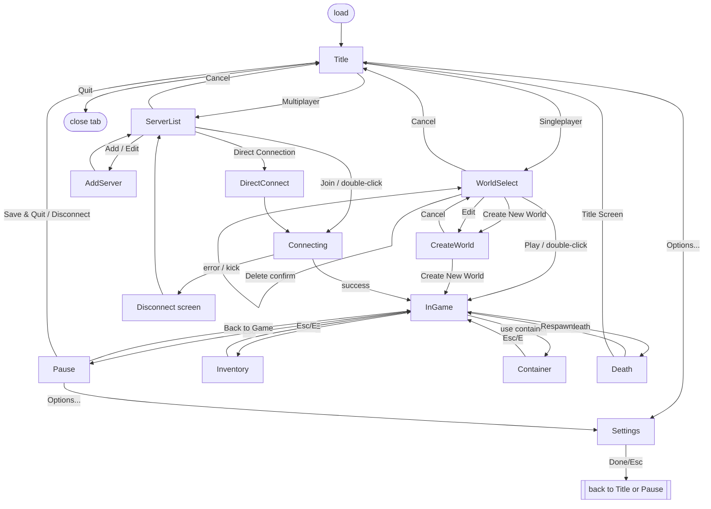

# UX_SPEC.md — Browser Client UX & Interface Specification

**Project:** MinecraftV2 — browser voxel game
**Client stack:** TypeScript + Three.js (WebGL), greedy-meshed voxel chunks, HTML/CSS overlay UI atop the WebGL canvas.
**Server:** authoritative Node.js over WebSockets. See [`docs/MULTIPLAYER_PROTOCOL.md`](./MULTIPLAYER_PROTOCOL.md) for the wire protocol referenced in §9.
**Assets:** NO external game assets. All block/item/GUI textures are **procedurally generated** at runtime into `CanvasTexture` atlases. "Texture packs" are generator parameter presets (§7), not image files.

**Audience:** builder agents. Every entry is concrete: names, pixel numbers, formulas, data shapes. Where a name is `code-styled` it is an intended identifier (CSS class, TS type, key). Coordinates are in **GUI pixels (`gp`)** unless stated otherwise (§0.2).

---

## 0. Architecture of the UI Layer

### 0.1 DOM layering over the canvas

```
#app                      position:relative; width:100vw; height:100vh; overflow:hidden; background:#000
├─ #gl-canvas             <canvas> Three.js WebGLRenderer; z-index:0; fills #app
├─ #hud-root              position:absolute; inset:0; z-index:10; pointer-events:none   (in-world HUD, §5)
│   └─ 9 anchor containers (§0.3) hold HUD widgets
├─ #screen-root           position:absolute; inset:0; z-index:20; pointer-events:auto   (menus/screens, §1–§4,§6,§8,§9)
│   └─ exactly 0 or 1 active <section class="screen"> at a time (screen stack, §0.4)
└─ #toast-root            position:absolute; top:0; right:0; z-index:30; pointer-events:none (toasts, §5.12)
```

- `#hud-root` is `pointer-events:none` so mouse events reach the canvas for pointer-lock look. Individual HUD widgets stay non-interactive.
- `#screen-root` is empty (`display:none`) whenever the base **in-game** layer is active and pointer lock is held. Pushing any screen releases pointer lock (§10.3).
- Only ONE screen is visible; screens are a stack (`ScreenStack`, §0.4). The canvas keeps rendering behind translucent screens (pause/inventory dim the world but do not stop rendering).

### 0.2 Virtual GUI coordinate system (GUI Scale)

All widget sizes/positions are authored in **GUI pixels (`gp`)**, then integer-scaled to physical device pixels by the **GUI Scale factor `S`** (an integer ≥ 1). Reference/pixel-art nominal is `1 texture px = 1 gp`.

**Compute `S`** (mirrors vanilla algorithm; base virtual minimum 320×240 gp):

```ts
function computeGuiScale(viewportW: number, viewportH: number, setting: number /* 0=Auto,1..4 */): number {
  const guiW = viewportW * devicePixelRatio, guiH = viewportH * devicePixelRatio;
  let s = 1;
  const cap = setting === 0 ? Number.MAX_SAFE_INTEGER : setting;
  while (s < cap && guiW / (s + 1) >= 320 && guiH / (s + 1) >= 240) s++;
  return s; // Auto => largest s that keeps >=320x240 gp; else min(setting, that max)
}
```

**Apply `S`.** Set on `:root`: `--S: <s>;` and derive a scaled-pixel helper. Every gp dimension is written as `calc(N * var(--S) * 1px)`. Prefer a SCSS/util `gp(N) => calc(N * var(--S) * 1px)`. Font size for bitmap text = `8gp` line height (§0.5). Recompute `S` and re-lay-out on `resize`/`devicePixelRatio` change.

**Virtual viewport in gp:** `guiVW = round(viewportW*dpr / S)`, `guiVH = round(viewportH*dpr / S)`. HUD anchor math (§5) uses `guiVW`/`guiVH`.

### 0.3 Anchor model (nine-anchor)

Every HUD element declares `{ anchor, dx, dy, w, h }` where `anchor ∈ AnchorId` and `(dx,dy)` are gp offsets from the anchor origin (positive x → right, positive y → down).

```ts
type AnchorId =
  | 'top-left'    | 'top-center'    | 'top-right'
  | 'mid-left'    | 'center'        | 'mid-right'
  | 'bottom-left' | 'bottom-center' | 'bottom-right';
```

Nine `position:absolute` container divs pin to their edge/corner of `#hud-root`; `top-center`/`bottom-center` use `left:50%; transform:translateX(-50%)`; `center`/`mid-*` similarly centered on their axis. Widget offsets are applied as `translate()` inside the anchor. This makes every widget resolution-independent and matches "HUD stacks above the centered hotbar."

### 0.4 Screen stack & state machine

```ts
type ScreenId =
  | 'title' | 'worldSelect' | 'createWorld'
  | 'multiplayer' | 'addServer' | 'directConnect' | 'connecting'
  | 'settings' | 'settings.video' | 'settings.controls' | 'settings.mouse'
  | 'settings.audio' | 'settings.accessibility' | 'settings.texturePacks' | 'settings.skin'
  | 'settings.chat'                                  // §4.7
  | 'pause' | 'death' | 'sleeping'                   // sleeping §3.3
  | 'advancements' | 'statistics' | 'socialInteractions' // §3.4, §3.5, §9.6
  | 'inventory' | 'container' | 'creative'
  | 'signEdit' | 'bookEdit' | 'bookView'            // §6.14, §6.15
  | 'spectate'                                       // spectator teleport menu §10.5
  | 'chatOverlay';

interface ScreenStack { push(id: ScreenId, props?): void; pop(): void; replace(id: ScreenId): void; clear(): void; peek(): ScreenId | null; }

// Runtime player game mode (server-authoritative, settable via `/gamemode`). This is the SUPERSET
// used at runtime; the world-CREATION `gameMode` in §2.2/§2.3 only exposes survival|creative|hardcore.
// Builders MUST use this enum for the live player state, not the creation enum.
type GameMode = 'survival' | 'creative' | 'adventure' | 'spectator' | 'hardcore';
// - 'adventure': survival HUD/bars; player CANNOT break/place blocks unless the held item has a
//   matching `CanDestroy`/`CanPlaceOn` tag — the block-break flow (§5.7) is suppressed otherwise.
// - 'spectator': no-clip, no collision, minimal HUD (§10.5); hidden from the world for other players
//   except a translucent floating head. Cycled via F3+N (§5.14).
// - 'hardcore': survival rules + permadeath + distinct heart sprite (§5.4) + locked Difficulty=Hard.
```

- `Esc` pops the top screen (or opens `pause` from in-game). Empty stack + in-world = pointer-locked gameplay.
- `chatOverlay` and `inventory`/`container`/`creative` are gameplay-adjacent screens: they overlay the HUD, release pointer lock, but the world keeps simulating (multiplayer) or pauses (singleplayer, only for `pause`/`death` — NOT for inventory).

### 0.5 Bitmap text & widget skin (procedural)

- **Font:** a procedurally-drawn bitmap font, 8gp line height, ~6gp advance for most glyphs, rendered to a glyph atlas at load. CSS text uses this atlas OR a bundled monospace pixel webfont with `image-rendering:pixelated`. Every text draw has a **drop shadow**: color `#3F3F3F`, offset `(+1gp,+1gp)`. **Two exceptions:** (1) static text on light `--ui-panel` faces (container/screen titles, slot-group labels) is set in `--ui-text-panel #404040` and draws with **no shadow** (dark-on-panel, 6.07:1 vs `#C6C6C6`); (2) `--ui-text-warn`/`--ui-text-err` text drawn on `--ui-panel` or `--ui-btn` faces (keybind-conflict rows §4.3, anvil `"Too Expensive!"` §6.8) draws a **1gp black `#000000` outline** (4× offset, like the level number §5.3) **instead of** the shadow — the plain `#3F3F3F` shadow leaves red/yellow below readable contrast on those faces (`#FF5555` vs `#3F3F3F` is only 3.35:1).
- **Palette (procedural GUI skin):**

  | Token | Hex | Use |
  |---|---|---|
  | `--ui-panel` | `#C6C6C6` | inventory/window face |
  | `--ui-panel-hi` | `#FFFFFF` | top/left bevel |
  | `--ui-panel-lo` | `#555555` | bottom/right bevel |
  | `--ui-slot` | `#8B8B8B` | empty slot recess |
  | `--ui-slot-hi` | `#FFFFFF` | slot bottom/right bevel |
  | `--ui-slot-lo` | `#373737` | slot top/left bevel |
  | `--ui-slot-hover` | `#FFFFFF @ 0.40` | hovered slot fill overlay |
  | `--ui-text` | `#FFFFFF` | primary text |
  | `--ui-text-panel` | `#404040` | dark static text on light panel faces (container/screen titles, slot-group labels); drawn with NO shadow |
  | `--ui-text-dim` | `#A0A0A0` | disabled/hint text |
  | `--ui-text-warn` | `#FFFF55` | warnings |
  | `--ui-text-err` | `#FF5555` | errors/conflicts |
  | `--ui-screen-dim` | `#000000 @ 0.50` | full-screen dim behind menus |
  | `--ui-btn` | `#6B6B6B` face / `#000@0.55` border | button normal |
  | `--ui-xp` | `#80FF20` | XP bar fill / level text |
  | `--ui-hp` | `#FF0000` | health |
  | `--ui-food` | `#C4915B` | hunger |

- **Buttons.** Sizes: primary `200×20 gp`, wide `310×20`, half `98×20`, tiny `20×20`. Three states: `normal`, `:hover` (brighter face + text goes `#FFFFA0`, plays click on press), `[disabled]` (face `#4A4A4A`, text `--ui-text-dim`, no hover). Beveled 1gp border via inset box-shadow (`--ui-panel-hi` top-left, `--ui-panel-lo` bottom-right).
- **Text field.** `.ui-textfield`: dark recessed box, 1gp light border when focused, blinking `_` caret, white text.
- **Slider/cycle button.** Slider = 200×20 track with a 8gp-wide knob; label shows `Name: <value>`. Cycle button = 200×20 that advances an enum on click (right-click / shift = previous).
- **Toggle button.** Renders `Name: ON` / `Name: OFF`.

---

## 1. Screen Flow



`Settings` is reachable from both `Title` and `Pause`; on `Done`/`Esc` it pops back to whichever pushed it.

---

## 2. Screens: Title, World Select, Create World

### 2.1 Title / Main Menu — `title`

- **Purpose:** entry point; route to singleplayer, multiplayer, settings, quit.
- **Background:** slowly rotating 3D **panorama** rendered by Three.js into `#gl-canvas` (a static cubemap scene, blurred via a full-screen post pass), NOT a screen div. `#screen-root` sits on top with a transparent background.
- **Elements** (all in a `center` column unless noted):
  - Logo band: procedurally rendered "MinecraftV2" wordmark, top region (`center`, dy ≈ `-70`).
  - Splash text: yellow italic string, anchored to logo lower-right, animated `scale = 1 + 0.05*|sin(t*π)|`; text drawn from a rotating list; picked once per load.
  - Primary buttons (`200×20`, stacked, 4gp gap): `Singleplayer` → push `worldSelect`; `Multiplayer` → push `multiplayer`.
  - Secondary row (two `98×20`, centered): `Options...` → push `settings`; `Quit Game` → `window.close()` fallback to a "you may close this tab" panel.
  - Icon buttons flanking the secondary row (`20×20`): `Language` (globe) and `Accessibility` (person) → push `settings.accessibility`.
  - Footer: version string bottom-left (`bottom-left`, dx `2`, dy `-2`): `"MinecraftV2 vX.Y.Z"`; build/copyright bottom-right.
- **Layout notes:** column centered via flexbox on `#screen-root > .screen`. Buttons full-width up to 200gp. All text uses drop shadow.

### 2.2 World Select — `worldSelect`

- **Purpose:** choose/manage local singleplayer worlds (persisted client-side, e.g. IndexedDB `worlds` store).
- **Data shape:**
  ```ts
  interface WorldSummary {
    id: string;                 // uuid, == storage key / folder name
    name: string;               // display name
    lastPlayed: number;         // epoch ms
    gameMode: 'survival'|'creative'|'hardcore'; // CREATION default only; runtime player mode is the
                                                // wider `GameMode` enum (§0.4: adds adventure|spectator)
    difficulty: 'peaceful'|'easy'|'normal'|'hard';
    cheats: boolean;
    versionTag: string;         // engine version that wrote it
    compatible: boolean;        // false => yellow/red warning row
    iconDataURL: string | null; // 64x64 procedural screenshot thumbnail
    sizeBytes: number;
  }
  ```
- **Elements:**
  - Title text `"Select World"` (`top-center`, dy `16`).
  - **Search box** (`.ui-textfield`, ~300gp wide, `top-center` dy `24`): live-filters list by `name` (case-insensitive substring).
  - **Scrollable list** (`#world-list`, centered column, virtualized, overflow-y auto). Each row `.world-row` (~310×36gp):
    - Left: 32×32gp icon (from `iconDataURL`, `image-rendering:pixelated`; placeholder if null).
    - Line 1: `name`.
    - Line 2 (dim): `id` · `lastPlayed` (relative) · `gameMode` · `versionTag`. Turns `--ui-text-warn` if `!compatible`.
    - Row states: hover highlight, selected (1gp white outline).
  - **Bottom button block** (two rows):
    - Row A: `Play Selected World` (enabled only when a row is selected), `Create New World` → push `createWorld` (no `worldId`).
    - Row B: `Edit` → push `createWorld` with `{worldId}` in edit mode; `Delete`; `Re-Create`; `Cancel` → pop.
- **Actions / list-item actions:**
  - **Play**: double-click row OR select + `Play Selected World` → load world, replace stack with in-game.
  - **Edit**: opens Create-World form in edit mode (name/gamerules editable; seed shown read-only).
  - **Delete**: opens confirm dialog `"Delete world '<name>'? This cannot be undone."` → `[Delete]` `[Cancel]`; on confirm removes storage entry + refresh list.
  - **Copy / Re-Create**: `Re-Create` = create a new world reusing this world's seed+settings (opens Create-World prefilled, new `id`); a `Copy` action clones the storage blob under a new id with name `"<name> - Copy"`.
- **Layout notes:** list max-width 320gp centered; buttons pinned to bottom via flex column with the list `flex:1`.

### 2.3 Create New World — `createWorld` (tabbed)

- **Purpose:** configure and create (or edit) a world.
- **Config data shape:**
  ```ts
  interface WorldCreationConfig {
    name: string;                 // default "New World"
    gameMode: 'survival'|'creative'|'hardcore';   // default 'survival' (creation only; runtime uses
                                                  // GameMode §0.4 — adventure/spectator via /gamemode)
    difficulty: 'peaceful'|'easy'|'normal'|'hard'; // default 'normal'
    allowCheats: boolean;         // default false
    seedInput: string;            // default "" (blank => random long)
    worldType: 'default'|'superflat'|'largeBiomes'|'amplified'|'singleBiome'|'debug'; // default 'default'
    generateStructures: boolean;  // default true
    bonusChest: boolean;          // default false
    gameRules: GameRules;         // §2.3.3
  }
  ```
- **Header:** `World Name` text field (default `"New World"`) + hint `"Will be saved in: <slugified id>"`.
- **Tabs** (row of tab buttons `Game | World | More`; active tab underlined):
  - **Game tab:**
    - `Game Mode` cycle: Survival / Creative / Hardcore + one-line description under it. Selecting **Hardcore** locks `Difficulty=Hard` (cycle disabled) and sets permadeath flag.
    - `Difficulty` cycle: Peaceful / Easy / Normal / Hard.
    - `Allow Cheats` toggle (ON/OFF). Forced OFF+disabled when Hardcore.
  - **World tab:**
    - `Seed` text field, placeholder `"Leave blank for a random seed"`. Parse: if numeric → `BigInt`/long; else hash string to 64-bit (`javaStringHash`-compatible long). In edit mode this is read-only.
    - `World Type` cycle: Default / Superflat / Large Biomes / Amplified / Single Biome / Debug. Show `Customize...` button only for Superflat/Single Biome.
    - `Generate Structures` toggle (default ON).
    - `Bonus Chest` toggle (default OFF).
  - **More tab:**
    - `Game Rules...` → sub-panel (§2.3.3).
    - `Data Packs...` (stub, disabled unless packs feature enabled).
- **Footer:** `Create New World` (primary; label `Save` in edit mode) → validate → persist `WorldSummary` + config, load world; `Cancel` → pop to `worldSelect`.
- **Defaults recap:** GameMode=Survival, Difficulty=Normal, Cheats=OFF, Structures=ON, BonusChest=OFF, WorldType=Default.
- **Layout notes:** fixed-width centered panel (~310gp). Tab body scrolls if overflow. Spectator is NOT selectable here (only via `/gamemode` when cheats on).

#### 2.3.3 Game Rules panel (`GameRules`)

Toggle/int rules editable when cheats allowed. Ship at least:
```ts
interface GameRules {
  // --- world/spawn/loot ---
  keepInventory: boolean;        // default false
  doDaylightCycle: boolean;      // default true
  doMobSpawning: boolean;        // default true
  doWeatherCycle: boolean;       // default true
  doTileDrops: boolean;          // default true  (== block drops)
  mobGriefing: boolean;          // default true
  doFireTick: boolean;           // default true
  naturalRegeneration: boolean;  // default true
  fallDamage: boolean;           // default true
  randomTickSpeed: number;       // default 3
  showCoordinates: boolean;      // default true  (client HUD/F3; == vanilla's reducedDebugInfo inverse for coords)
  // --- respawn / death UX (affect §3.2/§3.3) ---
  doImmediateRespawn: boolean;   // default false — true SKIPS the death screen (§3.2), respawns instantly
  playersSleepingPercentage: number; // 0..100, default 100 — % of players that must sleep to skip night (§3.3)
  forgiveDeadPlayers: boolean;   // default true  — angered neutral mobs forgive on target death
  universalAnger: boolean;       // default false — angered neutral mobs attack all nearby players
  spawnRadius: number;           // default 10   — world-spawn scatter radius on respawn without a bed
  // --- damage sources (each gates a HUD overlay/flash) ---
  fireDamage: boolean;           // default true  — gates fire overlay damage (§5.15)
  freezeDamage: boolean;         // default true  — gates powder-snow freeze damage + frost vignette (§5.15)
  drowningDamage: boolean;       // default true  — gates air-bubble drown flash (§5.6)
  fallDamageDrops?: boolean;     // (alias; use fallDamage)
  // --- mobs / spawning ---
  doInsomnia: boolean;           // default true  — phantoms spawn after 3 sleepless days
  doPatrolSpawning: boolean;     // default true  — pillager patrols
  doTraderSpawning: boolean;     // default true  — wandering trader
  doMobLoot: boolean;            // default true  — mob drops (separate from doTileDrops)
  doEntityDrops: boolean;        // default true  — non-mob entity drops (minecarts, item frames…)
  disableRaids: boolean;         // default false
  maxEntityCramming: number;     // default 24    — entities before cramming damage
  // --- command / feedback (affect chat & command-block UX) ---
  commandBlockOutput: boolean;   // default true  — command-block chat echo to ops
  sendCommandFeedback: boolean;  // default true  — /command success text in chat (§12)
  announceAdvancements: boolean; // default true  — advancement toasts + chat broadcast (§3.4, §5.12)
  reducedDebugInfo: boolean;     // default false — trims the F3 overlay (§5.14) to a minimal subset
  // --- misc ---
  spectatorsGenerateChunks: boolean; // default true
  doLimitedCrafting: boolean;    // default false — true = can only craft unlocked recipes (Recipe Book §6.2)
  blockExplosionDropDecay: boolean;  // default true — explosion drop loss scales with blast size
  maxCommandChainLength?: number;    // default 65536
}
```
Render as a scrollable list grouped by the comment headers: boolean rules → toggle buttons; int rules → text field with numeric validation (clamp to the noted range). `Done` returns to `More` tab. This is the minimum set a builder needs; several rules directly drive HUD/overlay behavior referenced elsewhere (noted inline).

#### 2.3.4 World-Type `Customize...` editors

The `Customize...` button (World tab, shown only for `worldType==='superflat'|'singleBiome'`) opens a modal editor. Two variants:

- **Superflat editor** (`worldType==='superflat'`):
  ```ts
  interface SuperflatConfig {
    layers: { block: string; height: number }[]; // ordered TOP→BOTTOM as shown in UI; height ≥ 1
    biome: string;                                // default 'minecraft:plains'
    features: boolean;                            // structures/villages/strongholds etc. (default false)
    lakes: boolean;                               // default false
    presetCode: string;                           // encoded string, editable (see below)
  }
  ```
  - **Layer list** (scrollable): each row = block icon + name + height field, with **remove (✕)** and drag-handle **reorder**. `Add Layer` appends (block picker + height). Total stack height clamps to build limit.
  - `Biome` picker (searchable dropdown), `Structures` toggle (`features`), `Lakes` toggle.
  - **Presets row:** `Presets...` opens a list of named presets that repopulate `layers`/`biome`: `Classic Flat`, `Tunnelers' Dream`, `Water World`, `Overworld`, `Snowy Kingdom`, `Bottomless Pit`, `Desert`, `Redstone Ready`, `The Void`. Selecting one fills the layer list.
  - **Preset code** `.ui-textfield` (bottom): a semicolon-delimited encoding (`<biome>;<h>*<block>,<h>*<block>,...`) round-tripped with the layer list — editing text re-parses into `layers`, and editing layers re-serializes the code.
  - Buttons: `Done` (validate + store into `WorldCreationConfig`), `Cancel`.
- **Single-Biome editor** (`worldType==='singleBiome'`): a single searchable **biome selector** (list of all biome ids with a small color swatch); stores `{ biome: string }`. Buttons `Done`/`Cancel`.

---

## 3. Pause & Death Screens

### 3.1 Pause — `pause`

- **Purpose:** in-game menu; **singleplayer pauses the sim**, multiplayer does not (world keeps running server-side).
- **Background:** `--ui-screen-dim` over the still-rendering world (optionally blurred per accessibility `menuBlur`).
- **Elements (centered column, 200×20 unless noted):**
  - `Back to Game` → pop, re-request pointer lock.
  - Row (two `98×20`): `Advancements` | `Statistics`.
  - `Options...` → push `settings`.
  - Row (two `98×20`): singleplayer → `Open to LAN` | `Save and Quit to Title`; multiplayer → single `200×20` `Disconnect` button.
- **Actions:** `Save and Quit` flushes world to storage then replace-stack `title`. `Disconnect` closes the WebSocket (`code 1000`) then `title`.

### 3.2 Death — `death`

- **Purpose:** shown on player death; blocks input except its buttons.
- **Data:** `{ deathMessage: string, score: number, hardcore: boolean }` — `deathMessage` mirrors the chat death string (e.g. `"Slain by Zombie"`, `"<name> fell from a high place"`).
- **Elements:** big title `"You Died!"` (red, `center` dy `-40`); death message line; `Score: <n>`; buttons `Respawn` and `Title Screen`.
- **Hardcore:** `Respawn` disabled/replaced by `Spectate World` (drops the player into `spectator` mode, §10.5); on quit the world is flagged permanently locked (shown in world-select as read-only).
- **Layout:** dim-red vignette overlay `#520000 @ 0.55`.

#### 3.2.1 Respawn point & spawn mechanics

`Respawn` sends the player to their **spawn point**, resolved in this order: personal bed → charged respawn anchor → world spawn (scattered within `gameRules.spawnRadius`).

- **Setting a spawn point:** successfully sleeping in a bed (§3.3) OR right-clicking a **charged respawn anchor** sets `spawnPoint = {x,y,z, dimension, angle}` and shows the chat/actionbar line `"Respawn point set"`.
- **Respawn anchor charge:** state `charge: 0..4`. Right-click with glowstone adds a charge (max 4); each charge level raises the block's emissive glow. Respawning **consumes one charge**. A 0-charge anchor is not a valid spawn. In the Overworld a respawn anchor explodes if used (parity behavior — surface for builders even if gated off).
- **Lost/blocked spawn:** if the bed is missing/obstructed or the anchor is uncharged at respawn time, fall back to world spawn and show `"Your home bed was missing or obstructed"` (bed) / `"You have no home bed or charged respawn anchor, or it was obstructed"` (anchor) as a chat line on respawn.
- **Data:** `player.spawnPoint: { x:number; y:number; z:number; dimension:string; angle:number } | null`. The `Respawn` button's destination reads this; on lethal fall to world-spawn, spawnPoint is left unchanged (bed) or cleared (obstructed).

### 3.3 Sleeping / Bed — `sleeping`

Right-clicking a bed (`use` on a bed block) attempts to sleep. Two outcomes:

- **Failure (no screen — chat/actionbar message only, action aborts):**
  - `"You can only sleep at night"` — daytime and not thundering.
  - `"You may not rest now; there are monsters nearby"` — hostile mob within ~8 blocks.
  - `"This bed is obstructed"` — no valid space beside the bed.
  - `"This bed is too far away"` (bed moved out of range).
- **Success → push `sleeping` screen:** the viewport fades to black over ~`--ui-screen-dim`+ (fade in ~100 ms), a `Leave Bed` button (`center`, lower third), and time fast-forwards toward morning. Sets the player's spawn point (§3.2.1) with `"Respawn point set"`.
  - **Multiplayer:** center text `"<n>/<m> players sleeping"`; night is skipped once sleeping players ≥ `gameRules.playersSleepingPercentage`% of eligible players (§2.3.3). Other players see the counter update live. `Leave Bed` (or `Esc`) wakes the player and pops the screen.
  - **Singleplayer:** clicking through simply advances time to dawn (and clears weather if the sleep-through-storm case applies), then auto-pops.
- **Data:** `{ sleeping: boolean, playersSleeping: number, playersRequired: number, canSkip: boolean }`.

### 3.4 Advancements — `advancements`

Opened by the Pause `Advancements` button or the `advancements` keybind (L, §11). Full-screen screen (releases pointer lock).

- **Category tabs** across the top: `Story` (dirt-block bg), `Nether`, `The End`, `Adventure`, `Husbandry` (one tab per root advancement; only tabs with ≥1 known advancement render). Active tab highlighted.
- **Tree view:** a pan/zoom-able canvas of advancement **frames** connected by lines (parent→child). Drag to pan; frames laid out on a grid by tree depth. The window is a fixed viewport that clips the tree; scroll/drag reveals off-screen frames.
- **Frame shapes** (3): `task` = square, `goal` = rounded/oval, `challenge` = spiked/notched. **State colors:** obtained = bright/gold border with a filled icon; not-obtained = gray/dashed border, dimmed icon. Obtaining a `challenge` plays a distinct sound + a toast (§5.12).
  ```ts
  interface Advancement {
    id: string; parent: string | null;
    display: { title: string; description: string; icon: ItemStack;
               frame: 'task'|'goal'|'challenge'; showToast: boolean; hidden: boolean };
    criteria: string[]; requirements: string[][]; // AND-of-OR
    progress: { done: boolean; completedCriteria: number; totalCriteria: number };
  }
  ```
- **Hover tooltip:** title (frame-colored), description, and progress `x/y` for multi-step advancements (e.g. `0/3`). Hidden advancements don't render until unlocked.

### 3.5 Statistics — `statistics`

Opened by the Pause `Statistics` button. Full-screen scrollable screen with three tabs:

- **General** tab: flat scrollable `label — value` list (e.g. Distance Walked, Jumps, Damage Dealt, Play Time, Deaths, Mob Kills). Time/distance formatted (`h:mm`, `km`).
- **Item** tab: a scrollable table, one row per item (icon), with sortable columns `Mined | Crafted | Used | Broken | Picked Up | Dropped`. Click a column header to sort asc/desc (arrow indicator).
- **Mobs** tab: one row per mob type with `Killed` and `Killed By` columns.
- **Data:**
  ```ts
  interface Statistics {
    custom: Record<string, number>;        // general counters (keyed by stat id)
    mined: Record<string, number>; crafted: Record<string, number>;
    used: Record<string, number>; broken: Record<string, number>;
    pickedUp: Record<string, number>; dropped: Record<string, number>;
    killed: Record<string, number>; killedBy: Record<string, number>;
  }
  ```

---

## 4. Settings

Root `settings` is a scrollable centered column of buttons + a couple inline controls. Each sub-screen has its own `ScreenId`, a title, a scrollable body, and a `Done` button (pops). All settings persist to `localStorage` key `mv2:settings` as one JSON blob (shape below). Changing a value applies live where feasible.

```ts
interface Settings {
  video: VideoSettings; controls: ControlsSettings; audio: AudioSettings;
  accessibility: AccessibilitySettings; keybinds: Record<ActionId, Binding>; // §11
  activeTexturePacks: string[]; // ordered, highest priority first; §7
  skin: SkinSettings;
}
```

### 4.1 Settings root — `settings`

- Inline `FOV` slider (see video). Buttons: `Video Settings...`, `Controls...`, `Music & Sounds...`, `Chat Settings...` (→ `settings.chat`, §4.7), `Accessibility Settings...`, `Resource Packs...` (→ `settings.texturePacks`), `Skin Customization...`, `Language...` (stub). When opened from Pause also show a `Difficulty` cycle + lock toggle.

### 4.2 Video — `settings.video` (`VideoSettings`)

Grid of `150×20` controls (2 columns). Ranges/defaults:

| Control | Type | Range / values | Default | Live apply |
|---|---|---|---|---|
| `renderDistance` | slider | 2–32 chunks | 8 | yes — retriggers chunk stream/mesh |
| `simulationDistance` | slider | 5–32 | 8 | yes |
| `fov` | slider | 30–110° (label 70=Normal, 110=Quake Pro) | 70 | yes — sets `PerspectiveCamera.fov` |
| `maxFramerate` | slider | 10–260 + `Unlimited` | 120 | yes — frame throttle |
| `vsync` | toggle | on/off | on | yes — on=rAF pacing, off=uncapped loop honoring maxFramerate |
| `guiScale` | cycle | Auto,1,2,3,4 | Auto | yes — recompute `S` (§0.2) |
| `graphics` | cycle | Fast / Fancy / Fabulous! | Fancy | yes — Fast=cutout leaves/no fancy water; Fancy=fancy leaves/water/AO; **Fabulous!**=order-independent / weighted-blended transparency for translucent blocks, water, clouds & particles seen through translucency. **Gate Fabulous! on WebGL2 MRT support** (multiple render targets); if unavailable, hide/disable the option and clamp to Fancy. |
| `brightness` | slider | 0.0 (Moody) – 1.0 (Bright) | 0.5 | yes — gamma uniform in block shader |
| `renderClouds` | cycle | Off / Fast / Fancy | Fancy | yes |
| `particles` | cycle | All / Decreased / Minimal | All | yes |
| `smoothLighting` | cycle | Off / Min / Max | Max | yes — AO in greedy mesher |
| `entityShadows` | toggle | on/off | on | yes |
| `viewBobbing` | toggle | on/off | on | yes |
| `attackIndicator` | cycle | Off / Crosshair / Hotbar | Crosshair | yes — HUD (§5.7) |
| `biomeBlend` | slider | 0–7 (radius) | 3 | rebuild affected chunks |
| `mipmapLevels` | slider | 0–4 | 4 | yes — number of mip levels generated on the procedural block/item atlas (§7). Higher = less distant shimmer/aliasing on the atlas; 0 = nearest-only. Regenerate mips on the `CanvasTexture` and set `texture.generateMipmaps`/`minFilter` accordingly. |
| `entityDistanceScaling` | slider | 50%–500% | 100% | yes — multiplies entity render/tracking distance |
| `autosaveInterval` | slider | 1–30 min (singleplayer) | 5 min | yes — drives the autosave-indicator (§4.5 `autosaveIndicator`) |
| `fullscreen` | toggle | on/off | off | yes — Fullscreen API (also F11) |

Notes for builders: `vsync` in a browser is fundamentally `requestAnimationFrame`; the toggle chooses rAF (on) vs a `setTimeout(0)` loop gated by `maxFramerate` (off). `guiScale=Auto` uses the §0.2 algorithm. **Distortion Effects** and **FOV Effects** sliders live in Accessibility (§4.5 `distortionEffects`/`fovEffects`); expose read-only cross-links here labeled `Distortion Effects...` / `FOV Effects...` that deep-link to §4.5 (vanilla surfaces them in both places).

### 4.3 Controls — `settings.controls` & Mouse — `settings.mouse` (`ControlsSettings`)

- **Controls screen:** `Mouse Settings...` button + the **Key Binds** list (§11 renders here). Key Binds list is scrollable, grouped by category, each row = `<Action name>` + a rebind button showing the current binding. Click rebind button → row enters "listening" state (button shows `> ... <`), next keydown/mousedown captures the binding; `Esc` cancels; the bound key with no modifier is stored. **Conflict detection:** any action sharing an identical binding renders BOTH rebind buttons in `--ui-text-err` with a `⚠` icon; a tooltip lists the conflicts. `Reset Keys` button restores all defaults after a confirm.
- **Mouse settings:**

  | Control | Type | Range | Default |
  |---|---|---|---|
  | `sensitivity` | slider | 0–200% (200 = "HYPERSPEED!!!") | 100 |
  | `invertY` | toggle | on/off | off |
  | `mouseWheelSensitivity` | slider | 0.1–10 | 1.0 |
  | `discreteScrolling` | toggle | on/off | off |
  | `rawInput` | toggle | on/off (use `movementX` unaccelerated when available) | on |
  | `autoJump` | toggle | on/off | off |

  Look math (§10.2) reads `sensitivity` + `invertY`.

### 4.4 Audio — `settings.audio` (`AudioSettings`)

Independent 0–100% sliders, each mapped to a Web Audio `GainNode` in a per-category bus; effective gain = `master * category`.
```ts
interface AudioSettings {
  master: number; music: number; jukebox: number; weather: number;
  blocks: number; hostile: number; friendly: number; players: number;
  ambient: number; voice: number;               // all 0..100, default 100
  showSubtitles: boolean;                        // default false
  directionalAudio: boolean;                     // default true (HRTF panner)
}
```
`Show Subtitles` drives the subtitle HUD (§5.11). Render as vertical list of sliders + two toggles.

### 4.5 Accessibility — `settings.accessibility` (`AccessibilitySettings`)

```ts
interface AccessibilitySettings {
  narrator: 'off'|'all'|'chat'|'system';   // default 'off'; hotkey Ctrl+B cycles/toggles
  textToSpeech: boolean;                    // default false
  textBackground: 'everywhere'|'chatOnly';  // default 'chatOnly'
  textBackgroundOpacity: number;            // 0..100, default 50
  chatOpacity: number;                      // 0..100, default 100
  highContrast: boolean;                    // default false -> swaps GUI palette to high-contrast variant
  colorblindMode: 'none'|'protanopia'|'deuteranopia'|'tritanopia'; // default 'none' -> LUT post-pass + HUD icon shape cues
  damageTilt: number;                       // 0..100 %, default 100
  distortionEffects: number;                // 0..100 %, default 100 (nausea/portal warp)
  fovEffects: number;                       // 0..100 %, default 100 (sprint/speed FOV change)
  menuBlur: number;                         // 0..100 %, default 50 (backdrop blur behind screens)
  toggleSneak: boolean;                     // default false (true=press toggles, false=hold)
  toggleSprint: boolean;                    // default false
  hideLightningFlashes: boolean;            // default false
  autosaveIndicator: boolean;               // default true
  glintSpeed: number;                       // 0..100 %, default 50 — animation speed of the enchant glint (§5.15.8)
  glintStrength: number;                    // 0..100 %, default 75 — opacity/intensity of the enchant glint overlay
}
```
- **High contrast** swaps `--ui-*` tokens to a bordered black/white/yellow set (higher bevel contrast, 2gp borders).
- **Colorblind mode** applies a color LUT in a post pass AND adds redundant **shape cues** to status-effect/potion icons and ping bars (never rely on hue alone).
- **Subtitles** toggle lives in Audio (§4.4) but is surfaced here too as a shortcut.
- `toggleSneak`/`toggleSprint` change the Sneak/Sprint keybinds from hold to toggle semantics.

### 4.6 Skin Customization — `settings.skin` (`SkinSettings`)

Toggles: `cape`, `jacket`, `leftSleeve`, `rightSleeve`, `leftPantsLeg`, `rightPantsLeg`, `hat` (all default true), and `mainHand: 'left'|'right'` (default `'right'`). `mainHand` flips the offhand slot side in the HUD/inventory (§5.1, §6.1).

### 4.7 Chat Settings — `settings.chat` (`ChatSettings`)

Consolidates all chat-appearance controls (do NOT scatter these: `chatOpacity`/`textBackground*` live in §4.5 as accessibility duplicates, chat *visibility* in §12). Reachable from Settings root and via a `Chat Settings...` button in the chat overlay (§12).

```ts
interface ChatSettings {
  visibility: 'shown'|'commandsOnly'|'hidden'; // default 'shown' (mirrors §12)
  colors: boolean;                 // default true  — render §-style color codes
  webLinks: boolean;               // default true  — make URLs clickable
  promptOnLinks: boolean;          // default true  — confirm dialog before opening a link
  opacity: number;                 // 0..100, default 100 (== §4.5 chatOpacity; single source of truth)
  textSize: number;                // scale %, 0..100 → maps to chat GUI scale, default 100
  lineSpacing: number;             // 0..100 %, default 0 — extra gap between chat lines
  delaySeconds: number;            // 0..6 s, default 0 — min delay between showing queued messages
  widthChars: number;              // chat box width, 40..320 gp equiv, default 320
  focusedHeight: number;           // px/gp, focused scrollback height, default 180
  unfocusedHeight: number;         // px/gp, unfocused (fade) height, default 90
  commandSuggestions: boolean;     // default true — autocomplete popup (§12)
  hideMatchedNames: boolean;       // default true — hide messages from muted/blocked players (§9.6)
  narratorReadsChat?: boolean;     // mirrors §4.5 narrator when 'chat'/'all'
}
```
Render as a scrollable list of sliders/toggles/cycles. Values drive §12 (input box width/height, fade timing, link handling) and the §5.11/§12 chat log rendering.

---

## 5. In-Game HUD

Base layer, `#hud-root`. All positions in gp, scaled by `S`. Bottom cluster anchors to the **centered hotbar**; corners/top anchor to screen edges. `guiVW`/`guiVH` = virtual viewport (§0.2). Hotbar center x = `guiVW/2`. Screen bottom = `guiVH`.

**Global show/hide:**
- `F1` (Hide GUI) hides EVERYTHING in `#hud-root`.
- When any screen with an open GUI is active (inventory/container/pause/chat-input), the **crosshair hides**; other HUD stays unless it's a full menu.
- Survival/hardcore/adventure show the survival bars; **creative** hides health/hunger/armor/xp/air (shows hotbar+crosshair only); **spectator** shows only a minimal/no HUD.

### 5.1 Hotbar

- **Sprite:** `182×22 gp`. Anchor `bottom-center`, `dx 0`, top-left at `(guiVW/2 - 91, guiVH - 22)`.
- **Slots:** 9 slots, pitch `20gp`. Slot `i` (0-based) icon (16×16) top-left = `(guiVW/2 - 91 + 3 + 20*i, guiVH - 19)`; icon center x = `guiVW/2 - 91 + 11 + 20*i`.
- **Selection highlight:** `24×24 gp` frame, slot `i` top-left = `(guiVW/2 - 91 - 1 + 20*i, guiVH - 23)`. Active slot set by keys `1`–`9` (§11) or mouse wheel (`mouseWheelSensitivity`/`discreteScrolling`).
- **Stack count:** bottom-right of each slot, numbers only if count > 1. **Durability bar:** 13gp-wide bar across slot bottom (2gp tall), color lerp green→red by `damage/maxDamage`, shown when item damaged.
- Data: `hotbar: (ItemStack|null)[9]`, `selectedSlot: 0..8`. `ItemStack = { id, count, durability?, nbt? }`.

### 5.2 Offhand slot

- `22×22 gp` frame beside the hotbar. If `skin.mainHand==='right'` → offhand on the **left**: top-left `(guiVW/2 - 91 - 29, guiVH - 23)`. If `'left'` → mirror to the right at `(guiVW/2 + 91 + 7, guiVH - 23)`. Only drawn when offhand slot non-empty OR always show empty frame (config; default show only when non-empty).

### 5.3 XP bar & level

- **Bar:** `182×5 gp`, top-left `(guiVW/2 - 91, guiVH - 29)`, green fill `--ui-xp` left→right = `xpProgress ∈ [0,1]`.
- **Level number:** centered at `x = guiVW/2`, baseline `guiVH - 31`, `--ui-xp` with black outline (drawn 4× offset for outline). Hidden if level 0.
- Hidden entirely in creative/spectator or when riding (replaced by jump-charge, §5.9).
- **Level-up feedback:** when `level` increases, flash the bar/level text **white** for ~`10` ticks (scale the level number up briefly, `1→1.3→1`) and play the level-up "ding". At **levels 30, 40, ...** play the louder milestone chime (higher pitch). Suppress if `hideGui` or XP bar hidden.
- **Pickup animations** (world→HUD): picked-up **item entities** arc toward the player over ~`3` ticks then vanish; on absorb, the target hotbar/inventory slot count **bumps** (brief scale pop) and plays the pickup pop sound. **XP orbs** fly to the player (accelerating toward the camera-anchored feet), then increment `xpProgress` with the bar's `--ui-xp` fill animating up. Both are driven by server pickup events; render as short client-side tweens.

### 5.4 Health

- 10 hearts, each `9×9 gp`, pitch `8gp` (1px overlap). Heart `k` (0-based, left→right) top-left = `(guiVW/2 - 91 + 8*k, guiVH - 39)`. Half-heart granularity (each heart = 2 HP, 20 HP max). Draw order: empty container sprite, then filled/half on top.
- **Variants** (swap heart sprite tint/style): poison=green tint, wither=black, frozen(powder snow)=cyan, regeneration=vertical bob `dy = -1*|sin|` on one heart, **absorption**=yellow hearts stacked in the row above (`guiVH - 39 - 8*rowsUsed... ` extra rows offset up by 10gp each when HP>20).
- **Hardcore heart sprite:** in Hardcore mode the hearts use a **separate `hardcore` heart sprite** (darker/veined container + fill), NOT one of the tint variants above. This is a distinct base texture selected by `player.gameMode==='hardcore'`; tint variants (poison/wither/frozen) still layer on top of the hardcore sprite when those effects are active.
- **Damage jitter:** on damage, offset the whole row by `dy = random(-2..2)` for ~10 ticks.
- Only in survival/hardcore/adventure. Row shifts up by an extra `10gp` when armor row present.

### 5.5 Armor

- 10 armor icons `9×9`, pitch `8`, top-left `(guiVW/2 - 91 + 8*k, guiVH - 49)` (row above health). Each icon = 2 armor points. **Only rendered when `armorPoints > 0`.**

### 5.6 Hunger (food) & Air

- **Hunger:** 10 drumstick icons, **mirrored** (deplete right→left). Icon `k` (k=0 = rightmost) top-left = `(guiVW/2 + 91 - 9 - 8*k, guiVH - 39)`. Half granularity, 20 food max. **Jitter** icons `dy=random(-1..1)` when saturation==0 and food low. Replaced by mount health when riding.
- **Air bubbles:** 10 bubbles `9×9`, right-aligned like hunger, row above at `y = guiVH - 49`. **Only shown when underwater** (`air < airMax`, 300 tick max); bubbles pop as air drains; empty → drowning damage flashes.

### 5.7 Crosshair & in-world targeting

- **Crosshair:** `9×9 gp` `+` centered at `(guiVW/2, guiVH/2)`. Render with an **inverting blend** (`mix-blend-mode: difference` on the div, OR draw with WebGL `ONE_MINUS_DST_COLOR` blend) so it's visible on any background. **Shown in ALL camera perspectives** (1st-person, 3rd-person-back, 3rd-person-front). Hidden ONLY when: a GUI screen is open, in `spectator` mode, or `hideGui` (F1) is active. (Correction: it is NOT first-person-only.)
- **Attack indicator** (setting §4.2): `Crosshair` mode draws a small progress arc/bar just below the crosshair (`dy +8gp`) filling `0→1` = `attackCooldownProgress`; `Hotbar` mode draws it beside the selected hotbar slot; `Off` = none.
- **Block selection outline (always-on aiming affordance):** the raycast that finds the targeted block/entity also drives a **black wireframe outline** drawn on the exact block the crosshair hits — this is what tells the player which block will be broken/placed.
  - **Render:** a `THREE.LineSegments` (in-world, WebGL, NOT HUD) tracing the targeted block's **actual `VoxelShape`**, not a unit cube — fences/walls (thin posts), stairs/slabs (partial boxes), fence gates, panes, etc. render their true collision/outline shape (a shape may be multiple boxes → draw all edges). Nudge outward by ~`0.002` blocks to avoid z-fighting.
  - **Style:** `2gp`-equivalent line width, color **black `rgba(0,0,0,0.4)`**. Depth-tested so it hugs surfaces.
  - **Hide when:** no block targeted (raycast miss / out of reach), a GUI screen is open, `spectator` mode, `hideGui` (F1), or (adventure) when the targeted block can't be interacted with — still show the outline for feedback but suppress the break flow (§0.4 adventure).
  - **Data:** `targetedBlock: { pos:[x,y,z], shape: Box[], face: 'up'|'down'|'north'|'south'|'east'|'west' } | null`.
- **Block-break progress:** while mining, overlay a 0→9 crack-stage texture on the targeted block face (in-world, not HUD) driven by `breakProgress`. (Distinct from the selection outline above — the outline is always-on, cracks appear only while actively mining.)
- **Entity hitbox highlight:** when the raycast hits an *entity* instead of a block, no block outline is drawn (the entity is the target); F3+B (§5.14) separately toggles debug hitboxes.

### 5.8 Status-effect icons

- Anchor `top-right`. Beneficial effects on the **top row**, harmful on the **row below** (`dy +26gp`). Each icon `24×24 gp`, laid right→left with **`25gp` pitch** (24gp icon + 1gp gap), `dx` from right edge = `-25 - 25*index`. (An earlier revision said "26gp pitch", contradicting the dx formula; the dx formula is authoritative — pitch is 25gp.)
- Each shows remaining duration as small text under the icon (`mm:ss`); ambient/beacon (infinite) show no timer. Icon **blinks** (alpha pulse) in the final ~10s (or 5s for the flashing threshold). Colorblind mode adds a shape badge. Only rendered when `activeEffects.length > 0`.

### 5.9 Mount / vehicle HUD

- Riding a rideable mount replaces the **hunger row** with the mount's **health hearts** (same layout, orange/health-colored) and replaces the **XP bar** with a **jump-charge bar** (`182×5`, fills while holding jump).

### 5.10 Boss bar

- Anchor `top-center`. Magenta/purple segmented bar `182×5 gp` scaled up 1× (draw at width ~182gp), boss **name** centered above it. Multiple bosses stack vertically (`dy += 19gp` per bar). Only when `bossEvents.length > 0`.

### 5.11 Subtitles

- Anchor `bottom-right`, above the hotbar cluster (`dy ≈ -40`). Directional sound captions: `"<sound name>  <arrow>"`, arrow points toward source direction. Max ~4 lines, fade after ~3s. Only when `audio.showSubtitles`. Background box uses `textBackgroundOpacity`.

### 5.12 Toasts

- `#toast-root`, top-right. Slide-in cards (`160×32 gp`) for advancements/recipe unlocks/tutorial hints; auto-dismiss ~5s, stack downward, max ~3 visible + queue.

### 5.13 Hotbar item-name popup

- On `selectedSlot` change (or item change in the selected slot), show the selected item's display name centered above the hotbar: `x = guiVW/2`, `y = guiVH - 41 - (health/xp present ? extra : 0)` (draw above the top bar of the bottom cluster). Fade over **40 ticks (~2.0s)**: full alpha for ~30 ticks then linear fade. Text is **rarity-colored** (below) + shadow.
- **Item rarity palette** (applies to this popup, the tooltip title text §6.10, and the "Now Playing" style disc name where relevant):

  | Rarity | Color | Hex |
  |---|---|---|
  | Common | white | `#FFFFFF` |
  | Uncommon | yellow | `#FFFF55` |
  | Rare | aqua | `#55FFFF` |
  | Epic | light purple | `#FF55FF` |

  - `rarity: 'common'|'uncommon'|'rare'|'epic'` is a per-item base value. **Enchanting an item bumps its rarity up one tier** (common→uncommon, rare→epic); **custom-named** items and certain special items are forced to a higher tier. Use the resulting effective rarity for the title-text color everywhere item names render in color.

### 5.14 Debug overlay (F3) — `debugOverlay`

Toggled by `F3` (not rebindable). Two monospace text columns over the game, `--ui-text` with `#000@0.5` text background. Content:

- **Left column (lines, in order):**
  1. `MinecraftV2 vX.Y.Z` (+ mods/flags)
  2. `FPS: <n>` (+ `T: <target>`, vsync flag, chunk-update count)
  3. server `ms tick / TPS` (if integrated/authoritative timing available)
  4. `C: <renderedSections>/<totalSections>` culling info
  5. `E: <renderedEntities>/<totalEntities>`
  6. `P: <particleCount>`
  7. loaded-chunk / mob-cap info
  8. blank
  9. `XYZ: <x> / <y> / <z>` (exact player position, 3 decimals)
  10. `Block: <bx> <by> <bz>` (integer block coords)
  11. `Chunk: <cx> <cy> <cz> in <rx> <ry> <rz>` (relative in chunk)
  12. `Facing: <cardinal> (<axis>) (<yaw> / <pitch>)`
  13. `Biome: <id>`
  14. `Local Difficulty: <ld> // <regional> (Day <n>)`
  15. `Light: <total> (<sky> sky, <block> block)`
- **Right column:** JS runtime/engine info; `Mem: <used>% <usedMB>/<maxMB>`; allocated/GC info; `CPU: <navigator.hardwareConcurrency> cores`; `Display: <w>x<h> (dpr <dpr>)`; `GPU: <WEBGL_debug_renderer_info>`; **Targeted Block** (id + all blockstate properties + tags) when raycast hits a block; **Targeted Fluid**; **Targeted Entity** data when applicable.
- **Graphs:** `Shift+F3` → profiler pie; `Alt+F3` → frame-time graph.

**F3 combos** (hold F3, press second key). Implement the applicable subset:

| Combo | Action |
|---|---|
| F3+A | Reload all render chunks (remesh) |
| F3+B | Toggle entity **hitboxes** + view vectors |
| F3+C | Copy player `/tp` command; hold ~10s = debug crash |
| F3+D | Clear chat history |
| F3+F / F3+Shift+F | Render distance +1 / −1 |
| F3+G | Toggle chunk-border grid overlay |
| F3+H | Toggle advanced item tooltips (ids, durability numbers) |
| F3+I | Copy targeted block/entity data to clipboard |
| F3+N | Cycle Spectator ↔ previous game mode (cheats) |
| F3+P | Toggle auto-pause on window blur |
| F3+Q | Print list of F3 shortcuts to chat |
| F3+T | Reload/regenerate textures (re-run procedural atlas; §7 hot-reload) |

### 5.15 Screen overlays (full-viewport post/DOM layers)

Full-viewport effects that sit **between the world canvas and the HUD**. DOM overlays live in a dedicated `#overlay-root` (`position:absolute; inset:0; z-index:5; pointer-events:none`, between `#gl-canvas` z=0 and `#hud-root` z=10); distortion/fog/FOV effects are **WebGL post-processing passes / camera uniforms**, not DOM. All DOM overlays are hidden by `hideGui` (F1) and in `spectator` unless noted.

#### 5.15.1 Fire overlay
- `#fire-overlay`: two rows of **animated flame sprites** tiled across the bottom ~40% of the viewport, screen-space (procedural flame texture, frame-cycled every ~2–3 ticks).
- **Gate:** `player.onFire && !fireImmune`. Suppress when the player has **Fire Resistance**, is in creative/spectator, or is an otherwise fire-immune state. Fire *damage* itself gated by `gameRules.fireDamage` (§2.3.3), but the visual shows whenever burning and not immune.

#### 5.15.2 Submerged / underwater overlay + fog
- `submersionType: 'none'|'water'|'lava'|'powderSnow'` = the fluid/block the **camera eyes** are inside.
- **Overlay (DOM/quad):** `water` = blue water-texture tint over the whole screen (subtle scroll); `lava` = dense orange/red tint; `powderSnow` = white tint.
- **Fog (post-pass uniform `uSubmersion` + `{fogColor, fogNear, fogFar, fogDensity}`):**
  - `water`: **blue near-fog**, far plane pulled in (reduced visibility); `fogColor` **biome-tinted** (swamp greener, warm-ocean lighter). Respiration enchant / Water Breathing extend `fogFar`.
  - `lava`: **orange dense fog**, view ~**1.5 blocks** (`fogFar ≈ 1.5`); Fire Resistance clears it (see far).
  - `powderSnow`: **white** fog, short view.
  - `none`: normal atmospheric/biome fog.

#### 5.15.3 Nether portal / nausea distortion
- **Portal overlay:** `#portal-overlay` purple swirl texture, full-screen. While standing in a nether-portal block, `portalTime` ramps `0→1` over ~**20 ticks**; overlay opacity = `portalTime`. Acts as the teleport countdown; resets when leaving the portal.
- **Nausea warp:** a post-pass screen **wobble/barrel-warp** shader driven by the **Nausea** effect intensity (and mildly by portal proximity). Amplitude = `effectIntensity * (distortionEffects/100)` (§4.5) — the accessibility slider at 0 fully disables the warp. Portal overlay itself is NOT disabled by the slider (only the warp is).

#### 5.15.4 Carved-pumpkin head overlay
- `#pumpkin-overlay`: a **pumpkin-shaped vignette** — dark border filling the screen edges with two eye cutouts + a mouth cutout that reveal the world through them (procedural mask).
- **Gate:** `armor.helmet.id === 'carved_pumpkin'` (§6.1 helmet slot). A pumpkin also normally prevents Enderman aggro — surface as a gameplay note, but the overlay is the UX deliverable here.

#### 5.15.5 Powder-snow freezing / frost vignette
- `#frost-overlay`: an **icy frost vignette** that grows inward from the screen edges as `player.frozenTicks` rises toward **140** (the freeze threshold). Opacity ≈ `clamp((frozenTicks - 40)/100, 0, 1)` (begins showing partway, full near 140).
- **Freeze-damage flash:** when a freeze-damage tick lands (at full freeze), pulse a stronger cyan/white vignette for ~5 ticks. Freeze damage gated by `gameRules.freezeDamage`. Pairs with the `frozen=cyan` heart tint (§5.4).

#### 5.15.6 Spyglass scope overlay
- While **using a spyglass** (`use` held with a spyglass): temporarily override camera FOV to ~`fov * 0.1` (scoped zoom); on release, restore.
- `#spyglass-overlay`: a **black scope vignette** — a centered circular transparent cutout (diameter = `min(vw,vh)`), solid black outside the circle. Pairs with the raise pose (§5.20).

#### 5.15.7 Totem of Undying activation
- On a **lethal-damage save** with a Totem of Undying in the main or off hand: play a large **centered totem model animation** over the viewport (scales up + spins, ~1s), emit a **golden particle burst**, and a brief **full-screen yellow flash** (`#totem-flash`, `#FFFF00` fading from ~0.6 alpha over ~0.5s).
- Grants Absorption II + Regeneration II + Fire Resistance and consumes the totem (surface the effect grant; visuals are the UX deliverable). Not suppressed by F1 (it's critical feedback).

#### 5.15.8 Enchantment glint rendering
- Enchanted items (and enchanted books / special items) draw an **animated iridescent glint** overlay wherever the item icon/model renders: **inventory/container slots (§6.10), hotbar icons (§5.1), and the first-person viewmodel (§5.20)**.
- **Implementation:** a second pass over the item sprite/model using an **additive/`screen`-blend** scrolling diagonal glint texture (magenta→cyan sheen); UVs scroll over time. **Speed = f(`glintSpeed`)**, **opacity/intensity = f(`glintStrength`)** from accessibility (§4.5); both `0` → static/no glint.

### 5.16 Actionbar text channel & "Now Playing"

- **Actionbar (distinct HUD line):** a single centered text line just above the hotbar cluster (`x = guiVW/2`, baseline ≈ `guiVH - 42`, above the XP/health bars). Driven by `/title <p> actionbar <text>`, status messages, and jukebox (below). Renders one line, **fades after ~60 ticks (~3s)**. This is a separate channel from chat (§12) and from the item-name popup (§5.13); when both the actionbar and item-name popup want the region, the **actionbar takes precedence** (item-name popup is delayed/suppressed).
- **"Now Playing" overlay:** when a jukebox starts a music disc, show actionbar-style text `"Now Playing: <artist> - <title>"` (e.g. `"C418 - cat"`), fading like the item-name popup. Data: `nowPlaying: { text: string } | null`.

### 5.17 Player list / Tab overlay — `playerList`

Held-`Tab` (§11) shows a centered translucent panel (`#000 @ 0.5`) over the HUD (not a screen — pointer lock retained).

- **Layout:** optional **header** text (multi-line, server-provided) at top; then one row per online player sorted by team → name; optional **footer** text at bottom. Splits into multiple columns when the player count is large (~> 20 per column).
- **Per-player row:** 8×8gp **skin head** icon · **name** (team-colored) · optional **gamemode** label · a **5-bar ping icon** (green<150ms→yellow→red; colorblind adds shape cue §4.5) · optional **scoreboard column** = the objective assigned to the `list` display slot (§5.18), right-aligned red number.
- **Data:**
  ```ts
  interface TabList {
    header: string; footer: string;
    players: { uuid: string; name: string; skinHeadDataURL: string;
               teamColor?: string; gameMode?: GameMode; pingMs: number; listScore?: number }[];
    listObjective?: { name: string };   // if a scoreboard objective is bound to the 'list' slot
  }
  ```

### 5.18 Scoreboard (sidebar + list + belowName)

Right-anchored objective scoreboard, plus the two other display slots.

- **Sidebar (`sidebar` slot):** anchor `mid-right`. **Title** centered at the top; below it up to **15 score lines**, each = team-colored entry **name** on the left + **red** `score` number on the right. Background `#000 @ 0.3`, box width = widest line. Lines sorted by score descending. Only rendered when a `sidebar` objective is set.
- **List slot (`list`):** renders as the per-player number column in the Tab overlay (§5.17).
- **BelowName slot (`belowName`):** renders under the in-world entity nametag (§5.19) as `<score> <objective-display-name>`.
- **Data:**
  ```ts
  interface ScoreboardDisplay {
    slot: 'sidebar'|'list'|'belowName';
    objective: { name: string; displayName: string };
    entries: { name: string; score: number; teamColor?: string }[]; // sidebar: top 15 by score
  }
  ```

### 5.19 In-world entity / player nametags

Floating names rendered in world-space above players (always) and custom-named / renamed mobs.

- **Render:** **billboarded** quad (always faces the camera) above the entity's head; **white** text with drop shadow on a `#000 @ 0.25` background pill. `belowName` scoreboard line (§5.18) renders on a second line beneath, if set.
- **Scale/visibility:** scales with distance to keep roughly constant screen size (capped); **hidden past ~64 blocks**; **hidden while the tagged entity is sneaking**; hidden if the entity has an invisibility/hidden-nametag flag.
- **Occlusion:** normally occluded by blocks (depth-tested). An **"always render through walls"** mode (team `nametagVisibility` / friendly-visible rules, or the F3 "see through" case) draws the tag on top regardless of depth.
- **Data:** `nametag: { text: string; color: string; belowName?: string; seeThrough: boolean } | null` per entity.

### 5.20 First-person viewmodel & item-use animations

The first-person **arm + held item**, rendered in a separate near-plane pass (its own camera/overlay layer so it never clips into world geometry).

- **Hands:** main hand on the `skin.mainHand` side (§4.6, default right), offhand opposite. Both render their `ItemStack` model (or bare arm when empty). Enchant glint (§5.15.8) applies. `viewBobbing` (§4.2) applies a walk bob.
- **Swing animation:** on attack/use, play a ~**6-tick** swing arc (item/arm sweeps down-and-back then returns).
- **Equip / swap ("lower-then-raise"):** on selected-slot change or held-item change, the item **lowers off-screen then raises** the new item (~3 ticks down + ~3 ticks up).
- **Use animations** (while `use` held, keyed off the item's use-action + use duration):
  - **Eating / drinking:** item tilts toward the mouth and shakes; **eating** emits food particles + crunch sound over a **32-tick** consume; **drinking** (potion/milk/honey) uses the drink pose (no food particles) + gulp sound.
  - **Bow:** **3 pull stages** by charge time (arm pulls back further each stage); release fires.
  - **Crossbow:** load animation → held **loaded** pose (shows loaded projectile).
  - **Shield:** **raise/block** pose (main or offhand), tilts to guard while blocking.
  - **Spyglass:** **raise-to-eye** pose (paired with the scope overlay + FOV zoom, §5.15.6).
  - **Trident:** raise/charge pose (throw), or riptide spin when charged in water/rain.
- **Data:** `heldUse: { hand: 'main'|'off'; action: 'none'|'eat'|'drink'|'bow'|'crossbow'|'shield'|'spyglass'|'trident'; ticksUsing: number; maxUseTicks: number }`.

---

## 6. Inventory & Container UIs

### 6.0 Common model

- Window is a centered panel `W×H gp`; `guiLeft = floor((guiVW - W)/2)`, `guiTop = floor((guiVH - H)/2)`. All slot coords below are **relative to `(guiLeft, guiTop)`**.
- **Slot metrics:** interactive slot is `18×18 gp` (16×16 icon + 1gp pad each side); the clickable/hover hit area is the 18×18 cell. Hovered slot draws `--ui-slot-hover` fill and shows a **tooltip** (item name + lore; advanced tooltips add id/durability).
- **Player inventory block** is present in every screen except creative's non-inventory tabs: main `3×9` starts at `(8, 84)` pitch 18; hotbar `1×9` at `(8, 142)` pitch 18. (These hold indices consistent with the on-screen hotbar.)
- **Cursor stack (`carried`):** `ItemStack|null` following the pointer, drawn centered under the cursor at cursor `(px,py)`. On screen close with a non-null `carried`, the stack is dropped into the world (a `DropAll` action). While a GUI is open, the browser cursor is visible (pointer lock released, §10.3).

### 6.1 Survival Player Inventory — `inventory` (176×166)

Slot map (relative to `guiLeft,guiTop`):

| Region | Coords |
|---|---|
| Armor: Helmet / Chest / Legs / Boots | `(8,8) (8,26) (8,44) (8,62)` (each accepts only its type) |
| Offhand | `(77,62)` (mirror to matching side if `mainHand==='left'`) |
| 2×2 crafting grid | `(98,18) (116,18) (98,36) (116,36)` |
| Crafting result | `(154,28)` |
| Main inventory 3×9 | start `(8,84)`, pitch 18 |
| Hotbar 1×9 | start `(8,142)`, pitch 18 |
| Player 3D preview | rect `(26,8)–(75,78)`; live-rotating model, follows cursor slightly |
| Recipe Book toggle | knowledge-book button at ~`(6,y)` left of grid; opens left panel (§6.2) |

### 6.2 Recipe Book panel

Toggled from crafting/inventory/furnace screens. Left-side panel: category tabs (top), search field, scrollable grid of craftable recipe icons; click a recipe → ghost-fills the crafting grid; craftable vs missing-ingredient recipes visually distinguished. Furnace variant shows smeltable recipes.

### 6.3 Creative Inventory — `creative` (195×136)

- **Tabs** across top (two rows of tab buttons): Building Blocks, Colored Blocks, Natural Blocks, Functional, Redstone, Tools & Utilities, Combat, Food & Drinks, Ingredients, Spawn Eggs, **Search** (text field appears), **Survival Inventory** (renders §6.1 layout), **Saved Hotbars**.
- **Item grid:** `9×5` visible slots, scrollbar on the right; infinite-supply source slots (left-click grabs a full stack, right-click grabs one, middle-click grabs a stack even if holding).
- **Destroy-item (trash) slot** bottom-right of the grid: dropping any stack here deletes it.
- **Search tab:** text field filters all items by name/id/tag.
- **Saved Hotbars tab:** 9 rows, each a saved hotbar snapshot; interacts with `C`/`X` toolbar keys (§11).

### 6.4 Chest / Barrel / Shulker / Ender — `container`

- **Single (27 slots, 3×9):** window `176×(114+3*18)=176×168`... use canonical `176×168`? Ship `176×166` header pattern: container slots start at `(8,18)`, `rows×9` pitch 18; player inventory appended below (main at `(8, 18 + rows*18 + 14)` , hotbar `+58`). For a 3-row chest, `guiTop`-relative main-inv start ≈ `(8, 84)`.
- **Double chest (54, 6×9):** container slots start `(8,18)`, 6 rows.
- Hopper = `5 slots (1×5)` at `(44,20)` pitch 18. Ender Chest / Shulker / Barrel reuse the 27-slot layout.
- **Dispenser / Dropper** (`176×166`): a **3×3** (9-slot) grid, slots start at **`(62,17)`** pitch 18 (`slot i` at `(62 + 18*(i%3), 17 + 18*floor(i/3))`); player inventory block below at the canonical `(8,84)` / hotbar `(8,142)`. Same GUI for both blocks (dispenser shoots/places, dropper only ejects — identical UI). Title text `"Dispenser"` / `"Dropper"`.
- Open plays a sound + (for chests) a lid animation in-world.

### 6.5 Crafting Table — `container` (176×166)

3×3 grid start `(30,17)` pitch 18; result `(124,35)`; Recipe Book toggle. Shift-click on result crafts repeatedly, distributing outputs into inventory.

### 6.6 Furnace / Blast Furnace / Smoker — `container` (176×166)

| Slot/element | Coords |
|---|---|
| Input (top) | `(56,17)` |
| Fuel (bottom) | `(56,53)` |
| Flame icon (burn-time) | `(56,36)`, 14×14, fills bottom-up |
| Progress arrow → | `(79,34)`, 24×17, fills left→right |
| Output | `(116,35)` (extract-only; collecting yields smelting XP) |

Blast Furnace (metals, 2× speed) & Smoker (food, 2× speed) share this layout.

### 6.7 Enchanting Table — `container` (176×166)

- Item slot `(15,47)`; Lapis slot `(35,47)`.
- **Three enchant option rows** on the right (each ~`108×19`, at y `14 / 38 / 62`): each shows required **level (1–30)**, a glyph line in the Standard Galactic ("enchanting") alphabet, and — on hover, if enough levels — one revealed enchantment name + **XP-level cost** (1/2/3 lapis + levels). Nearby bookshelves (up to 15) raise the max level; power computed server-side.

### 6.8 Anvil — `container` (176×166)

- Input A (target) `(27,47)`; Input B (sacrifice/material/book) `(76,47)`; Output `(134,47)`.
- **Name text field** at top (`(26,20)`, ~110gp wide) for renaming (adds cost).
- Output shows **XP-level cost**; displays `"Too Expensive!"` (`--ui-text-err`) at ≥40 levels in survival (39 cap). Tracks "prior work penalty."

### 6.9 Brewing Stand — `container` (176×166)

- 3 bottle slots across bottom: `(56,51) (79,58) (102,51)`; ingredient slot top-center `(79,17)`; blaze-powder fuel `(17,17)`; brewing **bubble/arrow progress** indicator between ingredient and bottles; fuel bar by the blaze slot.

### 6.10 Slot interaction matrix (highest-fidelity — replicate exactly)

`carried` = cursor stack; `hovered` = slot under cursor. LMB=left, RMB=right, MMB=middle. Mouse buttons: DOM `button` 0/1/2 = left/middle/right.

| Input | Precondition | Effect |
|---|---|---|
| LMB on slot | `carried` empty, slot has stack | Pick up **full** stack into `carried` |
| LMB on slot | `carried` non-empty, slot empty/same-item | Place **entire** `carried`; if same item, merge up to max stack (remainder stays carried) |
| LMB on slot | `carried` & slot differ | **Swap** carried ↔ slot |
| RMB on slot | `carried` empty, slot has stack | Pick up **half** (ceil) into `carried` |
| RMB on slot | `carried` non-empty | Place **one** item into slot (if empty or same item & room) |
| Shift+LMB (or Shift+RMB) | slot has stack | **Quick-move** entire stack to the other section (inventory↔container; hotbar↔main); result slot → craft & move all |
| Double-LMB | `carried` non-empty (or after a pickup) | **Gather** all matching items from the container into `carried` up to max stack |
| LMB drag across slots | started with `carried` non-empty | **Split evenly** — distribute `carried` one-portion per dragged slot (`floor(total/nSlots)` each); remainder returns to `carried` |
| RMB drag across slots | `carried` non-empty | Place **one** per dragged slot |
| MMB drag (creative) | creative + `carried` non-empty | Fill each dragged slot with a **full stack** clone |
| Number key `1`–`9` while hovering | any | **Swap** hovered item with hotbar slot (1–9); if hotbar slot empty, moves hovered there |
| `F` while hovering | any | Swap hovered item with **offhand** |
| `Q` while hovering | slot has stack, `carried` empty | **Drop one** into world |
| `Ctrl+Q` while hovering | slot has stack | **Drop whole** stack |
| LMB outside any slot | `carried` non-empty | Drop **entire** carried; RMB outside = drop **one** |
| Shift+LMB on result slot | craftable | **Craft repeatedly** and quick-move all outputs until ingredients run out or inventory full |
| Hover | — | Show tooltip (name + lore; advanced tooltip adds id/durability if F3+H) |

Multiplayer note: all slot actions are **predicted client-side then confirmed/reconciled** by server `WindowClick`/`SetSlot` packets — see [`docs/MULTIPLAYER_PROTOCOL.md`](./MULTIPLAYER_PROTOCOL.md).

### 6.10.1 Special-case item tooltips & interactions

- **Bundle** (default item since 1.21.2):
  - **Interaction (in a slot, not a normal click):** RMB a bundle **onto** a stack (or a stack onto the bundle) to **insert** items into it; RMB the bundle in an empty area / while carried to **remove** the most-recently-inserted item. Capacity = 64 total item "weight".
  - **Tooltip:** renders a **mini contents grid** of the contained stacks + a **fullness bar** (used/total), and a **selected-item preview**.
  - **Data:** `bundle: { contents: ItemStack[]; selectedIndex?: number }` (in nbt).
- **Shulker box:** hovering a shulker box **that has contents** shows a special tooltip rendering its **27-slot contents as a mini 9×3 grid** of item icons (in addition to name/lore). Data: `shulkerContents: (ItemStack|null)[27]`.
- Advanced tooltips (F3+H) still append id/durability lines beneath these previews.

### 6.11 Villager / Merchant trading — `container` (MerchantScreen)

- **Window** ~`276×166`. **Left column** = one **trade-select button** per offer, ~7 visible, with **up/down scroll arrows** when `offers.length > 7`; list starts `(5,18)`, row pitch ~`20`.
- **Selected trade** (right area): **input1** slot `(136,37)`, optional **input2** slot `(162,37)`, **arrow** between, **output** slot `(220,37)`.
- **Unaffordable / out-of-stock / disabled:** draw a **red slash/✕** over the output (barred arrow) when the player can't afford the cost, or the trade is **disabled** because `uses >= maxUses` (until the villager restocks). Disabled trades render grayed in the list.
- **Level:** villager **level name** (`Novice | Apprentice | Journeyman | Expert | Master`) + a green **XP progress bar** toward next level at the top (omit both for the Wandering Trader).
- **Data:**
  ```ts
  interface MerchantData {
    offers: { input1: ItemStack; input2?: ItemStack; output: ItemStack;
              disabled: boolean; uses: number; maxUses: number;
              priceMultiplier?: number; specialPrice?: number }[];
    levelName?: string; xpBar?: number;   // 0..1; absent for wandering trader
    canRestock: boolean;
  }
  ```

### 6.12 Beacon — `container` (`230×219`)

- **Payment slot** (bottom-center): accepts one **iron / gold / emerald / diamond / netherite ingot** to activate.
- **Primary-effect buttons**, unlocked by pyramid **tier (1–4)**: tier 1 → `Speed`, `Haste`; tier 2 adds `Resistance`, `Jump Boost`; tier 3 adds `Strength`. Buttons for tiers above the current pyramid render **disabled**.
- **Secondary column:** only at **full pyramid (tier 4)** — choose `Regeneration` OR **"+ level"** (upgrade the chosen primary to level II).
- **Confirm (✓) / Cancel (✗)** buttons: Confirm enabled only when a payment item is present AND a primary effect is chosen; on Confirm, consume the payment and apply the beacon effects.
- **Data:** `beacon: { tier: 0|1|2|3|4; primary: EffectId|null; secondary: EffectId|null; payment: ItemStack|null }`. `tier` drives which buttons are enabled.

### 6.13 Utility workstations — `container`

Five standard station GUIs (slot coords in the `(guiLeft,guiTop)`-relative style of §6.6–6.9; all `176×166` unless noted, with the canonical player-inventory block appended below):

- **Grindstone:** input A `(49,19)`, input B `(49,40)`, output `(129,34)`. Combines/repairs the two inputs and **returns XP**; **strips all non-curse enchantments** (curses remain on the item). Output previews the repaired item.
- **Smithing Table** (1.20 3-slot layout): **template** `(8,48)`, **base** `(26,48)`, **addition** `(44,48)` → **output** `(98,48)`. Supports **netherite upgrade** (upgrade template + diamond gear + netherite ingot) and **armor trims** (trim template + armor + trim material); output previews the upgraded/trimmed item.
- **Loom:** **banner** `(13,26)`, **dye** `(33,26)`, **pattern** slot `(23,45)` → **output** `(143,58)`; a scrollable **pattern-list grid** (start `(60,13)`, 4×4 buttons) + a **live banner preview** panel. Banner+dye enables the pattern list; selecting a pattern updates preview + output.
- **Cartography Table:** **map** slot `(15,15)`, **paper / empty-map / glass-pane / compass** slot `(15,52)` → **output** `(145,39)`; large **map preview** panel on the right. Second-item modes: paper = **zoom out**, empty map = **clone**, glass pane = **lock**, compass = add a position marker.
- **Stonecutter:** single **input** `(20,33)` → **output** `(143,33)`; a scrollable **recipe-button grid** of possible cut results (start `(52,14)`, 4 columns, `18`gp cells, scrollbar when the recipe count overflows). Clicking a recipe button selects that output variant.

### 6.14 Sign editing — `signEdit`

Placing or right-clicking an editable sign opens an **in-world text editor** (camera focuses the sign; releases pointer lock, but it's not a full panel screen).

- **4 lines** of centered text edited in place with a **live 3D preview**; blinking caret on the active line; Enter/Up/Down move between lines (line width limited by the sign face).
- **Per-side editing (front & back, since 1.20):** the clicked side is the one edited; the other side is untouched.
- **Text color:** applying a **dye** sets the text color; a **glow ink sac** toggles **glowing** (outlined/emissive) text, a plain **ink sac** reverts it.
- **Finish:** `Done`/`Esc` commits and closes.
- **Data:** `signEdit: { pos:[x,y,z]; side:'front'|'back'; lines:[string,string,string,string]; color:string; glowing:boolean }`.

### 6.15 Book & Quill / signed book / Lectern — `bookEdit`, `bookView`

- **Writing (`bookEdit`, Book and Quill):** paged editor, ~**14 lines/page**, page-turn arrows (◀ ▶) + page counter at the bottom, `Sign` button. `Sign` → enter a **title** field (author auto = player name) → confirming converts it to an immutable **Written Book**. `Cancel` closes without signing (draft persists in the item).
- **Reading (`bookView`):** read-only viewer for **signed books** and **lecterns**; page-turn arrows, `Take Book` (lectern) / `Done`. **Multiplayer:** lectern page turns broadcast to all nearby readers so their view **page-syncs**.
- **Data:** `book: { pages: string[]; title?: string; author?: string; signed: boolean; currentPage: number }`.

### 6.16 Ridden-entity inventory (horse / donkey / mule / llama)

Opening inventory (`E`) while riding a **tamed** horse-type opens a dedicated GUI **alongside** the player inventory block (§6.1 layout appended below at `(8,84)`/`(8,142)`).

- **Slots:** **saddle** slot `(8,18)` (horse/donkey/mule); **armor** slot `(8,36)` = **horse armor** (horses) or **carpet/decor** (llama) — donkey/mule have no armor slot. For **donkey/mule/llama with a chest**, a **storage grid** to the right: `3×N` starting `(80,18)` pitch 18 — donkey/mule `N=5` (15 slots); llama `N = strength` (1–5 → 3–15 slots).
- **Mount 3D preview** on the left (like §6.1's player preview). Title = the mount's (custom) name.
- **Data:** `mountInv: { saddle?: ItemStack; armor?: ItemStack; storage?: (ItemStack|null)[]; storageCols: number }`.

---

## 7. Texture-Pack Switcher — `settings.texturePacks`

Because all textures are **procedural**, a "texture pack" is a **generator parameter preset** that produces the block/item/GUI atlas at runtime. Ship three built-ins:

```ts
interface TexturePack {
  id: 'default'|'smooth-cartoon'|'gritty' | string;
  name: string;
  description: string;               // shown under name
  builtin: boolean;
  params: TextureGenParams;          // seeds/noise/palette/edge params fed to the atlas generator
  iconDataURL: string;               // 32x32 procedural preview icon
}
interface TextureGenParams {
  paletteSeed: number; noiseType: 'value'|'perlin'|'worley'; noiseScale: number;
  contrast: number; edgeDarkening: number; dither: boolean; roughness: number;
  saturation: number; outlineWeight: number; /* ... */
}
```

Built-in presets (tune to taste):
- **`default`** — balanced, medium noise, subtle edge darkening. Baseline params.
- **`smooth-cartoon`** — low noise, high saturation, bold `outlineWeight`, flat shading, `dither:false`.
- **`gritty`** — high noise + `roughness`, low saturation, strong `edgeDarkening`, `dither:true`.

**UI (two-column transfer, priority-ordered):**
- **Left column "Available"** = installed-but-inactive packs; **Right column "Selected"** = active packs, ordered **top→bottom = highest priority first**; built-in `default` pinned at the bottom (fallback).
- Each entry `.pack-card`: 32×32 `iconDataURL`, name, description; hover reveals a **move arrow** to shift it between columns; selected packs get **up/down reorder** arrows. Incompatible params-version → yellow/red warning line.
- **Live preview:** a small `<canvas>` panel renders a few sample blocks (grass/stone/log/planks) + an item, regenerated from the **hovered/selected** pack's `params` in real time as the user hovers, WITHOUT applying.
- Buttons: `Done` applies; `Reset to Default`.

**Apply without reload (hot-swap — implement this):**
1. Regenerate the atlas `CanvasTexture`(s) from the merged, priority-ordered active packs (later/lower packs are fallbacks; top overrides).
2. Update the shared atlas texture object in place: redraw its source canvas, then set `texture.needsUpdate = true`. Because block/item materials reference the SAME texture object, no material reassignment is needed.
3. Bump a `atlasVersion` uniform if any chunk shaders cache UVs; UVs are stable (same atlas layout) so **no remesh** is required for a pure palette/noise change. Only remesh if a pack changes atlas layout (avoid — keep layout fixed across packs).
4. This is the same path as **F3+T** (§5.14). Target: swap completes in one frame with no page reload.

`Settings.activeTexturePacks: string[]` persists the ordered active list.

---

## 8. (reserved) — merged into §3

---

## 9. Multiplayer Join Flow

Cross-reference: all packet names/states below map to [`docs/MULTIPLAYER_PROTOCOL.md`](./MULTIPLAYER_PROTOCOL.md). Transport is **WebSocket** (`ws://` / `wss://`). Default port **25565** (configurable); URL form `ws://host:port` (or `wss://` for TLS).

### 9.1 Server List — `multiplayer`

- **First-run disclaimer:** one-time online-play notice panel with `Proceed` + `[ ] Do not show again` checkbox (persist `mv2:mpDisclaimerAck`).
- **Data shape:**
  ```ts
  interface ServerEntry {
    id: string; name: string;
    address: string;                 // "host", "host:port", or full "ws(s)://host:port"
    resourcePacks: 'enabled'|'disabled'|'prompt';
    iconDataURL: string | null;      // 32x32 (server-provided or placeholder)
    status: ServerStatus;            // filled by ping
  }
  interface ServerStatus {
    state: 'unknown'|'pinging'|'online'|'unreachable'|'incompatible';
    pingMs: number | null;           // latency
    players: { online: number; max: number; sample?: string[] };
    motd: string[];                  // up to 2 lines
    version: { name: string; compatible: boolean };
  }
  ```
- **Rows** (`.server-row`, ~310×36gp): 32×32 icon; name; up to 2 MOTD lines; player count `online/max` (hover → sample names); a **5-bar ping icon** colored green(<150ms)→yellow→red, or red `✕` if `unreachable`; detected version (`--ui-text-err` if incompatible). Selected rows show up/down **reorder** buttons.
- **Ping:** on screen open and on `Refresh`, open a short-lived status WebSocket per server, send the protocol `StatusRequest`/`Ping`, measure RTT, populate `ServerStatus`, then close. Debounce/parallelize; timeout → `unreachable`.
- **Buttons:** `Join Server` (enabled when a row selected), `Direct Connection` → push `directConnect`, `Add Server` → push `addServer` (new), `Edit` → push `addServer` (existing), `Delete` (confirm), `Refresh`, `Cancel` → pop. **Double-click** a row = join.
- Persist list to `localStorage` `mv2:servers`.

### 9.2 Add/Edit Server — `addServer`

- Fields: `Server Name` (text), `Server Address` (text, `host` / `host:port` / full ws URL), `Server Resource Packs` cycle (Enabled / Disabled / Prompt).
- Buttons: `Done` (validate address, save/update entry, pop), `Cancel` (pop).

### 9.3 Direct Connect — `directConnect`

- Single `Server Address` field (not saved to list) + `Join Server` / `Cancel`. Normalizes bare `host`/`host:port` → `ws://host:port` (default port 25565); accepts explicit `ws://`/`wss://`.

### 9.4 Connecting / Handshake — `connecting`

Full-screen status panel with a title, a status line, and a `Cancel` button. State machine (aligns with protocol phases):

```
DISCONNECTED
  → CONNECTING          "Connecting to <host>..."     (WebSocket opening)
  → HANDSHAKE           "Logging in..."               (send Handshake+LoginStart, await LoginSuccess)
  → JOINING             "Joining world..."            (await JoinGame + initial chunks near spawn)
  → DOWNLOADING_TERRAIN "Loading terrain..."          (spawn chunks streaming; show % from expected chunk count)
  → PLAYING                                            (replace stack with in-game, request pointer lock)
```

- **Resource-pack prompt:** if server pushes a pack and entry setting is `prompt`, show `Server Resource Packs` dialog (`Yes`/`No`) before `PLAYING`.
- Show a spinner/progress; `DOWNLOADING_TERRAIN` shows a determinate bar when the expected spawn-chunk count is known.

### 9.5 Disconnect / Error handling

- Any `close`/error/kick → push a **Disconnect** screen: title `"Disconnected"` / `"Connection Lost"`, a reason line (kick message, `"Connection timed out"`, `"Failed to connect: <code>"`, `"Outdated client/server"`), and a `Back to Server List` button. WebSocket close codes map to reasons per the protocol doc.
- In-game connection loss (`onclose` while `PLAYING`) → immediately push Disconnect over a dimmed frozen world.
- `Cancel` during `connecting` closes the socket (`code 1000`) and pops to server list.

### 9.6 Social Interactions — `socialInteractions`

Opened by the `socialInteractions` keybind (P, §11). A screen (releases pointer lock) listing players currently in the session; the world keeps simulating behind it.

- **Header:** title `"Social Interactions"` + a **search field** (filters by name) + a "chat reporting available" indicator when the server supports it.
- **Scrollable player list**, one row each: 8×8gp **skin head** · **name** · a **Mute chat** toggle (client-side mute; hides that player's chat, gated by `chat.hideMatchedNames` §4.7) · **Report** button (report player / their chat messages) · **Hide** button. The local player's own row has no mute/report.
- **Data:**
  ```ts
  interface SocialInteractions {
    players: { uuid: string; name: string; skinHeadDataURL: string;
               muted: boolean; blocked: boolean; reportable: boolean }[];
  }
  ```

---

## 10. Controls Model

### 10.1 Pointer lock (mouse-look) & click-to-capture

- Gameplay uses **Pointer Lock API** on `#gl-canvas`. When in-world with no screen open, clicking the canvas calls `canvas.requestPointerLock()` ("click to capture").
- On `pointerlockchange`: if unlocked while in-world and no screen is open, auto-open `pause` (or show a `"Click to play"` overlay — choose click-to-play overlay to avoid pausing multiplayer).
- While locked: mouse buttons drive Attack/Use/Pick; `mousemove.movementX/Y` drives look; wheel cycles hotbar. The OS cursor is hidden.
- Opening any GUI screen (`Esc`, `E`, container, chat) calls `document.exitPointerLock()`; closing it re-requests lock.

### 10.2 Look math

Per frame, with raw deltas `dx = e.movementX`, `dy = e.movementY`:
```ts
const s = clamp(settings.controls.sensitivity/100, 0, 2); // 0..2 (100%=1.0)
const f = (s * 0.6 + 0.2);          // vanilla curve
const factor = f * f * f * 8.0;      // cubic sensitivity
const degPerPixel = factor * 0.15;   // degrees per raw pixel
yaw   += dx * degPerPixel;
pitch += (settings.controls.invertY ? -dy : dy) * degPerPixel;
pitch  = clamp(pitch, -89.9, 89.9);
```
Wrap `yaw` to `[-180,180)`. Apply to the `PerspectiveCamera`. `rawInput` on = use `movementX` directly; off = optional smoothing (EMA over ~2 frames).

### 10.3 Input routing

- **Contexts:** `in-world` (pointer locked), `gui` (a screen open), `text-entry` (a focused text field / chat). Keybinds only fire in their declared context (§11). `text-entry` swallows character keys.
- `Esc`: text-entry → blur/cancel; gui → pop screen; in-world → open `pause`. Also fires `pointerlockchange`.
- Prevent browser defaults for gameplay keys (`Space`, `Tab`, `/`, arrows, F-keys where allowed) via `preventDefault` while in-world/gui. Note browsers reserve some F-keys; `F11` fullscreen and `F5`/`F2` may need remapping if the browser intercepts — provide in-menu alternatives.

### 10.4 Touch / mobile (stretch)

- Detect coarse pointer (`matchMedia('(pointer:coarse)')`) → enable **touch HUD** (no pointer lock):
  - **Left virtual joystick** (thumbstick zone, bottom-left): WASD-equivalent movement vector.
  - **Right look zone** (drag anywhere on the right half): look delta (same §10.2 math, scaled).
  - **Buttons** (right cluster): `Jump`, `Sneak/Fly-down`, `Sprint` toggle; `Inventory (E)`; `Place/Use` and `Attack/Mine` (or tap-to-mine / long-press-to-place on the world).
  - Hotbar slots are directly tappable to select; long-press a slot = pick.
  - Chat/command via an on-screen `T` button opening the soft keyboard.
- Layout scales with `S`; buttons ≥ 44×44 CSS px hit targets. This is a stretch goal; desktop pointer-lock is the primary target.

### 10.5 Sprint, flight & spectator movement

- **Double-tap sprint:** double-tapping `moveForward` within ~**300 ms** toggles **sprint** ON (vanilla default, independent of the Sprint key). Sprint also engages while the Sprint key is held (§11), or as a press-toggle when `toggleSprint` is set (§4.5). Survival sprint requires hunger > 6 and forward input; it ends on hunger depletion, wall collision, sneaking, or releasing forward. Sprinting raises FOV (scaled by `fovEffects`, §4.5).
- **Double-tap fly (creative/spectator):** double-tapping `jump` within ~**300 ms** toggles **flight** — only in `creative` and `spectator` (never survival/adventure). While flying: `jump` = ascend, `sneak` = descend, WASD = horizontal; **holding sprint doubles fly speed**. Creative flight takes **no fall damage**; landing on ground in creative cancels flight. State: `player.flying: boolean`, `player.canFly: boolean` (true in creative/spectator). This flight state is why §5.3 hides the XP bar in creative.
- **Spectator mode UX** (`gameMode==='spectator'`, entered via `/gamemode spectator` or F3+N §5.14):
  - **No-clip:** no collision — passes through blocks and entities; blocks are see-through (rendered, not solid). No block selection outline and no break/place (§5.7). Always flying (double-tap-fly not needed).
  - **HUD:** minimal/none (§5); crosshair hidden (§5.7); no hotbar/health/hunger.
  - **Teleport menu — `spectate` screen:** pressing `use` opens a **"Teleport to Player"** grid of online **player heads**; clicking one **teleports** the spectator to that player. `Esc` closes.
  - **Attach camera:** clicking (`attack`) on an **entity** attaches the spectator's first-person view to that entity (see through its eyes); click again or `sneak` to detach back to free-cam.
  - **Fly speed:** the **scroll wheel** steps spectator fly speed up/down.
  - **Visibility to others:** other players see a spectator as a **semi-transparent floating head**; the spectator is excluded from normal collision/targeting.

---

## 11. Full Keybinding Table

`Binding` stores a DOM key. `code` = `KeyboardEvent.code`; mouse = `Mouse0/1/2` (DOM `button` 0/1/2 = left/middle/right). Rebindable via §4.3 with conflict detection. `Ctrl+Q` etc. are modifier combos handled in-slot, not separate bindings.

```ts
type ActionId = string;
interface Binding { code: string; }  // e.g. {code:'KeyW'} or {code:'Mouse0'}
```

**Movement** (context: in-world)

| Action (`ActionId`) | Default | `code` | Rebindable | Context |
|---|---|---|---|---|
| `moveForward` | W | `KeyW` | Yes | in-world |
| `moveBack` | S | `KeyS` | Yes | in-world |
| `strafeLeft` | A | `KeyA` | Yes | in-world |
| `strafeRight` | D | `KeyD` | Yes | in-world |
| `jump` | Space | `Space` | Yes | in-world |
| `sneak` | Left Shift | `ShiftLeft` | Yes | in-world (hold; toggle if `toggleSneak`) |
| `sprint` | Left Ctrl | `ControlLeft` | Yes | in-world (hold; toggle if `toggleSprint`) |

> **Double-tap defaults (not separate bindings, §10.5):** double-tap `moveForward` = toggle **sprint**; double-tap `jump` = toggle **flight** (creative/spectator). These derive from the movement bindings above, so they follow any rebind of `moveForward`/`jump`.

**Gameplay / mouse** (context: in-world)

| Action | Default | `code` | Rebindable | Context |
|---|---|---|---|---|
| `attack` | Left Mouse | `Mouse0` | Yes | in-world (hold to keep mining) |
| `use` | Right Mouse | `Mouse2` | Yes | in-world (use item / place block) |
| `pickBlock` | Middle Mouse | `Mouse1` | Yes | in-world (copy targeted block to hand) |

**Inventory** (context: in-world for open; hotbar keys also work in GUI over a slot, §6.10)

| Action | Default | `code` | Rebindable | Context |
|---|---|---|---|---|
| `openInventory` | E | `KeyE` | Yes | in-world (also closes inventory) |
| `dropItem` | Q | `KeyQ` | Yes | in-world / gui-hover (Ctrl+Q = drop stack) |
| `swapOffhand` | F | `KeyF` | Yes | in-world / gui-hover |
| `hotbar1` | 1 | `Digit1` | Yes | in-world / gui-hover (swap) |
| `hotbar2` | 2 | `Digit2` | Yes | in-world / gui-hover |
| `hotbar3` | 3 | `Digit3` | Yes | in-world / gui-hover |
| `hotbar4` | 4 | `Digit4` | Yes | in-world / gui-hover |
| `hotbar5` | 5 | `Digit5` | Yes | in-world / gui-hover |
| `hotbar6` | 6 | `Digit6` | Yes | in-world / gui-hover |
| `hotbar7` | 7 | `Digit7` | Yes | in-world / gui-hover |
| `hotbar8` | 8 | `Digit8` | Yes | in-world / gui-hover |
| `hotbar9` | 9 | `Digit9` | Yes | in-world / gui-hover |

**Multiplayer / communication**

| Action | Default | `code` | Rebindable | Context |
|---|---|---|---|---|
| `playerList` | Tab (hold) | `Tab` | Yes | in-world (shows tab-list while held) |
| `openChat` | T | `KeyT` | Yes | in-world → text-entry |
| `openCommand` | / | `Slash` | Yes | in-world → text-entry (prefilled `/`) |
| `socialInteractions` | P | `KeyP` | Yes | in-world |

**Miscellaneous**

| Action | Default | `code` | Rebindable | Context |
|---|---|---|---|---|
| `screenshot` | F2 | `F2` | Yes | any (canvas → PNG download) |
| `togglePerspective` | F5 | `F5` | Yes | in-world (1st ↔ 3rd-back ↔ 3rd-front) |
| `advancements` | L | `KeyL` | Yes | in-world |
| `narratorToggle` | Ctrl+B | `KeyB`+Ctrl | Yes | any |
| `hideGui` | F1 | `F1` | **No** (hardcoded) | in-world |
| `debug` | F3 | `F3` | **No** (hardcoded) | any (+ combos §5.14) |
| `fullscreen` | F11 | `F11` | **No** (hardcoded, Fullscreen API) | any |
| `pause` | Esc | `Escape` | **No** (hardcoded) | any (context-dependent, §10.3) |

**Creative mode** (context: in-world, inventory closed)

| Action | Default | `code` | Rebindable | Context |
|---|---|---|---|---|
| `saveToolbar` | C (hold) + 1–9 | `KeyC` | Yes | creative in-world (hold C, press 1–9 to save hotbar) |
| `loadToolbar` | X (hold) + 1–9 | `KeyX` | Yes | creative in-world (hold X, press 1–9 to load) |

**Mouse defaults recap:** `Mouse0`=attack/mine (hold), `Mouse2`=use/place, `Mouse1`=pick block, wheel=cycle hotbar slot. `Reset Keys` restores this whole table.

---

## 12. Chat Overlay — `chatOverlay`

- Open with `openChat` (T, empty input) or `openCommand` (/, prefilled `/`). Enter sends, Esc cancels. Context = `text-entry` (releases pointer lock).
- **Input box:** full-width `.ui-textfield` bottom-left over `#000@textBackgroundOpacity`; **history log** stacks above it.
- **Fade:** when closed, recent lines stay then fade after ~10s (200 ticks). When open, full scrollback is shown and scrollable (wheel/scrollbar); `chatOpacity` from accessibility applies.
- **Autocomplete:** `Tab` cycles command/arg/player-name suggestions (popup above input). Up/Down arrows cycle sent-message history.
- **Rich text:** clickable URLs (with an "open link?" confirm), hover tooltips, color/format codes. **256-char** message limit.
- Chat visibility setting: Shown / Commands Only / Hidden.

---

## 13. Builder checklist (invariants)

1. Author every widget in **gp**; multiply by `S` (§0.2). Never hardcode device px.
2. HUD bottom cluster anchors to the **centered hotbar** using the exact offsets in §5. Corners/top use the nine-anchor model (§0.3).
3. **Slot interaction matrix (§6.10)** is the highest-fidelity requirement — identical across every container; predicted client-side, reconciled by server.
4. Pointer lock is the gameplay input mode; any open screen releases it (§10.3).
5. Keybinds are per-`ActionId`, remappable with conflict detection, except `F1/F3/F11/Esc` (§11).
6. Texture packs = procedural param presets; apply = regenerate atlas + `needsUpdate`, **no page reload, no remesh** (§7).
7. Multiplayer states/packets track [`docs/MULTIPLAYER_PROTOCOL.md`](./MULTIPLAYER_PROTOCOL.md) (§9).
